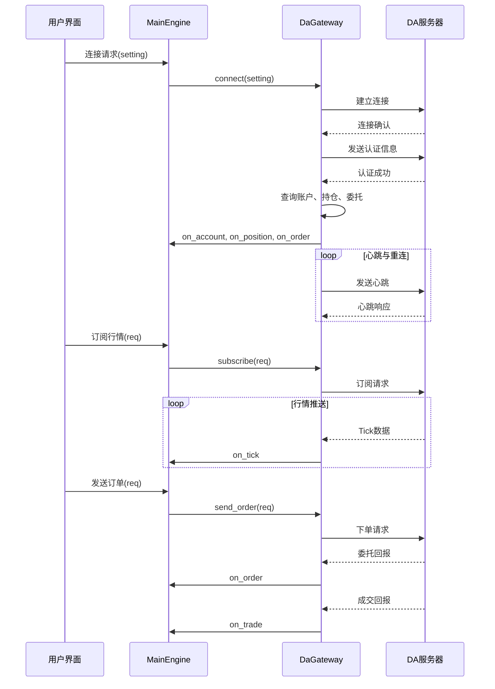
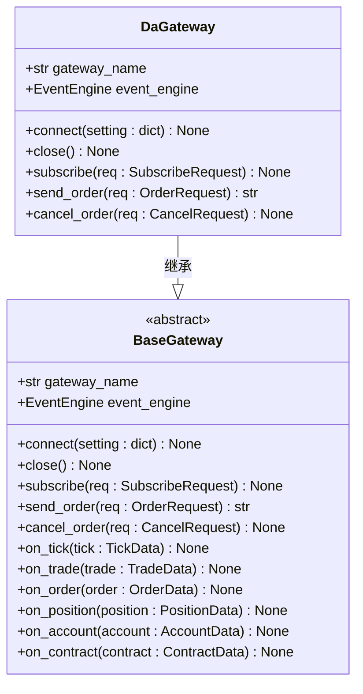
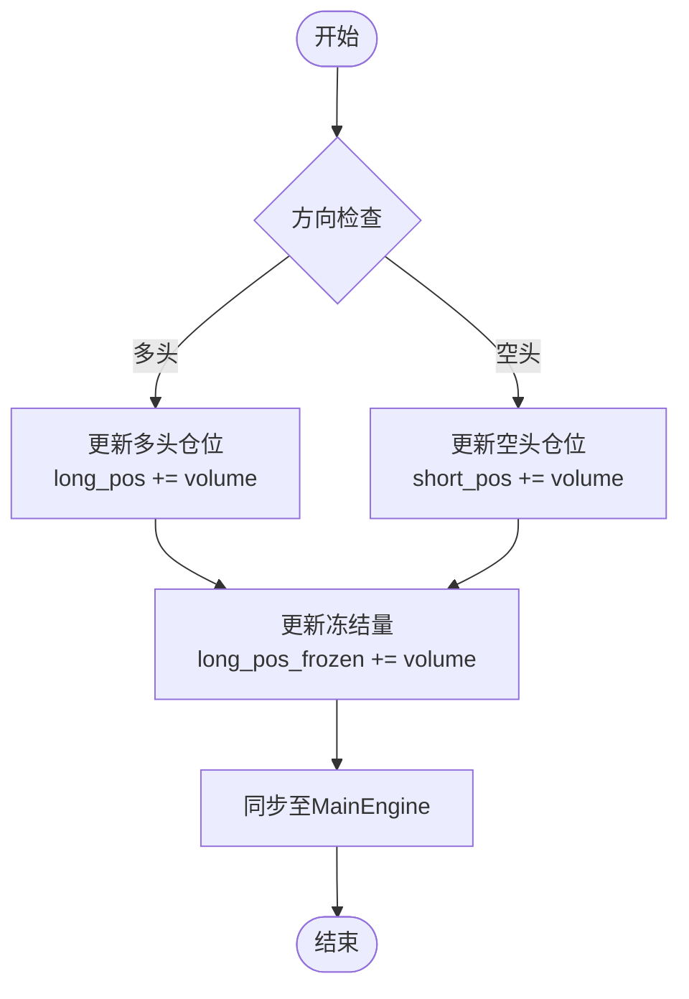
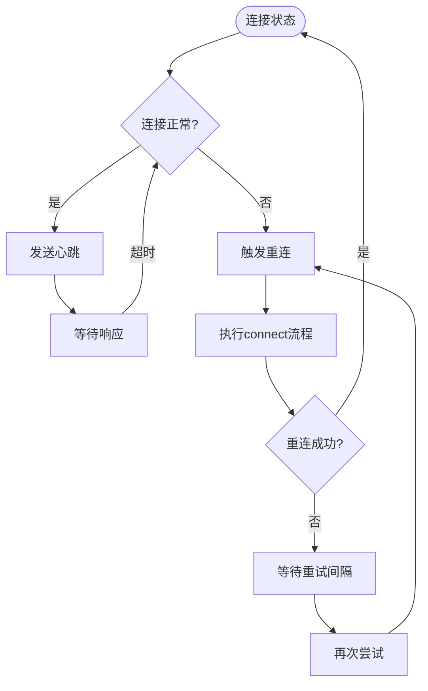
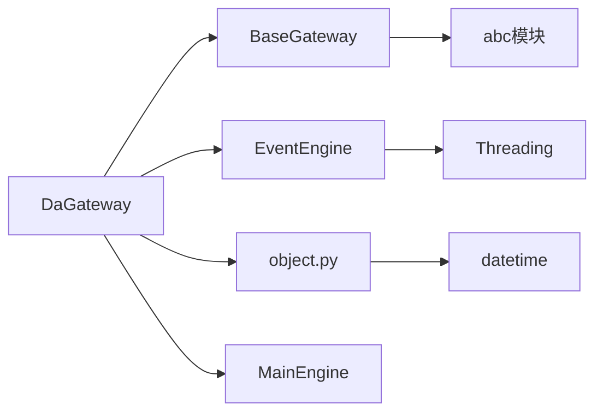

# 直达期货(DA)接口

<cite>
**本文档引用的文件**  
- [gateway.md](file://docs/community/info/gateway.md#L632-L658)
- [gateway.py](file://vnpy/trader/gateway.py#L33-L273)
- [object.py](file://vnpy/trader/object.py#L271-L324)
- [engine.py](file://vnpy/trader/engine.py#L195-L275)
- [converter.py](file://vnpy/trader/converter.py#L54-L256)
</cite>

## 目录
1. [简介](#简介)
2. [项目结构](#项目结构)
3. [核心组件](#核心组件)
4. [架构概述](#架构概述)
5. [详细组件分析](#详细组件分析)
6. [依赖分析](#依赖分析)
7. [性能考虑](#性能考虑)
8. [故障排除指南](#故障排除指南)
9. [结论](#结论)
10. [附录](#附录)（如有必要）

## 简介
直达期货(DA)接口是vn.py框架中用于连接海外期货市场的交易接口，专为外盘期货交易设计。该接口支持双向持仓模式，允许交易者在同一合约上同时持有买入和卖出仓位，为套利策略和组合策略提供了更大的灵活性。文档将系统化地阐述DA接口的接入流程和技术细节，包括配置参数、连接认证、会话管理、断线重连等核心机制，并结合vn.py的BaseGateway规范说明其功能实现。

## 项目结构
直达期货(DA)接口作为vn.py生态系统的一部分，遵循标准的交易接口(gateway)设计模式。虽然具体的实现代码位于独立的`vnpy_da`包中，但其与vn.py核心框架的交互通过标准化的接口定义完成。核心交互点包括`gateway.py`中定义的`BaseGateway`抽象基类，以及`object.py`中定义的数据对象模型。

```mermaid
graph TB
subgraph "vnpy_da"
DA[DaGateway]
end
subgraph "vnpy核心"
BG[BaseGateway]
OBJ[数据对象模型]
ENG[MainEngine]
end
DA --> BG : 继承
DA --> OBJ : 使用
DA --> ENG : 注册
```

**Diagram sources**
- [gateway.py](file://vnpy/trader/gateway.py#L33-L273)
- [gateway.md](file://docs/community/info/gateway.md#L632-L658)

**Section sources**
- [gateway.md](file://docs/community/info/gateway.md#L632-L658)
- [project_structure](file://#L1-L100)

## 核心组件
直达期货(DA)接口的核心功能围绕`DaGateway`类展开，该类继承自`BaseGateway`，实现了与DA交易服务器的连接、认证、行情订阅、订单发送和状态同步等关键功能。其核心组件包括连接管理、行情处理、交易执行和会话维护。

**Section sources**
- [gateway.py](file://vnpy/trader/gateway.py#L33-L273)
- [gateway.md](file://docs/community/info/gateway.md#L632-L658)

## 架构概述
DA接口的架构遵循vn.py的事件驱动设计模式。`DaGateway`实例化后，通过`MainEngine`注册到系统中。当用户发起连接请求时，`DaGateway`负责建立与DA服务器的网络连接，完成认证，并初始化数据同步。行情数据和交易回报通过异步事件的方式，经由`EventEngine`分发给上层应用。



**Diagram sources**
- [gateway.py](file://vnpy/trader/gateway.py#L160-L273)
- [engine.py](file://vnpy/trader/engine.py#L213-L275)

## 详细组件分析

### 配置与连接分析
DA接口的连接需要提供统一的配置参数，这些参数通过一个字典传递给`connect`方法。根据文档，必需的配置字段包括：用户名、密码、交易服务器、行情服务器和授权码。



**Diagram sources**
- [gateway.py](file://vnpy/trader/gateway.py#L33-L273)
- [gateway.md](file://docs/community/info/gateway.md#L648-L654)

**Section sources**
- [gateway.md](file://docs/community/info/gateway.md#L648-L658)
- [gateway.py](file://vnpy/trader/gateway.py#L160-L179)

### 双向持仓机制分析
DA接口支持双向持仓，这与国内期货接口（如CTP）的净仓模式有本质区别。在双向持仓模式下，多头和空头仓位是独立管理的。vn.py框架通过`PositionData`对象来表示这种关系，其中`direction`字段明确区分了`LONG`（多头）和`SHORT`（空头）。



**Diagram sources**
- [converter.py](file://vnpy/trader/converter.py#L71-L84)
- [object.py](file://vnpy/trader/object.py#L144-L161)

**Section sources**
- [converter.py](file://vnpy/trader/converter.py#L54-L256)
- [object.py](file://vnpy/trader/object.py#L144-L161)

### 会话与重连策略分析
为了确保交易的连续性和可靠性，DA接口实现了自动重连机制。`BaseGateway`的文档明确要求，网关实现必须在连接丢失时自动尝试重新连接。这通常通过一个独立的线程或协程来监控连接状态，并在检测到断开时执行重连逻辑。



**Diagram sources**
- [gateway.py](file://vnpy/trader/gateway.py#L48)
- [gateway.py](file://vnpy/trader/gateway.py#L160-L179)

**Section sources**
- [gateway.py](file://vnpy/trader/gateway.py#L48)
- [gateway.py](file://vnpy/trader/gateway.py#L160-L179)

## 依赖分析
DA接口的正常运行依赖于vn.py核心框架的多个组件。最主要的依赖是`BaseGateway`抽象类，它定义了所有交易接口必须实现的契约。此外，`DaGateway`依赖于`EventEngine`进行事件分发，并使用`object.py`中定义的`TickData`、`OrderData`、`TradeData`等数据对象与上层应用进行通信。



**Diagram sources**
- [gateway.py](file://vnpy/trader/gateway.py#L1-L30)
- [object.py](file://vnpy/trader/object.py#L1-L30)

**Section sources**
- [gateway.py](file://vnpy/trader/gateway.py#L1-L30)
- [object.py](file://vnpy/trader/object.py#L1-L30)

## 性能考虑
由于DA接口处理的是实时的行情和交易数据，性能至关重要。`BaseGateway`的设计原则要求所有方法都是非阻塞的，以避免在高频率事件下导致系统卡顿。因此，`DaGateway`的实现应确保网络I/O、数据解析和事件分发都在高效的异步或线程化环境中完成。对于高频策略，应特别注意减少不必要的数据拷贝和日志记录开销。

## 故障排除指南
常见的DA接口问题通常与网络连接、认证信息或服务器状态有关。首先应检查配置参数（用户名、密码、服务器地址、授权码）是否正确。其次，确认网络连接是否通畅，防火墙是否阻止了相关端口。最后，查看日志输出，`BaseGateway`的`write_log`方法会记录连接过程中的关键信息和错误，是诊断问题的第一手资料。

**Section sources**
- [gateway.py](file://vnpy/trader/gateway.py#L153-L158)
- [gateway.md](file://docs/community/info/gateway.md#L656-L658)

## 结论
直达期货(DA)接口为vn.py用户提供了一个稳定可靠的海外期货交易通道。通过遵循`BaseGateway`规范，它无缝集成了vn.py的事件驱动架构，支持行情订阅、订单管理、成交回报等核心功能。其支持的双向持仓特性，为构建复杂的套利和组合策略提供了坚实的基础。结合自动重连和会话管理机制，该接口能够满足实盘交易对连续性和可靠性的严格要求。