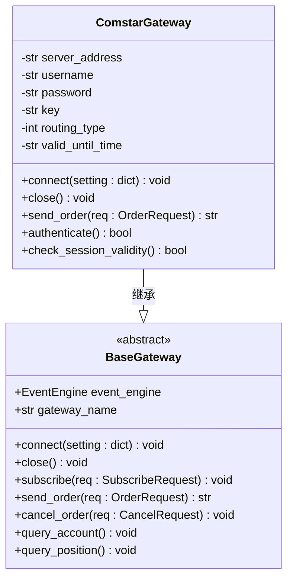
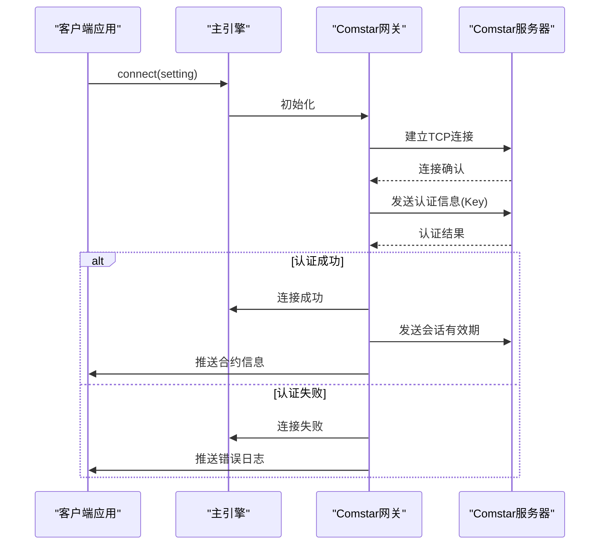

# 中亿汇达Comstar银行间市场接口

<cite>
**本文档引用文件**  
- [gateway.md](file://docs/community/info/gateway.md)
- [README.md](file://README.md)
- [introduction.md](file://docs/community/info/introduction.md)
</cite>

## 目录
1. [引言](#引言)
2. [目标用户与业务特点](#目标用户与业务特点)
3. [接口配置参数](#接口配置参数)
4. [认证与会话管理机制](#认证与会话管理机制)
5. [路由配置与通信协议](#路由配置与通信协议)
6. [性能调优与稳定性保障](#性能调优与稳定性保障)
7. [异常处理与连接管理](#异常处理与连接管理)
8. [扩展性与定制化支持](#扩展性与定制化支持)
9. [总结](#总结)

## 引言

中亿汇达Comstar银行间市场交易接口是vnpy框架支持的重要交易通道之一，专为银行间市场这一非标准化、机构主导的金融市场设计。该接口通过独立的外部模块`vnpy_comstar`实现，为大型金融机构提供安全、稳定的交易接入能力。本文档系统化地阐述该接口的技术实现、特殊流程和最佳实践，帮助用户深入理解其在高频、低延迟交易场景下的应用。

**Section sources**
- [gateway.md](file://docs/community/info/gateway.md#L505-L533)
- [README.md](file://README.md#L114)

## 目标用户与业务特点

中亿汇达Comstar接口的目标用户群体主要为大型金融机构，包括但不限于券商自营交易部门、银行金融市场部等。该接口不向私募基金或个人投资者开放，体现了银行间市场的机构化、专业化特征。

在业务特点上，该接口专注于银行间市场交易，支持债券、同业拆借等非标准化金融产品的交易。与标准化交易所不同，银行间市场具有交易对手协商、协议定价、非集中撮合等特点，因此该接口不提供持仓方向管理，也不支持历史数据查询功能。

**Section sources**
- [gateway.md](file://docs/community/info/gateway.md#L505-L533)
- [introduction.md](file://docs/community/info/introduction.md#L57)

## 接口配置参数

连接中亿汇达Comstar接口需要配置以下关键参数：

- **交易服务器**：指定Comstar交易服务器的地址和端口
- **用户名**：用于身份认证的登录用户名
- **密码**：与用户名对应的登录密码
- **Key**：用于中继模式认证的密钥
- **routing_type**：路由类型，固定为5
- **valid_until_time**：会话有效期，格式为HH:MM:SS.SSS

这些参数在连接时通过配置字典传递给vnpy的主引擎，确保与Comstar服务器建立正确的通信会话。

**Section sources**
- [gateway.md](file://docs/community/info/gateway.md#L523-L528)

## 认证与会话管理机制

中亿汇达Comstar接口采用中继模式（Relay Mode）进行认证，这是一种基于密钥的双向认证机制。用户需要提供预分配的Key，该密钥用于在客户端和服务器端之间建立安全的通信通道，防止未授权访问。

会话有效期通过`valid_until_time`参数进行控制，该参数设定了会话的截止时间（如18:30:00.000）。系统会在该时间点自动终止会话，确保交易活动在规定的交易时段内进行。这种机制符合银行间市场的交易时间管理要求，有助于风险控制。

**Section sources**
- [gateway.md](file://docs/community/info/gateway.md#L526-L528)

## 路由配置与通信协议

`routing_type=5`是中亿汇达Comstar接口的特定路由配置，指示系统使用特定的通信路径和协议栈。该配置确保交易指令通过正确的网络路径传输，满足银行间市场对通信可靠性和安全性的要求。

对于非标准化交易场景，vnpy框架通过Gateway扩展机制支持定制化通信协议和报文格式封装。开发者可以继承`BaseGateway`类，实现`connect`、`send_order`等抽象方法，以适应Comstar接口特有的报文结构和通信流程。

**Diagram sources**
- [gateway.md](file://docs/community/info/gateway.md#L523-L528)
- [gateway.py](file://vnpy/trader/gateway.py#L33-L273)

**Section sources**
- [gateway.md](file://docs/community/info/gateway.md#L527-L528)

## 性能调优与稳定性保障

为满足高频、低延迟交易要求，建议采取以下性能调优措施：

1. **连接优化**：保持长连接，避免频繁重连带来的延迟
2. **线程管理**：将Comstar网关运行在独立线程中，避免阻塞主事件循环
3. **批量处理**：对行情订阅和订单查询进行批量处理，减少网络往返次数
4. **资源监控**：实时监控内存和CPU使用情况，及时发现性能瓶颈

稳定性保障方面，应实现自动重连机制，在网络中断后能够自动恢复连接。同时，建议设置合理的超时时间，避免因服务器响应延迟导致的系统阻塞。

**Section sources**
- [gateway.py](file://vnpy/trader/gateway.py#L48)
- [gateway.md](file://docs/community/info/gateway.md#L509)

## 异常处理与连接管理

在连接管理方面，通过`MainEngine.connect()`方法建立与Comstar服务器的连接，该方法接收包含连接参数的字典。系统会自动处理连接过程中的各种异常情况，如网络超时、认证失败等，并通过事件系统推送日志信息。

异常处理模式遵循vnpy的统一设计，所有异常都通过`on_log`回调函数进行报告。开发者应订阅日志事件，及时发现和处理连接异常、订单拒绝等错误情况。对于关键交易操作，建议实现重试机制，提高系统的容错能力。

**Diagram sources**
- [engine.py](file://vnpy/trader/engine.py#L168-L193)
- [widget.py](file://vnpy/trader/ui/widget.py#L667-L689)

**Section sources**
- [script_trader.md](file://docs/community/app/script_trader.md#L126-L158)
- [widget.py](file://vnpy/trader/ui/widget.py#L667-L689)

## 扩展性与定制化支持

vnpy框架通过模块化设计提供了良好的扩展性。中亿汇达Comstar接口的实现位于独立的`vnpy_comstar`仓库中，这种分离式架构便于维护和升级。开发者可以根据具体需求，对网关进行定制化开发，以支持特定的业务流程或协议扩展。

通过继承`BaseGateway`类，可以轻松实现新的交易接口或对现有接口进行功能扩展。这种设计模式使得vnpy能够灵活适应不同金融机构的个性化需求，特别是在银行间市场这种非标准化交易环境中。

**Section sources**
- [README.md](file://README.md#L114)
- [gateway.py](file://vnpy/trader/gateway.py#L33)

## 总结

中亿汇达Comstar银行间市场接口为大型金融机构提供了接入银行间市场的专业通道。通过中继模式认证、特定路由配置和会话有效期控制等机制，确保了交易的安全性和合规性。vnpy框架的模块化设计和扩展机制，使得该接口能够适应高频、低延迟的交易要求，并支持定制化开发，满足不同机构的个性化需求。