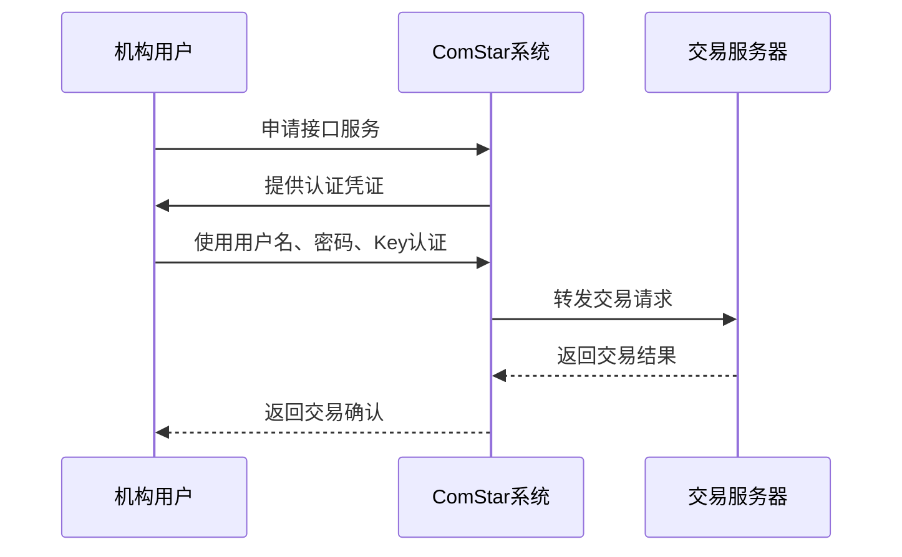
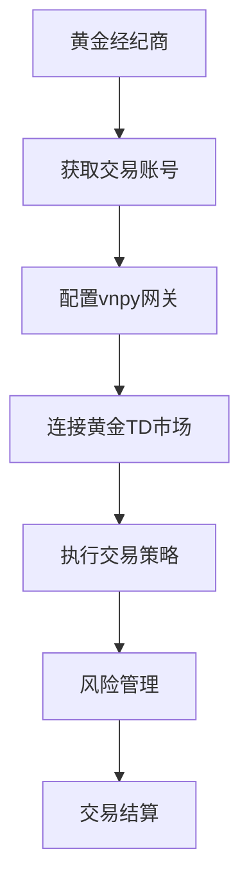
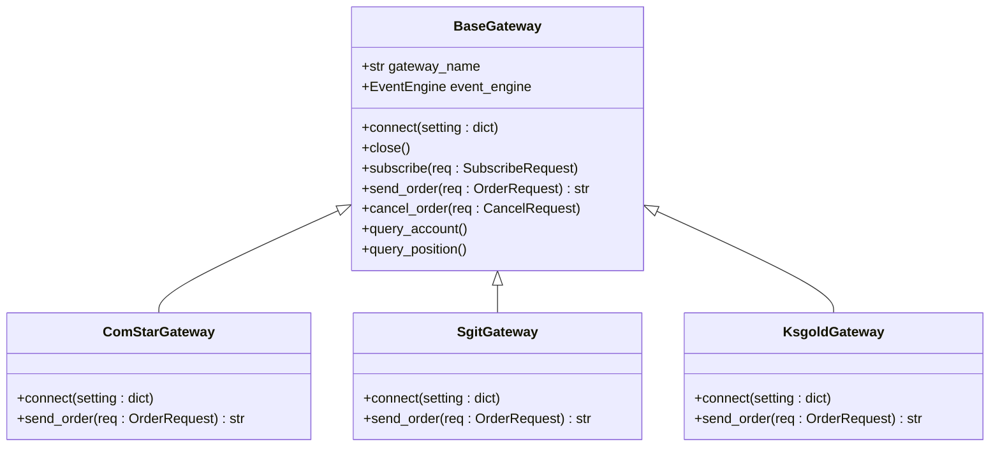

# 特殊应用场景接口

<cite>
**本文档引用的文件**  
- [gateway.md](file://docs/community/info/gateway.md)
- [introduction.md](file://docs/community/info/introduction.md)
- [gateway.py](file://vnpy/trader/gateway.py)
- [object.py](file://vnpy/trader/object.py)
- [engine.py](file://vnpy/trader/engine.py)
</cite>

## 目录
1. [引言](#引言)
2. [特殊领域交易接口概述](#特殊领域交易接口概述)
3. [ComStar银行间市场接口](#comstar银行间市场接口)
4. [黄金TD交易接口](#黄金td交易接口)
5. [网关扩展机制](#网关扩展机制)
6. [性能调优与稳定性保障](#性能调优与稳定性保障)
7. [结论](#结论)

## 引言

vnpy是一个开源的量化交易系统框架，支持多种交易接口，包括针对特殊应用场景的专业接口。本文档重点介绍vnpy支持的特殊领域交易接口，特别是银行间市场（ComStar）和黄金TD（SGIT/KSGOLD）等专业场景。这些接口服务于特定的用户群体和业务需求，具有独特的技术要求和实现机制。

**本文档引用的文件**  
- [introduction.md](file://docs/community/info/introduction.md)

## 特殊领域交易接口概述

vnpy通过其灵活的网关（Gateway）架构，支持覆盖国内外所有交易品种的交易接口。在特殊应用场景方面，vnpy提供了针对银行间市场和黄金TD市场的专业接口，满足机构投资者在这些特定市场的交易需求。

根据文档信息，vnpy支持的特殊应用场景接口主要包括：
- **ComStar（中亿汇达）**：用于银行间市场交易
- **SGIT（飞鼠）** 和 **KSGOLD（金仕达黄金）**：用于黄金TD交易

这些接口的目标用户群体主要是大型金融机构，如券商自营交易部、银行金融市场部等机构自营部门，以及黄金现货经纪商。这些用户在非标准交易场景下需要定制化的通信协议和报文格式支持。

**本文档引用的文件**  
- [introduction.md](file://docs/community/info/introduction.md)
- [gateway.md](file://docs/community/info/gateway.md)

## ComStar银行间市场接口

### 接口特性与业务特点

ComStar接口专为银行间市场设计，服务于大型金融机构的自营交易需求。该接口的主要特性包括：

- **操作系统支持**：仅支持Windows系统
- **交易品种**：银行间市场产品
- **持仓方向**：无持仓方向概念
- **历史数据**：不提供历史数据

ComStar接口采用中继模式认证，这是一种特殊的认证机制，确保交易安全性和合规性。该接口的认证流程涉及用户名、密码和Key等安全凭证，以及routing_type和valid_until_time等特定参数。

### 目标用户与接入要求

ComStar接口的目标用户主要是各类大型金融机构，包括券商自营交易部、银行金融市场部等。私募基金或个人投资者无法使用该接口。用户需要购买ComStar的交易接口服务后才能获得使用权限。

**接口来源**  
- [gateway.md](file://docs/community/info/gateway.md#L505-L533)

**本文档引用的文件**  
- [gateway.md](file://docs/community/info/gateway.md)

## 黄金TD交易接口

### 接口实现与交易机制

vnpy通过SGIT（飞鼠）和KSGOLD（金仕达黄金）两个网关支持黄金TD交易。黄金TD交易是一种特殊的贵金属交易方式，具有以下特点：

- **交易机制**：采用保证金交易模式
- **报价方式**：支持双向报价
- **结算方式**：T+0交易，T+1结算

黄金TD接口支持完整的交易功能，包括行情订阅、下单、撤单、查询账户和持仓等。这些功能通过vnpy的统一网关接口实现，确保与其他交易接口的一致性。

### 目标用户与接入方式

黄金TD接口的目标用户主要是黄金现货经纪商和专业的贵金属交易机构。用户需要通过黄金现货经纪商获取交易账号和接入权限。

**本文档引用的文件**  
- [introduction.md](file://docs/community/info/introduction.md#L66-L68)
- [gateway.md](file://docs/community/info/gateway.md#L778-L781)

## 网关扩展机制

### 网关架构设计

vnpy的网关架构基于BaseGateway抽象类实现，为各种交易接口提供了统一的接口规范。BaseGateway定义了所有网关必须实现的核心方法和回调函数，确保接口的一致性和可扩展性。

核心组件包括：
- **connect**：建立与交易服务器的连接
- **subscribe**：订阅行情数据
- **send_order**：发送交易订单
- **cancel_order**：撤销订单
- **query_account**：查询账户信息
- **query_position**：查询持仓信息

**接口来源**  
- [gateway.py](file://vnpy/trader/gateway.py#L33-L272)

### 定制化通信协议实现

在非标准交易场景下，可以通过继承BaseGateway类来实现定制化的通信协议和报文格式。具体实现步骤包括：

1. **创建新的网关类**：继承BaseGateway类
2. **实现连接方法**：重写connect方法，处理特定的认证流程
3. **实现交易方法**：重写send_order、cancel_order等方法，适配特定的报文格式
4. **处理回调函数**：实现on_tick、on_order、on_trade等回调函数，解析服务器返回的数据

通过这种扩展机制，vnpy可以支持各种专有的交易协议，满足特殊市场的交易需求。

**本文档引用的文件**  
- [gateway.py](file://vnpy/trader/gateway.py)
- [object.py](file://vnpy/trader/object.py)

## 性能调优与稳定性保障

### 性能优化建议

针对特殊应用场景的交易接口，建议采取以下性能优化措施：

- **连接池管理**：维护多个连接实例，提高交易吞吐量
- **异步处理**：采用异步I/O操作，避免阻塞主线程
- **批量处理**：对行情数据和交易请求进行批量处理，减少网络开销
- **内存优化**：合理管理数据缓存，避免内存泄漏

### 稳定性保障措施

为确保交易系统的稳定性，建议实施以下保障措施：

- **自动重连机制**：在网络中断时自动重新连接
- **心跳检测**：定期发送心跳包，检测连接状态
- **异常处理**：完善的异常捕获和处理机制
- **日志记录**：详细的交易日志记录，便于问题排查
- **监控告警**：实时监控系统状态，及时发现异常

这些措施可以有效提高交易系统的可靠性和稳定性，确保在高并发交易场景下的正常运行。

**本文档引用的文件**  
- [gateway.py](file://vnpy/trader/gateway.py)
- [engine.py](file://vnpy/trader/engine.py)

## 结论

vnpy通过其灵活的网关架构，为银行间市场和黄金TD等特殊应用场景提供了专业的交易接口支持。这些接口服务于特定的机构用户群体，满足其在非标准交易场景下的特殊需求。通过继承BaseGateway类，开发者可以轻松实现定制化的通信协议和报文格式，扩展vnpy的功能。同时，合理的性能调优和稳定性保障措施可以确保交易系统在高负载下的稳定运行。

**本文档引用的文件**  
- [gateway.md](file://docs/community/info/gateway.md)
- [introduction.md](file://docs/community/info/introduction.md)
- [gateway.py](file://vnpy/trader/gateway.py)
- [object.py](file://vnpy/trader/object.py)
- [engine.py](file://vnpy/trader/engine.py)