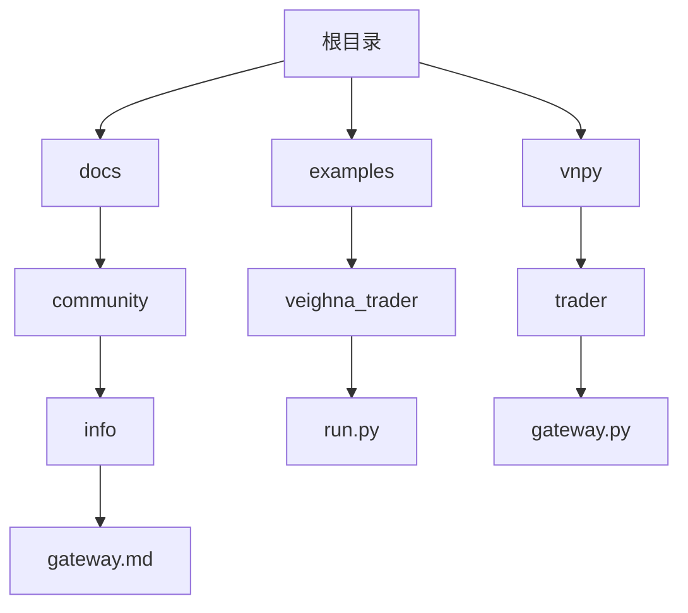
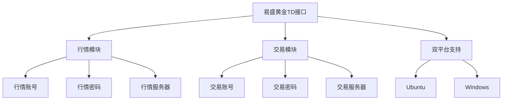
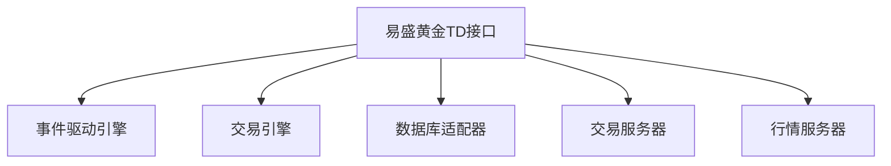

# 易盛黄金TD接口

<cite>
**本文档引用文件**   
- [gateway.md](file://docs/community/info/gateway.md)
- [CHANGELOG.md](file://CHANGELOG.md)
- [README.md](file://README.md)
</cite>

## 目录
1. [简介](#简介)
2. [项目结构](#项目结构)
3. [核心组件](#核心组件)
4. [架构概述](#架构概述)
5. [详细组件分析](#详细组件分析)
6. [依赖分析](#依赖分析)
7. [性能考虑](#性能考虑)
8. [故障排除指南](#故障排除指南)
9. [结论](#结论)
10. [附录](#附录)（如有必要）

## 简介
易盛（Esunny）黄金TD接口是VeighNa量化交易系统中的一个重要组成部分，支持国内期货和黄金TD交易。该接口在设计上实现了行情与交易分离的双账号认证机制，确保了交易的安全性和稳定性。通过配置行情账号、交易账号和授权码等字段，用户可以灵活地进行交易操作。此外，该接口还支持Ubuntu和Windows双平台下的连接流程，方便用户在不同操作系统下使用。对于黄金TD特有的业务规则，如递延费、涨跌停板和连续交易时段，该接口提供了相应的技术实现方案。本文档将全面文档化易盛黄金TD接口的实现细节，重点说明其同时支持期货与黄金TD交易的特性，并提供连接超时、认证失败等常见问题的排查指南。

## 项目结构
易盛黄金TD接口作为VeighNa项目的一部分，其文件结构遵循VeighNa的整体架构。主要文件和目录包括文档、示例代码和核心代码库。文档部分位于`docs/community/info/`目录下，包含关于交易接口的详细说明。示例代码位于`examples/`目录下，提供了如何使用易盛接口的实例。核心代码库位于`vnpy/`目录下，包含了交易接口的具体实现。



**图表来源**
- [gateway.md](file://docs/community/info/gateway.md)
- [run.py](file://examples/veighna_trader/run.py)
- [gateway.py](file://vnpy/trader/gateway.py)

**章节来源**
- [gateway.md](file://docs/community/info/gateway.md)
- [run.py](file://examples/veighna_trader/run.py)

## 核心组件
易盛黄金TD接口的核心组件主要包括行情与交易分离的双账号认证机制、支持期货与黄金TD交易的特性、以及在Ubuntu和Windows双平台下的连接流程。这些组件共同构成了接口的基础功能，确保了交易的高效性和安全性。

**章节来源**
- [gateway.md](file://docs/community/info/gateway.md)
- [CHANGELOG.md](file://CHANGELOG.md)

## 架构概述
易盛黄金TD接口的架构设计充分考虑了交易的复杂性和多样性，通过模块化的设计实现了功能的解耦。接口支持行情与交易分离的双账号认证机制，确保了交易的安全性。同时，接口还支持内盘和外盘交易系统的切换逻辑，满足了不同交易场景的需求。



**图表来源**
- [gateway.md](file://docs/community/info/gateway.md)

## 详细组件分析
### 行情与交易分离的双账号认证机制
易盛黄金TD接口采用行情与交易分离的双账号认证机制，通过独立的行情账号和交易账号来分别处理行情数据和交易指令。这种设计不仅提高了系统的安全性，还增强了系统的灵活性。用户需要配置行情账号、行情密码、行情服务器、交易账号、交易密码和交易服务器等字段，以完成认证过程。

**章节来源**
- [gateway.md](file://docs/community/info/gateway.md)

### 支持期货与黄金TD交易的特性
易盛黄金TD接口支持期货和黄金TD两种交易品种，用户可以通过配置不同的交易系统（内盘或外盘）来选择交易类型。接口还支持双向持仓，允许用户在同一账户中同时持有多个方向的仓位。

**章节来源**
- [gateway.md](file://docs/community/info/gateway.md)

### 双平台连接流程
易盛黄金TD接口支持Ubuntu和Windows双平台下的连接流程。用户可以在不同操作系统下使用相同的配置文件，实现无缝切换。接口通过标准化的API调用，确保了在不同平台上的兼容性和一致性。

**章节来源**
- [gateway.md](file://docs/community/info/gateway.md)

## 依赖分析
易盛黄金TD接口依赖于VeighNa框架的核心组件，如事件驱动引擎、交易引擎和数据库适配器。这些组件为接口提供了必要的支持，确保了交易的高效性和稳定性。此外，接口还依赖于外部的交易服务器和行情服务器，这些服务器提供了实时的市场数据和交易服务。



**图表来源**
- [gateway.md](file://docs/community/info/gateway.md)
- [README.md](file://README.md)

**章节来源**
- [gateway.md](file://docs/community/info/gateway.md)
- [README.md](file://README.md)

## 性能考虑
易盛黄金TD接口在设计时充分考虑了性能因素，通过优化数据传输和处理流程，确保了交易的高效性。接口支持高并发的实时交易请求发送，能够快速响应市场变化。此外，接口还采用了缓存机制，减少了对服务器的频繁请求，提高了系统的整体性能。

**章节来源**
- [gateway.md](file://docs/community/info/gateway.md)

## 故障排除指南
### 连接超时
当出现连接超时问题时，首先检查网络连接是否正常，确保交易服务器和行情服务器的地址和端口配置正确。如果网络连接正常，尝试重启客户端和服务器，以排除临时故障。

**章节来源**
- [gateway.md](file://docs/community/info/gateway.md)

### 认证失败
认证失败通常是由于账号或密码错误导致的。请仔细核对行情账号、行情密码、交易账号和交易密码的配置，确保无误。如果问题仍然存在，联系易盛官方技术支持获取帮助。

**章节来源**
- [gateway.md](file://docs/community/info/gateway.md)

## 结论
易盛黄金TD接口作为VeighNa量化交易系统的重要组成部分，提供了强大的交易功能和灵活的配置选项。通过行情与交易分离的双账号认证机制，接口确保了交易的安全性和稳定性。支持期货与黄金TD交易的特性，以及在Ubuntu和Windows双平台下的连接流程，使得用户能够在不同场景下高效地进行交易操作。本文档全面文档化了易盛黄金TD接口的实现细节，为用户提供了详细的使用指南和技术支持。

## 附录
### 配置示例
以下是一个典型的易盛黄金TD接口配置示例：

```json
{
  "gateway_name": "ESUNNY",
  "td_address": "tcp://127.0.0.1:10000",
  "md_address": "tcp://127.0.0.1:10010",
  "broker_id": "9999",
  "app_id": "simnow_client_test",
  "auth_code": "0000000000000000",
  "user_id": "your_user_id",
  "password": "your_password"
}
```

**章节来源**
- [gateway.md](file://docs/community/info/gateway.md)