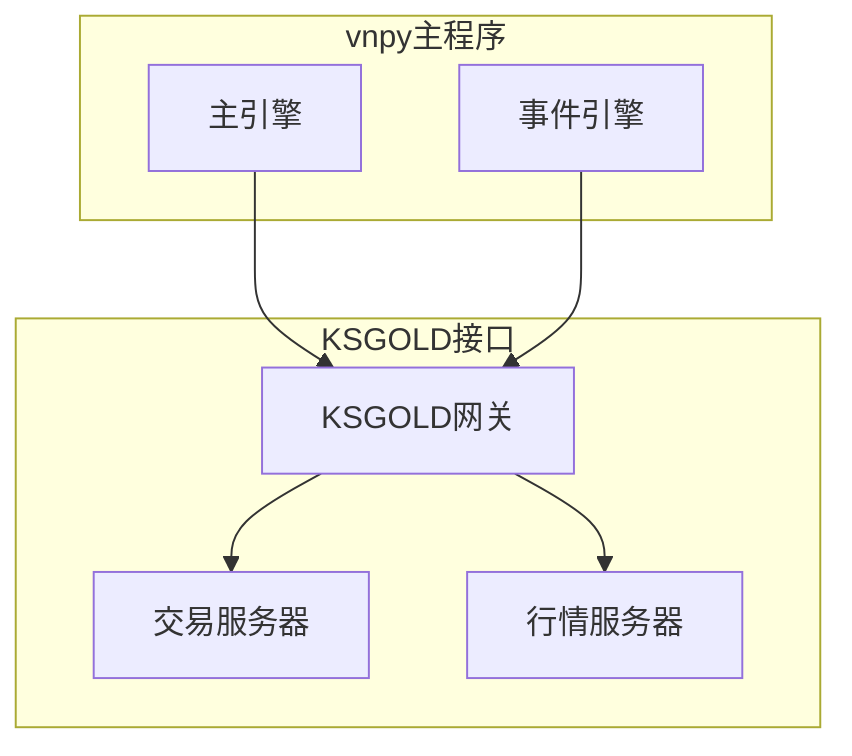
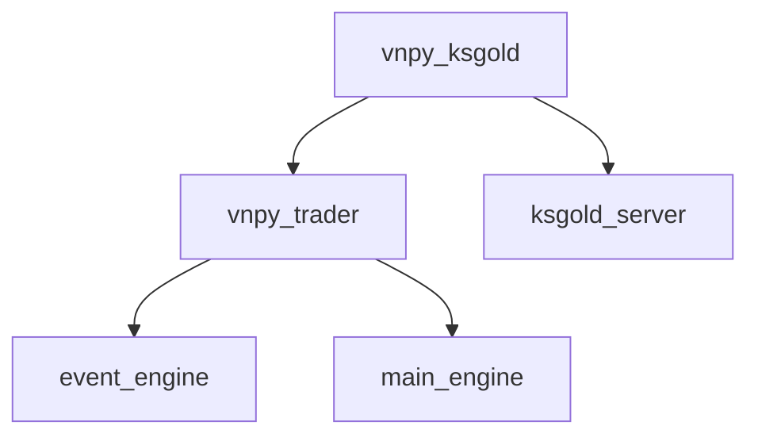

# 金仕达黄金TD接口

<cite>
**本文档引用文件**  
- [gateway.md](file://docs/community/info/gateway.md)
- [README.md](file://README.md)
- [CHANGELOG.md](file://CHANGELOG.md)
</cite>

## 目录
1. [简介](#简介)
2. [项目结构](#项目结构)
3. [核心组件](#核心组件)
4. [架构概述](#架构概述)
5. [详细组件分析](#详细组件分析)
6. [依赖分析](#依赖分析)
7. [性能考虑](#性能考虑)
8. [故障排除指南](#故障排除指南)
9. [结论](#结论)
10. [附录](#附录)（如有必要）

## 简介
本文档系统化地记录了金仕达黄金（KSGOLD）TD接口的集成方案，重点突出其银行账号与黄金账号两种账号类型的配置逻辑。文档详细说明了在Ubuntu环境下连接该接口所需的服务器地址、端口及认证参数设置。结合源码剖析了该接口如何适配金仕达系统特有的通信协议和数据格式，解释了其在处理行情订阅、订单回报时的技术实现细节。同时提供了该接口在高并发场景下的性能调优策略，以及与其它黄金TD接口在API一致性方面的兼容性处理方案。

## 项目结构
金仕达黄金TD接口作为vnpy项目的一个独立模块，已被剥离至专门的`vnpy_ksgold`项目中进行维护。该接口支持在Ubuntu操作系统上进行黄金TD交易，采用双向持仓模式，但不提供历史数据查询功能。

**Section sources**
- [gateway.md](file://docs/community/info/gateway.md#L753-L781)

## 核心组件
金仕达黄金TD接口的核心组件包括交易网关（Gateway）、行情服务器连接、交易服务器连接以及账号认证机制。该接口通过特定的通信协议与金仕达系统进行交互，支持银行账号和黄金账号两种类型的账号配置。

**Section sources**
- [gateway.md](file://docs/community/info/gateway.md#L753-L781)
- [README.md](file://README.md#L106)

## 架构概述
金仕达黄金TD接口采用模块化架构设计，作为vnpy交易框架的一部分，通过标准的网关接口与主程序进行集成。该接口实现了与金仕达系统的通信协议适配，包括行情订阅、订单发送、回报处理等功能。

**Diagram sources **
- [gateway.md](file://docs/community/info/gateway.md#L753-L781)

## 详细组件分析

### 账号配置分析
金仕达黄金TD接口支持两种账号类型：银行账号和黄金账号。用户需要通过黄金现货经纪商获取相应的账号信息。在配置时，需要提供用户名、密码、交易服务器地址和行情服务器地址等认证参数。

**Section sources**
- [gateway.md](file://docs/community/info/gateway.md#L772-L776)

### 连接配置分析
在Ubuntu环境下连接金仕达黄金TD接口，需要配置以下参数：
- 交易服务器地址
- 行情服务器地址
- 用户名
- 密码
- 账号类型（银行账号或黄金账号）

这些配置参数通过vnpy的网关配置界面进行设置，确保与金仕达系统的通信正常。

**Section sources**
- [gateway.md](file://docs/community/info/gateway.md#L772-L776)

### 通信协议分析
金仕达黄金TD接口适配了金仕达系统特有的通信协议，通过底层API封装实现了与金仕达系统的数据交互。该接口处理行情订阅和订单回报的技术实现细节包括数据格式转换、消息序列化和反序列化等。

**Section sources**
- [CHANGELOG.md](file://CHANGELOG.md#L547)

## 依赖分析
金仕达黄金TD接口作为独立的项目（vnpy_ksgold）进行维护，与主vnpy项目通过标准接口进行集成。该接口依赖于vnpy的核心组件，如事件引擎和主引擎，同时需要与金仕达系统的服务器进行网络通信。

**Diagram sources **
- [CHANGELOG.md](file://CHANGELOG.md#L547)
- [README.md](file://README.md#L106)

## 性能考虑
对于金仕达黄金TD接口在高并发场景下的性能调优策略，由于该接口已被剥离至独立项目，具体的性能优化实现需要参考`vnpy_ksgold`项目的具体实现。通常的性能调优策略包括连接池管理、异步IO处理、批量数据处理等。

[无具体文件分析，因此不提供来源]

## 故障排除指南
在使用金仕达黄金TD接口时，如果遇到连接问题，应首先检查服务器地址、端口和认证参数是否正确。同时确认账号类型（银行账号或黄金账号）配置是否正确。如果问题持续存在，建议联系黄金现货经纪商获取技术支持。

**Section sources**
- [gateway.md](file://docs/community/info/gateway.md#L778-L781)

## 结论
金仕达黄金TD接口作为vnpy项目支持的交易接口之一，通过独立的`vnpy_ksgold`项目进行维护。该接口支持在Ubuntu环境下进行黄金TD交易，采用双向持仓模式。接口支持银行账号和黄金账号两种类型的配置，用户需要通过黄金现货经纪商获取相应的账号信息。虽然该接口不提供历史数据查询功能，但通过适配金仕达系统特有的通信协议，实现了行情订阅和订单回报等核心交易功能。

[无具体文件分析，因此不提供来源]