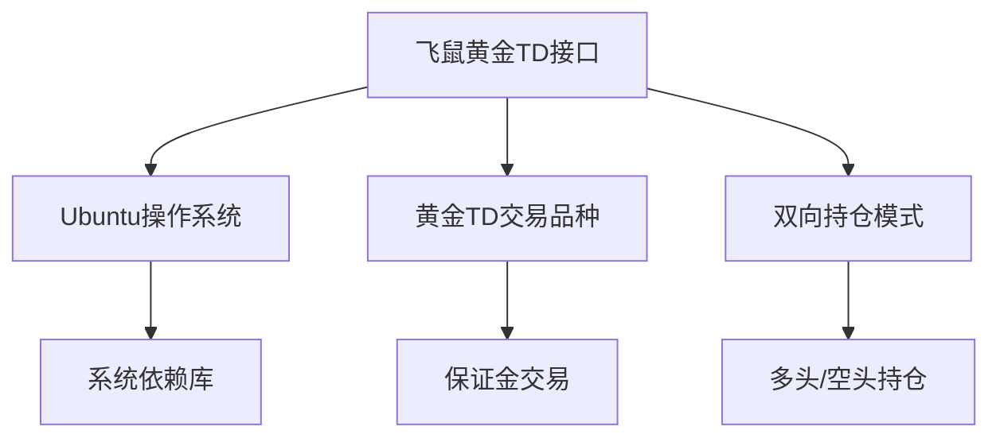
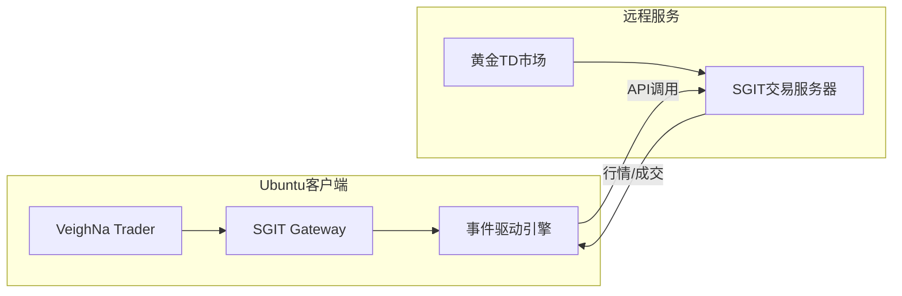
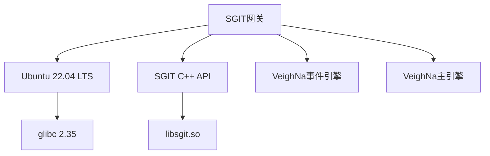

# 飞鼠黄金TD接口

<cite>
**本文档引用文件**   
- [gateway.md](file://docs/community/info/gateway.md#L725-L781)
- [ubuntu_install.md](file://docs/community/install/ubuntu_install.md#L72-L73)
- [common.py](file://vnpy/rpc/common.py#L8-L10)
</cite>

## 目录
1. [引言](#引言)
2. [项目结构](#项目结构)
3. [核心组件](#核心组件)
4. [架构概述](#架构概述)
5. [详细组件分析](#详细组件分析)
6. [依赖分析](#依赖分析)
7. [性能考虑](#性能考虑)
8. [故障排除指南](#故障排除指南)
9. [结论](#结论)
10. [附录](#附录)（如有必要）

## 引言
本文档深入解析飞鼠(SGIT)黄金TD接口的技术实现，重点阐述其仅支持Ubuntu操作系统的特点。详细说明用户名、密码、产品名称和授权编码等连接参数的获取途径与配置方法。结合源码分析该接口如何处理黄金TD双向持仓、保证金交易等核心功能，解释与易盛接口在报单生命周期管理上的差异。提供针对该接口特有的连接稳定性优化建议，包括网络超时设置、心跳机制维护等生产环境部署最佳实践。

## 项目结构
飞鼠(SGIT)黄金TD接口作为VeighNa量化交易系统的一部分，其项目结构遵循统一的模块化设计。该接口主要位于独立的vnpy_sgit仓库中，通过gateway插件形式集成到主框架。在Ubuntu系统环境下，该接口通过特定的C++ API封装与黄金TD交易服务器进行通信，实现行情订阅、订单发送、撤单、账户资金和持仓查询等核心交易功能。



**图源**
- [gateway.md](file://docs/community/info/gateway.md#L725-L781)

**本节来源**
- [gateway.md](file://docs/community/info/gateway.md#L725-L781)

## 核心组件
飞鼠(SGIT)黄金TD接口的核心组件包括连接管理、行情处理、订单管理、资金与持仓管理四大模块。该接口严格遵循VeighNa框架的BaseGateway抽象基类，实现了connect、subscribe、send_order、cancel_order等关键方法。其中，connect方法负责建立与交易服务器的长连接，并完成身份验证；send_order方法将OrderRequest请求转换为SGIT API所需的订单结构并发送；on_order回调负责处理订单状态更新，完整覆盖从提交到成交或撤单的整个生命周期。

**本节来源**
- [gateway.md](file://docs/community/info/gateway.md#L725-L781)
- [common.py](file://vnpy/rpc/common.py#L8-L10)

## 架构概述
飞鼠(SGIT)黄金TD接口采用典型的客户端-服务器架构，运行在Ubuntu系统上的VeighNa客户端通过SGIT提供的API与远程交易服务器进行通信。该架构通过事件驱动引擎实现异步非阻塞I/O，确保高并发下的低延迟交易。与易盛接口相比，SGIT接口在报单生命周期管理上更为严格，要求客户端必须主动维护订单状态，服务器不会主动推送所有状态变更，这要求客户端实现更复杂的状态机来跟踪订单。



**图源**
- [gateway.md](file://docs/community/info/gateway.md#L725-L781)

## 详细组件分析

### 连接参数与配置分析
飞鼠(SGIT)黄金TD接口的连接需要配置用户名、密码、交易服务器、行情服务器、产品名称和授权编码等关键参数。这些参数通过VeighNa Trader的图形界面或JSON配置文件进行设置。用户需通过黄金现货经纪商获取这些凭证。在Ubuntu系统上，配置文件通常位于用户主目录下的.vntrader文件夹中，文件名为connect_sgit.json。

**本节来源**
- [gateway.md](file://docs/community/info/gateway.md#L743-L748)

### 双向持仓与保证金交易分析
该接口支持黄金TD的双向持仓模式，允许交易者同时持有同一合约的多头和空头仓位。在保证金交易方面，接口通过on_account和on_position回调实时更新账户资金和持仓信息。与易盛接口不同，SGIT接口要求客户端在发送订单时必须明确指定开平仓标志，且不支持自动换仓功能，这使得报单生命周期更加透明可控。

**本节来源**
- [gateway.md](file://docs/community/info/gateway.md#L735-L736)

### 报单生命周期管理差异分析
与易盛接口相比，飞鼠(SGIT)黄金TD接口在报单生命周期管理上存在显著差异。易盛接口采用更主动的推送机制，而SGIT接口要求客户端通过查询接口主动获取订单状态，这增加了客户端的复杂性但提高了系统的稳定性。此外，SGIT接口对订单状态转换有更严格的规则，例如撤单后必须等待服务器确认才能视为完全结束。

**本节来源**
- [gateway.md](file://docs/community/info/gateway.md#L725-L781)

## 依赖分析
飞鼠(SGIT)黄金TD接口的主要依赖包括Ubuntu操作系统环境、SGIT提供的C++动态链接库、以及VeighNa框架的核心组件如事件引擎和主引擎。该接口不提供历史数据，依赖外部数据服务如RQData进行历史行情补充。在部署时，必须确保Ubuntu系统的glibc版本与SGIT API兼容，并正确配置LD_LIBRARY_PATH环境变量。



**图源**
- [gateway.md](file://docs/community/info/gateway.md#L730)
- [ubuntu_install.md](file://docs/community/install/ubuntu_install.md#L72-L73)

**本节来源**
- [gateway.md](file://docs/community/info/gateway.md#L725-L781)

## 性能考虑
为确保飞鼠(SGIT)黄金TD接口在生产环境中的高性能运行，建议进行以下优化：首先，配置合理的网络超时时间，避免因短暂网络波动导致连接中断；其次，实现高效的心跳机制，定期发送心跳包以维持长连接；最后，优化订单处理逻辑，通过批量处理和异步I/O减少系统调用开销。在Ubuntu系统上，可通过调整TCP内核参数进一步提升网络性能。

**本节来源**
- [common.py](file://vnpy/rpc/common.py#L8-L10)

## 故障排除指南
针对飞鼠(SGIT)黄金TD接口的常见问题，建议采取以下排查步骤：首先检查Ubuntu系统环境和依赖库是否正确安装；其次验证连接参数是否准确无误；然后查看日志文件中是否有认证失败或连接超时的记录。对于连接稳定性问题，可尝试调整心跳间隔和超时设置。若问题持续存在，应联系黄金现货经纪商确认API服务状态。

**本节来源**
- [gateway.md](file://docs/community/info/gateway.md#L752)
- [common.py](file://vnpy/rpc/common.py#L8-L10)

## 结论
飞鼠(SGIT)黄金TD接口是一个专为Ubuntu系统设计的高性能交易接口，专注于黄金TD品种的双向持仓和保证金交易。其严格的报单生命周期管理机制虽然增加了客户端的复杂性，但也带来了更高的稳定性和可控性。通过合理的连接参数配置和生产环境优化，该接口能够满足专业量化交易的需求。

## 附录
### 连接参数说明
- **用户名**: 由黄金现货经纪商提供的交易账户名
- **密码**: 对应账户的交易密码
- **交易服务器**: SGIT提供的交易API服务器地址
- **行情服务器**: SGIT提供的行情API服务器地址
- **产品名称**: 用于标识客户端产品的名称
- **授权编码**: 由经纪商颁发的API使用授权码

**本节来源**
- [gateway.md](file://docs/community/info/gateway.md#L743-L748)

### 心跳机制配置
```python
# 心跳相关常量
HEARTBEAT_TOPIC = "heartbeat"
HEARTBEAT_INTERVAL = 10  # 心跳间隔（秒）
HEARTBEAT_TOLERANCE = 30  # 心跳容忍时间（秒）
```

**本节来源**
- [common.py](file://vnpy/rpc/common.py#L8-L10)