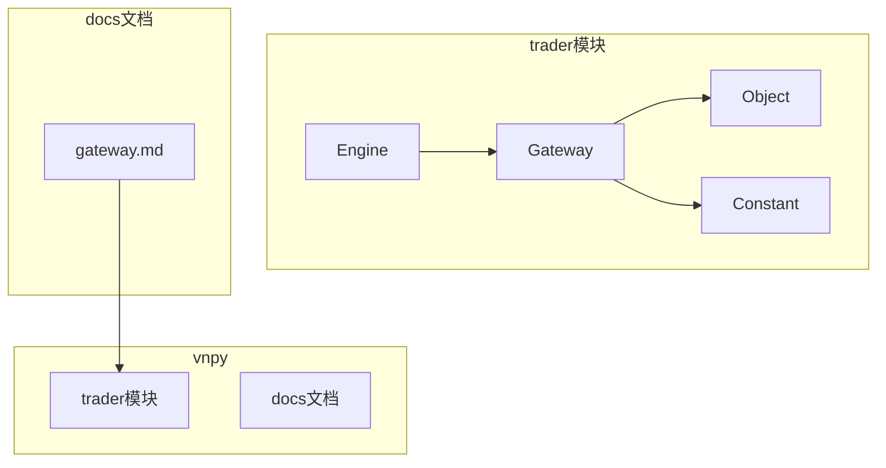
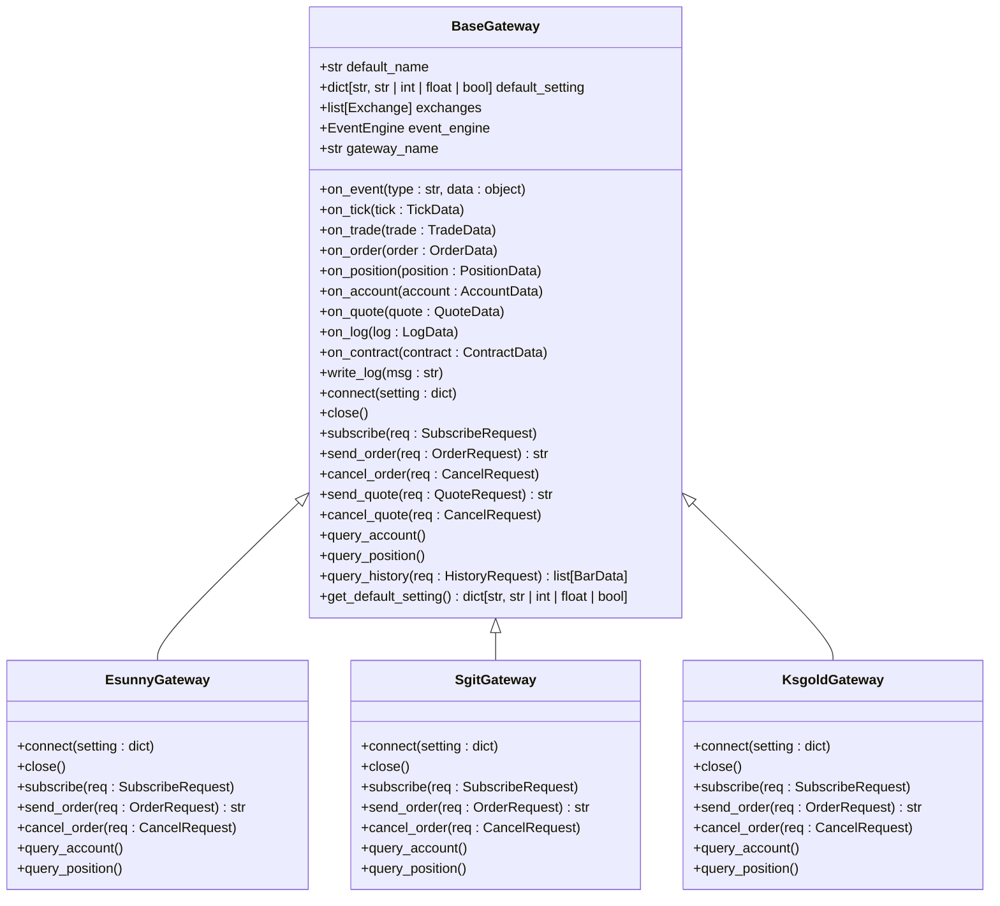
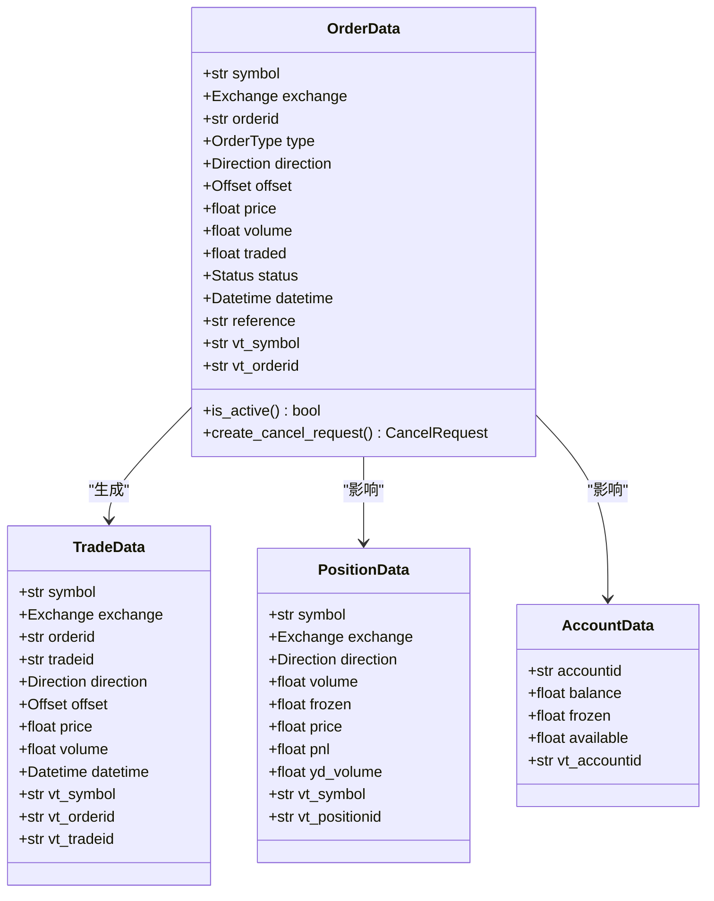
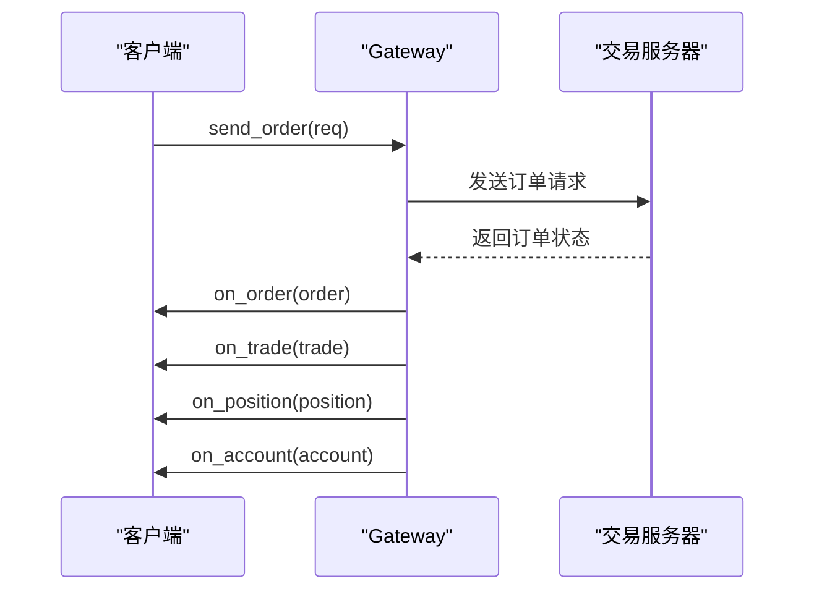
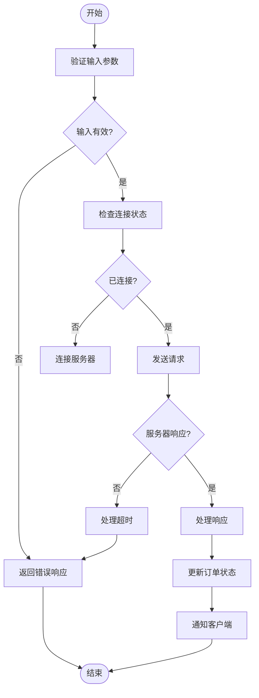
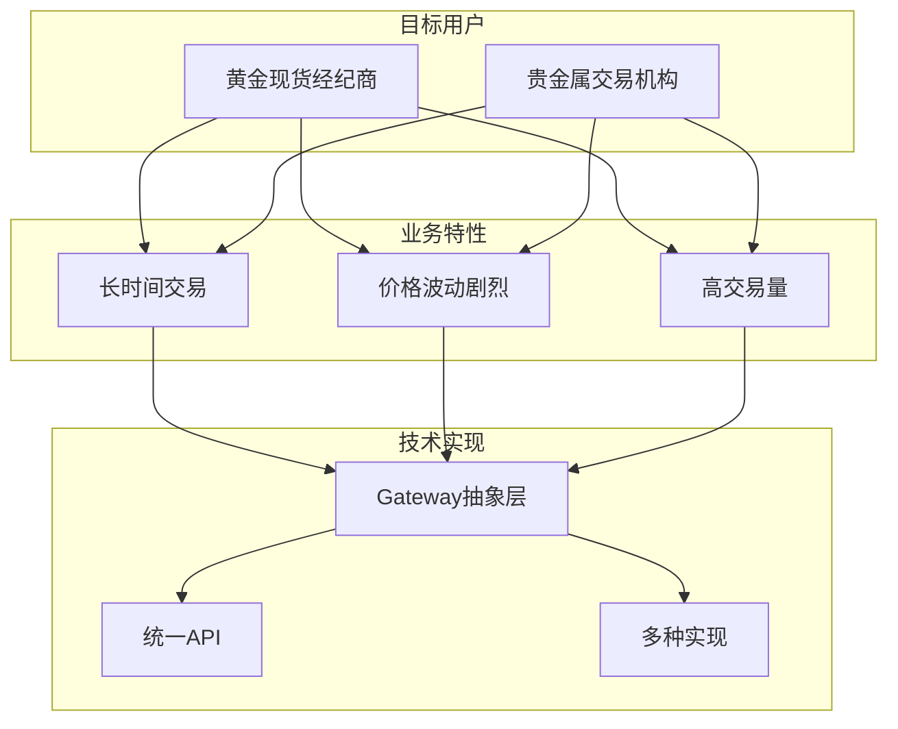
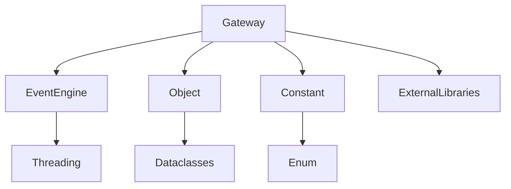

# 黄金TD交易接口

<cite>
**本文档引用文件**   
- [gateway.py](file://vnpy/trader/gateway.py)
- [object.py](file://vnpy/trader/object.py)
- [constant.py](file://vnpy/trader/constant.py)
- [engine.py](file://vnpy/trader/engine.py)
- [gateway.md](file://docs/community/info/gateway.md)
</cite>

## 目录
1. [引言](#引言)
2. [项目结构](#项目结构)
3. [核心组件](#核心组件)
4. [架构概述](#架构概述)
5. [详细组件分析](#详细组件分析)
6. [依赖分析](#依赖分析)
7. [性能考虑](#性能考虑)
8. [故障排除指南](#故障排除指南)
9. [结论](#结论)

## 引言
本文档全面文档化vnpy支持的黄金TD交易接口，包括易盛(ESunny)、飞鼠(SGIT)和金仕达黄金(KSGOLD)等实现。明确该类接口的目标用户（如黄金现货经纪商、贵金属交易机构）及其业务特性。深入解析黄金TD特有的交易机制、清算规则和报单生命周期管理。对比不同供应商接口在认证方式、行情订阅、订单执行等方面的异同点。提供针对黄金TD市场交易时段长、价格波动剧烈等特点的系统稳定性优化方案。结合源码说明如何通过Gateway抽象层统一处理多黄金TD接口的共性逻辑与个性差异。

## 项目结构
vnpy项目中，黄金TD交易接口主要通过Gateway模块实现，该模块位于vnpy/trader/gateway.py文件中。黄金TD相关的数据结构定义在vnpy/trader/object.py和vnpy/trader/constant.py文件中。文档信息位于docs/community/info/gateway.md文件中。

**Diagram sources**
- [gateway.py](file://vnpy/trader/gateway.py)
- [object.py](file://vnpy/trader/object.py)
- [constant.py](file://vnpy/trader/constant.py)
- [engine.py](file://vnpy/trader/engine.py)
- [gateway.md](file://docs/community/info/gateway.md)

**Section sources**
- [gateway.py](file://vnpy/trader/gateway.py)
- [object.py](file://vnpy/trader/object.py)
- [constant.py](file://vnpy/trader/constant.py)
- [engine.py](file://vnpy/trader/engine.py)
- [gateway.md](file://docs/community/info/gateway.md)

## 核心组件
黄金TD交易接口的核心组件包括BaseGateway抽象类、各种数据对象（如OrderData、TradeData等）以及相关的常量定义。这些组件共同构成了vnpy处理黄金TD交易的基础架构。

**Section sources**
- [gateway.py](file://vnpy/trader/gateway.py#L33-L273)
- [object.py](file://vnpy/trader/object.py#L1-L428)
- [constant.py](file://vnpy/trader/constant.py#L1-L161)

## 架构概述
vnpy的黄金TD交易接口架构基于事件驱动模型，通过Gateway抽象层统一处理多黄金TD接口的共性逻辑与个性差异。该架构支持易盛(ESunny)、飞鼠(SGIT)和金仕达黄金(KSGOLD)等多种实现。

**Diagram sources**
- [gateway.py](file://vnpy/trader/gateway.py#L33-L273)

## 详细组件分析
### 黄金TD接口实现分析
vnpy通过继承BaseGateway抽象类来实现不同的黄金TD交易接口。每个具体的实现类（如EsunnyGateway、SgitGateway、KsgoldGateway）都需要实现connect、close、subscribe、send_order、cancel_order等抽象方法。

#### 对象导向组件

**Diagram sources**
- [object.py](file://vnpy/trader/object.py#L111-L217)

#### API/服务组件

**Diagram sources**
- [gateway.py](file://vnpy/trader/gateway.py#L196-L213)

#### 复杂逻辑组件

**Diagram sources**
- [gateway.py](file://vnpy/trader/gateway.py#L160-L273)

**Section sources**
- [gateway.py](file://vnpy/trader/gateway.py#L33-L273)
- [object.py](file://vnpy/trader/object.py#L1-L428)
- [constant.py](file://vnpy/trader/constant.py#L1-L161)

### 概念概述
黄金TD交易接口的目标用户主要是黄金现货经纪商和贵金属交易机构。这些机构需要处理黄金TD特有的交易机制，包括长时间交易、价格波动剧烈等特点。vnpy通过统一的Gateway抽象层，使得不同供应商的接口可以以一致的方式被使用。

## 依赖分析
黄金TD交易接口依赖于vnpy的核心模块，包括事件引擎、数据对象和常量定义。这些依赖关系确保了接口的稳定性和一致性。

**Diagram sources**
- [gateway.py](file://vnpy/trader/gateway.py)
- [object.py](file://vnpy/trader/object.py)
- [constant.py](file://vnpy/trader/constant.py)
- [engine.py](file://vnpy/trader/engine.py)

**Section sources**
- [gateway.py](file://vnpy/trader/gateway.py)
- [object.py](file://vnpy/trader/object.py)
- [constant.py](file://vnpy/trader/constant.py)
- [engine.py](file://vnpy/trader/engine.py)

## 性能考虑
针对黄金TD市场交易时段长、价格波动剧烈等特点，vnpy提供了多种系统稳定性优化方案。这些方案包括连接重试机制、异步处理、线程安全设计等，确保在高负载情况下仍能稳定运行。

## 故障排除指南
当遇到黄金TD交易接口问题时，首先检查网络连接和认证信息。然后查看日志文件，确认是否有错误信息。如果问题仍然存在，可以尝试重启接口或联系供应商技术支持。

**Section sources**
- [gateway.py](file://vnpy/trader/gateway.py#L153-L158)
- [engine.py](file://vnpy/trader/engine.py)

## 结论
vnpy通过统一的Gateway抽象层，成功实现了对多种黄金TD交易接口的支持。这种设计不仅提高了代码的可维护性，还使得不同供应商的接口可以以一致的方式被使用。未来可以进一步优化性能，增加更多供应商的支持。