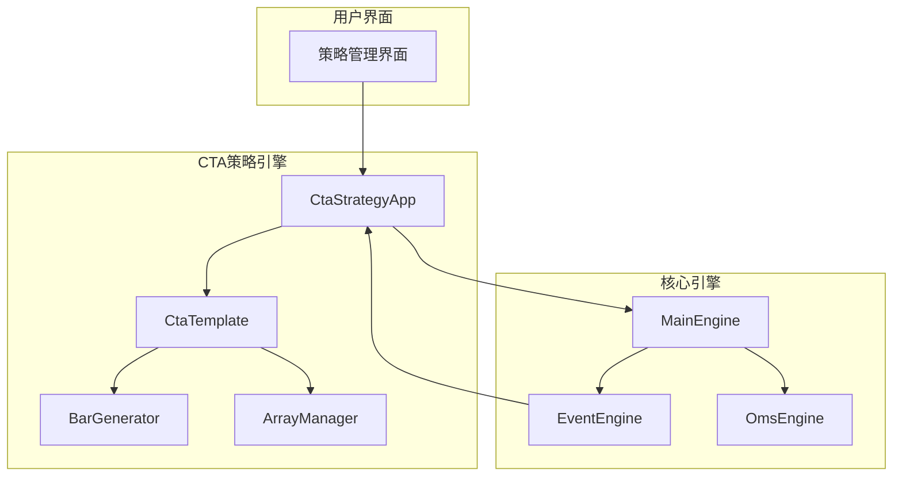
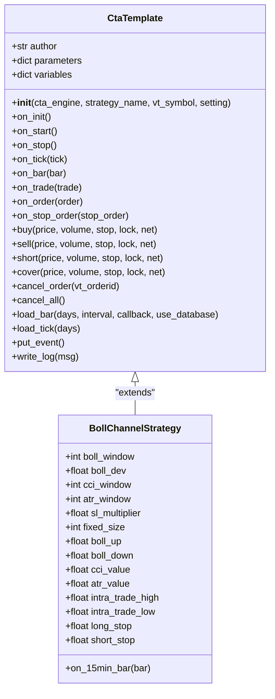
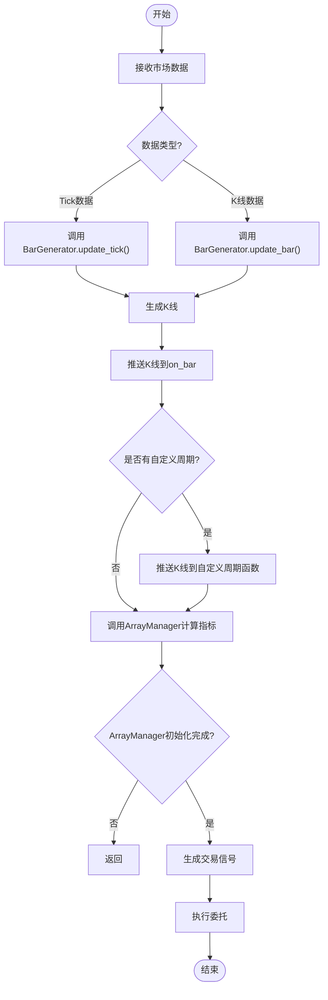
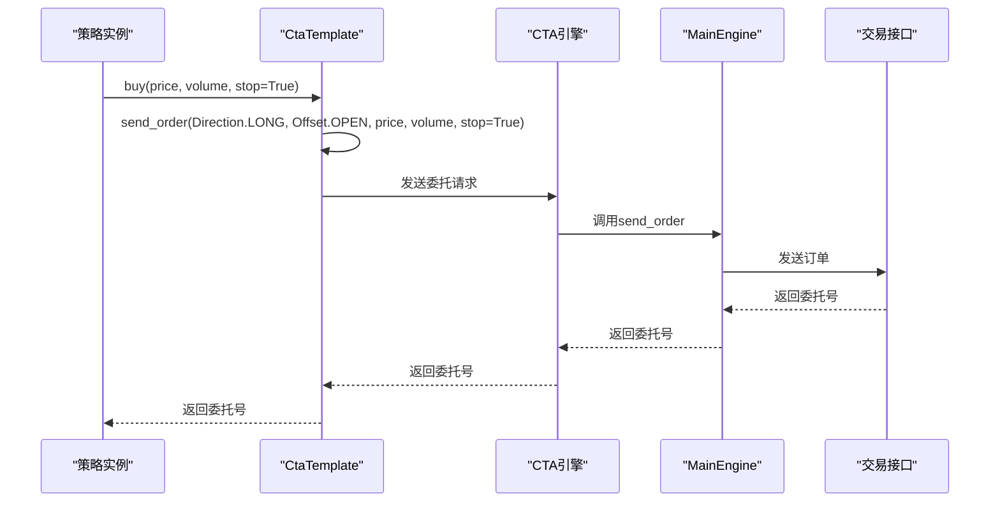
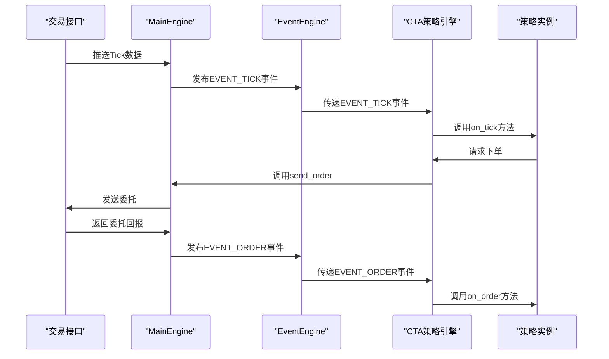
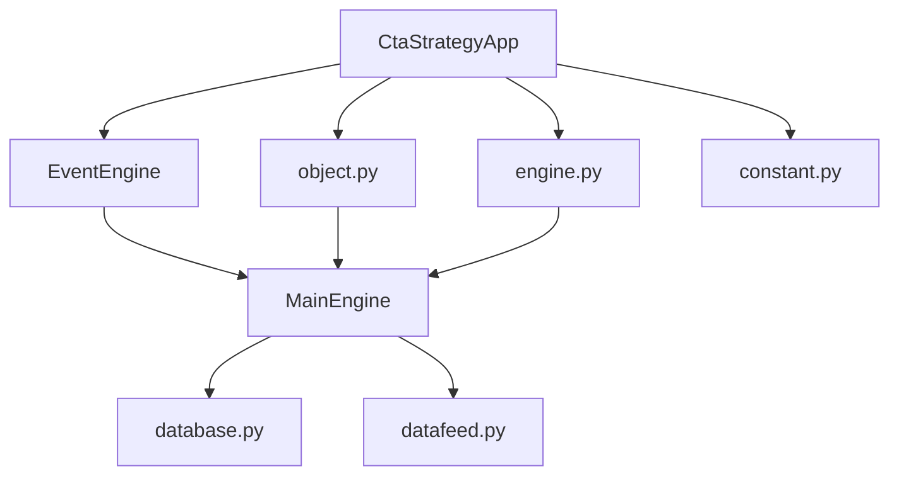

# CTA策略

<cite>
**本文档引用文件**   
- [cta_strategy.md](file://docs/community/app/cta_strategy.md)
- [backtesting_demo.ipynb](file://examples/cta_backtesting/backtesting_demo.ipynb)
- [engine.py](file://vnpy/trader/engine.py)
- [object.py](file://vnpy/trader/object.py)
</cite>

## 目录
1. [引言](#引言)
2. [项目结构](#项目结构)
3. [核心组件](#核心组件)
4. [架构概述](#架构概述)
5. [详细组件分析](#详细组件分析)
6. [依赖分析](#依赖分析)
7. [性能考虑](#性能考虑)
8. [故障排除指南](#故障排除指南)
9. [结论](#结论)

## 引言
CTA策略应用（CtaStrategyApp）是VeighNa量化交易平台中用于CTA自动交易的核心功能模块。该模块为用户提供了一个完整的策略生命周期管理界面，支持策略的初始化、启动、停止、参数编辑和移除等操作。本文档将详尽描述其设计原理与实现机制，重点说明其作为趋势跟踪策略核心引擎的工作流程。

## 项目结构
CTA策略应用的文件结构遵循VeighNa平台的模块化设计原则。核心文档位于`docs/community/app/`目录下，其中`cta_strategy.md`提供了详细的使用说明和开发指南。示例代码位于`examples/cta_backtesting/`目录下，包含回测演示脚本。核心实现代码分布在`vnpy/trader/`目录中，涉及事件引擎、对象定义和主引擎等基础组件。

## 核心组件
CTA策略应用的核心组件包括策略模板（CtaTemplate）、K线生成模块（BarGenerator）、K线时间序列管理模块（ArrayManager）以及回测引擎（BacktestingEngine）。这些组件共同构成了策略开发和执行的基础框架，支持用户基于模板快速开发和部署CTA策略。

## 架构概述
CTA策略应用的架构基于事件驱动模型，通过MainEngine协调各个功能模块。策略实例通过继承CtaTemplate获得基础功能，利用BarGenerator将Tick数据合成为K线数据，并通过ArrayManager进行技术指标计算。整个系统通过事件引擎（EventEngine）实现组件间的松耦合通信。

**Diagram sources**
- [cta_strategy.md](file://docs/community/app/cta_strategy.md)
- [engine.py](file://vnpy/trader/engine.py)

## 详细组件分析

### 策略模板分析
CTA策略模板（CtaTemplate）是所有策略类的基类，定义了策略开发的标准接口和生命周期方法。策略开发者通过继承该模板并实现特定的回调函数来构建自己的交易策略。

#### 类继承体系

**Diagram sources**
- [cta_strategy.md](file://docs/community/app/cta_strategy.md)

### 信号生成逻辑
CTA策略的信号生成逻辑主要通过on_bar和on_tick等回调函数实现。策略接收市场数据后，利用ArrayManager计算技术指标，并根据预设的交易规则生成买卖信号。

#### 信号生成工作流程

**Diagram sources**
- [cta_strategy.md](file://docs/community/app/cta_strategy.md)

### 交易规则执行
CTA策略的交易规则执行通过buy、sell、short、cover等主动函数实现。这些函数封装了委托下单的复杂逻辑，包括价格取整、数量调整和委托类型转换等。

#### 交易执行序列图

**Diagram sources**
- [cta_strategy.md](file://docs/community/app/cta_strategy.md)

### 与MainEngine的事件交互
CTA策略应用通过事件机制与MainEngine进行交互。所有市场数据、委托回报和成交信息都通过事件总线进行传递，实现了组件间的松耦合。

#### 事件交互模式

**Diagram sources**
- [engine.py](file://vnpy/trader/engine.py)
- [cta_strategy.md](file://docs/community/app/cta_strategy.md)

### 策略开发模板解析
CTA策略开发模板提供了完整的生命周期方法，开发者需要根据策略逻辑在相应的方法中实现具体功能。

#### 生命周期方法使用场景
| 方法 | 使用场景 | 最佳实践 |
|------|---------|---------|
| on_init | 策略初始化 | 调用load_bar加载历史数据，进行策略初始化计算 |
| on_start | 策略启动 | 输出启动日志，准备开始交易 |
| on_stop | 策略停止 | 输出停止日志，清理资源 |
| on_tick | 接收Tick数据 | 调用BarGenerator.update_tick处理Tick数据 |
| on_bar | 接收K线数据 | 计算技术指标，生成交易信号 |
| on_trade | 处理成交回报 | 更新策略状态，记录交易信息 |
| on_order | 处理委托回报 | 监控委托状态，处理异常情况 |
| on_stop_order | 处理停止单回报 | 监控停止单状态，更新策略逻辑 |

**Section sources**
- [cta_strategy.md](file://docs/community/app/cta_strategy.md)

## 依赖分析
CTA策略应用依赖于VeighNa平台的多个核心组件，包括事件引擎、对象系统和主引擎。这些依赖关系确保了策略能够与交易平台的其他功能无缝集成。

**Diagram sources**
- [engine.py](file://vnpy/trader/engine.py)
- [object.py](file://vnpy/trader/object.py)

## 性能考虑
CTA策略应用在设计时充分考虑了性能因素。通过事件驱动架构和异步处理机制，确保了策略能够在高频率市场数据下稳定运行。历史数据加载采用多级缓存策略，优先从交易接口获取，其次使用数据服务，最后查询本地数据库。

## 故障排除指南
常见问题包括策略初始化失败、交易信号未触发和委托下单异常等。初始化失败通常由合约代码错误或历史数据不足引起；交易信号未触发可能是由于ArrayManager未完成初始化；委托下单异常则需要检查策略的trading状态是否为True。

**Section sources**
- [cta_strategy.md](file://docs/community/app/cta_strategy.md)

## 结论
CTA策略应用提供了一个强大而灵活的框架，支持用户开发和部署复杂的趋势跟踪策略。通过标准化的接口和丰富的功能组件，大大降低了量化策略开发的门槛。结合回测演示脚本，用户可以快速验证策略逻辑并部署到实盘交易中。