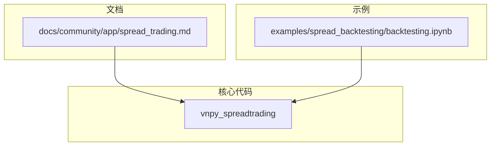
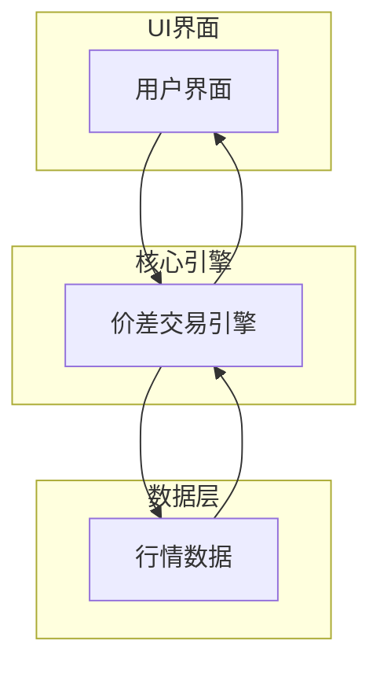
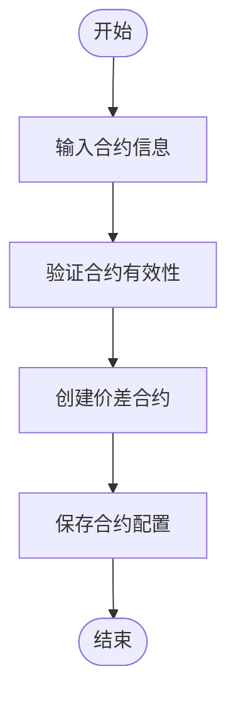
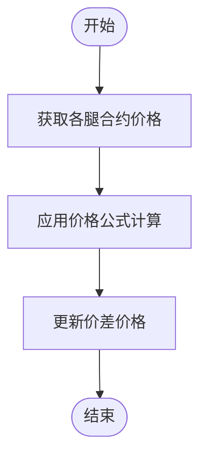
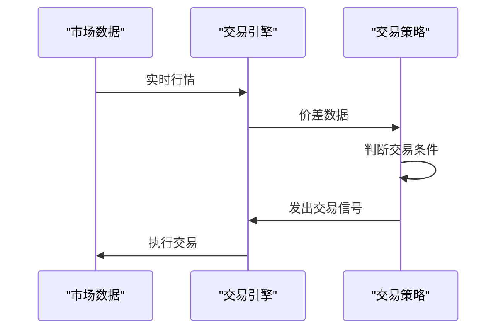
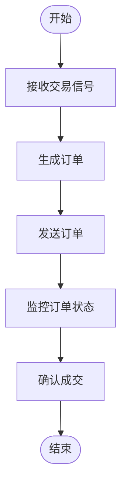
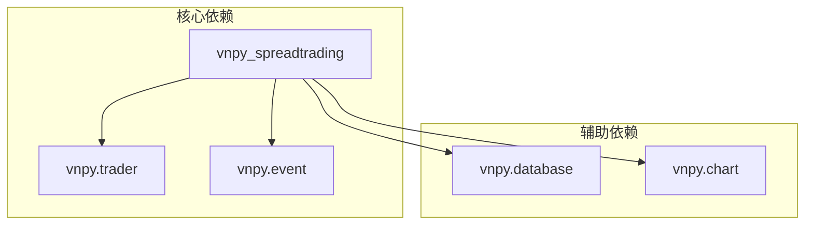

# 价差交易

<cite>
**本文档引用文件**   
- [spread_trading.md](file://docs/community/app/spread_trading.md)
- [backtesting.ipynb](file://examples/spread_backtesting/backtesting.ipynb)
</cite>

## 目录
1. [引言](#引言)
2. [项目结构](#项目结构)
3. [核心组件](#核心组件)
4. [架构概述](#架构概述)
5. [详细组件分析](#详细组件分析)
6. [依赖分析](#依赖分析)
7. [性能考虑](#性能考虑)
8. [故障排除指南](#故障排除指南)
9. [结论](#结论)

## 引言

价差交易应用（SpreadTradingApp）是用于多合约价差套利的功能模块，支持跨市场套利、期限结构交易等场景。该应用通过灵活的价差计算公式和交易信号触发机制，实现手动和自动交易功能。用户可以通过UI界面创建价差合约，配置多腿合约关系、权重系数与动态调整规则，并通过自动化交易接口进行策略回测和实盘交易。

## 项目结构

价差交易应用的文件结构主要包含文档、示例和核心代码三个部分。文档部分提供了详细的使用说明和开发指南，示例部分包含了回测脚本，核心代码部分实现了价差交易的各项功能。

**图示来源**
- [spread_trading.md](file://docs/community/app/spread_trading.md#L1-L865)
- [backtesting.ipynb](file://examples/spread_backtesting/backtesting.ipynb#L1-L131)

## 核心组件

价差交易应用的核心组件包括价差合约创建、价格计算引擎、交易信号触发机制和订单执行策略。这些组件共同协作，实现复杂的价差交易逻辑。

**组件来源**
- [spread_trading.md](file://docs/community/app/spread_trading.md#L58-L335)

## 架构概述

价差交易应用的架构设计遵循模块化原则，将不同的功能分离到独立的组件中。这种设计使得系统易于维护和扩展，同时也提高了代码的可读性和可测试性。

**图示来源**
- [spread_trading.md](file://docs/community/app/spread_trading.md#L1-L865)

## 详细组件分析

### 价差合约创建分析

价差合约创建是价差交易应用的基础功能，允许用户定义多腿合约关系和权重系数。

#### 价差合约创建流程

**图示来源**
- [spread_trading.md](file://docs/community/app/spread_trading.md#L58-L97)

### 价格计算引擎分析

价格计算引擎负责实时计算价差合约的价格，支持复杂的数学公式。

#### 价格计算流程

**图示来源**
- [spread_trading.md](file://docs/community/app/spread_trading.md#L75-L95)

### 交易信号触发机制分析

交易信号触发机制基于预设的阈值和条件，自动发出交易指令。

#### 交易信号触发流程

**图示来源**
- [spread_trading.md](file://docs/community/app/spread_trading.md#L200-L229)

### 订单执行策略分析

订单执行策略负责将交易信号转化为具体的订单操作，确保交易的顺利执行。

#### 订单执行流程

**图示来源**
- [spread_trading.md](file://docs/community/app/spread_trading.md#L144-L182)

## 依赖分析

价差交易应用依赖于多个外部组件和库，这些依赖关系确保了系统的完整性和功能性。

**图示来源**
- [spread_trading.md](file://docs/community/app/spread_trading.md#L353-L365)

## 性能考虑

价差交易应用在设计时充分考虑了性能因素，确保在高频率交易场景下的稳定运行。

- 实时行情处理：优化数据流，减少延迟
- 计算效率：采用高效的算法和数据结构
- 内存管理：合理分配和释放内存资源
- 并发处理：支持多线程和异步操作

## 故障排除指南

当遇到问题时，可以参考以下常见问题的解决方案：

1. **合约信息查询失败**：确保已正确连接交易接口，并等待"合约信息查询成功"日志输出后再启动模块。
2. **价差价格跳动取值为零**：检查是否在合约信息查询成功前打开了模块。
3. **IB接口问题**：需要先手动订阅合约行情，再启动模块。

**问题来源**
- [spread_trading.md](file://docs/community/app/spread_trading.md#L43-L48)

## 结论

价差交易应用通过其灵活的架构设计和强大的功能，为用户提供了一个高效、可靠的价差交易解决方案。无论是跨市场套利还是期限结构交易，该应用都能满足复杂交易策略的需求。通过合理的配置和使用，用户可以充分利用该应用的优势，实现稳定的收益。