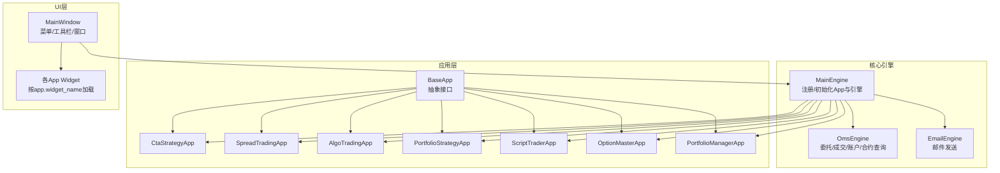
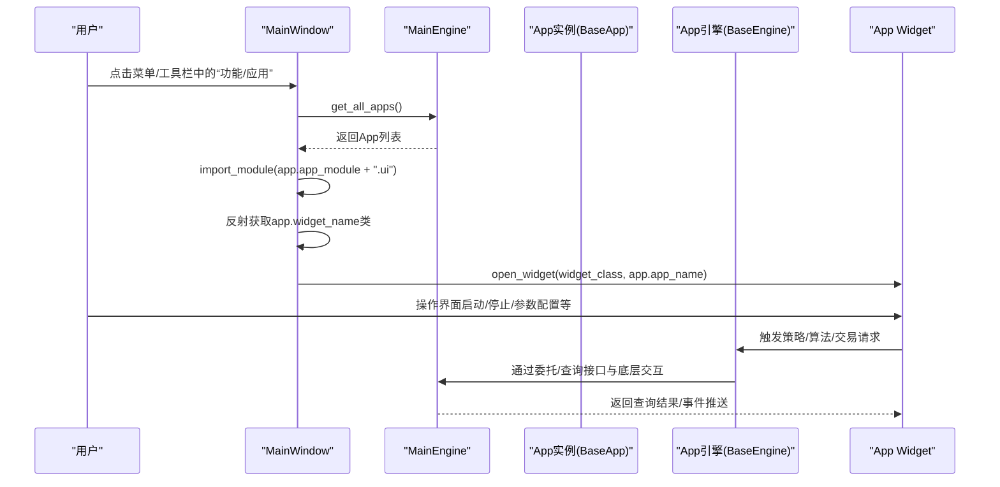
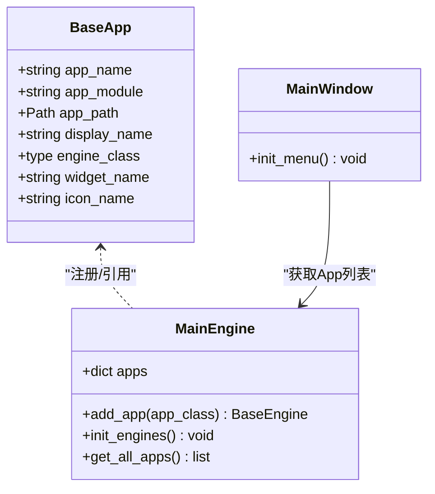

# 功能应用

<cite>
**本文引用的文件**
- [vnpy/trader/app.py](file://vnpy/trader/app.py)
- [vnpy/trader/engine.py](file://vnpy/trader/engine.py)
- [vnpy/trader/ui/mainwindow.py](file://vnpy/trader/ui/mainwindow.py)
- [examples/veighna_trader/run.py](file://examples/veighna_trader/run.py)
- [docs/community/app/cta_strategy.md](file://docs/community/app/cta_strategy.md)
- [docs/community/app/spread_trading.md](file://docs/community/app/spread_trading.md)
- [docs/community/app/algo_trading.md](file://docs/community/app/algo_trading.md)
- [docs/community/app/portfolio_strategy.md](file://docs/community/app/portfolio_strategy.md)
- [docs/community/app/script_trader.md](file://docs/community/app/script_trader.md)
- [docs/community/app/option_master.md](file://docs/community/app/option_master.md)
- [docs/community/app/portfolio_manager.md](file://docs/community/app/portfolio_manager.md)
- [docs/community/info/introduction.md](file://docs/community/info/introduction.md)
</cite>

## 目录
1. [引言](#引言)
2. [项目结构](#项目结构)
3. [核心组件](#核心组件)
4. [架构总览](#架构总览)
5. [详细组件分析](#详细组件分析)
6. [依赖关系分析](#依赖关系分析)
7. [性能考量](#性能考量)
8. [故障排查指南](#故障排查指南)
9. [结论](#结论)
10. [附录](#附录)

## 引言
本文件系统性梳理vnpy提供的各类功能应用（App），重点覆盖CTA策略、价差交易、期权交易、算法交易、组合策略、脚本交易等核心App的工作原理与使用场景。文档同时阐述App的注册机制、UI集成方式与其与MainEngine的交互模式，给出配置参数说明、策略开发模板要点、回测与实盘切换方法，并结合cta_strategy.md、spread_trading.md等官方文档提炼关键功能点，辅助用户按需选择与组合不同App构建个性化交易系统。

## 项目结构
vnpy将“应用（App）”抽象为可插拔的功能单元，通过统一的BaseApp接口与MainEngine注册机制接入系统。UI侧由MainWindow动态构建菜单项与工具栏按钮，按App声明的模块名与部件类名加载对应Widget，形成完整的功能入口。

图表来源
- [vnpy/trader/app.py](file://vnpy/trader/app.py#L1-L22)
- [vnpy/trader/engine.py](file://vnpy/trader/engine.py#L120-L180)
- [vnpy/trader/ui/mainwindow.py](file://vnpy/trader/ui/mainwindow.py#L127-L138)

章节来源
- [vnpy/trader/app.py](file://vnpy/trader/app.py#L1-L22)
- [vnpy/trader/engine.py](file://vnpy/trader/engine.py#L120-L180)
- [vnpy/trader/ui/mainwindow.py](file://vnpy/trader/ui/mainwindow.py#L127-L138)
- [examples/veighna_trader/run.py](file://examples/veighna_trader/run.py#L39-L87)

## 核心组件
- BaseApp（抽象接口）
  - 关键字段：app_name、app_module、app_path、display_name、engine_class、widget_name、icon_name
  - 作用：定义App的唯一标识、模块导入路径、显示名称、绑定的引擎类与UI部件类名
- MainEngine（应用注册与引擎初始化）
  - add_app：实例化App并注册到apps字典，同时创建并返回App对应的引擎实例
  - init_engines：初始化通用引擎（如日志、委托查询、邮件等），并将常用查询/转换能力绑定到MainEngine
  - get_all_apps：提供所有已注册App对象，供UI动态构建菜单
- MainWindow（UI集成）
  - 从MainEngine获取所有App，动态import app.app_module.ui并反射获取widget_name对应的Widget类
  - 为每个App创建菜单项与工具栏按钮，点击后open_widget打开对应功能面板

章节来源
- [vnpy/trader/app.py](file://vnpy/trader/app.py#L1-L22)
- [vnpy/trader/engine.py](file://vnpy/trader/engine.py#L120-L180)
- [vnpy/trader/ui/mainwindow.py](file://vnpy/trader/ui/mainwindow.py#L127-L138)

## 架构总览
App的生命周期与交互流程如下：

图表来源
- [vnpy/trader/ui/mainwindow.py](file://vnpy/trader/ui/mainwindow.py#L127-L138)
- [vnpy/trader/engine.py](file://vnpy/trader/engine.py#L120-L180)

## 详细组件分析

### CTA策略（CtaStrategyApp）
- 功能定位
  - 提供CTA策略的图形化管理：策略实例创建、初始化、启动/停止、参数编辑、移除、批量操作、停止单监控、移仓助手等
- 注册与加载
  - 通过脚本或Veighna Station加载，调用main_engine.add_app(CtaStrategyApp)
- UI与交互
  - 通过MainWindow动态加载CtaStrategyApp.ui中的Widget类，菜单显示“CTA策略”
- 关键流程
  - 初始化：加载历史数据、恢复变量缓存、订阅行情
  - 启动：策略状态切换为trading=true，允许发单
  - 停止：撤销活动委托，保存变量缓存
  - 停止单：本地停止单（非交易所停止单）触发后转为限价委托
  - 移仓助手：批量平仓旧合约并以目标合约重建策略实例
- 策略模板要点
  - 继承CtaTemplate，使用BarGenerator与ArrayManager进行K线合成与指标计算
  - 回调函数：on_init/on_start/on_stop/on_tick/on_bar/on_trade/on_order/on_stop_order
  - 主动函数：buy/sell/short/cover/send_order/cancel_order/cancel_all
  - 功能函数：write_log/get_engine_type/get_pricetick/load_bar/put_event
- 配置参数
  - 策略类参数与变量需显式声明在parameters/variables列表中，以便UI显示与持久化
  - 合约vt_symbol、参数类型（str/int/float/bool）与默认值
- 回测与实盘切换
  - 通过get_engine_type判断引擎类型，实现同一策略同时适配回测与实盘
- 使用场景
  - 单合约趋势/均值回归/突破类策略，适合高频或中低频交易

章节来源
- [docs/community/app/cta_strategy.md](file://docs/community/app/cta_strategy.md#L1-L853)
- [examples/veighna_trader/run.py](file://examples/veighna_trader/run.py#L63-L70)

### 价差交易（SpreadTradingApp）
- 功能定位
  - 支持多合约价差构建、手动交易、自动交易（策略+算法）
- 注册与加载
  - main_engine.add_app(SpreadTradingApp)
- UI与交互
  - 菜单显示“价差交易”，动态加载SpreadTradingApp.ui中的Widget类
- 关键流程
  - 价差合约创建：支持灵活公式（A/B、A-B*C等），含主动/被动/定价腿
  - 手动交易：SpreadTaker算法按阈值超价挂单，先主动腿成交后被动腿对冲
  - 自动交易：策略实例（如BasicSpreadStrategy/StatisticalArbitrageStrategy）通过start_long_algo/start_short_algo调度算法
  - 初始化/启动/停止/编辑/移除与批量操作
- 策略模板要点
  - 继承SpreadStrategyTemplate，使用BarGenerator/ArrayManager
  - 回调函数：on_init/on_start/on_stop/on_spread_data/on_spread_tick/on_spread_bar/on_spread_pos/on_spread_algo/on_order/on_trade
  - 主动函数：start_long_algo/start_short_algo/start_algo/stop_algo/stop_all_algos
  - 功能函数：put_event/write_log/get_spread_tick/get_spread_pos
- 配置参数
  - 价差名称、主动腿、最小交易量、价格公式、A/B/C/D/E腿参数（合约代码、交易方向、交易乘数）
- 使用场景
  - 跨期/跨品种价差套利、统计套利、波动率区间交易

章节来源
- [docs/community/app/spread_trading.md](file://docs/community/app/spread_trading.md#L1-L865)
- [examples/veighna_trader/run.py](file://examples/veighna_trader/run.py#L66-L66)

### 算法交易（AlgoTradingApp）
- 功能定位
  - 提供多种示例算法（TWAP、Iceberg、Sniper、Stop、BestLimit），支持配置保存与批量CSV启动
- 注册与加载
  - main_engine.add_app(AlgoTradingApp)
- UI与交互
  - 菜单显示“算法交易”，动态加载AlgoTradingApp.ui中的Widget类
- 关键流程
  - 配置算法参数（算法类型、vt_symbol、方向、价格、数量、执行时间、轮询间隔、开平）
  - 启动/暂停/恢复/停止算法，支持“全部停止”
  - 数据监控：执行中/已结束/日志
- 使用场景
  - 大单拆分、冲击成本控制、网格/套利自动化

章节来源
- [docs/community/app/algo_trading.md](file://docs/community/app/algo_trading.md#L1-L172)
- [examples/veighna_trader/run.py](file://examples/veighna_trader/run.py#L67-L67)

### 组合策略（PortfolioStrategyApp）
- 功能定位
  - 多合约组合策略实盘，支持目标仓位调仓、回测（分钟K线）、批量操作
- 注册与加载
  - main_engine.add_app(PortfolioStrategyApp)
- UI与交互
  - 菜单显示“组合策略”，动态加载PortfolioStrategyApp.ui中的Widget类
- 关键流程
  - 策略实例创建：合约列表（逗号分隔，无空格）、参数配置
  - 初始化/启动/停止/编辑/移除/批量操作
  - 组合策略不提供本地停止单
- 策略模板要点
  - 继承StrategyTemplate，使用PortfolioBarGenerator与ArrayManager
  - 回调函数：on_init/on_start/on_stop/on_tick/on_bars（回测不支持on_tick）
  - 主动函数：buy/sell/short/cover/send_order/cancel_order/cancel_all
  - 功能函数：get_pos/get_order/get_all_active_orderids/get_pricetick/write_log/load_bars/put_event/send_email/sync_data
  - 进阶：set_target/get_target/rebalance_portfolio/calculate_price
- 配置参数
  - 合约列表（vt_symbols）、参数（如布林窗口、ATR窗口、固定手数、价格超价等）
- 使用场景
  - 资产配置/多标趋势/多因子择时/目标调仓

章节来源
- [docs/community/app/portfolio_strategy.md](file://docs/community/app/portfolio_strategy.md#L1-L884)
- [examples/veighna_trader/run.py](file://examples/veighna_trader/run.py#L69-L69)

### 脚本交易（ScriptTraderApp）
- 功能定位
  - 交互式量化分析与脚本策略运行，支持多接口连接、行情/委托/成交/账户查询、邮件发送
- 注册与加载
  - main_engine.add_app(ScriptTraderApp)
- UI与交互
  - 菜单显示“脚本策略”，动态加载ScriptTraderApp.ui中的Widget类
- 关键流程
  - 打开脚本策略文件、启动/停止、清空日志
  - 脚本引擎（ScriptEngine）提供订阅、查询、交易、日志、邮件等能力
- 使用场景
  - 股指/股票/期权多市场扫描、对冲策略、跨品种套利、自动化选股

章节来源
- [docs/community/app/script_trader.md](file://docs/community/app/script_trader.md#L1-L440)
- [examples/veighna_trader/run.py](file://examples/veighna_trader/run.py#L70-L70)

### 期权波动率交易（OptionMasterApp）
- 功能定位
  - 期权实时定价、波动率曲面跟踪、希腊值监控、组合压力测试、电子眼自动交易、Delta对冲
- 注册与加载
  - main_engine.add_app(OptionMasterApp)
- UI与交互
  - 菜单显示“期权交易”，动态加载OptionMasterApp.ui中的Widget类
- 关键流程
  - 配置组合（定价模型、年化利率、合约模式、希腊值小数位、定价标的）
  - T型报价、快速交易、持仓希腊值、升贴水监控、波动率曲线、Delta对冲、情景分析、波动率管理、电子眼
- 使用场景
  - 波动率交易、跨期/跨品种价差、希腊值中性策略、压力测试与风控

章节来源
- [docs/community/app/option_master.md](file://docs/community/app/option_master.md#L1-L284)
- [examples/veighna_trader/run.py](file://examples/veighna_trader/run.py#L68-L68)

### 投资组合管理（PortfolioManagerApp）
- 功能定位
  - 盘中业绩跟踪与盈亏分析，按组合维度（手动/策略/算法/脚本/组合策略/期权电子眼/Delta对冲）统计
- 注册与加载
  - main_engine.add_app(PortfolioManagerApp)
- UI与交互
  - 菜单显示“投资组合”，动态加载PortfolioManagerApp.ui中的Widget类
- 关键流程
  - 组合信息表（组合名称、本地代码、开盘/当前仓位、交易/持仓/总/净盈亏、多/空头成交）
  - 成交记录表筛选、刷新频率设置、缓存文件管理
- 使用场景
  - 多策略/多来源交易的统一归集与分析

章节来源
- [docs/community/app/portfolio_manager.md](file://docs/community/app/portfolio_manager.md#L1-L122)
- [examples/veighna_trader/run.py](file://examples/veighna_trader/run.py#L78-L78)

## 依赖关系分析
- App注册与引擎初始化
  - MainEngine.add_app：实例化App并注册到apps字典，随后创建并返回App引擎实例
  - MainEngine.init_engines：初始化通用引擎（日志、委托查询、邮件），并将常用查询/转换能力绑定到MainEngine
- UI集成
  - MainWindow.init_menu：从MainEngine获取所有App，import app.app_module.ui并反射获取widget_name类，动态创建菜单项与工具栏按钮
- App间耦合
  - App之间通过MainEngine共享底层查询/委托能力，彼此解耦
  - 各App的Widget与引擎职责分离，UI仅负责交互，业务逻辑在App引擎中实现

图表来源
- [vnpy/trader/app.py](file://vnpy/trader/app.py#L1-L22)
- [vnpy/trader/engine.py](file://vnpy/trader/engine.py#L120-L180)
- [vnpy/trader/ui/mainwindow.py](file://vnpy/trader/ui/mainwindow.py#L127-L138)

章节来源
- [vnpy/trader/engine.py](file://vnpy/trader/engine.py#L120-L180)
- [vnpy/trader/ui/mainwindow.py](file://vnpy/trader/ui/mainwindow.py#L127-L138)

## 性能考量
- 数据加载与缓存
  - CTA/组合策略在初始化阶段加载历史数据，建议合理设置加载天数，避免数据不足导致指标异常
  - 策略变量与持仓缓存（cta_strategy_data.json/portfolio_strategy_data.json）需谨慎管理，避免手动修改导致状态偏差
- 委托与滑点
  - 算法交易（TWAP/Iceberg/Sniper/BestLimit/Stop）可降低冲击成本，需根据流动性与滑点容忍度调整参数
  - 价差交易的主动/被动腿对冲需考虑流动性与价差收敛速度
- UI刷新与事件
  - 策略需调用put_event以刷新界面，避免界面停滞
  - PortfolioManager的刷新频率可调，兼顾性能与实时性
- 多合约与并发
  - 组合策略与价差策略在on_bars/on_spread_bar中批量处理，注意避免重复撤单与过度发单

## 故障排查指南
- 初始化失败
  - CTA策略：合约代码缺失交易所后缀、交易所名称错误、ArrayManager未初始化、数据服务不可用
  - 价差交易：合约信息查询未完成、价差公式/乘数配置不当
  - 组合策略：vt_symbol列表错误、初始化时报错
- 停止与撤销
  - 策略停止时会撤销活动委托，若仍有未成交委托，检查策略逻辑与接口状态
- 日志与邮件
  - 使用write_log输出关键节点，必要时配置EmailEngine并通过send_email发送通知
- UI无响应
  - 确认策略已调用put_event，或检查策略trading状态是否为True

章节来源
- [docs/community/app/cta_strategy.md](file://docs/community/app/cta_strategy.md#L122-L200)
- [docs/community/app/spread_trading.md](file://docs/community/app/spread_trading.md#L241-L333)
- [docs/community/app/portfolio_strategy.md](file://docs/community/app/portfolio_strategy.md#L104-L146)
- [docs/community/app/script_trader.md](file://docs/community/app/script_trader.md#L424-L440)

## 结论
vnpy通过统一的App抽象与MainEngine注册机制，将CTA策略、价差交易、期权交易、算法交易、组合策略、脚本交易、投资组合管理等模块有机整合。用户可通过脚本或Veighna Station按需加载App，借助UI完成策略与算法的全生命周期管理。结合官方文档与策略模板，用户可快速构建从单合约到多合约、从单策略到多策略组合的个性化量化交易系统。

## 附录
- App加载与演示
  - 示例脚本展示了如何在启动时注册多个App，便于对比与联调
- 模块概览
  - 官方文档对各App功能与特性进行了系统性介绍，可作为入门与进阶参考

章节来源
- [examples/veighna_trader/run.py](file://examples/veighna_trader/run.py#L39-L87)
- [docs/community/info/introduction.md](file://docs/community/info/introduction.md#L87-L117)