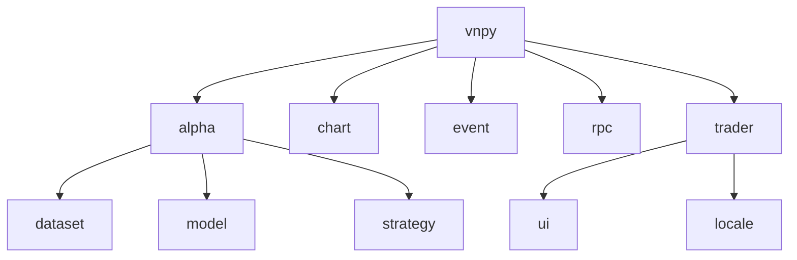
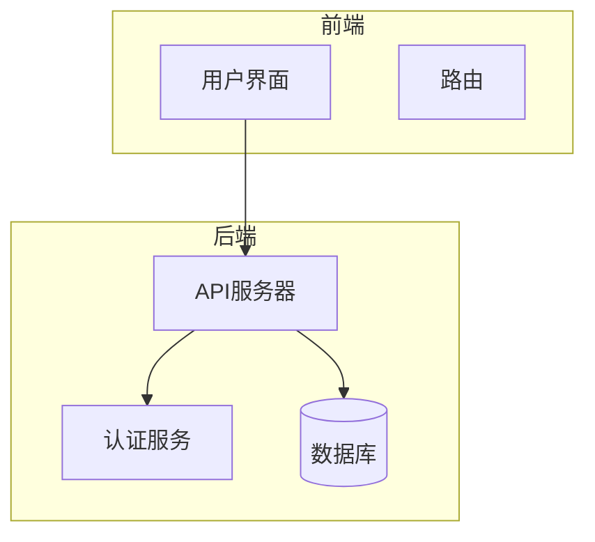
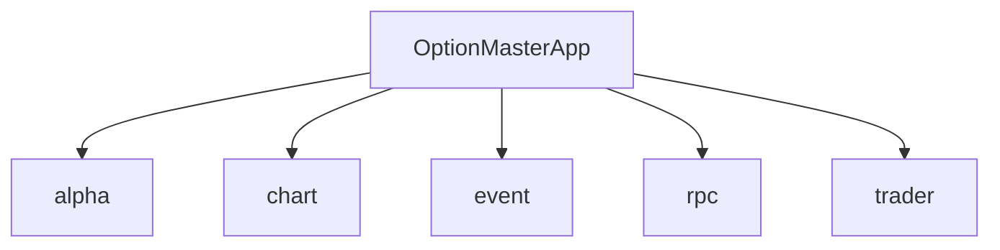

# 期权交易

<cite>
**本文档引用文件**  
- [option_master.md](file://docs/community/app/option_master.md)
- [elite_optionstrategy.md](file://docs/elite/strategy/elite_optionstrategy.md)
- [template.py](file://vnpy/alpha/strategy/template.py)
- [template.py](file://vnpy/alpha/dataset/template.py)
</cite>

## 目录
1. [简介](#简介)
2. [项目结构](#项目结构)
3. [核心组件](#核心组件)
4. [架构概述](#架构概述)
5. [详细组件分析](#详细组件分析)
6. [依赖分析](#依赖分析)
7. [性能考虑](#性能考虑)
8. [故障排除指南](#故障排除指南)
9. [结论](#结论)
10. [附录](#附录)（如有必要）

## 简介
OptionMasterApp是vnpy框架中的一个功能模块，专为**期权波动率交易**设计。该应用支持期权实时定价、波动率曲面跟踪、持仓希腊值监控、组合压力测试以及电子眼自动交易等功能。用户可以通过配置界面选择不同的定价模型（如Black-76、Black-Scholes和Binomial-Tree），并根据需要调整年化利率、合约模式等参数。此外，OptionMasterApp还提供了T型报价、快速交易、Delta对冲、情景分析和波动率管理等多种工具，帮助用户进行高效的期权交易。

## 项目结构
OptionMasterApp的实现主要分布在`vnpy`目录下的多个子模块中。核心功能文档位于`docs/community/app/option_master.md`，而相关的策略模板和数据集处理代码则位于`vnpy/alpha`目录下。具体结构如下：

**Diagram sources**  
- [option_master.md](file://docs/community/app/option_master.md)

**Section sources**
- [option_master.md](file://docs/community/app/option_master.md)

## 核心组件
OptionMasterApp的核心组件包括期权链配置、行情监控、快速交易、持仓希腊值监控、升贴水监控、波动率曲线、Delta对冲、情景分析和波动率管理。这些组件共同构成了一个完整的期权交易系统，支持复杂的期权策略（如跨式、宽跨式、蝶式组合）的构建与执行。

**Section sources**
- [option_master.md](file://docs/community/app/option_master.md)

## 架构概述
OptionMasterApp的架构设计旨在提供一个灵活且可扩展的期权交易环境。通过集成多种定价模型和风险管理工具，用户可以轻松地进行期权交易。系统支持从简单的手动交易到复杂的自动化策略执行，满足不同层次用户的需求。

**Diagram sources**  
- [option_master.md](file://docs/community/app/option_master.md)

## 详细组件分析

### 组件A分析
#### 期权链配置
在管理界面上，用户可以选择要交易的期权产品，并点击【配置】按钮打开组合配置对话框。配置参数包括定价模型、年化利率、合约模式、Greeks小数位以及期权链对应的定价标的。完成配置后，系统会初始化期权组合，激活其他功能按钮。

**Section sources**
- [option_master.md](file://docs/community/app/option_master.md)

#### 行情监控
点击【T型报价】按钮，用户可以查看期权的实时行情信息。窗口分为左右区域，中间为行权价，左侧为看涨期权，右侧为看跌期权。每行显示的信息包括合约代码、实时现金希腊值（Vega、Theta、Gamma、Delta）、交易信息（持仓量、成交量）、1档盘口信息（买隐波、买量、买价、卖价、卖量、卖隐波）以及净持仓。

**Section sources**
- [option_master.md](file://docs/community/app/option_master.md)

#### 快速交易
点击【快速交易】按钮，用户可以打开手动下单窗口。输入合约代码、买卖方向、开平方向、交易价格和数量后，点击【委托】按钮即可发出限价委托。双击T型报价中的单元格可以快速填充合约代码。

**Section sources**
- [option_master.md](file://docs/community/app/option_master.md)

#### 持仓希腊值
点击【持仓希腊值】按钮，用户可以监控交易组合、标的物合约、期权链和期权合约四个维度的风险。每个维度的监控信息包括多仓、空仓、净仓以及总希腊值（Delta、Gamma、Theta、Vega）。

**Section sources**
- [option_master.md](file://docs/community/app/option_master.md)

#### 升贴水监控
点击【升贴水监控】按钮，用户可以查看期权链定价升贴水校准幅度。系统会显示不同月份期权链的升贴水情况，帮助用户进行定价调整。

**Section sources**
- [option_master.md](file://docs/community/app/option_master.md)

#### 波动率曲线
点击【波动率曲线】按钮，用户可以查看当前市场波动率曲线。图表中每个期权链的波动率曲线采用不同颜色显示，包括看涨期权和看跌期权的1档盘口隐含波动率中值以及定价波动率。

**Section sources**
- [option_master.md](file://docs/community/app/option_master.md)

#### Delta对冲
点击【Delta对冲】按钮，用户可以启动Delta自动对冲功能。设置对冲标的、执行频率、Delta目标、Delta范围和委托超价后，系统会在满足条件时自动执行对冲操作。

**Section sources**
- [option_master.md](file://docs/community/app/option_master.md)

#### 情景分析
点击【情景分析】按钮，用户可以进行交易组合的整体持仓风险压力测试。通过配置目标数据、时间衰减、价格变动和波动率变动范围，系统会计算并绘制3D曲面图，展示不同情景下的盈亏情况。

**Section sources**
- [option_master.md](file://docs/community/app/option_master.md)

#### 波动率管理
点击【波动率管理】按钮，用户可以管理定价波动率。通过重置、拟合和手动微调，用户可以确保波动率曲线的平滑性和准确性。

**Section sources**
- [option_master.md](file://docs/community/app/option_master.md)

## 依赖分析
OptionMasterApp依赖于vnpy框架的多个模块，包括alpha、chart、event、rpc和trader。其中，alpha模块提供了量化模型和策略模板，chart模块负责图表绘制，event模块处理事件驱动逻辑，rpc模块支持远程过程调用，trader模块则提供了交易相关的基础功能。

**Diagram sources**  
- [option_master.md](file://docs/community/app/option_master.md)

**Section sources**
- [option_master.md](file://docs/community/app/option_master.md)

## 性能考虑
OptionMasterApp在设计时充分考虑了性能问题。通过使用高效的算法和数据结构，系统能够在高并发环境下稳定运行。此外，系统还支持批量操作和并行处理，进一步提升了性能。

## 故障排除指南
当遇到问题时，用户可以参考以下步骤进行排查：
1. 检查网络连接是否正常。
2. 确认配置参数是否正确。
3. 查看日志文件以获取详细错误信息。
4. 联系技术支持获取帮助。

**Section sources**
- [option_master.md](file://docs/community/app/option_master.md)

## 结论
OptionMasterApp是一个功能强大且易于使用的期权交易工具。通过集成多种定价模型和风险管理工具，用户可以轻松地进行复杂的期权交易。未来，我们将继续优化系统性能，增加更多高级功能，以满足用户不断增长的需求。

## 附录
如有必要，可在附录中添加额外的信息，如术语表、常见问题解答等。