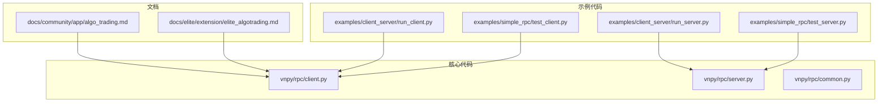
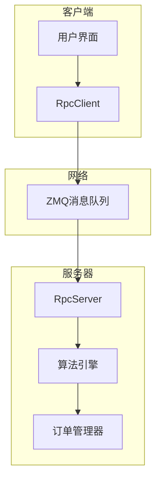
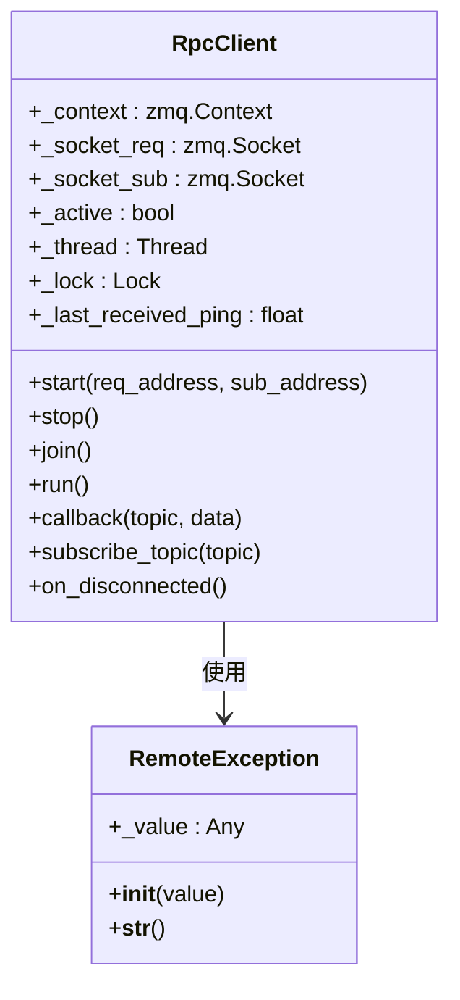
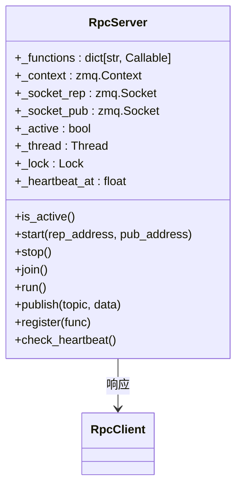
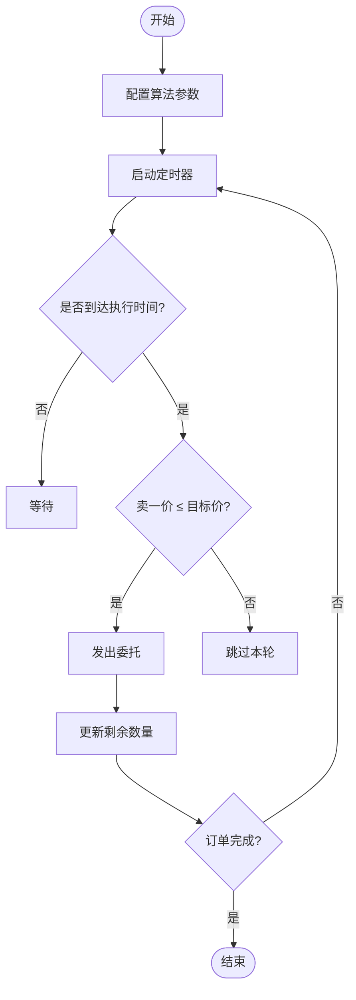
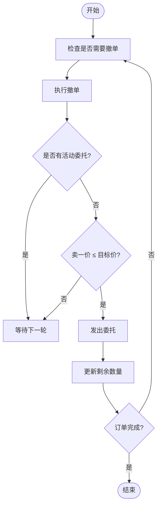
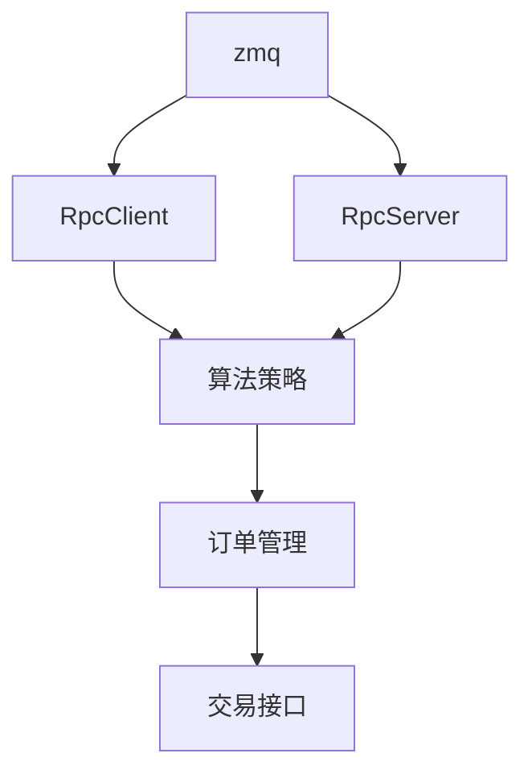

# 算法交易

<cite>
**本文档引用的文件**
- [algo_trading.md](file://docs/community/app/algo_trading.md)
- [client.py](file://vnpy/rpc/client.py)
- [server.py](file://vnpy/rpc/server.py)
- [common.py](file://vnpy/rpc/common.py)
- [run_client.py](file://examples/client_server/run_client.py)
- [run_server.py](file://examples/client_server/run_server.py)
- [test_client.py](file://examples/simple_rpc/test_client.py)
- [test_server.py](file://examples/simple_rpc/test_server.py)
</cite>

## 目录
1. [简介](#简介)
2. [项目结构](#项目结构)
3. [核心组件](#核心组件)
4. [架构概述](#架构概述)
5. [详细组件分析](#详细组件分析)
6. [依赖分析](#依赖分析)
7. [性能考虑](#性能考虑)
8. [故障排除指南](#故障排除指南)
9. [结论](#结论)

## 简介
算法交易应用（AlgoTradingApp）是VeighNa量化交易平台中的核心模块，专注于实现复杂的算法订单执行策略。该系统通过分布式架构设计，实现了客户端-服务器分离部署，确保了高可用性和低延迟执行。本文档系统阐述了算法交易应用的架构设计与分布式执行能力，重点解析冰山单、时间加权平均价格（TWAP）、成交量加权平均价格（VWAP）等算法订单类型的实现机制。同时，详细说明了算法引擎如何通过RPC服务实现跨进程通信，以及算法任务的生命周期管理、状态同步和异常恢复策略。

## 项目结构
算法交易应用的项目结构体现了清晰的模块化设计原则，将核心功能、文档说明和示例代码分层组织。系统通过RPC模块实现分布式通信，算法策略独立部署，确保了系统的可扩展性和维护性。

**图源**
- [algo_trading.md](file://docs/community/app/algo_trading.md)
- [client.py](file://vnpy/rpc/client.py)
- [server.py](file://vnpy/rpc/server.py)

**本节来源**
- [algo_trading.md](file://docs/community/app/algo_trading.md)
- [client.py](file://vnpy/rpc/client.py)
- [server.py](file://vnpy/rpc/server.py)

## 核心组件
算法交易应用的核心组件包括算法引擎、RPC客户端与服务器、以及多种内置算法策略。算法引擎负责管理算法任务的生命周期，包括启动、暂停、恢复和停止。RPC客户端与服务器组件实现了客户端-服务器分离架构，通过ZMQ消息队列进行高效通信。系统提供了多种内置算法，如TWAP、冰山算法、狙击手算法等，每种算法都有其特定的执行逻辑和应用场景。

**本节来源**
- [algo_trading.md](file://docs/community/app/algo_trading.md)
- [client.py](file://vnpy/rpc/client.py)
- [server.py](file://vnpy/rpc/server.py)

## 架构概述
算法交易应用采用分布式架构设计，通过RPC服务实现客户端与服务器的分离部署。客户端负责用户界面交互和算法配置，服务器端负责算法执行和订单管理。这种架构设计不仅提高了系统的可扩展性，还确保了高可用性和低延迟执行。

**图源**
- [client.py](file://vnpy/rpc/client.py)
- [server.py](file://vnpy/rpc/server.py)

## 详细组件分析

### RPC客户端分析
RPC客户端组件是算法交易应用与服务器通信的关键。它通过ZMQ的请求-回复模式和发布-订阅模式实现双向通信。客户端维护两个套接字：一个用于发送请求和接收响应，另一个用于订阅服务器推送的数据。

**图源**
- [client.py](file://vnpy/rpc/client.py#L29-L170)

**本节来源**
- [client.py](file://vnpy/rpc/client.py#L1-L170)
- [test_client.py](file://examples/simple_rpc/test_client.py#L1-L35)

### RPC服务器分析
RPC服务器组件负责接收客户端请求、执行相应功能并返回结果。服务器采用多线程设计，能够同时处理多个客户端的请求。它通过注册机制管理可调用函数，并通过心跳机制确保连接的可靠性。

**图源**
- [server.py](file://vnpy/rpc/server.py#L11-L141)

**本节来源**
- [server.py](file://vnpy/rpc/server.py#L1-L141)
- [test_server.py](file://examples/simple_rpc/test_server.py#L1-L39)

### 算法策略分析
算法交易应用内置了多种交易策略，每种策略都有其独特的执行逻辑。这些策略通过事件驱动的方式响应市场数据变化，实现智能化的订单执行。

#### TWAP算法流程
时间加权平均价格（TWAP）算法通过将大额订单分割成多个小额订单，在指定时间区间内均匀执行，以降低市场冲击成本。

**图源**
- [algo_trading.md](file://docs/community/app/algo_trading.md#L123-L131)

#### 冰山算法流程
冰山算法通过隐藏大额订单的真实规模，只显示部分订单量，从而减少市场影响，适合大额订单的执行。

**图源**
- [algo_trading.md](file://docs/community/app/algo_trading.md#L133-L141)

## 依赖分析
算法交易应用的组件之间存在明确的依赖关系。RPC客户端依赖于ZMQ库进行网络通信，RPC服务器同样依赖ZMQ库并管理可调用函数的注册。算法策略依赖于RPC服务进行远程调用，实现分布式执行。

**图源**
- [client.py](file://vnpy/rpc/client.py)
- [server.py](file://vnpy/rpc/server.py)

**本节来源**
- [client.py](file://vnpy/rpc/client.py#L1-L170)
- [server.py](file://vnpy/rpc/server.py#L1-L141)
- [common.py](file://vnpy/rpc/common.py#L1-L11)

## 性能考虑
算法交易应用在设计时充分考虑了性能因素。通过使用ZMQ消息队列，实现了高效的跨进程通信。心跳机制确保了连接的可靠性，同时避免了不必要的网络开销。多线程设计使得服务器能够并发处理多个客户端请求，提高了系统的吞吐量。算法策略的执行逻辑经过优化，确保在高频率市场数据更新下仍能保持低延迟。

## 故障排除指南
当算法交易应用出现连接问题时，首先检查网络配置和防火墙设置。如果RPC客户端无法连接服务器，确认服务器地址和端口配置正确。对于算法执行异常，检查日志输出以确定问题根源。系统提供了心跳机制和异常处理，能够在连接中断时及时通知用户。

**本节来源**
- [client.py](file://vnpy/rpc/client.py#L164-L169)
- [server.py](file://vnpy/rpc/server.py#L129-L141)

## 结论
算法交易应用通过分布式架构设计和RPC服务实现，成功构建了一个高可用、低延迟的算法执行平台。系统支持多种算法订单类型，包括TWAP、冰山算法等，能够有效降低交易成本和市场冲击。通过清晰的组件划分和高效的通信机制，该应用为量化交易提供了强大的技术支持。未来可进一步优化算法策略，增加更多智能执行逻辑，提升系统的整体性能和用户体验。