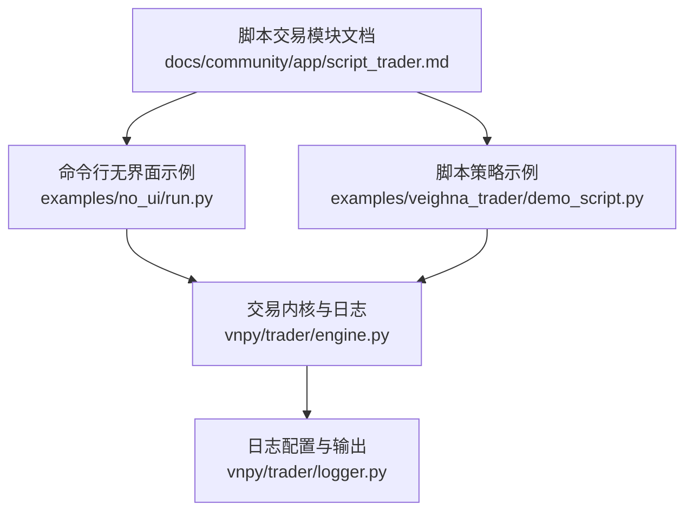
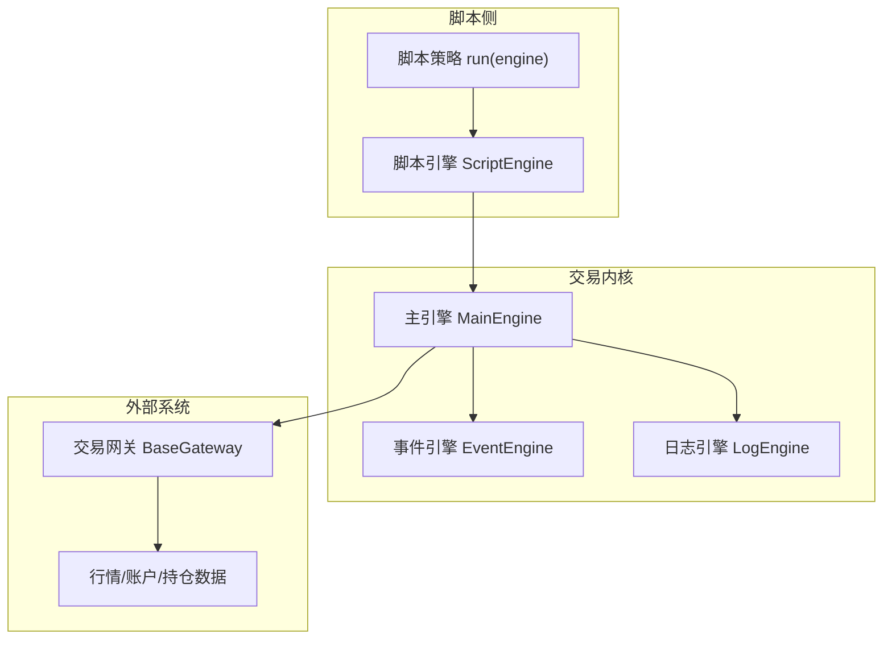
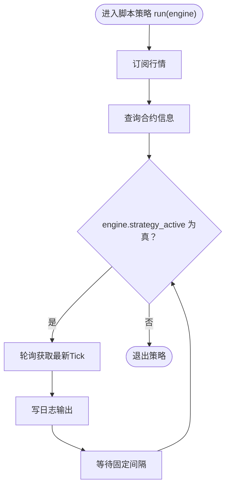
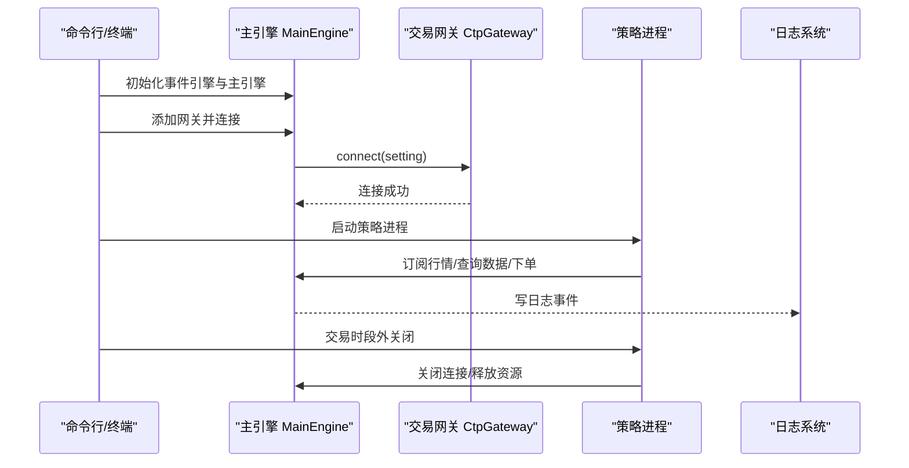
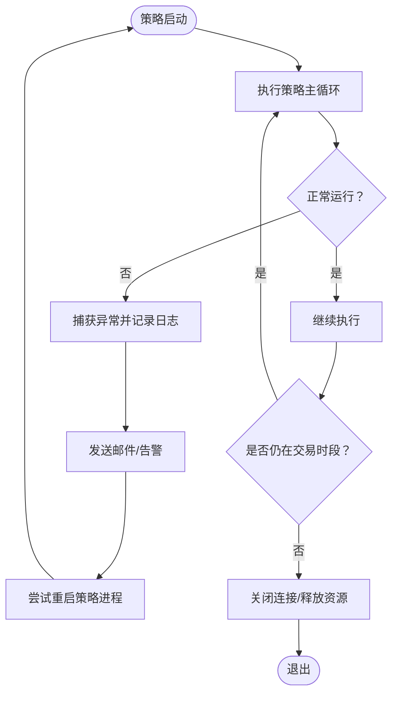
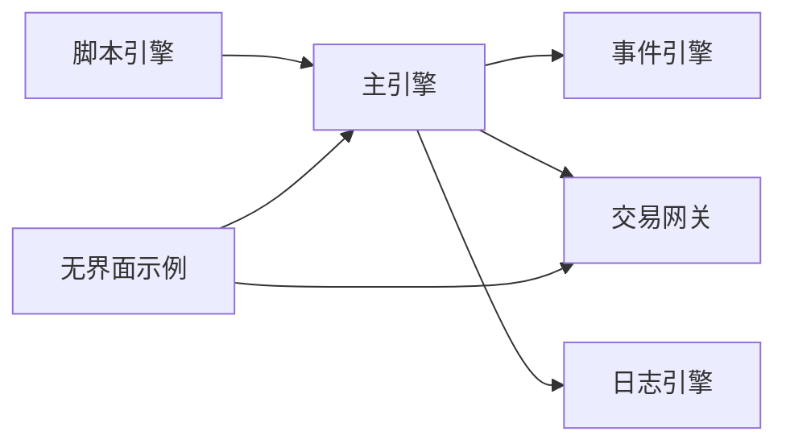

# 脚本交易

<cite>
**本文引用的文件**
- [script_trader.md](file://docs/community/app/script_trader.md)
- [run.py](file://examples/no_ui/run.py)
- [demo_script.py](file://examples/veighna_trader/demo_script.py)
- [engine.py](file://vnpy/trader/engine.py)
- [logger.py](file://vnpy/trader/logger.py)
- [README.md](file://README.md)
</cite>

## 目录
1. [引言](#引言)
2. [项目结构](#项目结构)
3. [核心组件](#核心组件)
4. [架构总览](#架构总览)
5. [详细组件分析](#详细组件分析)
6. [依赖分析](#依赖分析)
7. [性能考虑](#性能考虑)
8. [故障排查指南](#故障排查指南)
9. [结论](#结论)
10. [附录](#附录)

## 引言
本文件围绕脚本交易应用（ScriptTraderApp）的轻量化设计与自动化交易能力展开，重点说明其在无人值守场景下的优势。文档结合脚本交易模块的官方文档与示例，阐述Python脚本如何通过API直接访问交易接口、行情数据与账户信息，实现完全自定义的交易逻辑；并给出命令行交互模式、脚本热加载机制与异常重启策略的实践建议，最后以 no_ui/run.py 示例展示如何在无图形界面环境下启动交易引擎、连接网关并执行自动化策略，适用于服务器部署与高频交易场景。

## 项目结构
脚本交易应用位于文档与示例目录中，核心文档为脚本交易模块说明，示例包含命令行无界面运行脚本与脚本策略示例。交易内核与日志体系位于vnpy/trader模块中，为脚本引擎提供统一的事件驱动与日志输出能力。

图表来源
- [script_trader.md](file://docs/community/app/script_trader.md#L1-L120)
- [demo_script.py](file://examples/veighna_trader/demo_script.py#L1-L42)
- [run.py](file://examples/no_ui/run.py#L1-L126)
- [engine.py](file://vnpy/trader/engine.py#L150-L349)
- [logger.py](file://vnpy/trader/logger.py#L1-L55)

章节来源
- [script_trader.md](file://docs/community/app/script_trader.md#L1-L120)
- [run.py](file://examples/no_ui/run.py#L1-L126)
- [demo_script.py](file://examples/veighna_trader/demo_script.py#L1-L42)
- [engine.py](file://vnpy/trader/engine.py#L150-L349)
- [logger.py](file://vnpy/trader/logger.py#L1-L55)

## 核心组件
- 脚本引擎（ScriptEngine）：提供订阅行情、查询合约/账户/持仓、下单/撤单、写日志等能力，是脚本策略的统一入口。
- 主引擎（MainEngine）：统一管理事件引擎、网关、应用与功能引擎，提供连接、订阅、下单、撤单、查询历史等对外接口。
- 日志系统（LogEngine + logger）：通过事件驱动输出日志，支持控制台与文件输出，满足无人值守环境下的可观测性需求。
- 脚本策略模板：演示如何使用 ScriptEngine 编写持续运行的策略，通过 engine.strategy_active 控制循环退出。
- 命令行无界面示例：展示如何在无GUI环境下启动引擎、连接网关、初始化策略并按交易时段自动启停。

章节来源
- [script_trader.md](file://docs/community/app/script_trader.md#L120-L440)
- [engine.py](file://vnpy/trader/engine.py#L150-L349)
- [logger.py](file://vnpy/trader/logger.py#L1-L55)
- [demo_script.py](file://examples/veighna_trader/demo_script.py#L1-L42)
- [run.py](file://examples/no_ui/run.py#L1-L126)

## 架构总览
脚本交易应用采用“脚本引擎 + 主引擎 + 网关 + 日志系统”的分层架构。脚本引擎通过主引擎提供的统一API访问交易接口、行情与账户数据；日志系统通过事件机制输出到控制台与文件，满足无人值守场景下的审计与排障需求。

图表来源
- [script_trader.md](file://docs/community/app/script_trader.md#L120-L440)
- [engine.py](file://vnpy/trader/engine.py#L150-L349)
- [logger.py](file://vnpy/trader/logger.py#L1-L55)

## 详细组件分析

### 组件A：脚本引擎与脚本策略
- 脚本引擎能力
  - 订阅行情：支持批量订阅多个合约。
  - 查询数据：支持单条/多条/全量查询，涵盖Tick、Order、Contract、Account、Position、Bars等。
  - 交易委托：提供 buy/sell/short/cover 等便捷函数，或 send_order 完整参数下单。
  - 撤单与历史数据：基于本地委托号撤单，或通过数据服务查询历史K线。
  - 日志输出：write_log 输出到日志事件，便于无人值守记录。
- 脚本策略模板
  - 使用 engine.strategy_active 控制while循环，实现可控退出。
  - 演示订阅行情、打印合约信息、轮询获取Tick并写日志。

图表来源
- [script_trader.md](file://docs/community/app/script_trader.md#L75-L118)
- [demo_script.py](file://examples/veighna_trader/demo_script.py#L1-L42)

章节来源
- [script_trader.md](file://docs/community/app/script_trader.md#L75-L118)
- [demo_script.py](file://examples/veighna_trader/demo_script.py#L1-L42)

### 组件B：命令行交互模式与无界面运行
- 命令行交互模式
  - 文档提供 init_cli_trading 接口，支持一次性初始化多个网关并返回脚本引擎，便于在Jupyter或终端中快速开始交易。
- 无界面运行示例
  - no_ui/run.py 展示了在无GUI环境下启动引擎、连接网关、初始化策略并按交易时段自动启停的完整流程。
  - 通过子进程在交易时段启动策略进程，非交易时段优雅关闭，适合服务器部署与无人值守。

图表来源
- [script_trader.md](file://docs/community/app/script_trader.md#L120-L162)
- [run.py](file://examples/no_ui/run.py#L1-L126)
- [engine.py](file://vnpy/trader/engine.py#L150-L349)

章节来源
- [script_trader.md](file://docs/community/app/script_trader.md#L120-L162)
- [run.py](file://examples/no_ui/run.py#L1-L126)
- [engine.py](file://vnpy/trader/engine.py#L150-L349)

### 组件C：日志记录规范与异常重启策略
- 日志记录规范
  - 通过主引擎 write_log 将日志事件推送到事件引擎，日志引擎统一处理并输出到控制台与文件。
  - 支持设置日志级别、控制台输出与文件输出，满足无人值守环境下的审计与排障需求。
- 异常重启策略
  - 在无界面示例中，通过父进程守护子进程，依据交易时段自动启停子进程，实现异常重启与资源回收。
  - 建议在脚本策略中增加异常捕获与告警（如邮件通知），并在退出时确保连接关闭与资源释放。

图表来源
- [logger.py](file://vnpy/trader/logger.py#L1-L55)
- [engine.py](file://vnpy/trader/engine.py#L150-L349)
- [run.py](file://examples/no_ui/run.py#L1-L126)

章节来源
- [logger.py](file://vnpy/trader/logger.py#L1-L55)
- [engine.py](file://vnpy/trader/engine.py#L150-L349)
- [run.py](file://examples/no_ui/run.py#L1-L126)

### 组件D：脚本热加载机制（建议）
- 当前脚本交易模块文档未提供内置的脚本热加载机制。建议在无人值守场景下采用以下实践：
  - 文件变更检测：使用文件监控库在策略文件变更时触发策略重启。
  - 进程级热加载：通过子进程隔离策略，文件变更后重启子进程以加载新代码。
  - 配置中心：将策略参数集中管理，支持远程更新后触发策略重载。
  - 健康检查：在重启前后进行健康检查，确保策略可用后再切换流量。

[本节为概念性建议，不直接分析具体文件，故不附加章节来源]

## 依赖分析
- 脚本引擎依赖主引擎提供的统一API，主引擎进一步依赖事件引擎与网关实现数据与交易能力。
- 日志系统通过事件机制与主引擎解耦，既支持控制台输出也支持文件落盘。
- 无界面示例依赖主引擎与网关，通过交易时段判断实现进程启停。

图表来源
- [engine.py](file://vnpy/trader/engine.py#L150-L349)
- [logger.py](file://vnpy/trader/logger.py#L1-L55)
- [run.py](file://examples/no_ui/run.py#L1-L126)

章节来源
- [engine.py](file://vnpy/trader/engine.py#L150-L349)
- [logger.py](file://vnpy/trader/logger.py#L1-L55)
- [run.py](file://examples/no_ui/run.py#L1-L126)

## 性能考虑
- 轻量化设计：脚本交易应用通过脚本引擎直接对接主引擎API，避免复杂UI开销，适合服务器部署与高频交易场景。
- 事件驱动：主引擎采用事件驱动模型，脚本引擎通过订阅与查询接口获取数据，降低轮询成本。
- 日志输出：建议在生产环境启用文件日志并合理设置日志级别，避免过多I/O影响性能。
- 进程管理：在无人值守场景下，建议使用进程池或守护进程策略，确保异常重启与资源回收。

[本节提供一般性指导，不直接分析具体文件，故不附加章节来源]

## 故障排查指南
- 连接问题
  - 确认网关配置正确且已连接成功，查看日志中“连接登录”等关键信息。
- 行情缺失
  - 确认已订阅所需合约，查看日志中“订阅行情”记录；部分接口需手动订阅后才可获取合约信息。
- 下单失败
  - 检查下单参数（vt_symbol、price、volume、order_type）与网关支持情况；查看日志中“委托下单”记录。
- 日志缺失
  - 检查日志配置（控制台/文件输出、日志级别），确保日志引擎已注册事件处理器。
- 异常重启
  - 结合无界面示例的进程启停策略，确保在交易时段外优雅关闭并清理资源。

章节来源
- [script_trader.md](file://docs/community/app/script_trader.md#L120-L440)
- [engine.py](file://vnpy/trader/engine.py#L150-L349)
- [logger.py](file://vnpy/trader/logger.py#L1-L55)
- [run.py](file://examples/no_ui/run.py#L1-L126)

## 结论
脚本交易应用（ScriptTraderApp）以脚本引擎为核心，通过主引擎统一API实现对交易接口、行情与账户的直接访问，具备轻量化、可扩展与无人值守的优势。结合命令行交互模式、日志记录规范与异常重启策略，可在服务器部署与高频交易场景中稳定运行。建议在实际工程中补充脚本热加载与健康检查机制，进一步提升系统的可靠性与可维护性。

[本节为总结性内容，不直接分析具体文件，故不附加章节来源]

## 附录
- 常用交易指令集（基于脚本引擎）
  - 订阅行情：支持批量订阅多个合约。
  - 查询数据：单条/多条/全量查询Tick、Order、Contract、Account、Position、Bars。
  - 交易委托：buy/sell/short/cover 或 send_order 完整参数下单。
  - 撤单与历史数据：基于本地委托号撤单，或通过数据服务查询历史K线。
  - 日志输出：write_log 输出到日志事件。
- 错误处理模式
  - 在策略主循环中捕获异常并记录日志，必要时发送邮件告警。
  - 退出时确保关闭连接与释放资源，避免资源泄漏。
- 日志记录规范
  - 设置日志级别、控制台与文件输出，统一格式化输出，便于审计与排障。

章节来源
- [script_trader.md](file://docs/community/app/script_trader.md#L120-L440)
- [engine.py](file://vnpy/trader/engine.py#L150-L349)
- [logger.py](file://vnpy/trader/logger.py#L1-L55)
- [README.md](file://README.md#L140-L160)