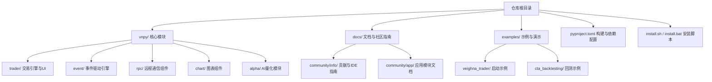
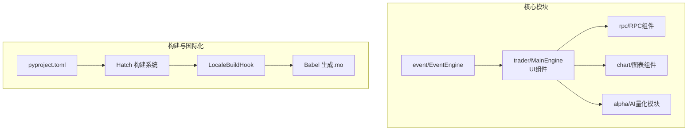
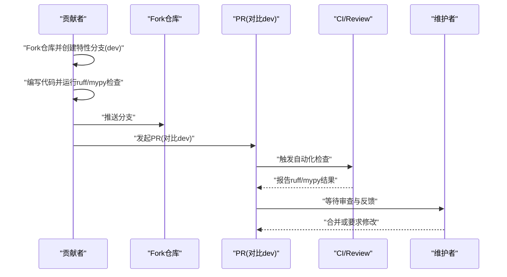
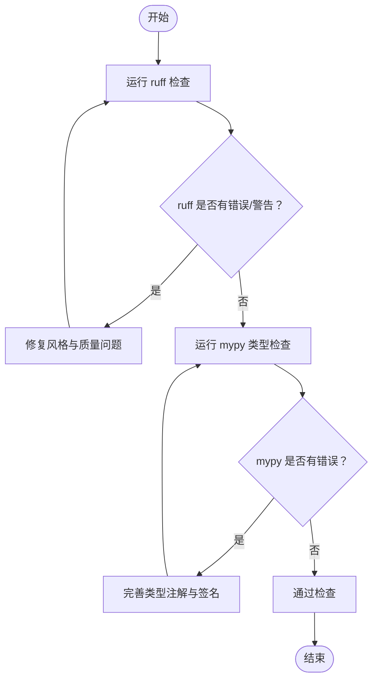
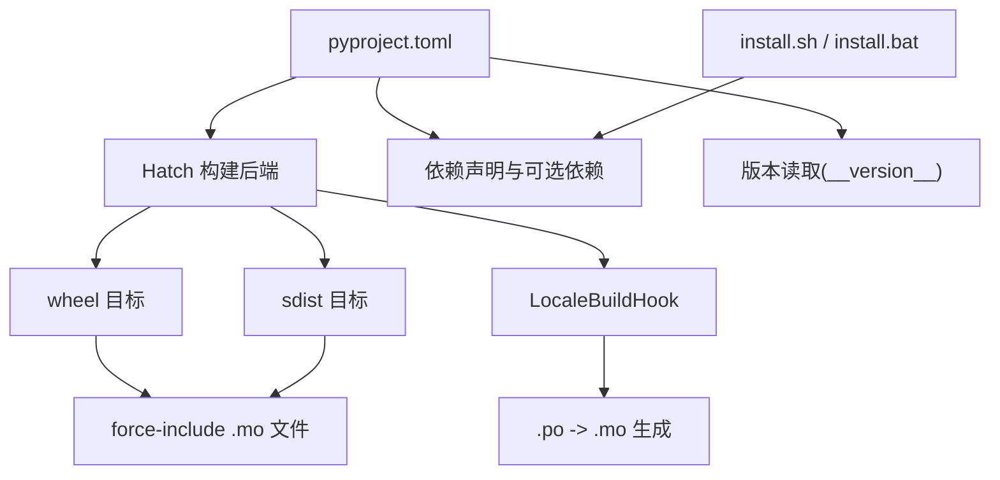
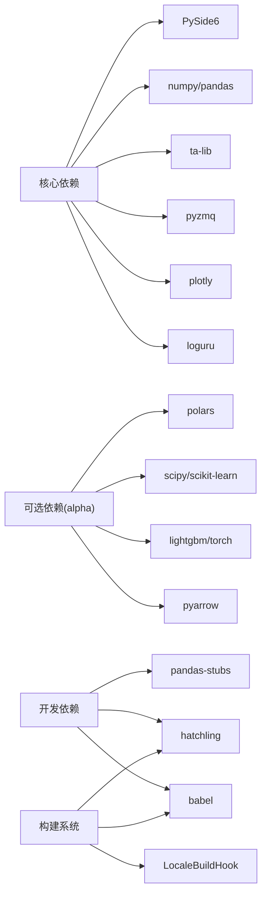

# 开发指南

<cite>
**本文引用的文件列表**
- [README.md](file://README.md)
- [pyproject.toml](file://pyproject.toml)
- [vnpy/__init__.py](file://vnpy/__init__.py)
- [vnpy/trader/locale/build_hook.py](file://vnpy/trader/locale/build_hook.py)
- [docs/community/info/contribution.md](file://docs/community/info/contribution.md)
- [docs/community/info/pycharm.md](file://docs/community/info/pycharm.md)
- [docs/community/info/vscode.md](file://docs/community/info/vscode.md)
- [install.sh](file://install.sh)
- [install.bat](file://install.bat)
</cite>

## 目录
1. [引言](#引言)
2. [项目结构](#项目结构)
3. [核心组件](#核心组件)
4. [架构总览](#架构总览)
5. [详细组件分析](#详细组件分析)
6. [依赖分析](#依赖分析)
7. [性能考虑](#性能考虑)
8. [故障排查指南](#故障排查指南)
9. [结论](#结论)
10. [附录](#附录)

## 引言
本开发指南面向vnpy项目的贡献者，旨在提供从Fork仓库、创建特性分支（基于dev）、编写代码、运行ruff与mypy进行代码检查，到提交Pull Request的完整贡献流程。文档同时强调代码风格一致性、类型注解要求、单元测试覆盖率等质量标准，并给出开发环境搭建建议（PyCharm与VSCode配置要点），介绍基于pyproject.toml的依赖管理与构建流程，说明Issue与PR的撰写规范，鼓励清晰的问题描述与变更说明，为社区贡献者提供明确的行动指引。

## 项目结构
vnpy是一个模块化的量化交易框架，核心位于vnpy目录，文档与示例分布在docs与examples中。项目采用现代Python打包与构建体系，使用pyproject.toml集中管理元数据、依赖与构建钩子。

**章节来源**
- [README.md](file://README.md#L1-L120)
- [pyproject.toml](file://pyproject.toml#L1-L40)

## 核心组件
- 事件驱动引擎：负责系统内各模块间的消息传递与调度，是vnpy的中枢。
- 交易引擎与UI：提供主窗口、界面组件与通用交易对象。
- RPC组件：支持跨进程通信与分布式部署。
- 图表组件：高性能K线图表，支持大数据量与实时更新。
- Alpha模块：面向AI量化的数据集、模型与策略回测工具链。
- 构建与国际化：通过Hatch构建系统与Babel生成.mo文件，支持多语言。

**章节来源**
- [vnpy/trader/locale/build_hook.py](file://vnpy/trader/locale/build_hook.py#L1-L24)
- [vnpy/__init__.py](file://vnpy/__init__.py#L23-L25)

## 架构总览
vnpy采用模块化架构，核心模块通过事件驱动引擎耦合，应用模块（如cta_strategy、cta_backtester等）通过App接口接入主引擎。构建系统通过Hatch与自定义钩子生成国际化资源，pyproject.toml集中管理依赖与工具配置。

**图表来源**
- [vnpy/trader/locale/build_hook.py](file://vnpy/trader/locale/build_hook.py#L1-L24)
- [pyproject.toml](file://pyproject.toml#L65-L85)

**章节来源**
- [README.md](file://README.md#L120-L220)
- [pyproject.toml](file://pyproject.toml#L65-L120)

## 详细组件分析

### 贡献流程与质量标准
- Fork与分支策略：从主仓库dev分支派生特性分支，提交PR至dev分支。
- 代码风格与类型注解：使用ruff进行风格与质量检查，使用mypy进行静态类型检查。
- 提交前检查清单：ruff无error/warning；mypy无未标注或不匹配的类型；必要时补充单元测试覆盖。
- Issue与PR规范：Issue用于较大变更或讨论；较小改进可直接发PR；PR需清晰描述变更动机、影响范围与验证方法。

**章节来源**
- [README.md](file://README.md#L306-L340)
- [docs/community/info/contribution.md](file://docs/community/info/contribution.md#L1-L88)

### 代码风格与类型注解要求
- 命名规范：类属性/方法/参数/变量使用小写下划线；类名使用驼峰式；常量使用大写下划线。
- 代码格式：至少满足PEP8；类与函数需带docstring。
- 工具检查：ruff用于风格与质量检查；mypy用于类型注解检查，严格模式开启多项告警开关。

**章节来源**
- [docs/community/info/contribution.md](file://docs/community/info/contribution.md#L33-L88)
- [pyproject.toml](file://pyproject.toml#L86-L120)

### 开发环境搭建（PyCharm）
- 解释器选择：使用VeighNa Studio自带Python解释器，避免手动升级依赖导致版本冲突。
- 项目创建：选择“Previously configured interpreter”，指向系统已安装的Python环境。
- 运行与调试：通过右键Run/Debug运行脚本；断点调试支持Step Into/Over/Out；C++回调调试可通过在回调函数内设置断点或使用pydevd追踪。
- 运行目录：可在Run/Debug配置中设置Working directory。

**章节来源**
- [docs/community/info/pycharm.md](file://docs/community/info/pycharm.md#L1-L120)
- [docs/community/info/pycharm.md](file://docs/community/info/pycharm.md#L177-L210)

### 开发环境搭建（VSCode）
- Python环境：通过右下角选择当前Python解释器；如需切换，从下拉菜单中选择其他环境。
- 运行与调试：支持断点调试，Step Into/Over/Out；支持在DEBUG CONSOLE交互式调试；C++回调调试同样可通过pydevd追踪。
- 插件推荐：Python、Pylance、Python Debugger、Jupyter、Flake8等。

**章节来源**
- [docs/community/info/vscode.md](file://docs/community/info/vscode.md#L87-L170)
- [docs/community/info/vscode.md](file://docs/community/info/vscode.md#L174-L207)

### 依赖管理与构建流程
- 依赖声明：在pyproject.toml中集中声明核心依赖与可选依赖（如alpha、dev）。
- 构建系统：使用Hatch作为构建后端，wheel与sdist目标配置明确；自定义build hook生成.en/LC_MESSAGES/vnpy.mo。
- 版本管理：通过vnpy/__init__.py中的__version__由Hatch动态读取。
- 平台安装：提供install.sh与install.bat，自动处理ta-lib依赖与本地化设置。

**图表来源**
- [pyproject.toml](file://pyproject.toml#L65-L120)
- [vnpy/trader/locale/build_hook.py](file://vnpy/trader/locale/build_hook.py#L1-L24)
- [vnpy/__init__.py](file://vnpy/__init__.py#L23-L25)
- [install.sh](file://install.sh#L1-L41)
- [install.bat](file://install.bat#L1-L16)

**章节来源**
- [pyproject.toml](file://pyproject.toml#L1-L40)
- [pyproject.toml](file://pyproject.toml#L65-L120)
- [vnpy/trader/locale/build_hook.py](file://vnpy/trader/locale/build_hook.py#L1-L24)
- [vnpy/__init__.py](file://vnpy/__init__.py#L23-L25)
- [install.sh](file://install.sh#L1-L41)
- [install.bat](file://install.bat#L1-L16)

### Issue与PR撰写规范
- Issue：较大改动（新功能、大型重构）建议先开Issue讨论；较小改进（文档、Bug修复）可直接发PR。
- PR：描述变更动机、影响范围、测试验证方法；确保ruff与mypy通过；必要时补充单元测试。

**章节来源**
- [README.md](file://README.md#L306-L340)
- [docs/community/info/contribution.md](file://docs/community/info/contribution.md#L1-L32)

## 依赖分析
- 核心依赖：PySide6、numpy、pandas、ta-lib、pyzmq、plotly、loguru等，满足GUI、数值计算、图表与通信需求。
- 可选依赖：alpha模块引入polars、scipy、scikit-learn、lightgbm、torch等，支持AI量化场景。
- 开发依赖：pandas-stubs、hatchling、babel，用于类型stub与构建国际化资源。
- 构建后端：hatchling.build，配合babel与自定义钩子生成.mo文件。

**图表来源**
- [pyproject.toml](file://pyproject.toml#L25-L57)
- [pyproject.toml](file://pyproject.toml#L65-L85)

**章节来源**
- [pyproject.toml](file://pyproject.toml#L25-L57)
- [pyproject.toml](file://pyproject.toml#L65-L85)

## 性能考虑
- 事件驱动与异步通信：通过事件引擎与zmq实现高并发请求与低延迟通信。
- 数值计算与绘图：使用numpy/pandas与pyqtgraph/plotly，兼顾性能与可视化。
- 构建与国际化：Hatch与Babel在构建阶段生成.mo文件，避免运行时I/O开销。
- 平台与依赖：install脚本预编译ta-lib并设置本地化，减少运行时编译成本。

**章节来源**
- [README.md](file://README.md#L170-L220)
- [install.sh](file://install.sh#L1-L41)
- [install.bat](file://install.bat#L1-L16)
- [vnpy/trader/locale/build_hook.py](file://vnpy/trader/locale/build_hook.py#L1-L24)

## 故障排查指南
- ruff/mypy失败：逐项修复风格与类型注解问题；必要时参考mypy配置中的忽略模块策略。
- 依赖冲突：使用VeighNa Studio自带解释器，避免手动升级依赖；如需更换，确保版本兼容。
- C++回调断点调试：在回调函数内设置断点或使用pydevd追踪；调试结束后删除追踪代码。
- 安装问题：install.sh/install.bat会自动处理ta-lib与本地化；如遇权限问题，检查系统权限与网络代理。

**章节来源**
- [docs/community/info/contribution.md](file://docs/community/info/contribution.md#L71-L88)
- [docs/community/info/pycharm.md](file://docs/community/info/pycharm.md#L187-L210)
- [docs/community/info/vscode.md](file://docs/community/info/vscode.md#L174-L207)
- [install.sh](file://install.sh#L1-L41)
- [install.bat](file://install.bat#L1-L16)

## 结论
本指南系统梳理了vnpy的贡献流程、质量标准与开发环境配置，明确了ruff与mypy的检查要求、依赖管理与构建流程，并提供了Issue与PR的撰写规范。建议贡献者在提交前确保代码风格一致、类型注解完备、测试覆盖充分，并遵循分支与PR规范，以提升协作效率与代码质量。

## 附录
- 快速检查清单
  - ruff检查：无error/warning
  - mypy检查：无未标注或不匹配类型
  - 单元测试：补充必要的测试用例
  - 文档与注释：更新相关文档与docstring
  - PR描述：清晰说明变更动机、影响范围与验证方法