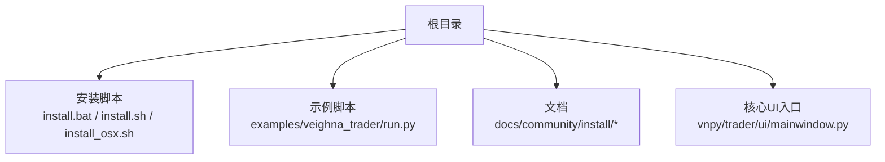
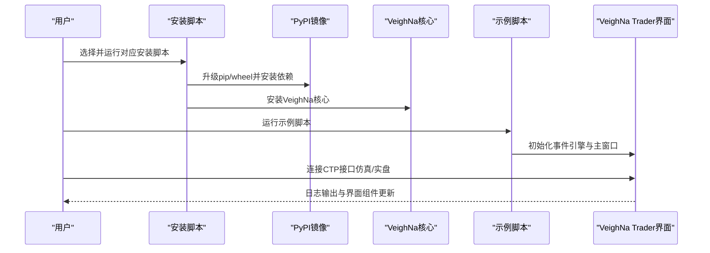
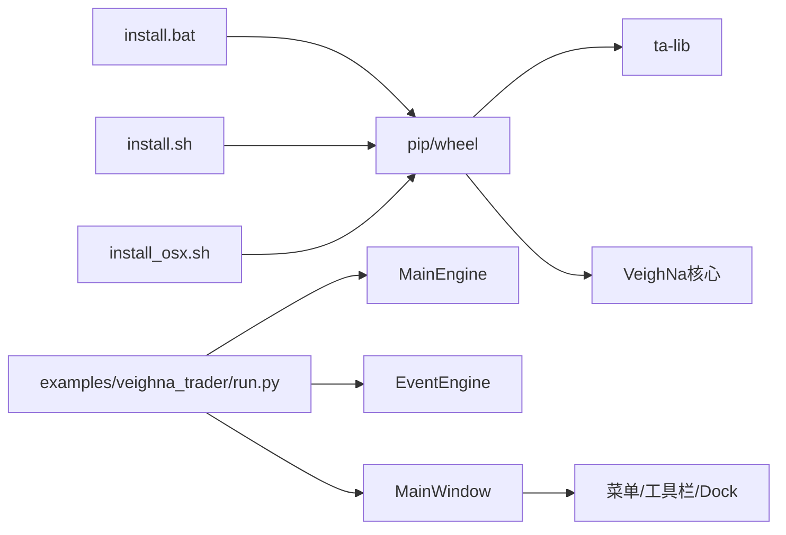

# 快速入门

<cite>
**本文引用的文件**
- [README.md](file://README.md)
- [install.bat](file://install.bat)
- [install.sh](file://install.sh)
- [install_osx.sh](file://install_osx.sh)
- [examples/veighna_trader/run.py](file://examples/veighna_trader/run.py)
- [docs/community/install/index.rst](file://docs/community/install/index.rst)
- [docs/community/install/windows_install.md](file://docs/community/install/windows_install.md)
- [docs/community/install/ubuntu_install.md](file://docs/community/install/ubuntu_install.md)
- [docs/community/install/mac_install.md](file://docs/community/install/mac_install.md)
- [docs/community/info/veighna_trader.md](file://docs/community/info/veighna_trader.md)
- [vnpy/trader/ui/mainwindow.py](file://vnpy/trader/ui/mainwindow.py)
</cite>

## 目录
1. [简介](#简介)
2. [项目结构](#项目结构)
3. [核心组件](#核心组件)
4. [架构总览](#架构总览)
5. [详细组件分析](#详细组件分析)
6. [依赖关系分析](#依赖关系分析)
7. [性能与稳定性建议](#性能与稳定性建议)
8. [故障排查指南](#故障排查指南)
9. [结论](#结论)
10. [附录](#附录)

## 简介
本指南面向首次使用VeighNa的用户，覆盖从环境准备、安装到系统运行的全流程，包括：
- 支持的操作系统与Python版本要求
- VeighNa Studio一键安装与手动安装对比
- 通过install.bat、install.sh、install_osx.sh脚本进行本地安装的步骤
- 配置CTP仿真账户或实盘接口的流程
- 基于示例脚本构建自定义启动脚本的方法
- 首次启动VeighNa Trader的界面操作指引
- 常见问题排查与验证安装成功的标准输出参考

## 项目结构
本仓库包含VeighNa核心框架、示例脚本、安装脚本与官方文档。与快速入门密切相关的目录与文件：
- 安装脚本：install.bat（Windows）、install.sh（Ubuntu）、install_osx.sh（macOS）
- 示例启动脚本：examples/veighna_trader/run.py
- 官方安装与使用文档：docs/community/install/* 与 docs/community/info/*

**图表来源**
- [install.bat](file://install.bat#L1-L16)
- [install.sh](file://install.sh#L1-L41)
- [install_osx.sh](file://install_osx.sh#L1-L30)
- [examples/veighna_trader/run.py](file://examples/veighna_trader/run.py#L1-L88)
- [vnpy/trader/ui/mainwindow.py](file://vnpy/trader/ui/mainwindow.py#L1-L200)

**章节来源**
- [README.md](file://README.md#L225-L267)
- [docs/community/install/index.rst](file://docs/community/install/index.rst#L1-L9)

## 核心组件
- 安装脚本：提供一键安装ta-lib与VeighNa核心的自动化流程，分别针对Windows、Ubuntu、macOS定制。
- 示例启动脚本：演示如何通过最小化配置快速启动VeighNa Trader，便于用户理解组件加载与界面初始化。
- 文档与界面：官方安装与使用文档提供系统要求、安装步骤与界面操作指引；主窗口类负责菜单、工具栏、Dock区域与全局配置入口。

**章节来源**
- [install.bat](file://install.bat#L1-L16)
- [install.sh](file://install.sh#L1-L41)
- [install_osx.sh](file://install_osx.sh#L1-L30)
- [examples/veighna_trader/run.py](file://examples/veighna_trader/run.py#L1-L88)
- [docs/community/info/veighna_trader.md](file://docs/community/info/veighna_trader.md#L1-L120)
- [vnpy/trader/ui/mainwindow.py](file://vnpy/trader/ui/mainwindow.py#L1-L200)

## 架构总览
从安装到运行的整体流程如下：
- 环境准备：确认操作系统与Python版本，推荐使用VeighNa Studio或手动安装对应依赖。
- 一键安装：根据操作系统选择相应脚本，自动安装ta-lib与VeighNa核心。
- 启动VeighNa Trader：通过VeighNa Station或示例脚本启动图形界面。
- 配置接口：在界面中连接CTP仿真或实盘接口，填写必要参数。
- 首次验证：观察日志输出与界面组件，确认连接成功。

**图表来源**
- [install.bat](file://install.bat#L1-L16)
- [install.sh](file://install.sh#L1-L41)
- [install_osx.sh](file://install_osx.sh#L1-L30)
- [examples/veighna_trader/run.py](file://examples/veighna_trader/run.py#L1-L88)
- [docs/community/info/veighna_trader.md](file://docs/community/info/veighna_trader.md#L23-L80)

## 详细组件分析

### 系统要求与安装方式对比
- 支持的操作系统与Python版本
  - Windows 11以上 / Windows Server 2022以上
  - Ubuntu 22.04 LTS以上
  - Python 3.10及以上（64位），推荐使用Python 3.13
- VeighNa Studio一键安装
  - 集成VeighNa框架、依赖库与VeighNa Station，无需手动安装
  - 适合新手快速体验与日常使用
- 手动安装
  - 需要自行准备Python环境与系统依赖，适合有经验用户或特殊发行版需求

**章节来源**
- [README.md](file://README.md#L225-L267)
- [docs/community/install/windows_install.md](file://docs/community/install/windows_install.md#L1-L40)
- [docs/community/install/ubuntu_install.md](file://docs/community/install/ubuntu_install.md#L1-L20)
- [docs/community/install/mac_install.md](file://docs/community/install/mac_install.md#L1-L20)

### Windows安装流程（VeighNa Studio与手动）
- VeighNa Studio方案
  - 下载安装包，使用默认设置快速安装
  - 安装完成后桌面出现VeighNa Station图标，双击运行
  - 可通过命令行直接使用VeighNa Studio Python发行版
- 手动安装方案
  - 准备Python 3.10 64位环境（推荐官方发行版）
  - 下载源码后在包含install.bat的目录运行脚本
  - 一键安装分为：下载安装ta-lib库、安装VeighNa核心
  - 启动VeighNa Trader：在examples/veighna_trader中运行run.py

**章节来源**
- [docs/community/install/windows_install.md](file://docs/community/install/windows_install.md#L21-L116)
- [docs/community/install/windows_install.md](file://docs/community/install/windows_install.md#L117-L167)

### Ubuntu安装流程
- 准备Python与编译环境：安装build-essential
- 运行install.sh（可传入python软连接名）
- 一键安装分为：下载安装ta-lib库与numpy、安装VeighNa核心
- 启动VeighNa Trader：在examples/veighna_trader中运行run.py
- 常见问题处理：Python开发环境缺失、图形驱动问题、中文编码问题、路径分隔符建议

**章节来源**
- [docs/community/install/ubuntu_install.md](file://docs/community/install/ubuntu_install.md#L1-L75)
- [docs/community/install/ubuntu_install.md](file://docs/community/install/ubuntu_install.md#L77-L134)

### macOS安装流程
- 安装ta-lib（brew）、安装NumPy与ta-lib（Python）
- 安装VeighNa核心与所需模块
- CTP接口模块（vnpy_ctp）需从源码编译安装，注意动态库加载与系统信任设置
- 启动VeighNa Trader：在examples/veighna_trader中运行run.py

**章节来源**
- [docs/community/install/mac_install.md](file://docs/community/install/mac_install.md#L1-L120)

### 本地安装脚本详解
- install.bat（Windows）
  - 升级pip与wheel，设置PyPI索引
  - 安装预编译的ta-lib（预构建wheel）
  - 安装VeighNa核心
- install.sh（Ubuntu）
  - 升级pip与wheel，设置PyPI索引
  - 自动检测并安装ta-lib（从源码编译）
  - 设置本地中文语言环境
  - 安装VeighNa核心
- install_osx.sh（macOS）
  - 升级pip与wheel，设置PyPI索引
  - 通过brew安装ta-lib（或从源码编译）
  - 安装NumPy与ta-lib（Python）
  - 安装VeighNa核心

**章节来源**
- [install.bat](file://install.bat#L1-L16)
- [install.sh](file://install.sh#L1-L41)
- [install_osx.sh](file://install_osx.sh#L1-L30)

### 基于示例脚本构建自定义启动脚本
- 示例脚本位置与用途
  - examples/veighna_trader/run.py：演示如何加载事件引擎、主引擎、界面与常用应用模块
- 构建自定义脚本的关键步骤
  - 初始化事件引擎与主引擎
  - 添加所需交易接口（如CTP）
  - 添加所需应用模块（如CTA策略、回测、数据管理等）
  - 创建并显示主窗口
  - 启动事件循环
- 注意事项
  - 根据操作系统与实际需求启用/禁用接口与应用模块
  - 如需加载其他接口或应用模块，按示例脚本注释方式取消注释并导入

**章节来源**
- [examples/veighna_trader/run.py](file://examples/veighna_trader/run.py#L1-L88)

### 配置CTP仿真账户或实盘接口
- 仿真账户（SimNow）
  - 注册并获取用户名、密码、经纪商代码、交易/行情服务器地址与端口
  - 在VeighNa Trader中通过菜单“系统”->“连接CTP”打开配置窗口，填写对应字段
  - 连接成功后日志组件会输出登录相关信息，界面显示账户与持仓信息
- 实盘接口
  - 通过期货公司或相关渠道获取实盘账号，填写用户名、密码、经纪商代码、服务器地址与端口
  - 注意不同接口支持的操作系统与交易品种不同

**章节来源**
- [docs/community/info/veighna_trader.md](file://docs/community/info/veighna_trader.md#L23-L80)
- [docs/community/info/gateway.md](file://docs/community/info/gateway.md#L51-L110)

### 首次启动VeighNa Trader界面操作指引
- 启动方式
  - 通过VeighNa Station图形化启动
  - 或在examples/veighna_trader目录运行示例脚本
- 主界面组成
  - 菜单栏：系统、功能、帮助、配置
  - 工具栏：常用按钮
  - Dock区域：交易、行情、委托、活动、成交、日志、资金、持仓等
- 常用操作
  - 连接接口：系统->连接对应接口
  - 查询合约：帮助->合约查询
  - 订阅行情：在交易组件输入交易所与合约代码并回车
  - 查看日志：关注日志组件输出
  - 全局配置：配置字体、日志级别、邮件通知、数据服务与数据库等

**章节来源**
- [docs/community/info/veighna_trader.md](file://docs/community/info/veighna_trader.md#L1-L120)
- [vnpy/trader/ui/mainwindow.py](file://vnpy/trader/ui/mainwindow.py#L1-L200)

## 依赖关系分析
- 安装脚本与PyPI索引
  - Windows脚本默认使用内部PyPI索引，升级pip与wheel后安装ta-lib与VeighNa核心
  - Linux/macOS脚本同样使用内部PyPI索引，Ubuntu额外处理ta-lib源码编译与系统依赖
- 示例脚本与核心UI
  - 示例脚本通过事件引擎与主引擎初始化界面，主窗口类负责菜单、工具栏与Dock区域的组织
- 接口与应用模块
  - 示例脚本默认加载CTP接口与多个应用模块，用户可按需增删

**图表来源**
- [install.bat](file://install.bat#L1-L16)
- [install.sh](file://install.sh#L1-L41)
- [install_osx.sh](file://install_osx.sh#L1-L30)
- [examples/veighna_trader/run.py](file://examples/veighna_trader/run.py#L1-L88)
- [vnpy/trader/ui/mainwindow.py](file://vnpy/trader/ui/mainwindow.py#L1-L200)

**章节来源**
- [install.bat](file://install.bat#L1-L16)
- [install.sh](file://install.sh#L1-L41)
- [install_osx.sh](file://install_osx.sh#L1-L30)
- [examples/veighna_trader/run.py](file://examples/veighna_trader/run.py#L1-L88)
- [vnpy/trader/ui/mainwindow.py](file://vnpy/trader/ui/mainwindow.py#L1-L200)

## 性能与稳定性建议
- 优先使用VeighNa Studio以减少环境差异带来的问题
- 在Ubuntu上确保build-essential与系统依赖齐全，避免编译失败
- macOS上注意动态库加载与系统信任设置，确保CTP接口模块正常运行
- 合理配置日志级别与输出，有助于定位问题并降低系统开销

[本节为通用建议，不直接分析具体文件]

## 故障排查指南
- 依赖缺失
  - Ubuntu：安装build-essential与Python开发头文件；如仍报错gcc相关，尝试安装对应python-dev包
  - macOS：通过brew安装ta-lib；如pip安装失败，先安装NumPy与ta-lib（Python）
- 端口冲突/网络不可达
  - 使用telnet测试交易/行情服务器端口是否开放
- 界面启动失败（Ubuntu）
  - 安装libxcb-xinerama0以解决Qt平台插件加载问题
- 中文编码问题（Ubuntu）
  - 使用locale-gen安装中文编码与中文字体，刷新字体缓存
- 路径分隔符问题（Linux）
  - 使用正斜杠/作为路径分隔符，避免路径解析问题

**章节来源**
- [docs/community/install/ubuntu_install.md](file://docs/community/install/ubuntu_install.md#L77-L134)
- [docs/community/info/veighna_trader.md](file://docs/community/info/veighna_trader.md#L23-L80)

## 结论
通过本指南，您可以：
- 明确系统与Python版本要求
- 选择VeighNa Studio一键安装或手动安装
- 按脚本完成本地安装
- 正确配置CTP仿真/实盘接口
- 使用示例脚本快速启动VeighNa Trader
- 在界面中完成合约查询、订阅行情与委托交易
- 遇到常见问题时快速定位并解决

[本节为总结，不直接分析具体文件]

## 附录

### 验证安装成功的标准输出参考
- 启动VeighNa Trader后，界面应显示主窗口与各Dock组件
- 在“系统”菜单中连接接口后，日志组件应输出登录相关信息
- 订阅行情后，行情组件应显示最新价、买卖盘口等信息
- 活动/委托/成交/资金/持仓组件应随交易行为更新

**章节来源**
- [docs/community/info/veighna_trader.md](file://docs/community/info/veighna_trader.md#L1-L120)