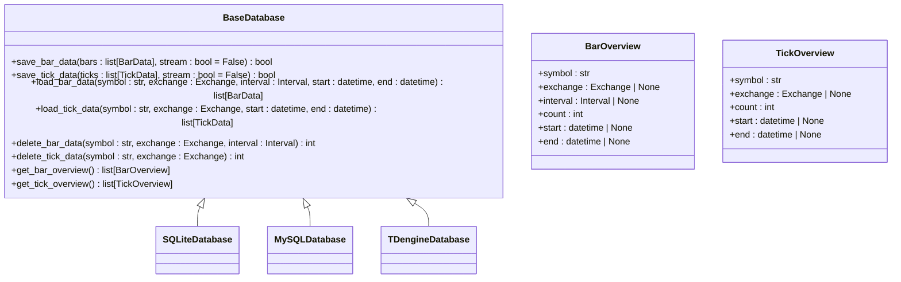
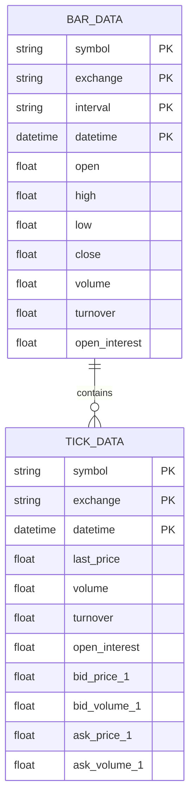
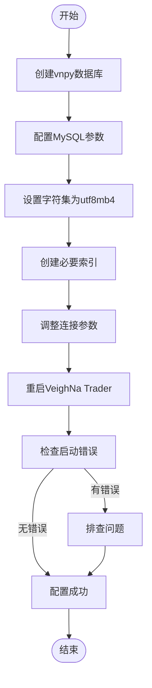

# 存储策略

<cite>
**本文档中引用的文件**   
- [database.py](file://vnpy/trader/database.py)
- [database.md](file://docs/community/info/database.md)
- [README.md](file://README.md)
</cite>

## 目录
1. [引言](#引言)
2. [数据库适配器概述](#数据库适配器概述)
3. [BaseDatabase抽象接口](#basedatabase抽象接口)
4. [不同数据库的表结构设计差异](#不同数据库的表结构设计差异)
5. [数据分片策略](#数据分片策略)
6. [TTL机制与数据保留策略](#ttl机制与数据保留策略)
7. [MySQL配置与初始化指南](#mysql配置与初始化指南)
8. [存储后端性能权衡](#存储后端性能权衡)

## 引言
vnpy作为一款多功能量化交易平台，提供了对多种数据库的适配支持，以满足不同用户在数据存储方面的需求。本文档深入分析vnpy的数据库存储策略，涵盖SQLite、MySQL、TDengine等数据库适配器的表结构设计差异与优化方案。我们将探讨BaseDatabase抽象类定义的统一接口如何被具体数据库驱动实现，详细说明数据分片策略，特别是按合约、交易所和时间维度进行数据分区的实现方式。同时，阐述TTL（Time-To-Live）机制在高频行情数据管理中的应用，以及如何配置数据保留策略。基于文档中MySQL配置示例，提供完整的数据库初始化和配置指南，包括连接参数设置、字符集配置和索引优化建议，并讨论不同存储后端在写入性能、查询效率和存储成本方面的权衡。

## 数据库适配器概述
vnpy支持多种数据库适配器，包括SQL类和NoSQL类数据库。SQL类数据库包括SQLite（默认）、MySQL和PostgreSQL；NoSQL类数据库包括MongoDB、InfluxDB、DolphinDB、Arctic和LevelDB。每种数据库都有其特定的配置字段和使用场景。

SQLite是一个轻量级的嵌入式数据库，无需安装和配置数据服务程序，适合入门新手用户。MySQL是主流的开源关系型数据库，文档资料丰富，社区活跃，可替换其他高性能NewSQL数据库兼容实现（如TiDB）。TDengine是一款分布式、高性能、支持SQL的时序数据库，带有内建的缓存、流式计算、数据订阅等系统功能，能大幅减少研发和运维的复杂度。

**Section sources**
- [database.md](file://docs/community/info/database.md#L3-L227)

## BaseDatabase抽象接口
BaseDatabase是vnpy中所有数据库适配器的抽象基类，定义了统一的数据库操作接口。通过继承BaseDatabase并实现其抽象方法，不同的数据库驱动可以提供一致的数据访问方式。

BaseDatabase定义了以下核心方法：
- `save_bar_data`: 保存K线数据到数据库
- `save_tick_data`: 保存Tick数据到数据库
- `load_bar_data`: 从数据库加载K线数据
- `load_tick_data`: 从数据库加载Tick数据
- `delete_bar_data`: 删除指定合约、交易所和周期的K线数据
- `delete_tick_data`: 删除指定合约和交易所的Tick数据
- `get_bar_overview`: 获取数据库中可用的K线数据概览
- `get_tick_overview`: 获取数据库中可用的Tick数据概览

这些方法为上层应用提供了统一的数据访问接口，使得应用程序无需关心底层数据库的具体实现细节。



**Diagram sources **
- [database.py](file://vnpy/trader/database.py#L52-L133)

**Section sources**
- [database.py](file://vnpy/trader/database.py#L52-L133)

## 不同数据库的表结构设计差异
不同数据库适配器在表结构设计上存在显著差异，这些差异主要体现在数据类型支持、索引机制、分区策略等方面。

SQLite作为轻量级数据库，其表结构设计相对简单，通常使用单一表存储所有K线或Tick数据，通过索引优化查询性能。MySQL作为关系型数据库，支持更复杂的表结构设计，可以使用分区表来提高大数据量下的查询效率。TDengine作为时序数据库，其表结构设计专门针对时间序列数据进行了优化，支持超级表（Super Table）和子表（Sub Table）的概念，能够高效地处理海量时序数据。

对于K线数据，通常包含以下字段：交易品种代码（symbol）、交易所（exchange）、时间周期（interval）、时间戳（datetime）、开盘价（open）、最高价（high）、最低价（low）、收盘价（close）、成交量（volume）、成交额（turnover）和持仓量（open_interest）。不同数据库在这些字段的数据类型选择上有所不同，例如SQLite可能使用TEXT类型存储时间戳，而MySQL和TDengine则使用DATETIME或TIMESTAMP类型。



**Diagram sources **
- [database.py](file://vnpy/trader/database.py#L25-L49)
- [database.py](file://vnpy/trader/database.py#L39-L49)

## 数据分片策略
vnpy的数据分片策略主要基于合约、交易所和时间三个维度进行。这种多维度的分片策略能够有效提高数据查询效率，特别是在处理大规模历史数据时。

按合约分片是将不同交易品种的数据存储在不同的表或分区中，这样可以避免单一表过大导致的性能问题。按交易所分片则是将不同交易所的数据分开存储，考虑到不同交易所的数据特征可能不同，这种分片方式有助于优化查询性能。按时间分片是最常见的分片策略，通常按天、周或月创建新的表或分区，这样可以快速定位特定时间段的数据，同时便于数据的归档和删除。

在实际实现中，TDengine的超级表功能非常适合这种多维度分片策略。超级表定义了数据的公共 schema，而每个子表对应一个具体的合约-交易所组合，这样既保证了数据结构的一致性，又实现了高效的分片存储。

**Section sources**
- [database.md](file://docs/community/info/database.md#L1-L227)

## TTL机制与数据保留策略
TTL（Time-To-Live）机制在高频行情数据管理中起着重要作用。由于金融市场的行情数据量巨大，特别是Tick级别的数据，如果不加以管理，很快就会占用大量存储空间。TTL机制允许为数据设置生存时间，超过指定时间的数据将被自动删除。

在vnpy中，TTL机制的实现依赖于底层数据库的支持。例如，TDengine原生支持TTL功能，可以通过设置数据保留策略来自动清理过期数据。MySQL虽然没有原生的TTL支持，但可以通过事件调度器（Event Scheduler）定期执行删除过期数据的任务。SQLite由于其轻量级特性，通常需要应用程序层面实现TTL逻辑。

配置数据保留策略时，需要根据实际需求权衡存储成本和数据可用性。对于高频交易策略，可能需要保留较长时间的精细数据；而对于低频策略，则可以适当缩短数据保留时间以节省存储空间。

**Section sources**
- [database.md](file://docs/community/info/database.md#L1-L227)

## MySQL配置与初始化指南
基于文档中的MySQL配置示例，以下是完整的数据库初始化和配置指南：

1. **创建数据库**：首先需要在MySQL服务器中创建名为vnpy的数据库。如果未创建，可以手动连接数据库并运行以下命令：
   ```sql
   CREATE DATABASE vnpy;
   ```

2. **配置参数**：在VeighNa Trader中配置MySQL相关参数：
   - database.name: mysql
   - database.database: vnpy
   - database.host: localhost
   - database.port: 3306
   - database.user: root
   - database.password: 1001

3. **字符集配置**：建议将数据库字符集设置为utf8mb4，以支持完整的Unicode字符集，避免中文字符存储问题。

4. **索引优化**：为提高查询效率，建议在以下字段上创建索引：
   - K线数据表：(symbol, exchange, interval, datetime)
   - Tick数据表：(symbol, exchange, datetime)

5. **连接参数**：根据实际使用场景调整连接池大小、超时时间等参数，以优化数据库性能。

配置完成后，重启VeighNa Trader以启用新的数据库配置。如果启动过程中没有报错提示，则说明MySQL数据库配置成功。



**Diagram sources **
- [database.md](file://docs/community/info/database.md#L287-L332)

**Section sources**
- [database.md](file://docs/community/info/database.md#L287-L332)

## 存储后端性能权衡
不同存储后端在写入性能、查询效率和存储成本方面存在显著权衡。SQLite作为嵌入式数据库，写入性能相对较低，但部署简单，适合小规模数据存储。MySQL作为成熟的关系型数据库，在写入性能和查询效率之间提供了良好的平衡，适合中等规模的数据存储需求。TDengine作为专门的时序数据库，在写入性能和查询效率上表现优异，特别适合处理高频行情数据，但可能需要更高的硬件资源。

在选择存储后端时，需要综合考虑以下因素：
- 数据量大小：小规模数据可选择SQLite，大规模数据建议使用MySQL或TDengine
- 查询频率：高频查询场景更适合使用TDengine
- 写入频率：高频写入场景需要考虑数据库的写入吞吐能力
- 存储成本：包括硬件成本、运维成本和开发成本
- 数据一致性要求：关系型数据库通常提供更强的数据一致性保证

对于量化交易平台而言，通常建议在开发和测试阶段使用SQLite，生产环境根据数据规模和性能要求选择MySQL或TDengine。

**Section sources**
- [database.md](file://docs/community/info/database.md#L1-L227)
- [README.md](file://README.md#L77-L221)