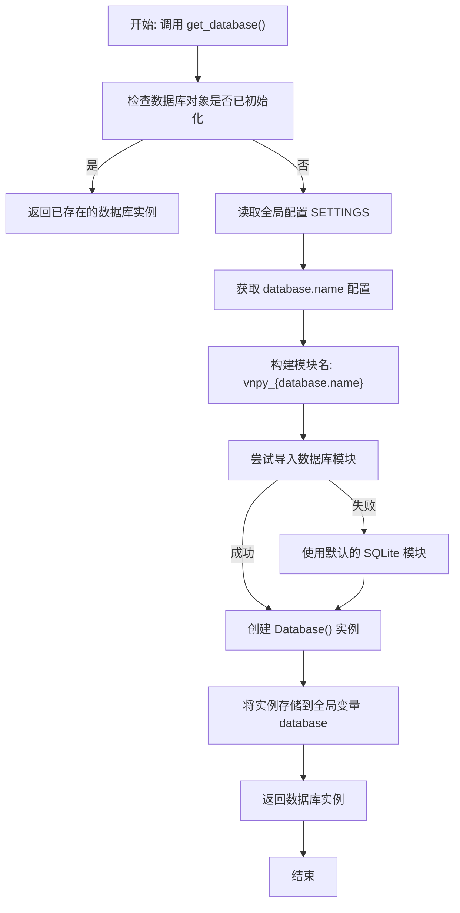
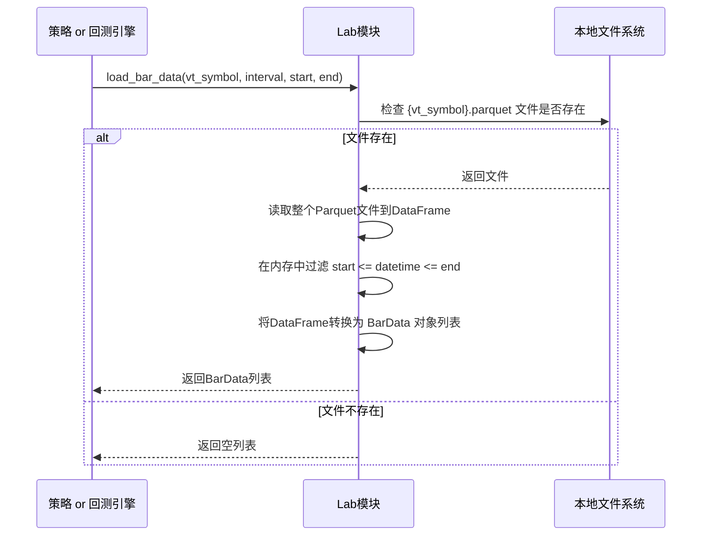

# 性能优化

<cite>
**本文档引用的文件**   
- [database.py](file://vnpy/trader/database.py)
- [setting.py](file://vnpy/trader/setting.py)
- [database.md](file://docs/community/info/database.md)
- [data_recorder.py](file://examples/data_recorder/data_recorder.py)
- [backtesting_demo.ipynb](file://examples/cta_backtesting/backtesting_demo.ipynb)
- [lab.py](file://vnpy/alpha/lab.py)
- [backtesting.py](file://vnpy/alpha/strategy/backtesting.py)
</cite>

## 目录
1. [引言](#引言)
2. [数据库连接池配置与管理](#数据库连接池配置与管理)
3. [批量插入优化策略](#批量插入优化策略)
4. [查询性能优化技巧](#查询性能优化技巧)
5. [大规模数据处理场景下的性能调优](#大规模数据处理场景下的性能调优)
6. [性能基准测试方法](#性能基准测试方法)
7. [结论](#结论)

## 引言

vnpy是一个多功能的量化交易平台，支持多种交易接口和数据库系统。在量化交易中，历史数据的高效存储和读取是实现策略回测和实盘交易的关键。本文档系统性地文档化vnpy数据库性能优化方案，重点分析基于`get_database()`函数的数据库连接池配置与管理机制，详细说明`save_bar_data`和`save_tick_data`方法的批量处理逻辑，探讨查询性能优化技巧，并结合回测示例提供针对大规模历史数据读写的性能调优建议。

**Section sources**
- [database.md](file://docs/community/info/database.md)

## 数据库连接池配置与管理

vnpy通过`get_database()`函数实现数据库连接的单例模式和动态加载机制，这是其数据库连接池管理的核心。该函数确保在整个应用程序生命周期内，数据库连接对象只被初始化一次，从而避免了重复创建连接带来的资源开销。

**Diagram sources **
- [database.py](file://vnpy/trader/database.py#L139-L159)

**Section sources**
- [database.py](file://vnpy/trader/database.py#L139-L159)
- [setting.py](file://vnpy/trader/setting.py#L31-L37)

### 连接池配置参数

数据库连接池的配置主要通过`vnpy/trader/setting.py`文件中的`SETTINGS`字典进行管理。用户可以在`vt_setting.json`配置文件中覆盖这些默认值。关键的连接池相关配置参数包括：

| 配置项 | 默认值 | 说明 |
| :--- | :--- | :--- |
| `database.name` | "sqlite" | 指定使用的数据库类型，如 "mysql", "postgresql" |
| `database.host` | "" | 数据库服务器地址，对于MySQL/PostgreSQL等远程数据库 |
| `database.port` | 0 | 数据库服务端口，如MySQL默认3306，PostgreSQL默认5432 |
| `database.database` | "database.db" | 数据库名称或文件路径 |
| `database.user` | "" | 数据库用户名 |
| `database.password` | "" | 数据库密码 |
| `database.timezone` | 本地时区 | 数据库存储的时区设置 |

当`database.name`设置为非"sqlite"的值时，vnpy会尝试动态导入对应的数据库驱动模块（如`vnpy_mysql`），并使用提供的`host`、`port`、`user`等信息建立连接。这种设计使得vnpy能够灵活地对接多种数据库系统，而无需修改核心代码。

## 批量插入优化策略

vnpy的批量插入优化策略主要体现在`BaseDatabase`抽象类定义的`save_bar_data`和`save_tick_data`方法上。这两个方法都接受一个数据对象列表（`list[BarData]`或`list[TickData]`）作为参数，并提供一个`stream`布尔参数，这为实现高效的批量操作提供了基础。

### 批量处理逻辑

虽然`database.py`文件中的`BaseDatabase`类只定义了抽象方法，但其设计模式明确指示了批量处理的意图。具体的批量插入逻辑由各个数据库驱动模块（如`vnpy_mysql`、`vnpy_mongodb`）实现。典型的优化策略包括：

1.  **批量提交（Batch Commit）**：避免对每一条数据都执行一次`INSERT`语句。驱动模块会将接收到的数据列表缓存起来，当达到一定数量或在特定时间点（如`DataRecorder`中的“写入间隔”）时，使用一条`INSERT ... VALUES (...), (...), ...`语句或数据库特定的批量插入API（如`executemany`）一次性写入多条记录，显著减少网络往返和事务开销。

2.  **事务管理**：将批量插入操作包裹在一个数据库事务中。这样可以确保数据的一致性，并且在事务提交前，数据库的写入操作通常会更高效。

3.  **数据预处理**：在写入数据库前，对数据进行必要的转换和验证，例如使用`convert_tz`函数将时间戳转换为数据库时区。

在`examples/data_recorder/data_recorder.py`中，`RecorderEngine`模块的配置界面允许用户设置“写入间隔”，这正是批量写入策略的体现。用户可以选择每1秒、5秒或10秒将内存中的数据批量写入数据库，而不是实时写入，从而在数据实时性和系统性能之间取得平衡。

**Diagram sources **
- [data_recorder.py](file://examples/data_recorder/data_recorder.py#L65-L146)

**Section sources**
- [database.py](file://vnpy/trader/database.py#L58-L69)
- [data_recorder.py](file://examples/data_recorder/data_recorder.py#L65-L146)

## 查询性能优化技巧

高效的查询是快速回测和策略分析的前提。vnpy通过多种机制来优化查询性能。

### 索引设计

尽管`database.py`文件本身不包含具体的SQL语句，但合理的索引设计是数据库驱动模块（如`vnpy_mysql`）必须实现的。对于`BarData`和`TickData`这类时间序列数据，通常会在以下字段上建立复合索引：

*   **(symbol, exchange, interval, datetime)**：这是最常用的查询条件组合，例如`load_bar_data`方法的参数。复合索引可以极大地加速按合约、周期和时间范围查询数据的速度。

### 数据缓存策略

vnpy利用Python的内存来缓存数据，减少对数据库的直接访问。一个典型的例子是`vnpy/alpha/lab.py`中的`load_bar_data`方法。该方法首先检查本地的Parquet文件是否存在，如果存在则读取整个文件到内存中，然后在内存中进行时间范围的过滤。对于频繁访问的历史数据，这种基于文件的缓存比每次都查询数据库要快得多。

**Diagram sources **
- [lab.py](file://vnpy/alpha/lab.py#L96-L154)

### 异步IO处理

虽然核心的`load_bar_data`和`save_bar_data`方法是同步的，但vnpy的底层架构（基于`event`事件驱动引擎）为异步操作提供了可能性。在实盘交易场景中，数据记录（`DataRecorder`）和策略计算可以运行在不同的线程或进程中，通过事件队列进行通信。这样，耗时的数据库写入操作不会阻塞主交易循环，保证了策略的实时性。

## 大规模数据处理场景下的性能调优

在回测大量历史数据时，性能瓶颈尤为明显。`examples/cta_backtesting/backtesting_demo.ipynb`提供了一个典型的回测场景。

### 回测中的数据加载

在回测过程中，`BacktestingEngine`会调用`load_bar_data`方法从数据库加载指定时间范围内的所有K线数据。对于长时间跨度的回测，这可能涉及数百万条记录。性能调优的关键在于：

1.  **使用高效的数据库**：对于大规模数据，应避免使用SQLite。推荐使用MySQL、PostgreSQL或专为时序数据设计的TDengine、DolphinDB等，它们在处理海量数据时性能更优。
2.  **优化查询语句**：确保数据库驱动模块生成的SQL查询语句是高效的，并利用了正确的索引。
3.  **分批加载**：如果单次查询数据量过大，可以考虑将时间范围分割成多个小段，分批加载，以减少内存峰值占用。

### 关键优化点

*   **连接池配置参数**：根据数据库类型调整连接池大小、超时时间等参数，避免连接耗尽。
*   **批量操作阈值设置**：在`DataRecorder`中合理设置“写入间隔”，平衡实时性与性能。对于高频数据，较长的写入间隔（如10秒）能显著降低数据库压力。
*   **读写分离策略**：在复杂的生产环境中，可以配置主从数据库，将写入操作集中在主库，而将耗时的回测查询操作分发到从库，实现读写分离，提高整体系统吞吐量。

**Section sources**
- [backtesting_demo.ipynb](file://examples/cta_backtesting/backtesting_demo.ipynb)
- [backtesting.py](file://vnpy/alpha/strategy/backtesting.py#L127-L148)

## 性能基准测试方法

为了评估不同存储方案的性能表现，建议进行以下基准测试：

1.  **数据写入速度测试**：
    *   准备一组固定数量的BarData或TickData。
    *   分别使用不同的数据库（SQLite, MySQL, MongoDB等）和不同的批量大小（1, 10, 100, 1000）进行写入。
    *   记录总耗时，计算每秒写入的数据条数。

2.  **数据读取速度测试**：
    *   在数据库中存入大量历史数据。
    *   模拟回测场景，执行`load_bar_data`查询，记录不同时间跨度（1天、1个月、1年）和不同合约数量下的查询耗时。

3.  **回测总耗时测试**：
    *   使用相同的策略和参数，在不同数据库配置下运行完整的回测流程。
    *   比较从开始加载数据到计算出最终结果的总时间。

### 典型硬件环境下的预期性能指标

*   **SQLite (SSD)**：适合小规模数据（< 1GB）。写入速度约1000-5000条/秒，读取1年分钟线数据约需1-5秒。
*   **MySQL (SSD, 合理索引)**：适合中大规模数据。写入速度可达5000-20000条/秒，读取1年分钟线数据约需0.5-2秒。
*   **TDengine/DolphinDB (SSD)**：专为时序优化，性能最佳。写入速度可超过50000条/秒，读取1年分钟线数据可在1秒内完成。

**Section sources**
- [database.md](file://docs/community/info/database.md)

## 结论

vnpy通过`get_database()`函数实现了灵活的数据库连接管理，并通过抽象的批量操作接口为性能优化奠定了基础。要充分发挥其性能潜力，用户应根据实际需求选择合适的数据库系统，合理配置连接参数，并利用批量写入、索引和缓存等策略。在进行大规模回测时，选择高性能的时序数据库并进行充分的基准测试，是确保策略开发效率的关键。