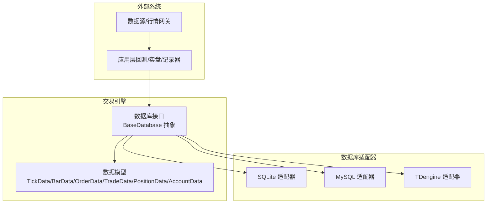
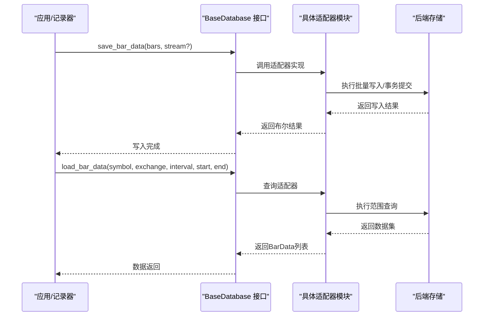
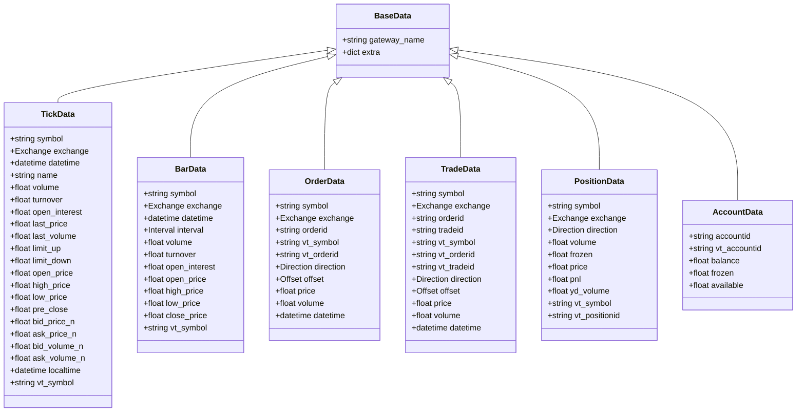
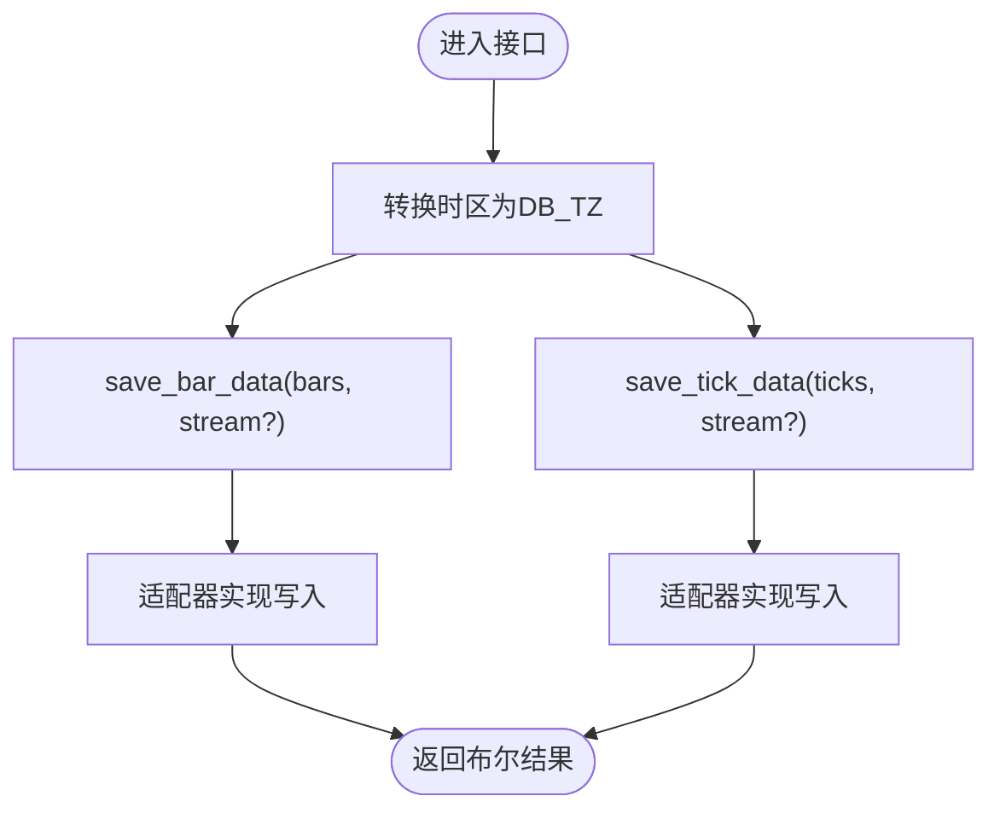
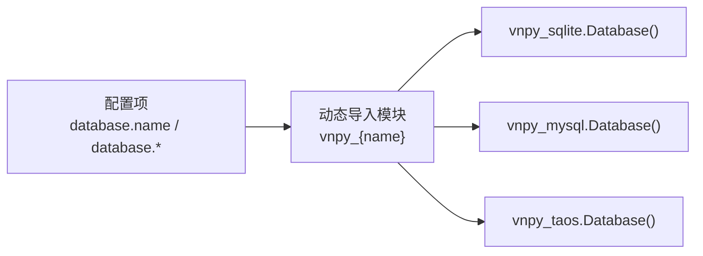
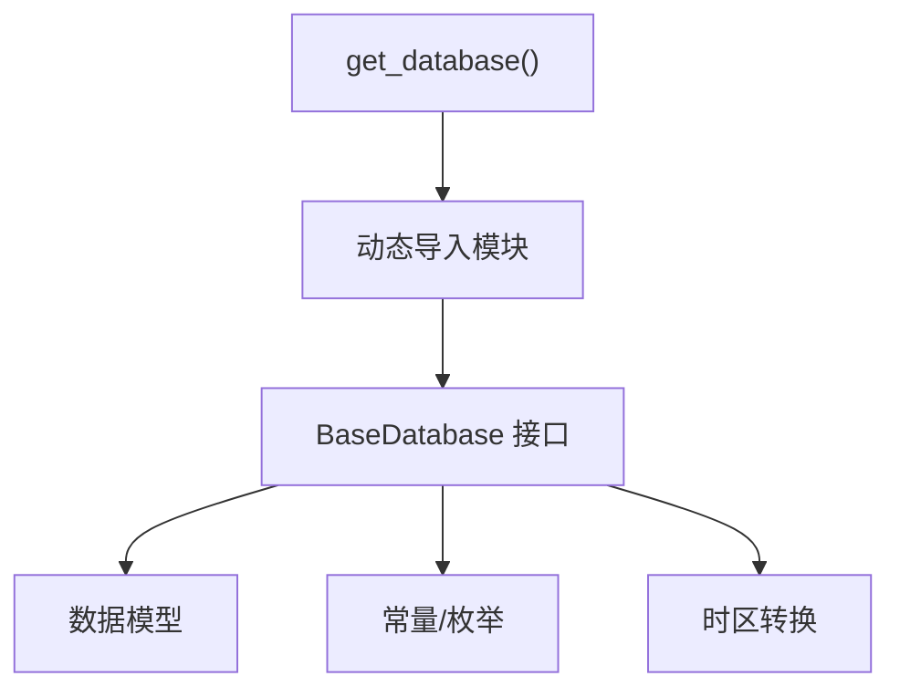

# 数据库设计

<cite>
**本文引用的文件**
- [vnpy/trader/database.py](file://vnpy/trader/database.py)
- [vnpy/trader/object.py](file://vnpy/trader/object.py)
- [docs/community/info/database.md](file://docs/community/info/database.md)
- [examples/download_bars/download_bars.ipynb](file://examples/download_bars/download_bars.ipynb)
- [docs/community/app/data_recorder.md](file://docs/community/app/data_recorder.md)
</cite>

## 目录
1. [简介](#简介)
2. [项目结构](#项目结构)
3. [核心组件](#核心组件)
4. [架构总览](#架构总览)
5. [详细组件分析](#详细组件分析)
6. [依赖分析](#依赖分析)
7. [性能考虑](#性能考虑)
8. [故障排查指南](#故障排查指南)
9. [结论](#结论)
10. [附录](#附录)

## 简介
本文件聚焦vnpy的数据库模式与适配层设计，系统性梳理TickData、BarData、OrderData、TradeData、PositionData、AccountData等核心数据模型的字段语义与持久化接口契约，说明不同数据库适配器（SQLite、MySQL、TDengine等）在表结构与能力上的差异与优化策略；并给出高频数据场景下的分片/分区、TTL策略、连接池与批量写入优化、查询缓存、迁移与备份恢复等实践建议。

## 项目结构
- 数据模型位于交易引擎层，抽象出统一的数据库接口，适配多种后端存储。
- 文档与示例展示了数据库配置、写入策略与典型使用方式。

[本图为概念结构示意，不直接映射具体源码文件，故不附“图表来源”]

**章节来源**
- file://vnpy/trader/database.py#L52-L159
- file://vnpy/trader/object.py#L1-L225

## 核心组件
- 数据模型：TickData、BarData、OrderData、TradeData、PositionData、AccountData，均继承自BaseData，包含符号、交易所、时间戳等关键字段。
- 数据库接口：BaseDatabase抽象类定义了保存/加载/删除/概览等统一接口，支持stream写入模式。
- 时区转换：统一转换为数据库时区，避免跨时区写入导致的时间偏差。

**章节来源**
- file://vnpy/trader/object.py#L1-L225
- file://vnpy/trader/database.py#L1-L159

## 架构总览
数据库适配器通过模块动态导入机制按配置选择具体驱动，统一对外暴露save/load/delete/get_overview接口。数据模型与接口之间通过数据类契约解耦，便于扩展新适配器。

**图表来源**
- [vnpy/trader/database.py](file://vnpy/trader/database.py#L52-L159)

**章节来源**
- file://vnpy/trader/database.py#L52-L159

## 详细组件分析

### 数据模型与字段定义
- TickData：逐笔行情快照，包含最新价、成交量、买卖盘口、时间戳、本地时间等字段，vt_symbol由symbol+exchange拼接生成。
- BarData：周期K线，包含开盘、最高、最低、收盘、成交量、成交额、持仓量、周期间隔等字段，vt_symbol同上。
- OrderData：订单状态追踪，包含方向、开平、价格、总量、已成交、委托时间、vt_orderid等。
- TradeData：成交明细，包含成交编号、委托编号、方向、开平、价格、数量、成交时间等。
- PositionData：持仓明细，包含方向、总仓、冻结、成本、昨仓等。
- AccountData：账户余额，包含可用资金、冻结资金、总余额、vt_accountid等。

**图表来源**
- [vnpy/trader/object.py](file://vnpy/trader/object.py#L1-L225)

**章节来源**
- file://vnpy/trader/object.py#L1-L225

### 数据库接口契约
- 统一接口：save_bar_data/save_tick_data、load_bar_data/load_tick_data、delete_bar_data/delete_tick_data、get_bar_overview/get_tick_overview。
- stream参数：支持流式写入模式，便于高频写入时的缓冲与批处理。
- 时区转换：convert_tz将传入datetime转换为数据库时区，避免跨时区写入问题。

**图表来源**
- [vnpy/trader/database.py](file://vnpy/trader/database.py#L1-L159)

**章节来源**
- file://vnpy/trader/database.py#L1-L159

### 数据库适配器与差异
- SQLite：默认适配器，无需服务端，适合入门与轻量场景；配置字段包含database.name与database.database。
- MySQL：关系型数据库，文档与生态完善，支持TiDB等兼容实现；配置字段包含host/port/database/user/password等。
- TDengine：时序数据库，支持SQL，具备分区、缓存、流式计算等能力；示例中展示通过SETTINGS配置使用TDengine。
- 其他适配器：文档还介绍了PostgreSQL、MongoDB、InfluxDB、DolphinDB、Arctic、LevelDB等，但本节聚焦SQLite/MySQL/TAOS。

**图表来源**
- [vnpy/trader/database.py](file://vnpy/trader/database.py#L139-L159)
- [docs/community/info/database.md](file://docs/community/info/database.md#L1-L227)
- [examples/download_bars/download_bars.ipynb](file://examples/download_bars/download_bars.ipynb#L41-L48)

**章节来源**
- file://vnpy/trader/database.py#L139-L159
- file://docs/community/info/database.md#L1-L227
- file://examples/download_bars/download_bars.ipynb#L41-L48

### 表结构与索引设计（适配器视角）
- SQLite：作为默认适配器，遵循BaseDatabase接口约定，具体表结构由各适配器实现决定；建议在symbol/exchange/datetime组合上建立索引以提升查询性能。
- MySQL：关系型表结构，建议在高频查询维度（如symbol、exchange、datetime、interval）建立复合索引；使用事务与批量写入提升吞吐。
- TDengine：时序数据库，天然支持分区与时间列，建议按时间分区与按symbol分桶，结合TTL策略清理过期数据。

说明：以上为通用优化建议，具体表结构以各适配器实现为准。

[本节为通用设计建议，不直接映射具体源码文件，故不附“章节来源”]

### 分片、分区与TTL策略（高频数据）
- 分片/分区：按时间（年/月/日）与合约（symbol）进行分区，降低扫描范围；TDengine原生支持分区与分桶。
- TTL：对历史Tick/Bar数据设置生命周期，定期清理过期数据，释放存储空间；MySQL可通过事件调度器或外部计划任务实现，TDengine可利用内置TTL。
- 写入策略：采用批量写入与事务提交，减少IO次数；写入队列聚合后再落库，降低写放大。

[本节为通用设计建议，不直接映射具体源码文件，故不附“章节来源”]

### 性能基准与调优建议
- 连接池：为MySQL/TDengine等后端配置连接池，合理设置最大连接数与空闲超时，避免频繁创建销毁连接。
- 批量插入：按批次批量写入，减少往返；使用事务包裹多个写入，提高一致性与吞吐。
- 查询缓存：对热点查询（如最近N条K线）增加应用层缓存，降低重复查询压力。
- 写入间隔：通过记录器的“写入间隔”参数，将队列中待写入数据一次性批量写入，降低数据库压力与延迟。

**章节来源**
- file://docs/community/app/data_recorder.md#L48-L65

## 依赖分析
- BaseDatabase依赖数据模型（TickData/BarData等）与常量（Interval/Exchange）。
- get_database通过SETTINGS["database.name"]动态导入vnpy_{name}模块并实例化Database。
- 时区转换依赖SETTINGS["database.timezone"]与ZoneInfo。

**图表来源**
- [vnpy/trader/database.py](file://vnpy/trader/database.py#L1-L159)
- [vnpy/trader/object.py](file://vnpy/trader/object.py#L1-L225)

**章节来源**
- file://vnpy/trader/database.py#L1-L159
- file://vnpy/trader/object.py#L1-L225

## 性能考虑
- 写入路径：优先使用批量写入与事务提交；对高频Tick/Bar采用队列聚合与定时批量写入。
- 读取路径：对常用查询维度建立索引；对历史数据采用分区裁剪与TTL清理。
- 连接池：为MySQL/TDengine配置连接池，避免连接抖动。
- 缓存：对热点查询结果进行应用层缓存，减少重复查询。

[本节为通用性能建议，不直接映射具体源码文件，故不附“章节来源”]

## 故障排查指南
- 适配器缺失：当SETTINGS["database.name"]对应的模块不存在时，系统回退到默认SQLite适配器。
- 时区异常：确保SETTINGS["database.timezone"]正确，避免跨时区写入导致的时间偏移。
- 配置错误：检查database.name与各适配器所需字段是否完整；参考文档示例配置。
- 数据清理：使用delete_bar_data/delete_tick_data清理指定合约/周期的数据；谨慎操作，避免误删。

**章节来源**
- file://vnpy/trader/database.py#L139-L159
- file://docs/community/info/database.md#L1-L227

## 结论
vnpy通过BaseDatabase抽象统一了数据库适配层，数据模型与接口解耦，便于扩展多种后端存储。在高频数据场景下，应结合适配器特性（如TDengine的分区与TTL）与通用优化手段（批量写入、索引、连接池、缓存）实现稳定高效的持久化方案。配置层面建议遵循文档示例，确保时区与时序数据一致性。

## 附录

### 数据库配置要点（示例）
- SQLite：database.name=sqlite，database.database=相对路径的数据库文件。
- MySQL：database.name=mysql，database.host/database.port/database.database/database.user/database.password。
- TDengine：通过SETTINGS配置database.name=taos，以及host/port/user/password等字段。

**章节来源**
- file://docs/community/info/database.md#L1-L227
- file://examples/download_bars/download_bars.ipynb#L41-L48

### 数据迁移与备份恢复
- 备份：对SQLite可直接复制数据库文件；对MySQL/TDengine可使用各自官方备份工具。
- 迁移：通过统一接口读取旧库数据，再批量写入新库；注意vt_*标识符与时间字段的转换。
- 恢复：先恢复基础数据文件/表结构，再通过接口写入增量数据；谨慎操作，避免覆盖重要数据。

[本节为通用操作建议，不直接映射具体源码文件，故不附“章节来源”]