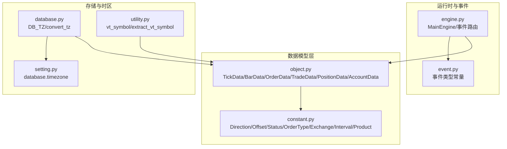
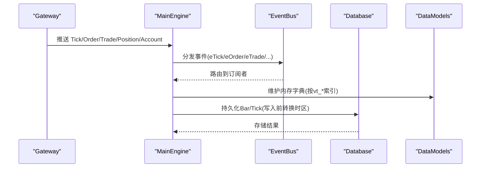
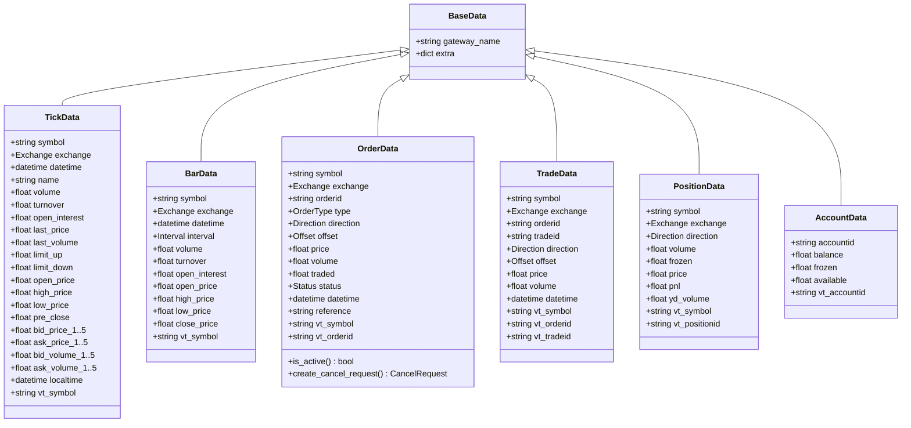
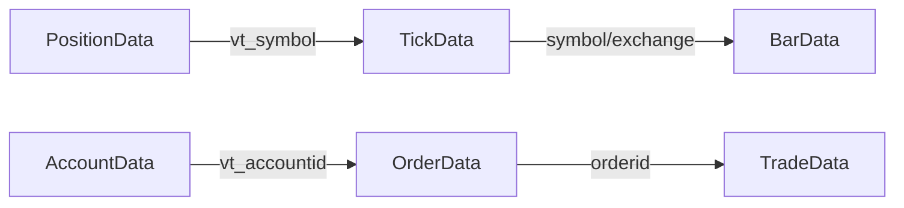
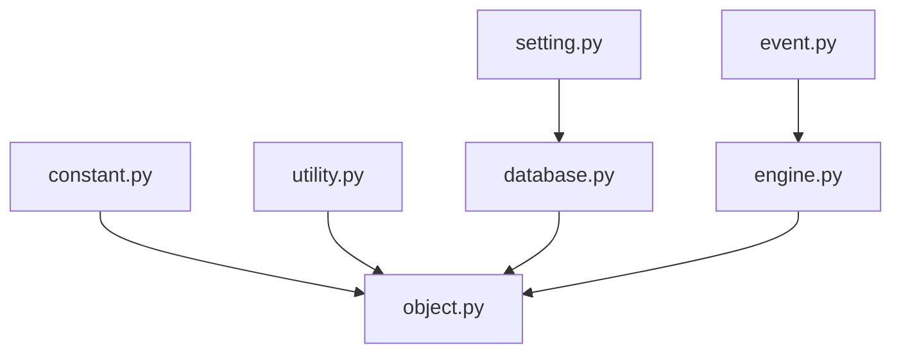

# 数据模型定义

<cite>
**本文引用的文件列表**
- [vnpy/trader/object.py](file://vnpy/trader/object.py)
- [vnpy/trader/constant.py](file://vnpy/trader/constant.py)
- [vnpy/trader/database.py](file://vnpy/trader/database.py)
- [vnpy/trader/utility.py](file://vnpy/trader/utility.py)
- [vnpy/trader/engine.py](file://vnpy/trader/engine.py)
- [vnpy/trader/event.py](file://vnpy/trader/event.py)
- [vnpy/trader/setting.py](file://vnpy/trader/setting.py)
</cite>

## 目录
1. [简介](#简介)
2. [项目结构](#项目结构)
3. [核心组件](#核心组件)
4. [架构总览](#架构总览)
5. [详细组件分析](#详细组件分析)
6. [依赖关系分析](#依赖关系分析)
7. [性能考量](#性能考量)
8. [故障排查指南](#故障排查指南)
9. [结论](#结论)
10. [附录](#附录)

## 简介
本文件系统性梳理 vnpy 核心数据模型，围绕 TickData、BarData、OrderData、TradeData、PositionData、AccountData 等实体，从字段定义、数据类型、业务含义、约束条件到相互关系进行深入解析，并结合数据库时区处理策略（DB_TZ）与事件驱动机制，给出 UML 类图、调用流程图与常见问题排查建议。为便于非专业读者理解，文档采用分层讲解方式，既覆盖代码级细节，也提供高层概览与可视化图表。

## 项目结构
vnpy 的数据模型集中于 trader/object.py，配合常量枚举（constant.py）、数据库时区转换（database.py）、工具函数（utility.py）、引擎与事件（engine.py、event.py）共同构成完整的数据生命周期：生成、传播、存储与查询。

**图表来源**
- [vnpy/trader/object.py](file://vnpy/trader/object.py#L1-L220)
- [vnpy/trader/constant.py](file://vnpy/trader/constant.py#L1-L161)
- [vnpy/trader/engine.py](file://vnpy/trader/engine.py#L425-L517)
- [vnpy/trader/event.py](file://vnpy/trader/event.py#L1-L14)
- [vnpy/trader/database.py](file://vnpy/trader/database.py#L1-L62)
- [vnpy/trader/setting.py](file://vnpy/trader/setting.py#L1-L44)
- [vnpy/trader/utility.py](file://vnpy/trader/utility.py#L22-L35)

**章节来源**
- [vnpy/trader/object.py](file://vnpy/trader/object.py#L1-L220)
- [vnpy/trader/constant.py](file://vnpy/trader/constant.py#L1-L161)
- [vnpy/trader/database.py](file://vnpy/trader/database.py#L1-L62)
- [vnpy/trader/utility.py](file://vnpy/trader/utility.py#L22-L35)
- [vnpy/trader/engine.py](file://vnpy/trader/engine.py#L425-L517)
- [vnpy/trader/event.py](file://vnpy/trader/event.py#L1-L14)
- [vnpy/trader/setting.py](file://vnpy/trader/setting.py#L1-L44)

## 核心组件
本节聚焦六大核心数据类及其关键字段、类型与业务语义：
- TickData：逐笔行情快照，包含最新价、成交量、买卖盘口、时间戳等。
- BarData：K线蜡烛数据，包含开盘/最高/最低/收盘、成交量/成交额/持仓量、周期等。
- OrderData：订单状态跟踪，包含委托类型、方向、开平、价格、数量、已成交、状态、引用等。
- TradeData：成交明细，记录一次委托的成交细节，支持多笔成交。
- PositionData：单一合约的持仓明细，含方向、总量、冻结量、成本、浮动盈亏、昨仓等。
- AccountData：账户资金信息，包含余额、冻结、可用余额等。

此外，还包含通用基类 BaseData 以及若干请求/响应对象（如 OrderRequest、CancelRequest、HistoryRequest、QuoteRequest），用于网关交互与数据转换。

**章节来源**
- [vnpy/trader/object.py](file://vnpy/trader/object.py#L17-L220)

## 架构总览
下图展示数据模型在系统中的角色与交互路径：引擎负责事件分发与存储；常量定义统一了枚举类型；工具函数提供符号拼装；数据库模块负责时区转换与持久化。

**图表来源**
- [vnpy/trader/engine.py](file://vnpy/trader/engine.py#L425-L517)
- [vnpy/trader/event.py](file://vnpy/trader/event.py#L1-L14)
- [vnpy/trader/database.py](file://vnpy/trader/database.py#L1-L62)

## 详细组件分析

### TickData（逐笔行情）
- 字段要点
  - 基础标识：symbol、exchange、datetime
  - 名称与统计：name、volume、turnover、open_interest
  - 最新与上下限：last_price、last_volume、limit_up、limit_down
  - 开高收停：open_price、high_price、low_price、pre_close
  - 买卖盘口：bid_price_i/ask_price_i、bid_volume_i/ask_volume_i（前五档）
  - 本地时间：localtime
- 关键行为
  - 自动生成 vt_symbol（symbol.exchange.value）
- 业务含义
  - 记录市场即时动态，支撑盘口分析与K线合成。
- 约束与注意
  - 价格/量均为浮点数，需结合合约最小变动单位与最小交易量进行校验。
  - localtime 为可选，用于记录本地时钟时间。

**章节来源**
- [vnpy/trader/object.py](file://vnpy/trader/object.py#L30-L86)

### BarData（K线）
- 字段要点
  - 基础标识：symbol、exchange、datetime、interval
  - 成交与价格：volume、turnover、open_interest、open_price、high_price、low_price、close_price
- 关键行为
  - 自动生成 vt_symbol（同上）
- 业务含义
  - 表征某一周期内的市场聚合信息，是策略回测与实时分析的基础。
- 约束与注意
  - interval 来源于枚举，支持分钟、小时、日、周、Tick 等。

**章节来源**
- [vnpy/trader/object.py](file://vnpy/trader/object.py#L87-L109)
- [vnpy/trader/constant.py](file://vnpy/trader/constant.py#L152-L161)

### OrderData（订单）
- 字段要点
  - 标识：symbol、exchange、orderid
  - 委托：type（OrderType）、direction（Direction）、offset（Offset）、price、volume
  - 进度：traded、status（Status）、datetime、reference
  - 生成：vt_symbol、vt_orderid（gateway_name.orderid）
- 关键行为
  - is_active：根据状态集合判断是否仍有效
  - create_cancel_request：从订单派生取消请求
- 业务含义
  - 记录委托全生命周期状态，支持主动撤单与状态查询。
- 约束与注意
  - ACTIVE_STATUSES 包含提交中、未成交、部分成交，is_active 以此为准。

**章节来源**
- [vnpy/trader/object.py](file://vnpy/trader/object.py#L111-L151)
- [vnpy/trader/constant.py](file://vnpy/trader/constant.py#L10-L161)

### TradeData（成交）
- 字段要点
  - 标识：symbol、exchange、orderid、tradeid
  - 成交：direction、offset、price、volume、datetime
  - 生成：vt_symbol、vt_orderid、vt_tradeid（均带 gateway_name 前缀）
- 业务含义
  - 记录一次委托的成交明细，支持一单多笔成交。
- 约束与注意
  - 通过 vt_orderid 与 OrderData 关联，通过 vt_symbol 与 Tick/Bar 关联。

**章节来源**
- [vnpy/trader/object.py](file://vnpy/trader/object.py#L153-L176)

### PositionData（持仓）
- 字段要点
  - 标识：symbol、exchange、direction
  - 数量与成本：volume、frozen、price、pnl、yd_volume
  - 生成：vt_symbol、vt_positionid（gateway_name.vt_symbol.direction.value）
- 业务含义
  - 记录单一合约的多头/空头持仓明细，支持冻结与浮动盈亏。
- 约束与注意
  - 不同交易所对“今/昨”仓划分不同，需结合 OffsetConverter 逻辑处理。

**章节来源**
- [vnpy/trader/object.py](file://vnpy/trader/object.py#L178-L198)

### AccountData（账户）
- 字段要点
  - 标识：accountid
  - 资金：balance、frozen、available（自动计算：balance-frozen）
  - 生成：vt_accountid（gateway_name.accountid）
- 业务含义
  - 记录账户可用资金、冻结与余额，支撑风控与下单校验。
- 约束与注意
  - 可用余额为派生字段，需确保 balance/frozen 合法。

**章节来源**
- [vnpy/trader/object.py](file://vnpy/trader/object.py#L200-L216)

### 请求与辅助类
- OrderRequest：创建订单时的请求对象，提供 create_order_data 将其转换为 OrderData
- CancelRequest：取消订单的请求对象
- HistoryRequest：历史数据查询请求
- QuoteRequest：报价请求，提供 create_quote_data 将其转换为 QuoteData
- SubscribeRequest：订阅行情请求

这些类在订单生命周期与数据转换中起到桥梁作用，确保从请求到数据对象的一致性。

**章节来源**
- [vnpy/trader/object.py](file://vnpy/trader/object.py#L306-L428)

### UML 类图（数据模型）

**图表来源**
- [vnpy/trader/object.py](file://vnpy/trader/object.py#L17-L216)

### 数据关系与业务映射
- 订单与成交
  - TradeData 通过 orderid 与 OrderData 关联；一个订单可有多笔成交。
- 持仓与账户
  - PositionData 与 AccountData 分别管理“持有”和“资金”，二者通过 vt_symbol/vt_accountid 在引擎中被统一索引与更新。
- 市场与周期
  - TickData 与 BarData 共享 symbol/exchange/datetime，BarData 由 TickData 合成或直接由网关推送。

**图表来源**
- [vnpy/trader/object.py](file://vnpy/trader/object.py#L111-L176)
- [vnpy/trader/engine.py](file://vnpy/trader/engine.py#L425-L517)

## 依赖关系分析
- 常量依赖
  - 所有数据类均依赖枚举类型（Direction、Offset、Status、OrderType、Exchange、Interval、Product），保证跨模块一致性。
- 引擎与事件
  - MainEngine 维护各数据类的内存字典，按 vt_* 键值索引；事件类型常量用于事件路由。
- 工具函数
  - vt_symbol/extract_vt_symbol 提供统一的符号拼装与拆解，贯穿数据模型与事件系统。
- 数据库与时区
  - database.DB_TZ 使用设置项 database.timezone，所有入库前的 datetime 需经 convert_tz 转换为 DB_TZ 无时区时间。

**图表来源**
- [vnpy/trader/constant.py](file://vnpy/trader/constant.py#L1-L161)
- [vnpy/trader/utility.py](file://vnpy/trader/utility.py#L22-L35)
- [vnpy/trader/database.py](file://vnpy/trader/database.py#L1-L62)
- [vnpy/trader/setting.py](file://vnpy/trader/setting.py#L1-L44)
- [vnpy/trader/event.py](file://vnpy/trader/event.py#L1-L14)
- [vnpy/trader/engine.py](file://vnpy/trader/engine.py#L425-L517)

**章节来源**
- [vnpy/trader/constant.py](file://vnpy/trader/constant.py#L1-L161)
- [vnpy/trader/utility.py](file://vnpy/trader/utility.py#L22-L35)
- [vnpy/trader/database.py](file://vnpy/trader/database.py#L1-L62)
- [vnpy/trader/setting.py](file://vnpy/trader/setting.py#L1-L44)
- [vnpy/trader/event.py](file://vnpy/trader/event.py#L1-L14)
- [vnpy/trader/engine.py](file://vnpy/trader/engine.py#L425-L517)

## 性能考量
- 内存索引
  - 引擎以 vt_* 作为键维护字典，查询复杂度近似 O(1)，适合高频读取。
- 序列化与存储
  - 数据类为 dataclass，天然具备良好的序列化能力；数据库层提供 convert_tz 与保存接口，避免重复转换。
- 时间窗口聚合
  - BarGenerator 对 Tick/Bar 进行窗口聚合，减少存储与计算压力；注意合理设置窗口大小与周期。

[本节为通用指导，不涉及具体文件分析]

## 故障排查指南
- vt_symbol 不一致
  - 确认 symbol 与 exchange 是否匹配，vt_symbol 由“symbol.exchange.value”生成，若不一致会导致跨模块关联失败。
- 订单状态异常
  - 检查 ACTIVE_STATUSES 判断逻辑，确认 status 是否正确更新；必要时调用 is_active 辅助诊断。
- 时区偏差导致入库错误
  - 确保入库前调用 convert_tz 将 datetime 转换为 DB_TZ；检查 SETTINGS 中 database.timezone 设置。
- 事件路由未触发
  - 检查事件类型常量与引擎 on_* 方法绑定，确认 vt_* 与事件后缀一致。

**章节来源**
- [vnpy/trader/object.py](file://vnpy/trader/object.py#L111-L176)
- [vnpy/trader/database.py](file://vnpy/trader/database.py#L1-L62)
- [vnpy/trader/setting.py](file://vnpy/trader/setting.py#L1-L44)
- [vnpy/trader/event.py](file://vnpy/trader/event.py#L1-L14)
- [vnpy/trader/engine.py](file://vnpy/trader/engine.py#L425-L517)

## 结论
vnpy 的数据模型以 dataclass 为基础，通过统一的 vt_* 标识与枚举常量，实现了跨模块的一致性与可扩展性。Tick/Bar 提供市场基础视图，Order/Trade 实现委托与成交闭环，Position/Account 覆盖持仓与资金维度。配合事件驱动与数据库时区转换，形成从采集、传播、存储到查询的完整链路。建议在实际应用中严格遵循 vt_* 规范、状态机约束与时区转换流程，确保数据一致性与系统稳定性。

[本节为总结性内容，不涉及具体文件分析]

## 附录

### 字段定义与业务含义速查
- TickData
  - symbol/exchange/datetime：唯一标识
  - last_price/last_volume：最新成交
  - bid/ask_i 与 bid/ask_volume_i：买卖盘口
  - volume/turnover/open_interest：成交量/成交额/持仓量
  - localtime：本地时间
- BarData
  - interval：周期
  - open/high/low/close：OHLC
  - volume/turnover/open_interest：成交量/成交额/持仓量
- OrderData
  - type/direction/offset/price/volume：委托要素
  - traded/status/reference：执行进度与引用
  - vt_orderid：全局唯一订单标识
- TradeData
  - direction/offset/price/volume：成交细节
  - vt_tradeid：全局唯一成交标识
- PositionData
  - direction/volume/frozen/price/pnl/yd_volume：持仓明细
  - vt_positionid：全局唯一持仓标识
- AccountData
  - accountid/balance/frozen/available：账户资金
  - vt_accountid：全局唯一账户标识

**章节来源**
- [vnpy/trader/object.py](file://vnpy/trader/object.py#L30-L216)

### 时区处理策略（DB_TZ）
- 时区来源
  - database.timezone 由本地时区名称决定，默认来自系统设置。
- 转换流程
  - 所有入库 datetime 在保存前经 convert_tz 转换为 DB_TZ，再去除时区信息以适配数据库存储。
- 使用建议
  - 保持 gateway_name 与 vt_* 前缀一致，避免跨模块混淆；入库前统一转换，避免混合时区数据。

**章节来源**
- [vnpy/trader/database.py](file://vnpy/trader/database.py#L1-L62)
- [vnpy/trader/setting.py](file://vnpy/trader/setting.py#L1-L44)

### 创建与操作示例（路径指引）
以下为常用操作的代码位置参考，请在对应文件中查看具体实现与调用方式：
- 创建订单请求并转为订单数据
  - [OrderRequest.create_order_data](file://vnpy/trader/object.py#L339-L356)
- 从订单派生取消请求
  - [OrderData.create_cancel_request](file://vnpy/trader/object.py#L143-L151)
- 生成 vt_symbol
  - [generate_vt_symbol](file://vnpy/trader/utility.py#L30-L35)
- 解析 vt_symbol
  - [extract_vt_symbol](file://vnpy/trader/utility.py#L22-L28)
- 获取最新数据（按 vt_*）
  - [MainEngine.get_order/get_trade/get_position/get_account](file://vnpy/trader/engine.py#L447-L470)
- 事件路由（按 vt_* 后缀）
  - [Gateway.on_order/on_trade/on_position/on_account](file://vnpy/trader/gateway.py#L101-L139)

**章节来源**
- [vnpy/trader/object.py](file://vnpy/trader/object.py#L306-L428)
- [vnpy/trader/utility.py](file://vnpy/trader/utility.py#L22-L35)
- [vnpy/trader/engine.py](file://vnpy/trader/engine.py#L447-L470)
- [vnpy/trader/gateway.py](file://vnpy/trader/gateway.py#L101-L139)