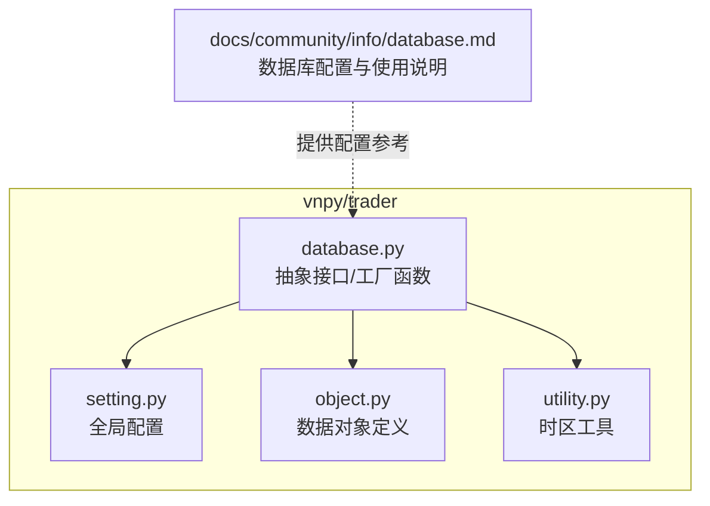
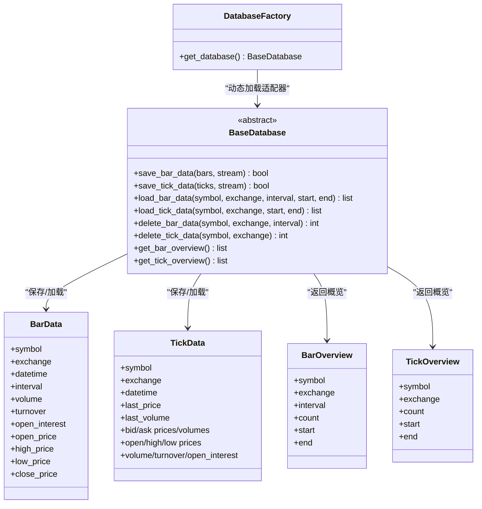
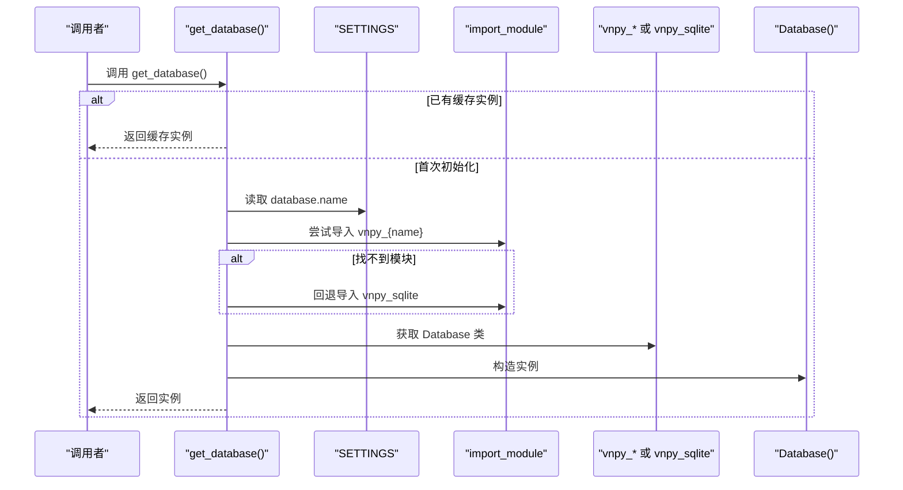
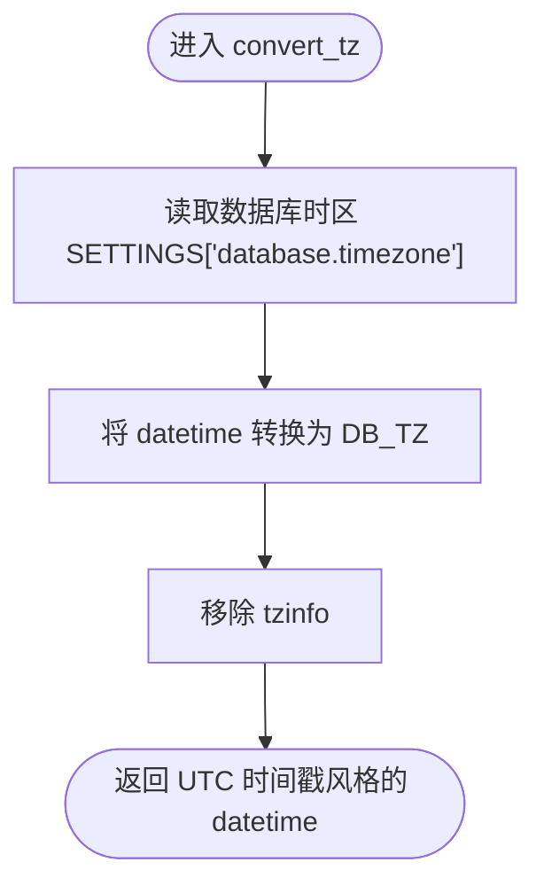
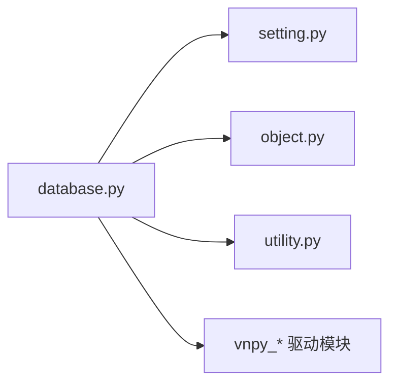

# 数据库管理

<cite>
**本文引用的文件**
- [vnpy/trader/database.py](file://vnpy/trader/database.py)
- [vnpy/trader/setting.py](file://vnpy/trader/setting.py)
- [vnpy/trader/object.py](file://vnpy/trader/object.py)
- [vnpy/trader/utility.py](file://vnpy/trader/utility.py)
- [docs/community/info/database.md](file://docs/community/info/database.md)
- [README.md](file://README.md)
</cite>

## 目录
1. [简介](#简介)
2. [项目结构](#项目结构)
3. [核心组件](#核心组件)
4. [架构总览](#架构总览)
5. [详细组件分析](#详细组件分析)
6. [依赖分析](#依赖分析)
7. [性能考虑](#性能考虑)
8. [故障排查指南](#故障排查指南)
9. [结论](#结论)
10. [附录](#附录)

## 简介
本文件围绕 vnpy 的数据库管理模块，系统阐述 database 模块的架构设计与实现机制，重点包括：
- 抽象基类 BaseDatabase 的职责与接口设计
- 通过工厂函数 get_database() 动态加载不同数据库驱动（如 vnpy_sqlite、vnpy_mysql 等）
- 数据库配置参数（database.name、database.host 等）的加载流程与错误处理
- 八种数据库（SQLite、MySQL、PostgreSQL、MongoDB、TDengine、DolphinDB、InfluxDB、Arctic、LevelDB）的配置方法、性能特点与适用场景
- 连接池管理、批量写入优化、索引策略等高级配置建议
- 如何通过继承 BaseDatabase 实现自定义数据库适配器

## 项目结构
database 模块位于 vnpy/trader/database.py，负责定义数据库抽象接口、时区转换工具、概览数据结构，以及工厂函数 get_database()。全局配置来自 vnpy/trader/setting.py，数据对象定义来自 vnpy/trader/object.py，时区工具来自 vnpy/trader/utility.py。官方文档在 docs/community/info/database.md 中提供了各数据库的配置与使用说明。

**图表来源**
- [vnpy/trader/database.py](file://vnpy/trader/database.py#L1-L159)
- [vnpy/trader/setting.py](file://vnpy/trader/setting.py#L1-L43)
- [vnpy/trader/object.py](file://vnpy/trader/object.py#L1-L200)
- [vnpy/trader/utility.py](file://vnpy/trader/utility.py#L1-L120)
- [docs/community/info/database.md](file://docs/community/info/database.md#L1-L410)

**章节来源**
- [vnpy/trader/database.py](file://vnpy/trader/database.py#L1-L159)
- [vnpy/trader/setting.py](file://vnpy/trader/setting.py#L1-L43)
- [vnpy/trader/object.py](file://vnpy/trader/object.py#L1-L200)
- [vnpy/trader/utility.py](file://vnpy/trader/utility.py#L1-L120)
- [docs/community/info/database.md](file://docs/community/info/database.md#L1-L410)

## 核心组件
- 抽象接口 BaseDatabase：定义保存/加载/删除/概览等统一接口，屏蔽不同数据库实现差异。
- 工厂函数 get_database()：按配置动态导入对应驱动模块并构造适配器实例。
- 时区转换工具 convert_tz()：将 datetime 统一转换为数据库时区，避免跨时区问题。
- 数据概览结构：BarOverview、TickOverview，用于展示数据库中已有数据的概览信息。
- 全局配置 SETTINGS：包含 database.timezone、database.name、database.host、database.port、database.user、database.password 等键。

关键职责与边界：
- database.py 仅负责抽象接口与工厂加载，不包含具体数据库实现。
- 具体数据库驱动（如 vnpy_sqlite、vnpy_mysql 等）由外部模块提供，通过模块名约定（vnpy_{name}）动态导入。
- 时区转换在写入/读取前统一处理，保证跨时区一致性。

**章节来源**
- [vnpy/trader/database.py](file://vnpy/trader/database.py#L1-L159)
- [vnpy/trader/setting.py](file://vnpy/trader/setting.py#L1-L43)
- [vnpy/trader/object.py](file://vnpy/trader/object.py#L1-L200)

## 架构总览
下面的类图展示了数据库抽象层与工厂加载机制的关系，以及与数据对象的交互。

**图表来源**
- [vnpy/trader/database.py](file://vnpy/trader/database.py#L1-L159)
- [vnpy/trader/object.py](file://vnpy/trader/object.py#L1-L200)

## 详细组件分析

### 抽象接口 BaseDatabase
- 统一的 CRUD 与概览接口，覆盖分钟/日线 K 线与 Tick 数据的保存、加载、删除与概览。
- 通过抽象方法约束具体驱动实现，保证上层调用的一致性。
- 适配器需自行处理连接、事务、索引、批量写入等性能细节。

**章节来源**
- [vnpy/trader/database.py](file://vnpy/trader/database.py#L52-L134)

### 工厂函数 get_database()
- 单例缓存：首次调用后缓存实例，避免重复导入与初始化。
- 配置读取：从 SETTINGS["database.name"] 获取驱动名称，拼接模块名 vnpy_{name}。
- 动态导入：优先尝试目标驱动模块；若不存在，回退到默认 SQLite 驱动（vnpy_sqlite）。
- 实例化：从模块中获取 Database 类并构造实例返回。

**图表来源**
- [vnpy/trader/database.py](file://vnpy/trader/database.py#L139-L159)
- [vnpy/trader/setting.py](file://vnpy/trader/setting.py#L1-L43)

**章节来源**
- [vnpy/trader/database.py](file://vnpy/trader/database.py#L139-L159)
- [vnpy/trader/setting.py](file://vnpy/trader/setting.py#L1-L43)

### 时区转换与概览结构
- convert_tz：将 datetime 转换为数据库时区（SETTINGS["database.timezone"]），移除 tzinfo，避免时区混杂导致的数据不一致。
- BarOverview/TickOverview：提供按合约/周期/交易所维度的数据概览，便于上层 UI 展示与数据管理。

**图表来源**
- [vnpy/trader/database.py](file://vnpy/trader/database.py#L14-L23)
- [vnpy/trader/setting.py](file://vnpy/trader/setting.py#L1-L43)
- [vnpy/trader/utility.py](file://vnpy/trader/utility.py#L1-L120)

**章节来源**
- [vnpy/trader/database.py](file://vnpy/trader/database.py#L14-L23)
- [vnpy/trader/setting.py](file://vnpy/trader/setting.py#L1-L43)
- [vnpy/trader/utility.py](file://vnpy/trader/utility.py#L1-L120)

### 数据库配置参数加载与错误处理
- 配置来源：SETTINGS 字典包含 database.timezone、database.name、database.database、database.host、database.port、database.user、database.password 等键。
- 加载顺序：factory 读取 database.name，拼装模块名并导入；若导入失败，打印提示并回退到默认 SQLite 驱动。
- 错误处理：ModuleNotFoundError 时回退，保证系统可用性；上层应确保数据库服务可达与凭据正确。

**章节来源**
- [vnpy/trader/setting.py](file://vnpy/trader/setting.py#L1-L43)
- [vnpy/trader/database.py](file://vnpy/trader/database.py#L139-L159)
- [docs/community/info/database.md](file://docs/community/info/database.md#L1-L410)

### 八种数据库的配置方法、性能特点与适用场景
以下为官方文档总结的配置要点与适用场景（以实际仓库文档为准）：

- SQLite（默认）
  - 特点：单文件、无需服务端、适合入门新手。
  - 配置字段：database.name、database.database（相对路径）。
  - 适用：轻量本地回测、教学演示、小规模数据。
  - 参考：[docs/community/info/database.md](file://docs/community/info/database.md#L1-L410)

- MySQL
  - 特点：生态丰富、社区活跃、可替换 NewSQL（如 TiDB）。
  - 配置字段：database.name、database.host、database.port、database.database、database.user、database.password。
  - 适用：中小规模生产环境、需要强一致与成熟生态。
  - 参考：[docs/community/info/database.md](file://docs/community/info/database.md#L1-L410)

- PostgreSQL
  - 特点：功能更丰富、扩展插件支持强。
  - 配置字段：database.name、database.host、database.port、database.database、database.user、database.password。
  - 适用：对扩展能力与特性有更高要求的场景。
  - 参考：[docs/community/info/database.md](file://docs/community/info/database.md#L1-L410)

- MongoDB
  - 特点：文档存储、热数据内存缓存、灵活 schema。
  - 配置字段：database.name、database.host、database.port、database.database、database.user、database.password、database.authentication_source。
  - 适用：时序数据、灵活 schema、高写入吞吐。
  - 参考：[docs/community/info/database.md](file://docs/community/info/database.md#L1-L410)

- TDengine（Taos）
  - 特点：分布式、高性能、SQL 支持、内置缓存/流式计算/订阅。
  - 配置字段：database.name、database.host、database.port、database.database。
  - 适用：大规模时序数据、低延迟与高吞吐。
  - 参考：[docs/community/info/database.md](file://docs/community/info/database.md#L1-L410)

- DolphinDB
  - 特点：列式 OLAP、混合引擎、分区并行、高压缩比。
  - 配置字段：database.name、database.host、database.port、database.database、database.user、database.password。
  - 适用：极致低延迟、实时/准实时任务。
  - 参考：[docs/community/info/database.md](file://docs/community/info/database.md#L1-L410)

- InfluxDB
  - 特点：列式存储、专为时序数据设计、独立服务进程。
  - 配置字段：database.name、database.host、database.port、database.database、database.user、database.password。
  - 适用：时序数据、高写入/查询性能。
  - 参考：[docs/community/info/database.md](file://docs/community/info/database.md#L1-L410)

- Arctic
  - 特点：基于 MongoDB 的金融时序数据库、支持 DataFrame/Numpy、版本化管理。
  - 配置字段：database.name、database.host、database.port。
  - 适用：因子工程、版本化数据管理。
  - 参考：[docs/community/info/database.md](file://docs/community/info/database.md#L1-L410)

- LevelDB
  - 特点：Google LSM 引擎、通用 KV 存储、海量数据。
  - 配置字段：database.name、database.database。
  - 适用：通用 KV 存储、低成本大体量。
  - 参考：[docs/community/info/database.md](file://docs/community/info/database.md#L1-L410)

**章节来源**
- [docs/community/info/database.md](file://docs/community/info/database.md#L1-L410)
- [README.md](file://README.md#L176-L221)

### 连接池管理、批量写入优化与索引策略（建议）
- 连接池管理
  - 建议在具体驱动实现中维护连接池，避免频繁创建/销毁连接带来的开销。
  - 对于 MySQL/PostgreSQL/MongoDB 等，合理设置最大连接数、超时与重试策略。
- 批量写入优化
  - 使用批量插入/批量更新 API，减少往返次数。
  - 对 SQLite 可考虑 WAL 模式与合适的同步策略；对 MySQL/PostgreSQL 可使用批量事务提交。
- 索引策略
  - 常用查询维度建立复合索引：(symbol, exchange, interval, datetime)。
  - 对高频查询字段（如 datetime）建立索引，平衡写入与查询性能。
- 时区与数据清洗
  - 写入前统一转换为数据库时区，避免跨时区导致的重复与排序异常。
  - 读取时注意时区还原策略，确保 UI 展示一致。

[本节为通用实践建议，不直接分析具体文件，故无“章节来源”标注]

### 自定义数据库适配器实现指南
- 继承 BaseDatabase 并实现所有抽象方法：保存/加载/删除/概览。
- 在模块中暴露一个 Database 类（适配器），工厂函数通过 import_module("vnpy_{name}") 获取。
- 注意：
  - 正确处理连接生命周期与异常回滚。
  - 实现批量写入与索引策略，满足高频写入场景。
  - 提供 get_bar_overview/get_tick_overview 的高效实现，避免全表扫描。
- 示例路径参考：
  - 抽象接口定义：[vnpy/trader/database.py](file://vnpy/trader/database.py#L52-L134)
  - 工厂加载逻辑：[vnpy/trader/database.py](file://vnpy/trader/database.py#L139-L159)

**章节来源**
- [vnpy/trader/database.py](file://vnpy/trader/database.py#L52-L134)
- [vnpy/trader/database.py](file://vnpy/trader/database.py#L139-L159)

## 依赖分析
- 模块耦合
  - database.py 依赖 setting.py（配置）、object.py（数据对象）、utility.py（时区工具）。
  - 具体驱动通过模块名约定（vnpy_{name}）被动态导入，形成松耦合。
- 外部依赖
  - 时区工具依赖 zoneinfo（tzlocal）。
  - 各数据库驱动依赖对应第三方库（如 SQLAlchemy、PyMySQL、pymongo、TDengine 客户端等）。
- 潜在循环依赖
  - 当前结构清晰，database.py 仅作为抽象与工厂，不直接依赖具体驱动，避免循环。

**图表来源**
- [vnpy/trader/database.py](file://vnpy/trader/database.py#L1-L159)
- [vnpy/trader/setting.py](file://vnpy/trader/setting.py#L1-L43)
- [vnpy/trader/object.py](file://vnpy/trader/object.py#L1-L200)
- [vnpy/trader/utility.py](file://vnpy/trader/utility.py#L1-L120)

**章节来源**
- [vnpy/trader/database.py](file://vnpy/trader/database.py#L1-L159)
- [vnpy/trader/setting.py](file://vnpy/trader/setting.py#L1-L43)
- [vnpy/trader/object.py](file://vnpy/trader/object.py#L1-L200)
- [vnpy/trader/utility.py](file://vnpy/trader/utility.py#L1-L120)

## 性能考虑
- 时区转换成本：convert_tz 在写入/读取前统一转换，避免跨时区引发的重复与排序问题，建议在批量写入时尽量减少重复转换。
- 批量写入：驱动实现应使用批量 API，减少网络往返与事务开销。
- 索引与分区：按查询热点建立索引；对时序数据可考虑分区策略（如按日期/合约）提升查询效率。
- 连接池：合理设置连接池大小与超时，避免阻塞与资源泄露。
- I/O 优化：SQLite 可开启 WAL；MySQL/PostgreSQL 可调整 innodb_flush_log_at_trx_commit 等参数以权衡一致性与性能。

[本节为通用性能建议，不直接分析具体文件，故无“章节来源”标注]

## 故障排查指南
- 驱动模块缺失
  - 现象：ModuleNotFoundError，工厂回退到默认 SQLite。
  - 处理：安装对应 vnpy_* 驱动包，或修正 database.name。
  - 参考：[vnpy/trader/database.py](file://vnpy/trader/database.py#L139-L159)
- 配置项不完整
  - 现象：连接失败、认证错误。
  - 处理：核对 database.host、database.port、database.user、database.password 等字段。
  - 参考：[docs/community/info/database.md](file://docs/community/info/database.md#L1-L410)
- 时区不一致
  - 现象：数据重复、排序异常。
  - 处理：确保写入前统一转换为数据库时区，读取时注意 UI 展示时的时区还原。
  - 参考：[vnpy/trader/database.py](file://vnpy/trader/database.py#L14-L23)
- 数据缺失
  - 现象：概览时间跨度与实际数据不连续。
  - 处理：检查数据源范围与更新策略，必要时重新下载补齐。
  - 参考：[docs/community/info/database.md](file://docs/community/info/database.md#L188-L192)

**章节来源**
- [vnpy/trader/database.py](file://vnpy/trader/database.py#L139-L159)
- [vnpy/trader/database.py](file://vnpy/trader/database.py#L14-L23)
- [docs/community/info/database.md](file://docs/community/info/database.md#L188-L192)

## 结论
vnpy 的数据库管理模块通过抽象接口与工厂加载机制，实现了对多种数据库驱动的统一接入。开发者只需遵循 BaseDatabase 接口规范，即可快速实现自定义适配器；工厂函数保障了配置驱动的灵活性与容错性。配合合理的连接池、批量写入与索引策略，可在不同业务场景下获得稳定、高效的数据库体验。官方文档提供了详尽的配置与使用说明，建议在生产环境中结合自身数据规模与性能需求选择合适的数据库与优化策略。

[本节为总结性内容，不直接分析具体文件，故无“章节来源”标注]

## 附录
- 快速定位
  - 抽象接口与工厂函数：[vnpy/trader/database.py](file://vnpy/trader/database.py#L52-L159)
  - 全局配置键：[vnpy/trader/setting.py](file://vnpy/trader/setting.py#L1-L43)
  - 数据对象定义：[vnpy/trader/object.py](file://vnpy/trader/object.py#L1-L200)
  - 时区工具：[vnpy/trader/utility.py](file://vnpy/trader/utility.py#L1-L120)
  - 数据库配置与使用说明：[docs/community/info/database.md](file://docs/community/info/database.md#L1-L410)