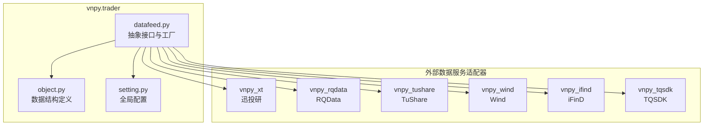
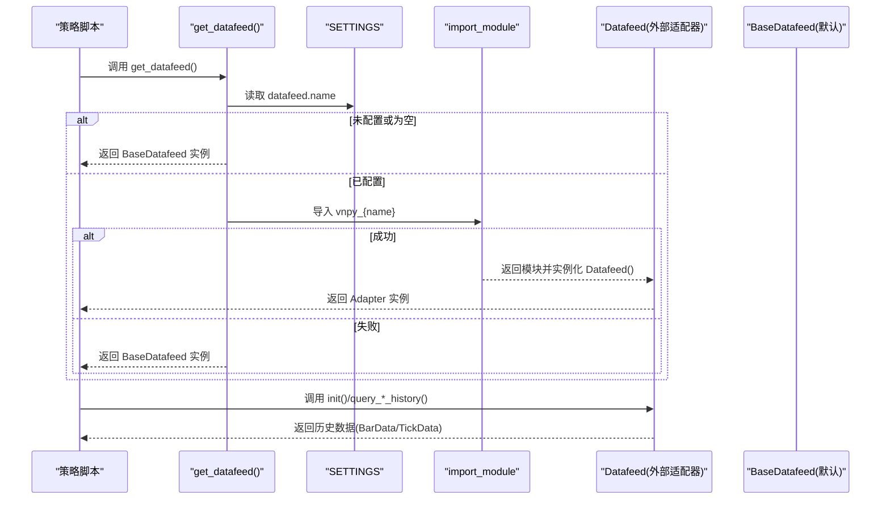
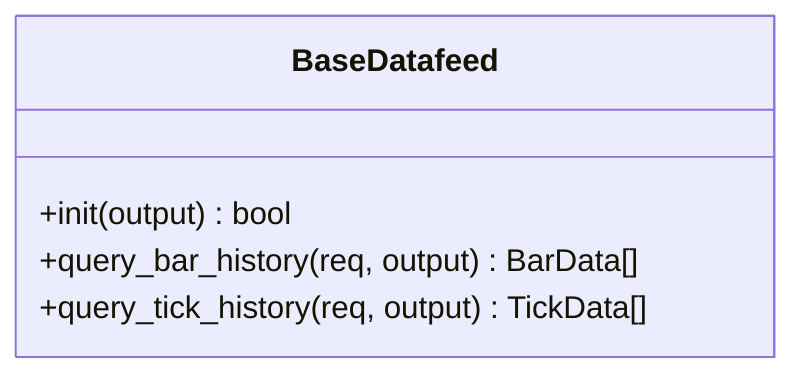
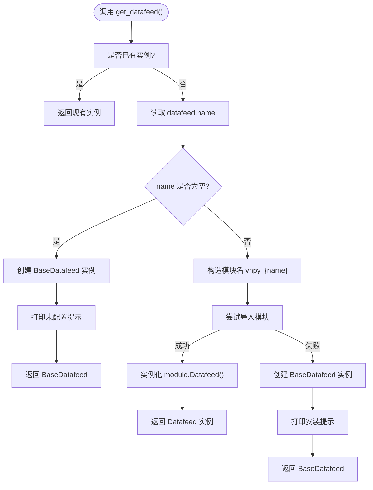
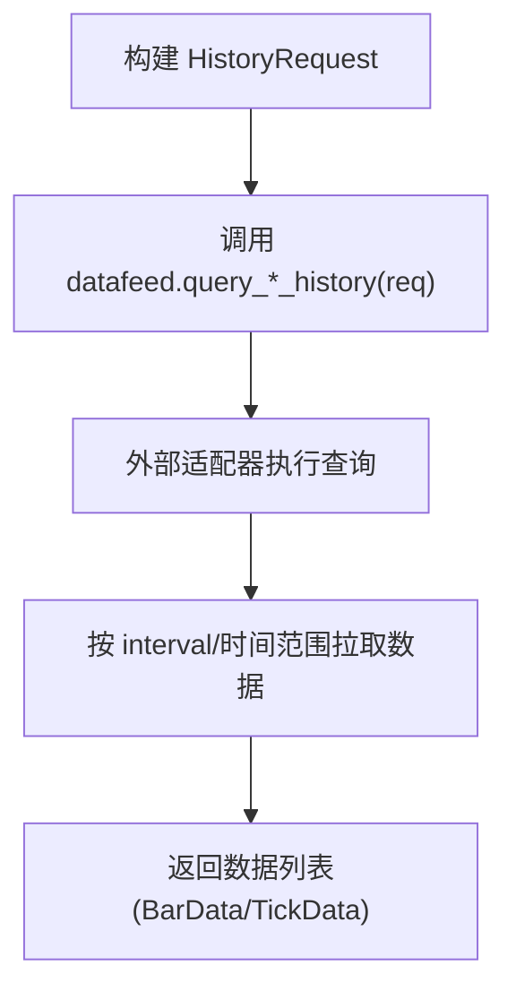
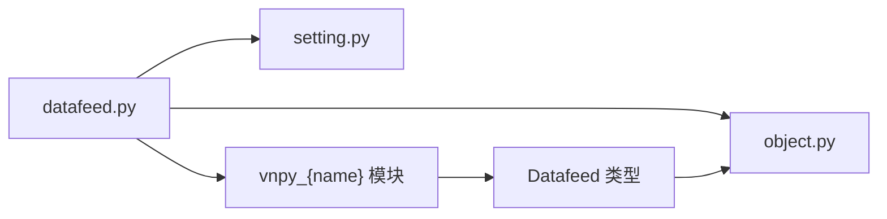

# 数据服务集成

<cite>
**本文引用的文件列表**
- [vnpy/trader/datafeed.py](file://vnpy/trader/datafeed.py)
- [vnpy/trader/object.py](file://vnpy/trader/object.py)
- [vnpy/trader/setting.py](file://vnpy/trader/setting.py)
- [docs/community/info/datafeed.md](file://docs/community/info/datafeed.md)
- [docs/community/info/veighna_trader.md](file://docs/community/info/veighna_trader.md)
- [examples/download_bars/download_bars.ipynb](file://examples/download_bars/download_bars.ipynb)
- [examples/alpha_research/download_data_rq.ipynb](file://examples/alpha_research/download_data_rq.ipynb)
</cite>

## 目录
1. [简介](#简介)
2. [项目结构](#项目结构)
3. [核心组件](#核心组件)
4. [架构总览](#架构总览)
5. [详细组件分析](#详细组件分析)
6. [依赖关系分析](#依赖关系分析)
7. [性能考虑](#性能考虑)
8. [故障排查指南](#故障排查指南)
9. [结论](#结论)
10. [附录](#附录)

## 简介
本文件围绕 vnpy 的数据服务集成体系，系统性阐述 datafeed 模块的标准化接口设计，重点解析 BaseDatafeed 抽象基类的职责与实现要点，以及 get_datafeed() 工厂方法的调用机制与模块装载流程。同时，结合官方文档与示例，给出 XT、RQData、TuShare、Wind、iFinD、TQSDK 等主流数据服务的配置方法（datafeed.name、datafeed.username、datafeed.password），说明认证方式与参数要点，并详细解释历史数据请求 HistoryRequest 的处理流程，指导策略脚本如何通过 datafeed 接口获取跨市场、多周期的金融数据。最后提供故障排查与性能优化建议，涵盖连接超时设置、请求频率控制等实践要点。

## 项目结构
datafeed 模块位于 vnpy.trader 包内，采用“抽象接口 + 工厂装载 + 外部适配器”的分层设计：
- 抽象接口层：BaseDatafeed 定义统一的数据服务接口规范
- 工厂装载层：get_datafeed() 根据全局配置动态导入外部适配器模块
- 数据结构层：HistoryRequest、TickData、BarData 作为数据请求与返回的标准载体
- 全局配置层：SETTINGS 中的 datafeed.* 字段承载认证与服务选择

**图表来源**
- [vnpy/trader/datafeed.py](file://vnpy/trader/datafeed.py#L1-L68)
- [vnpy/trader/object.py](file://vnpy/trader/object.py#L373-L428)
- [vnpy/trader/setting.py](file://vnpy/trader/setting.py#L11-L38)

**章节来源**
- [vnpy/trader/datafeed.py](file://vnpy/trader/datafeed.py#L1-L68)
- [vnpy/trader/object.py](file://vnpy/trader/object.py#L373-L428)
- [vnpy/trader/setting.py](file://vnpy/trader/setting.py#L11-L38)

## 核心组件
- BaseDatafeed 抽象接口：定义初始化 init() 与历史数据查询 query_bar_history()/query_tick_history() 方法，提供默认实现（未配置时输出提示并返回空列表）
- get_datafeed() 工厂方法：读取全局配置 datafeed.name，按约定命名规则动态导入外部适配器模块（vnpy_{name}），实例化 Datafeed 类；若未配置或导入失败则回退到 BaseDatafeed
- HistoryRequest 请求模型：封装 symbol、exchange、start、end、interval 等查询要素
- TickData/BarData 数据模型：标准化 Tick 与 K 线数据结构，便于跨服务统一处理

关键实现路径参考：
- 抽象接口与工厂方法：[vnpy/trader/datafeed.py](file://vnpy/trader/datafeed.py#L10-L68)
- 历史数据请求模型：[vnpy/trader/object.py](file://vnpy/trader/object.py#L373-L388)
- Tick/Bar 数据模型：[vnpy/trader/object.py](file://vnpy/trader/object.py#L30-L109)
- 全局配置项：[vnpy/trader/setting.py](file://vnpy/trader/setting.py#L11-L38)

**章节来源**
- [vnpy/trader/datafeed.py](file://vnpy/trader/datafeed.py#L10-L68)
- [vnpy/trader/object.py](file://vnpy/trader/object.py#L30-L109)
- [vnpy/trader/object.py](file://vnpy/trader/object.py#L373-L388)
- [vnpy/trader/setting.py](file://vnpy/trader/setting.py#L11-L38)

## 架构总览
下图展示从策略脚本到数据服务的调用链路，以及工厂方法的模块装载过程。

**图表来源**
- [vnpy/trader/datafeed.py](file://vnpy/trader/datafeed.py#L39-L68)
- [vnpy/trader/setting.py](file://vnpy/trader/setting.py#L11-L38)

## 详细组件分析

### BaseDatafeed 抽象基类
- 职责：定义统一接口，屏蔽不同数据服务的差异，提供默认兜底行为
- 关键方法：
  - init(output): 初始化连接，返回布尔值
  - query_bar_history(req, output): 查询历史 K 线，返回 BarData 列表
  - query_tick_history(req, output): 查询历史 Tick，返回 TickData 列表
- 默认行为：未正确配置时输出提示并返回空列表，避免上层逻辑崩溃

**图表来源**
- [vnpy/trader/datafeed.py](file://vnpy/trader/datafeed.py#L10-L34)

**章节来源**
- [vnpy/trader/datafeed.py](file://vnpy/trader/datafeed.py#L10-L34)

### 工厂方法 get_datafeed() 的调用机制
- 作用：根据 datafeed.name 动态装载对应适配器模块，实例化 Datafeed 并返回
- 流程：
  - 若已存在实例直接返回
  - 读取 datafeed.name
  - 未配置：返回 BaseDatafeed 实例并打印提示
  - 已配置：构造模块名 vnpy_{name}，尝试 import_module
  - 导入成功：实例化 module.Datafeed()
  - 导入失败：返回 BaseDatafeed 实例并提示安装对应模块
- 注意：模块名需严格遵循 vnpy_{name} 的命名规范

**图表来源**
- [vnpy/trader/datafeed.py](file://vnpy/trader/datafeed.py#L39-L68)

**章节来源**
- [vnpy/trader/datafeed.py](file://vnpy/trader/datafeed.py#L39-L68)

### 历史数据请求 HistoryRequest 的处理流程
- 结构要素：symbol、exchange、start、end、interval
- 用途：作为 query_bar_history()/query_tick_history() 的输入参数，驱动不同数据服务按指定合约、交易所、时间范围与周期拉取历史数据
- 输出：返回 BarData 或 TickData 列表，供策略脚本进一步处理

**图表来源**
- [vnpy/trader/object.py](file://vnpy/trader/object.py#L373-L388)
- [vnpy/trader/datafeed.py](file://vnpy/trader/datafeed.py#L21-L33)

**章节来源**
- [vnpy/trader/object.py](file://vnpy/trader/object.py#L373-L388)
- [vnpy/trader/datafeed.py](file://vnpy/trader/datafeed.py#L21-L33)

### 数据服务配置方法与认证要点
- 全局配置字段（均以 datafeed 前缀）：
  - datafeed.name：数据服务名称（小写英文全称）
  - datafeed.username：用户名
  - datafeed.password：密码或 Token
- 认证方式：不同服务的用户名/密码或 Token 由各适配器模块负责处理，统一入口在 get_datafeed() 返回的 Datafeed 实例中
- 适配器模块命名：vnpy_{name}，例如 xt、rqdata、tushare、wind、ifind、tqsdk 等

参考示例与官方文档：
- 配置字段说明与示例：[docs/community/info/datafeed.md](file://docs/community/info/datafeed.md#L1-L12)
- 支持的数据服务列表与链接：[docs/community/info/veighna_trader.md](file://docs/community/info/veighna_trader.md#L222-L240)
- 示例脚本中对 datafeed.name、username、password 的赋值演示：[examples/download_bars/download_bars.ipynb](file://examples/download_bars/download_bars.ipynb#L37-L41)

**章节来源**
- [docs/community/info/datafeed.md](file://docs/community/info/datafeed.md#L1-L12)
- [docs/community/info/veighna_trader.md](file://docs/community/info/veighna_trader.md#L222-L240)
- [examples/download_bars/download_bars.ipynb](file://examples/download_bars/download_bars.ipynb#L37-L41)

### 常见数据服务适配器与使用要点
- 迅投研（XT）：跨市场（股票、期货、期权、基金、合约信息、财务信息）支持日线、小时线、分钟线、Tick
- 米筐 RQData：股票、期货、期权、基金和黄金 TD，支持日线、小时线、分钟线、Tick
- TuShare：股票、期货，支持日线、分钟线（盘后更新）
- Wind：期货，支持分钟线（实时更新）
- iFinD：期货，支持分钟线（实时更新）
- TQSDK：期货，支持分钟线（实时更新）

注意：
- 不同服务对 Tick 数据的支持程度不同，下载前请确认服务是否提供 Tick 下载能力
- RQData 的用户名统一为“license”，密码为 license 对应的授权凭据

参考文档：
- 服务列表与注册申请链接：[docs/community/info/datafeed.md](file://docs/community/info/datafeed.md#L13-L78)
- 脚本加载与调用示例：[docs/community/info/datafeed.md](file://docs/community/info/datafeed.md#L81-L97)
- RQData 初始化示例：[examples/alpha_research/download_data_rq.ipynb](file://examples/alpha_research/download_data_rq.ipynb#L79-L83)

**章节来源**
- [docs/community/info/datafeed.md](file://docs/community/info/datafeed.md#L13-L78)
- [docs/community/info/datafeed.md](file://docs/community/info/datafeed.md#L81-L97)
- [examples/alpha_research/download_data_rq.ipynb](file://examples/alpha_research/download_data_rq.ipynb#L79-L83)

### 在策略脚本中获取跨市场、多周期数据
- 步骤概览：
  1) 设置全局配置 datafeed.name、datafeed.username、datafeed.password
  2) 通过 get_datafeed() 获取 Datafeed 实例
  3) 构造 HistoryRequest（指定 symbol、exchange、start、end、interval）
  4) 调用 query_bar_history()/query_tick_history() 获取数据
- 多周期：通过 HistoryRequest 的 interval 字段切换（分钟、小时、日线等）
- 跨市场：通过 HistoryRequest 的 exchange 字段切换（不同交易所）

参考示例：
- 基本脚本加载与调用：[docs/community/info/datafeed.md](file://docs/community/info/datafeed.md#L81-L97)
- 历史数据请求（分钟级）示例：[docs/community/info/datafeed.md](file://docs/community/info/datafeed.md#L118-L139)

**章节来源**
- [docs/community/info/datafeed.md](file://docs/community/info/datafeed.md#L81-L97)
- [docs/community/info/datafeed.md](file://docs/community/info/datafeed.md#L118-L139)

## 依赖关系分析
- datafeed.py 依赖：
  - object.py：HistoryRequest、TickData、BarData
  - setting.py：SETTINGS 中的 datafeed.* 配置
  - locale：国际化提示文本
- 外部适配器模块：
  - 通过 import_module 动态导入 vnpy_{name}，要求模块内提供 Datafeed 类型
- 依赖耦合：
  - datafeed.py 与外部适配器之间为弱耦合（通过约定命名与类型接口）
  - 与内部数据结构强耦合（HistoryRequest、TickData、BarData）

**图表来源**
- [vnpy/trader/datafeed.py](file://vnpy/trader/datafeed.py#L1-L68)
- [vnpy/trader/object.py](file://vnpy/trader/object.py#L30-L109)
- [vnpy/trader/setting.py](file://vnpy/trader/setting.py#L11-L38)

**章节来源**
- [vnpy/trader/datafeed.py](file://vnpy/trader/datafeed.py#L1-L68)
- [vnpy/trader/object.py](file://vnpy/trader/object.py#L30-L109)
- [vnpy/trader/setting.py](file://vnpy/trader/setting.py#L11-L38)

## 性能考虑
- 连接与会话管理：建议在策略启动阶段调用 datafeed.init() 完成认证与会话建立，避免在高频请求中重复初始化
- 请求频率控制：不同数据服务对并发与频率有限制，建议在策略侧做限流与重试策略，避免触发风控
- 分批拉取：对长时间跨度的历史数据，建议按月或季度分批拉取，降低单次请求压力
- 缓存策略：对高频访问的短周期数据，可在应用层做缓存，减少重复请求
- 超时设置：根据网络状况与服务响应特性，合理设置请求超时，避免阻塞主线程
- 日志与监控：开启必要的日志记录，定位慢请求与异常重试

[本节为通用建议，无需特定文件来源]

## 故障排查指南
- 未配置 datafeed.name：
  - 现象：get_datafeed() 返回 BaseDatafeed 实例并打印未配置提示
  - 处理：在全局配置中设置 datafeed.name，并确保模块已安装
  - 参考：[vnpy/trader/datafeed.py](file://vnpy/trader/datafeed.py#L49-L53)
- 未安装对应适配器模块：
  - 现象：导入失败，打印安装提示
  - 处理：根据提示运行 pip 安装对应模块（vnpy_{name}）
  - 参考：[vnpy/trader/datafeed.py](file://vnpy/trader/datafeed.py#L56-L67)
- 认证失败：
  - 现象：init() 返回 False 或查询接口报错
  - 处理：核对 datafeed.username、datafeed.password 或 Token 是否正确；检查服务有效期与权限
  - 参考：[docs/community/info/datafeed.md](file://docs/community/info/datafeed.md#L1-L12)
- Tick 数据缺失：
  - 现象：query_tick_history() 返回空列表或服务不支持
  - 处理：确认所选服务是否支持 Tick 下载；必要时改用分钟线或分批拉取
  - 参考：[docs/community/info/datafeed.md](file://docs/community/info/datafeed.md#L118-L139)
- 时间范围与周期问题：
  - 现象：查询结果为空或报错
  - 处理：检查 HistoryRequest 的 start/end 与 interval 是否符合服务支持范围
  - 参考：[vnpy/trader/object.py](file://vnpy/trader/object.py#L373-L388)

**章节来源**
- [vnpy/trader/datafeed.py](file://vnpy/trader/datafeed.py#L49-L67)
- [docs/community/info/datafeed.md](file://docs/community/info/datafeed.md#L1-L12)
- [docs/community/info/datafeed.md](file://docs/community/info/datafeed.md#L118-L139)
- [vnpy/trader/object.py](file://vnpy/trader/object.py#L373-L388)

## 结论
vnpy 的 datafeed 模块通过 BaseDatafeed 抽象接口与 get_datafeed() 工厂方法，实现了对多家数据服务的统一接入与灵活扩展。开发者只需在全局配置中设置 datafeed.name、username、password，即可通过标准化接口获取跨市场、多周期的历史数据。配合合理的性能优化与故障排查策略，可在实际策略开发中高效、稳定地使用各类数据服务。

[本节为总结性内容，无需特定文件来源]

## 附录
- 常用配置字段速查：
  - datafeed.name：数据服务名称（小写英文全称）
  - datafeed.username：用户名
  - datafeed.password：密码或 Token
- 示例脚本参考：
  - 基本加载与调用：[docs/community/info/datafeed.md](file://docs/community/info/datafeed.md#L81-L97)
  - RQData 初始化示例：[examples/alpha_research/download_data_rq.ipynb](file://examples/alpha_research/download_data_rq.ipynb#L79-L83)
  - 配置赋值示例：[examples/download_bars/download_bars.ipynb](file://examples/download_bars/download_bars.ipynb#L37-L41)

**章节来源**
- [docs/community/info/datafeed.md](file://docs/community/info/datafeed.md#L81-L97)
- [examples/alpha_research/download_data_rq.ipynb](file://examples/alpha_research/download_data_rq.ipynb#L79-L83)
- [examples/download_bars/download_bars.ipynb](file://examples/download_bars/download_bars.ipynb#L37-L41)