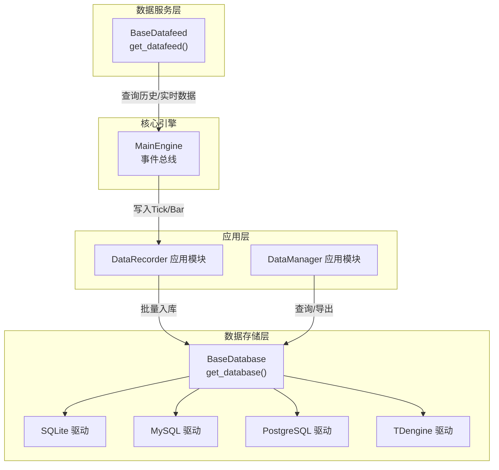
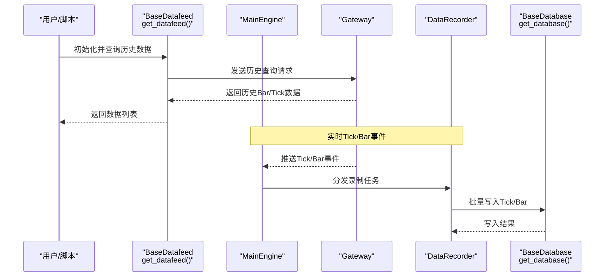
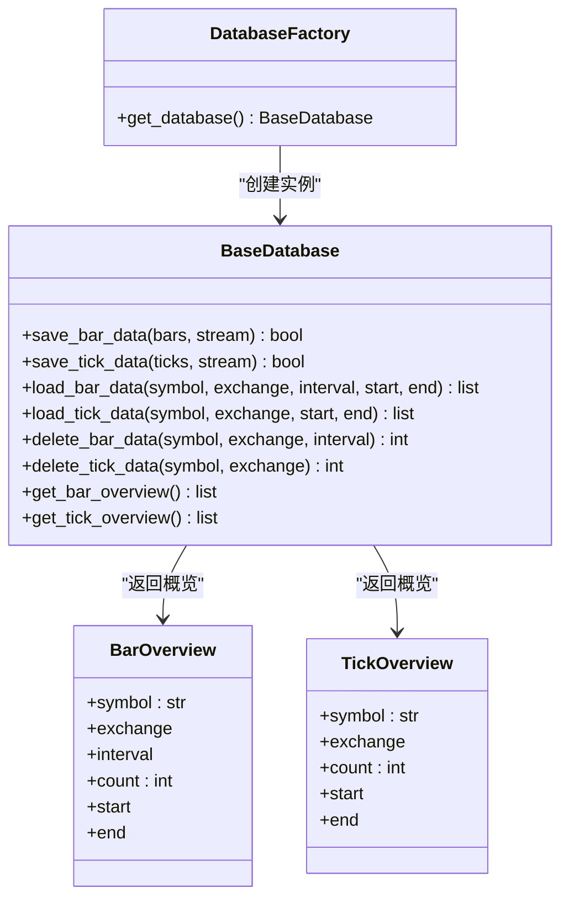
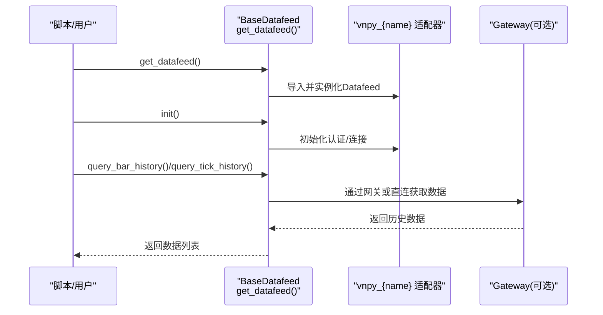
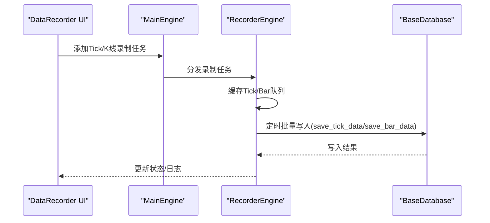
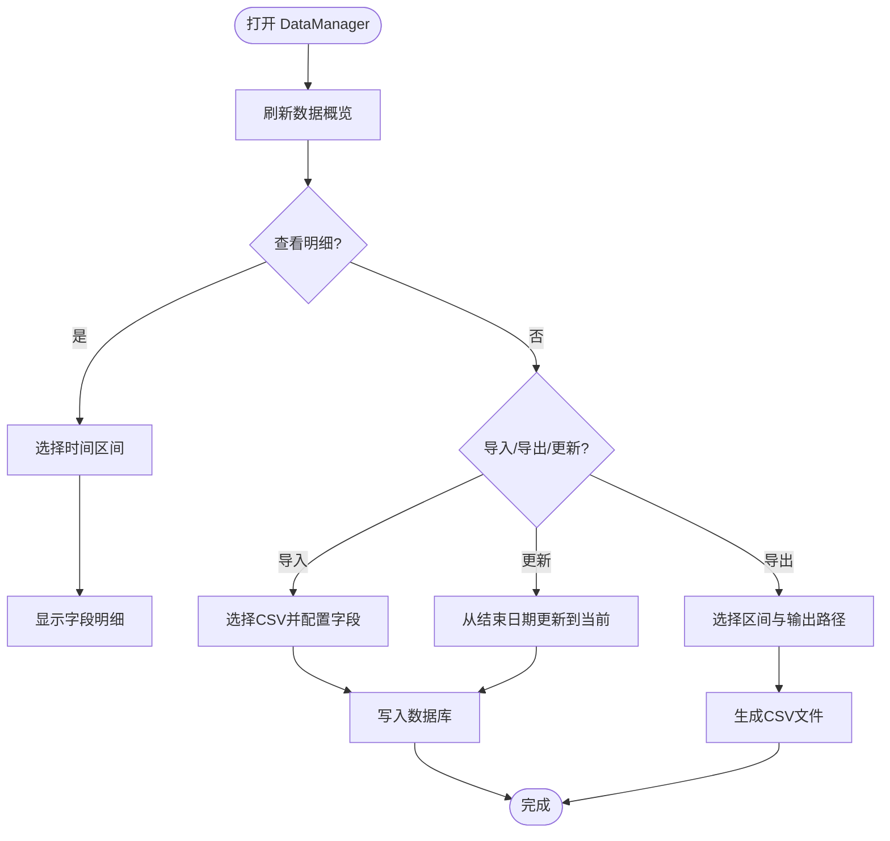
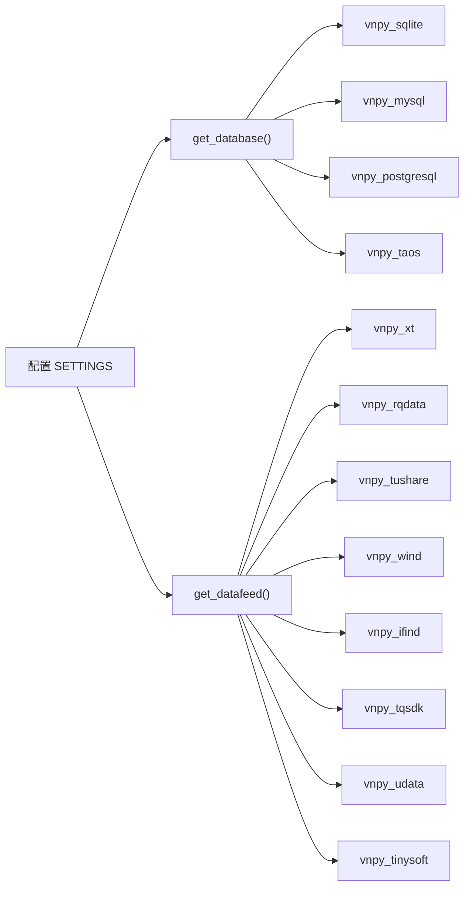

# 数据管理

<cite>
**本文引用的文件**
- [vnpy/trader/database.py](file://vnpy/trader/database.py)
- [vnpy/trader/datafeed.py](file://vnpy/trader/datafeed.py)
- [vnpy/trader/engine.py](file://vnpy/trader/engine.py)
- [docs/community/info/database.md](file://docs/community/info/database.md)
- [docs/community/info/datafeed.md](file://docs/community/info/datafeed.md)
- [docs/community/app/data_recorder.md](file://docs/community/app/data_recorder.md)
- [docs/community/app/data_manager.md](file://docs/community/app/data_manager.md)
- [examples/data_recorder/data_recorder.py](file://examples/data_recorder/data_recorder.py)
- [examples/download_bars/download_bars.ipynb](file://examples/download_bars/download_bars.ipynb)
- [README.md](file://README.md)
</cite>

## 目录
1. [简介](#简介)
2. [项目结构](#项目结构)
3. [核心组件](#核心组件)
4. [架构总览](#架构总览)
5. [详细组件分析](#详细组件分析)
6. [依赖关系分析](#依赖关系分析)
7. [性能考量](#性能考量)
8. [故障排查指南](#故障排查指南)
9. [结论](#结论)
10. [附录](#附录)

## 简介
本文件围绕vnpy的数据管理体系，系统梳理历史数据存储、实时行情获取与数据服务集成、行情录制与去重、数据查询与导出、以及大数据量下的性能调优建议。重点覆盖database模块对SQLite、MySQL、PostgreSQL、TDengine等数据库的支持与配置；datafeed模块对接RQData、迅投研、TuShare等第三方数据源；data_recorder模块的Tick与K线录制、订阅与批量写入；data_manager的树形浏览、查询与导出；并给出在高并发与大规模数据场景下的优化策略。

## 项目结构
- 数据存储抽象与数据库适配：通过统一的BaseDatabase接口与工厂函数get_database()动态加载具体数据库驱动，支持SQLite、MySQL、PostgreSQL、TDengine等。
- 数据服务适配：通过BaseDatafeed接口与工厂函数get_datafeed()动态加载具体数据服务驱动，支持RQData、迅投研、TuShare等。
- 实时行情与录制：通过MainEngine事件总线接收Tick/Bar事件，配合data_recorder应用模块进行录制与批量入库。
- 历史数据管理：通过data_manager应用模块提供树形浏览、查看、导入导出、更新等能力。

图表来源
- [vnpy/trader/database.py](file://vnpy/trader/database.py#L139-L159)
- [vnpy/trader/datafeed.py](file://vnpy/trader/datafeed.py#L39-L69)
- [vnpy/trader/engine.py](file://vnpy/trader/engine.py#L130-L160)
- [docs/community/app/data_recorder.md](file://docs/community/app/data_recorder.md#L1-L70)
- [docs/community/app/data_manager.md](file://docs/community/app/data_manager.md#L1-L192)

章节来源
- [vnpy/trader/database.py](file://vnpy/trader/database.py#L1-L159)
- [vnpy/trader/datafeed.py](file://vnpy/trader/datafeed.py#L1-L69)
- [vnpy/trader/engine.py](file://vnpy/trader/engine.py#L130-L160)
- [docs/community/info/database.md](file://docs/community/info/database.md#L1-L249)
- [docs/community/info/datafeed.md](file://docs/community/info/datafeed.md#L1-L97)
- [docs/community/app/data_recorder.md](file://docs/community/app/data_recorder.md#L1-L70)
- [docs/community/app/data_manager.md](file://docs/community/app/data_manager.md#L1-L192)

## 核心组件
- 数据库适配器
  - 抽象接口：BaseDatabase定义了保存/加载/删除/概览等统一方法。
  - 工厂函数：get_database()根据配置动态导入vnpy_{name}模块并实例化Database。
  - 时区转换：convert_tz()将datetime转换为数据库时区。
- 数据服务适配器
  - 抽象接口：BaseDatafeed定义init、查询历史K线/Tick等方法。
  - 工厂函数：get_datafeed()根据配置动态导入vnpy_{name}模块并实例化Datafeed。
- 主引擎与事件
  - MainEngine负责事件引擎初始化、网关与应用注册、历史查询转发等。
  - OmsEngine订阅并缓存Tick/Order/Trade/Position/Account/Contract/Quote事件，提供查询接口。
- 录制与管理应用
  - DataRecorder：按需添加Tick/K线录制任务，定时批量写入数据库。
  - DataManager：树形浏览、查看、导入导出、更新。

章节来源
- [vnpy/trader/database.py](file://vnpy/trader/database.py#L14-L159)
- [vnpy/trader/datafeed.py](file://vnpy/trader/datafeed.py#L1-L69)
- [vnpy/trader/engine.py](file://vnpy/trader/engine.py#L130-L160)
- [docs/community/app/data_recorder.md](file://docs/community/app/data_recorder.md#L1-L70)
- [docs/community/app/data_manager.md](file://docs/community/app/data_manager.md#L1-L192)

## 架构总览
下面的序列图展示了从数据服务到数据库的典型数据流，以及从事件引擎到录制模块的实时数据流。

图表来源
- [vnpy/trader/datafeed.py](file://vnpy/trader/datafeed.py#L39-L69)
- [vnpy/trader/engine.py](file://vnpy/trader/engine.py#L277-L288)
- [docs/community/app/data_recorder.md](file://docs/community/app/data_recorder.md#L1-L70)
- [vnpy/trader/database.py](file://vnpy/trader/database.py#L139-L159)

## 详细组件分析

### 数据库模块（database）
- 统一接口与工厂
  - BaseDatabase定义保存/加载/删除/概览等抽象方法，确保不同数据库实现一致的API。
  - get_database()根据SETTINGS["database.name"]动态导入vnpy_{name}模块，默认回退到vnpy_sqlite。
- 时区与时钟
  - DB_TZ使用SETTINGS["database.timezone"]，convert_tz()将传入datetime转换为DB_TZ并去除tzinfo，避免时区混杂导致的存储问题。
- 数据概览
  - BarOverview/TickOverview用于描述数据库中已有数据的统计信息（计数、起止时间等）。

图表来源
- [vnpy/trader/database.py](file://vnpy/trader/database.py#L25-L159)

章节来源
- [vnpy/trader/database.py](file://vnpy/trader/database.py#L14-L159)
- [docs/community/info/database.md](file://docs/community/info/database.md#L1-L249)

### 数据服务模块（datafeed）
- 统一接口与工厂
  - BaseDatafeed定义init、查询历史K线/Tick等方法，get_datafeed()根据SETTINGS["datafeed.name"]动态导入vnpy_{name}模块。
- 支持的数据服务
  - 迅投研、RQData、TuShare、Wind、iFinD、TQSDK、UData、Tinysoft等，均通过vnpy_{name}适配器接入。
- 使用流程
  - 在脚本中设置SETTINGS["datafeed.name"]、["username"]、["password"]，调用get_datafeed()获取实例，再调用init()与查询接口。

图表来源
- [vnpy/trader/datafeed.py](file://vnpy/trader/datafeed.py#L39-L69)
- [docs/community/info/datafeed.md](file://docs/community/info/datafeed.md#L1-L97)

章节来源
- [vnpy/trader/datafeed.py](file://vnpy/trader/datafeed.py#L1-L69)
- [docs/community/info/datafeed.md](file://docs/community/info/datafeed.md#L1-L97)
- [README.md](file://README.md#L196-L214)

### 实时行情录制（data_recorder）
- 功能概述
  - 支持按需添加Tick与K线录制任务，通过定时批量写入降低数据库压力与延迟。
  - 录制任务通过事件引擎分发，最终写入数据库。
- 配置与启动
  - 通过VeighNa Station或脚本添加DataRecorderApp，连接网关后启动录制界面。
  - 示例脚本演示了自动订阅合约并添加Tick/K线录制任务的流程。
- 批量写入与去重
  - 通过“写入间隔”配置定时批量写入，减少频繁IO。
  - 去重机制依赖数据库层约束与上层逻辑（如按vt_symbol+时间戳去重），具体实现由具体数据库驱动决定。

图表来源
- [docs/community/app/data_recorder.md](file://docs/community/app/data_recorder.md#L1-L70)
- [examples/data_recorder/data_recorder.py](file://examples/data_recorder/data_recorder.py#L65-L129)
- [vnpy/trader/database.py](file://vnpy/trader/database.py#L52-L133)

章节来源
- [docs/community/app/data_recorder.md](file://docs/community/app/data_recorder.md#L1-L70)
- [examples/data_recorder/data_recorder.py](file://examples/data_recorder/data_recorder.py#L1-L147)

### 历史数据管理（data_manager）
- 功能要点
  - 树形浏览：按交易所/周期/合约展示数据库已有数据概览。
  - 查看：选择时间区间查看明细字段。
  - 导入：支持CSV文件导入，配置合约信息、表头、时间格式等。
  - 导出：选择合约与区间导出为CSV。
  - 更新：基于现有数据结束日期自动下载更新。
- 数据来源
  - 数据服务（如RQData）、交易接口、DataRecorder录制。

图表来源
- [docs/community/app/data_manager.md](file://docs/community/app/data_manager.md#L1-L192)

章节来源
- [docs/community/app/data_manager.md](file://docs/community/app/data_manager.md#L1-L192)

### 数据序列化、索引优化与批量写入机制
- 序列化
  - 数据在写入数据库前通常以BarData/TickData对象形式存在，具体序列化/反序列化由具体数据库驱动实现。
- 索引优化
  - 建议在数据库层为vt_symbol、datetime、interval等常用查询字段建立索引，以提升查询与去重效率。
- 批量写入
  - DataRecorder通过定时批量写入减少IO次数；数据库驱动侧可使用事务批量提交、批量INSERT等方式提升吞吐。
- 去重机制
  - 建议在数据库层设置唯一约束（如vt_symbol+datetime），并在写入前进行去重判断，避免重复数据。

章节来源
- [docs/community/app/data_recorder.md](file://docs/community/app/data_recorder.md#L42-L70)
- [vnpy/trader/database.py](file://vnpy/trader/database.py#L52-L133)

## 依赖关系分析
- 组件耦合
  - database与datafeed均为可插拔模块，通过工厂函数与配置解耦。
  - engine与data_recorder通过事件总线耦合，实现Tick/Bar事件的实时录制。
- 外部依赖
  - 数据库驱动：vnpy_sqlite、vnpy_mysql、vnpy_postgresql、vnpy_taos等。
  - 数据服务驱动：vnpy_xt、vnpy_rqdata、vnpy_tushare、vnpy_wind、vnpy_ifind、vnpy_tqsdk、vnpy_udata、vnpy_tinysoft等。
- 配置项
  - database.name、database.*：数据库连接参数。
  - datafeed.name、datafeed.username、datafeed.password：数据服务认证参数。

图表来源
- [vnpy/trader/database.py](file://vnpy/trader/database.py#L139-L159)
- [vnpy/trader/datafeed.py](file://vnpy/trader/datafeed.py#L39-L69)
- [README.md](file://README.md#L177-L214)

章节来源
- [vnpy/trader/database.py](file://vnpy/trader/database.py#L139-L159)
- [vnpy/trader/datafeed.py](file://vnpy/trader/datafeed.py#L39-L69)
- [README.md](file://README.md#L177-L214)

## 性能考量
- 数据库层
  - 选择合适的数据库：SQLite适合入门与小规模数据；MySQL/PostgreSQL适合中大型项目；TDengine适合时序数据与高吞吐。
  - 建立索引：vt_symbol、datetime、interval等字段建立复合索引，提升查询与去重效率。
  - 批量写入：DataRecorder的定时批量写入策略可显著降低IO压力；数据库驱动侧建议使用事务批量提交。
  - 时区与时间：统一使用DB_TZ，避免跨时区查询与排序带来的额外开销。
- 数据服务层
  - 合理设置数据服务的用户名/密码与token，避免频繁重连与鉴权失败。
  - 对历史数据请求进行分批与限速，避免触发服务端限流。
- 应用层
  - 录制任务按需添加，避免过度录制造成内存与IO压力。
  - DataManager的刷新/查看操作在大数据量下可能卡顿，建议分页或分区间查询。
- 大数据量优化建议
  - 使用分表/分区策略（按时间或合约维度）。
  - 采用列式存储（如TDengine）以提升时序查询性能。
  - 异步写入与背压控制，防止内存溢出。
  - 定期归档旧数据，清理冗余数据。

章节来源
- [docs/community/info/database.md](file://docs/community/info/database.md#L1-L249)
- [docs/community/app/data_recorder.md](file://docs/community/app/data_recorder.md#L42-L70)
- [docs/community/app/data_manager.md](file://docs/community/app/data_manager.md#L113-L192)

## 故障排查指南
- 数据库无法连接
  - 检查database.name与对应驱动是否安装，确认database.*配置字段正确。
  - 对于MySQL/PostgreSQL，确保数据库已创建且用户权限正确。
- 数据服务无法加载
  - 检查datafeed.name与datafeed.username/password配置，确认已安装对应vnpy_{name}驱动。
  - 若ModuleNotFoundError，按提示pip安装对应驱动。
- 录制无数据
  - 确认已连接网关并订阅合约，DataRecorder界面任务列表中有对应vt_symbol。
  - 检查写入间隔与日志输出，确认批量写入正常。
- 查询/导出卡顿
  - DataManager刷新/查看时，建议缩小时间区间或分批导出。
  - 检查数据库索引是否完善，必要时重建索引。

章节来源
- [docs/community/info/database.md](file://docs/community/info/database.md#L1-L249)
- [docs/community/info/datafeed.md](file://docs/community/info/datafeed.md#L1-L97)
- [docs/community/app/data_recorder.md](file://docs/community/app/data_recorder.md#L1-L70)
- [docs/community/app/data_manager.md](file://docs/community/app/data_manager.md#L113-L192)

## 结论
vnpy的数据管理体系通过抽象接口与工厂模式实现了数据库与数据服务的可插拔扩展，结合事件驱动的实时录制与统一的历史数据管理，形成了从数据采集、存储、查询到导出的完整闭环。在实际部署中，应依据业务规模与性能需求选择合适的数据库与数据服务，并通过索引优化、批量写入与异步处理等手段提升整体性能与稳定性。

## 附录
- 示例脚本
  - DataRecorder示例：演示如何通过脚本自动订阅合约并添加Tick/K线录制任务。
  - 历史数据下载示例：演示如何配置数据服务与数据库并进行历史数据下载。

章节来源
- [examples/data_recorder/data_recorder.py](file://examples/data_recorder/data_recorder.py#L1-L147)
- [examples/download_bars/download_bars.ipynb](file://examples/download_bars/download_bars.ipynb#L1-L42)