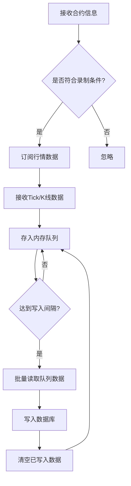
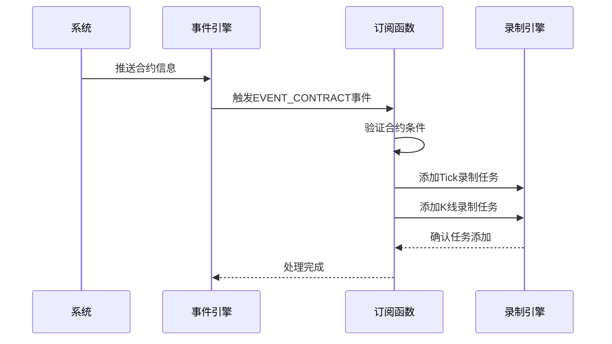

# 行情记录

<cite>
**本文档中引用的文件**  
- [data_recorder.md](file://docs/community/app/data_recorder.md)
- [data_recorder.py](file://examples/data_recorder/data_recorder.py)
- [app.py](file://vnpy/trader/app.py)
- [object.py](file://vnpy/trader/object.py)
- [utility.py](file://vnpy/trader/utility.py)
- [event.py](file://vnpy/trader/event.py)
- [setting.py](file://vnpy/trader/setting.py)
</cite>

## 目录
1. [简介](#简介)
2. [配置与启动方式](#配置与启动方式)
3. [vt_symbol格式与自动补全](#vt_symbol格式与自动补全)
4. [RecorderEngine内部实现机制](#recorderengine内部实现机制)
5. [写入间隔对数据库性能的影响](#写入间隔对数据库性能的影响)
6. [事件驱动的自动任务添加](#事件驱动的自动任务添加)
7. [录制任务管理与状态监控](#录制任务管理与状态监控)
8. [常见问题解决方案](#常见问题解决方案)

## 简介

行情记录模块（DataRecorderApp）是VeighNa框架中用于实盘行情数据采集的核心组件，支持实时Tick数据和K线数据的自动录制与持久化存储。该模块通过事件驱动架构实现高效的数据采集与写入，录制的数据可用于策略回测、实盘初始化以及历史数据分析。

本模块通过图形界面或脚本方式灵活配置，支持按需添加特定合约的行情录制任务。其核心引擎RecorderEngine负责处理行情订阅、数据缓存和批量写入数据库的完整流程，确保数据采集的高效性和可靠性。

**Section sources**
- [data_recorder.md](file://docs/community/app/data_recorder.md#L1-L6)
- [data_recorder.py](file://examples/data_recorder/data_recorder.py#L1-L5)

## 配置与启动方式

### 图形界面配置

在VeighNa Station中启动行情记录模块的步骤如下：
1. 登录VeighNa Station后，点击【交易】按钮
2. 在配置对话框的【应用模块】栏勾选【DataRecorder】
3. 连接交易接口并确认主界面日志栏输出"合约信息查询成功"
4. 在菜单栏点击【功能】-> 【行情记录】或点击左侧按钮栏图标启动模块

### 脚本方式启动

通过Python脚本加载和启动DataRecorderApp模块：

```python3
# 写在顶部
from vnpy_datarecorder import DataRecorderApp

# 写在创建main_engine对象后
main_engine.add_app(DataRecorderApp)
```

脚本启动方式提供了更高的灵活性，特别适合自动化部署和批量任务配置。

**Section sources**
- [data_recorder.md](file://docs/community/app/data_recorder.md#L7-L23)
- [data_recorder.py](file://examples/data_recorder/data_recorder.py#L75-L85)

## vt_symbol格式与自动补全

### vt_symbol格式规范

vt_symbol是VeighNa框架中合约的唯一标识符，采用"代码.交易所"的格式规范。例如：rb2112.SHFE表示上海期货交易所的螺纹钢2112合约。

在object.py文件中，ContractData类的__post_init__方法定义了vt_symbol的生成逻辑：
```python
self.vt_symbol: str = f"{self.symbol}.{self.exchange.value}"
```

### 自动补全功能

DataRecorder模块的UI界面提供了智能自动补全功能：
- 编辑框基于接口连接后收到的合约信息进行补全
- 补全功能区分大小写
- 用户输入代码前缀时，系统自动匹配符合条件的合约列表

该功能大大提升了用户配置录制任务的效率，减少了手动输入错误的可能性。

**Section sources**
- [data_recorder.md](file://docs/community/app/data_recorder.md#L46-L49)
- [object.py](file://vnpy/trader/object.py#L261-L262)
- [utility.py](file://vnpy/trader/utility.py#L22-L27)

## RecorderEngine内部实现机制

RecorderEngine是DataRecorderApp的核心引擎，负责处理行情数据的完整生命周期。其内部实现机制包括以下几个关键环节：

### 行情订阅流程

1. **事件监听**：注册EVENT_CONTRACT事件监听器，当系统接收到新的合约信息时触发处理函数
2. **合约过滤**：根据预设的交易所和品种类型过滤条件，判断是否需要录制该合约
3. **订阅请求**：向交易接口发送订阅请求，开始接收指定合约的行情数据

### 数据缓存与处理

1. **数据队列**：接收到的Tick数据和K线数据首先存入内存队列
2. **数据转换**：将原始行情数据转换为适合数据库存储的格式
3. **批量处理**：按照设定的写入间隔，将队列中的数据批量处理

### 批量写入数据库

1. **定时触发**：根据配置的写入间隔定时触发数据库写入操作
2. **事务处理**：使用数据库事务确保数据写入的原子性和一致性
3. **错误处理**：捕获并处理数据库写入过程中的异常，确保系统稳定性



**Diagram sources**
- [data_recorder.py](file://examples/data_recorder/data_recorder.py#L88-L109)
- [event.py](file://vnpy/trader/event.py#L7)

**Section sources**
- [data_recorder.py](file://examples/data_recorder/data_recorder.py#L87-L111)
- [event.py](file://vnpy/trader/event.py#L7)

## 写入间隔对数据库性能的影响

写入间隔（Write Interval）是影响数据库性能的关键参数，它决定了数据从内存队列批量写入数据库的频率。

### 性能影响分析

| 写入间隔 | 优点 | 缺点 | 适用场景 |
|---------|------|------|---------|
| 短间隔（如5秒） | 数据延迟低，实时性强 | 数据库压力大，I/O频繁 | 高频交易，实时性要求高的场景 |
| 中间隔（如30秒） | 平衡性能与延迟 | 适中 | 一般性行情记录需求 |
| 长间隔（如60秒） | 数据库压力小，写入效率高 | 数据延迟较大 | 大量合约同时录制，性能优先场景 |

### 最佳实践

1. **合理设置间隔**：根据系统性能和数据量选择合适的写入间隔，建议初始设置为30秒
2. **监控系统负载**：实时监控数据库CPU、内存和I/O使用情况，及时调整配置
3. **分批处理**：对于大量合约的录制任务，可采用分批处理策略，避免瞬时压力过大
4. **异常处理**：确保写入失败时有重试机制，防止数据丢失

批量写入机制可以显著降低数据库压力，通过一次性写入队列中所有待记录数据，减少了数据库连接和事务开销。

**Section sources**
- [data_recorder.md](file://docs/community/app/data_recorder.md#L51-L53)
- [setting.py](file://vnpy/trader/setting.py#L15-L18)

## 事件驱动的自动任务添加

通过事件驱动机制，可以实现为特定交易所和品种的合约自动添加录制任务。以下是一个完整的示例脚本：

```python
def subscribe_data(event: Event) -> None:
    """
    处理合约推送并订阅行情
    当系统接收到合约信息后，根据预设的交易所和品种过滤条件，
    自动为符合条件的合约添加行情录制任务。
    """
    # 从事件对象中获取合约数据
    contract: ContractData = event.data

    # 判断合约是否符合录制条件
    if (
        contract.exchange in recording_exchanges    # 检查合约所属交易所是否在预设列表中
        and contract.product in recording_products  # 检查合约品种类型是否在预设列表中
    ):
        # 添加该合约的行情录制任务
        recorder_engine.add_tick_recording(contract.vt_symbol)      # 录制Tick数据
        recorder_engine.add_bar_recording(contract.vt_symbol)       # 录制分钟K线

# 注册合约事件处理函数
event_engine.register(EVENT_CONTRACT, subscribe_data)
```

该机制的工作流程如下：
1. 定义合约订阅函数，处理EVENT_CONTRACT事件
2. 从事件数据中提取合约信息
3. 根据预设的交易所和品种类型进行过滤
4. 为符合条件的合约自动添加Tick和K线录制任务
5. 注册事件监听器，实现自动化处理



**Diagram sources**
- [data_recorder.py](file://examples/data_recorder/data_recorder.py#L88-L111)

**Section sources**
- [data_recorder.py](file://examples/data_recorder/data_recorder.py#L88-L111)
- [event.py](file://vnpy/trader/event.py#L13)

## 录制任务管理与状态监控

### 任务管理

#### 添加录制任务
1. 在【本地代码】编辑框中输入需要录制的合约vt_symbol
2. 在【写入间隔】编辑框中选择定时批量写入频率
3. 点击【K线记录】或【Tick记录】对应的【添加】按钮

#### 移除录制任务
1. 在【本地代码】编辑框中输入需要移除的合约vt_symbol
2. 点击【K线记录】或【Tick记录】对应的【移除】按钮

### 状态监控

系统通过日志机制提供实时的状态监控：
- **成功日志**：任务添加/移除成功时输出对应日志
- **错误日志**：任务操作失败时记录错误信息
- **运行日志**：定期输出数据录制状态和统计信息

日志监控配置：
```python
# 获取日志引擎
log_engine: LogEngine = main_engine.get_engine("log")

def print_log(event: Event) -> None:
    """处理数据录制模块的日志事件"""
    log_engine.logger.log(INFO, event.data)

# 注册日志事件处理函数
event_engine.register(EVENT_RECORDER_LOG, print_log)
```

**Section sources**
- [data_recorder.md](file://docs/community/app/data_recorder.md#L42-L69)
- [data_recorder.py](file://examples/data_recorder/data_recorder.py#L113-L129)

## 常见问题解决方案

### 问题1：无法获取合约信息

**现象**：IB接口登录后无法自动获取所有合约信息
**解决方案**：
1. 在主界面上先行手动订阅所需合约行情
2. 等待合约信息推送完成后，再启动行情记录模块

### 问题2：数据库写入延迟

**现象**：数据从接收到写入数据库存在明显延迟
**解决方案**：
1. 检查写入间隔设置是否过长
2. 监控数据库性能指标，优化数据库配置
3. 考虑升级数据库硬件或使用更高性能的数据库系统

### 问题3：内存占用过高

**现象**：长时间运行后系统内存占用持续增长
**解决方案**：
1. 检查数据写入是否正常，确保没有写入阻塞
2. 适当缩短写入间隔，加快数据从内存队列的消耗速度
3. 监控数据队列长度，设置合理的队列大小限制

### 问题4：自动补全功能失效

**现象**：vt_symbol编辑框无法提供自动补全建议
**解决方案**：
1. 确认已成功连接交易接口并接收到合约信息
2. 检查网络连接是否稳定
3. 重启行情记录模块重新加载合约信息

**Section sources**
- [data_recorder.md](file://docs/community/app/data_recorder.md#L31-L32)
- [data_recorder.py](file://examples/data_recorder/data_recorder.py#L134-L135)