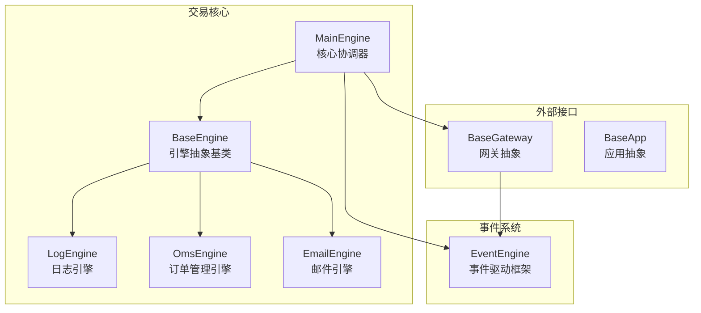
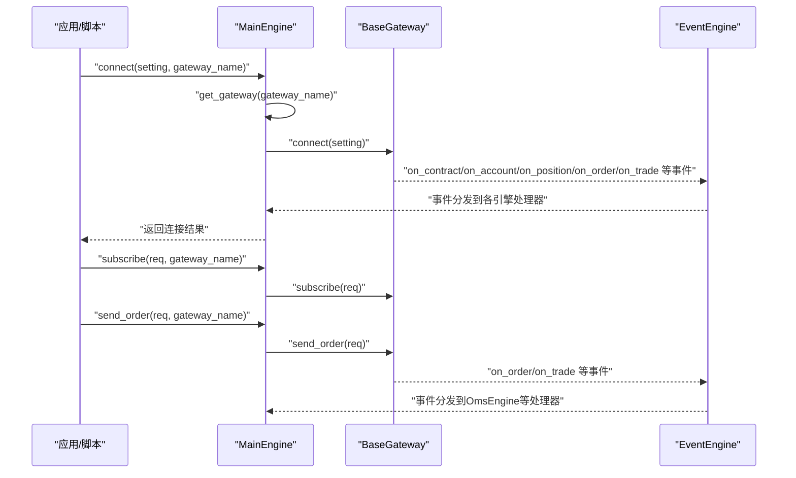
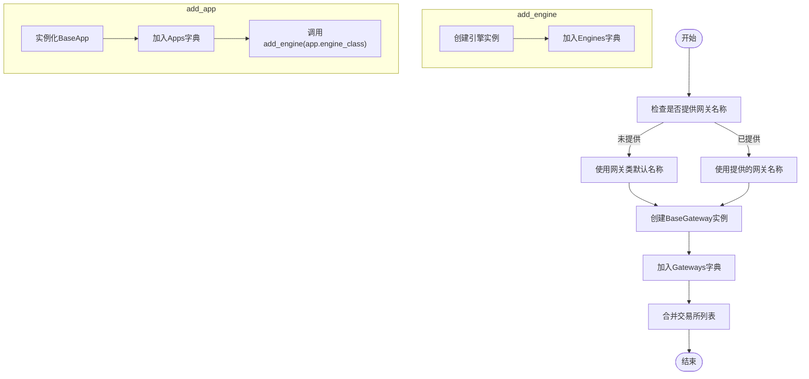
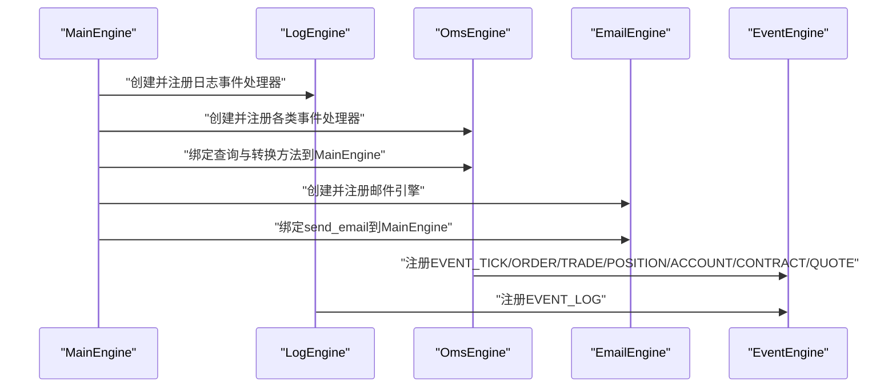
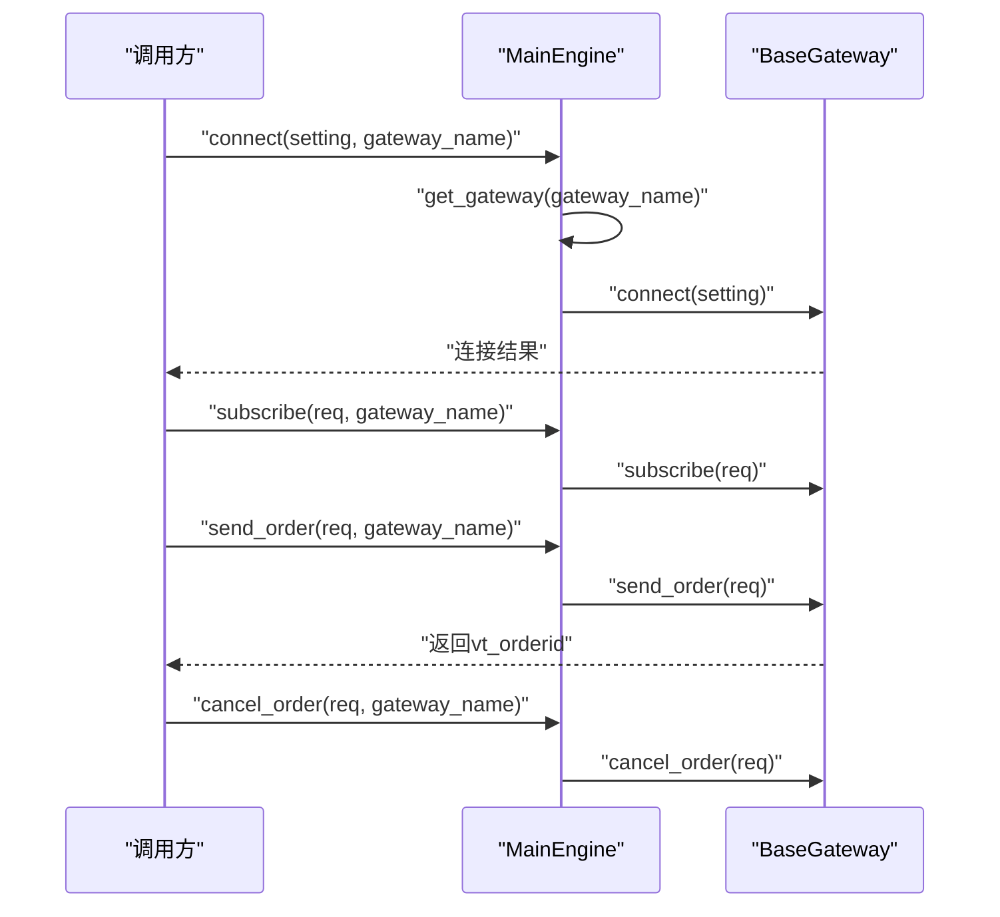
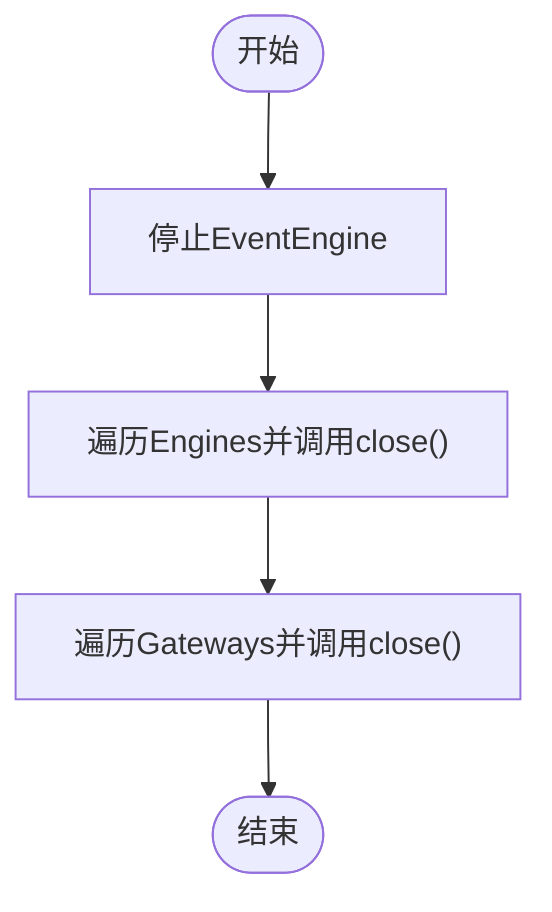
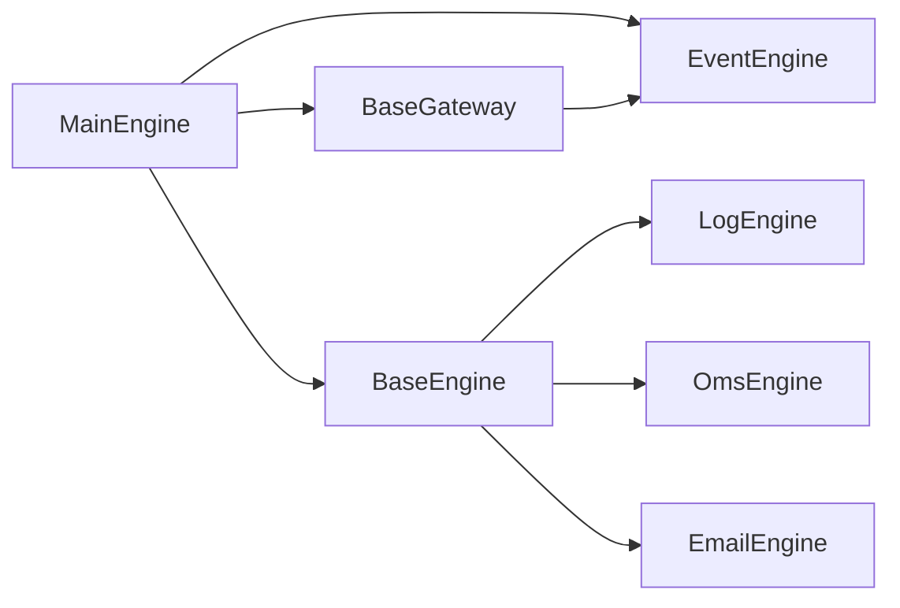

# 主交易引擎

<cite>
**本文引用的文件列表**
- [vnpy/trader/engine.py](file://vnpy/trader/engine.py)
- [vnpy/event/engine.py](file://vnpy/event/engine.py)
- [vnpy/trader/gateway.py](file://vnpy/trader/gateway.py)
- [vnpy/trader/app.py](file://vnpy/trader/app.py)
- [examples/veighna_trader/run.py](file://examples/veighna_trader/run.py)
</cite>

## 目录
1. [引言](#引言)
2. [项目结构](#项目结构)
3. [核心组件](#核心组件)
4. [架构总览](#架构总览)
5. [详细组件分析](#详细组件分析)
6. [依赖关系分析](#依赖关系分析)
7. [性能考量](#性能考量)
8. [故障排查指南](#故障排查指南)
9. [结论](#结论)
10. [附录](#附录)

## 引言
本文件面向vnpy主交易引擎（MainEngine）的全面技术文档，聚焦其作为系统核心的协调职责与模块化架构。文档将深入解析MainEngine在初始化时如何自动启动事件引擎并创建gateways、engines、apps等核心字典容器；详解add_gateway、add_app、add_engine三类关键方法如何实现系统的模块化与插件化；重点阐释init_engines中日志引擎（LogEngine）、订单管理系统（OmsEngine）与邮件引擎（EmailEngine）的初始化流程与依赖注入机制；梳理connect、subscribe、send_order等交易指令的转发路径，展示MainEngine如何作为网关（Gateway）与上层应用之间的中介；说明get_gateway、get_engine等查询方法的字典查找机制与失败时的日志记录策略；结合源码给出close方法的优雅关闭顺序与资源释放要点；最后提供扩展引擎的实践指南，包括注册自定义事件处理器与集成新功能模块的方法。

## 项目结构
围绕MainEngine的核心代码主要分布在以下模块：
- vnpy/trader/engine.py：定义MainEngine、BaseEngine、LogEngine、OmsEngine、EmailEngine以及相关常量与数据对象类型。
- vnpy/event/engine.py：事件驱动框架，提供事件队列、定时器、处理器注册与分发能力。
- vnpy/trader/gateway.py：抽象网关基类，定义与交易系统交互的统一接口与事件推送方法。
- vnpy/trader/app.py：应用抽象基类，承载应用元信息与引擎类绑定。
- examples/veighna_trader/run.py：示例入口，演示如何创建EventEngine与MainEngine、注册网关与应用。

图表来源
- [vnpy/trader/engine.py](file://vnpy/trader/engine.py#L73-L193)
- [vnpy/event/engine.py](file://vnpy/event/engine.py#L33-L146)
- [vnpy/trader/gateway.py](file://vnpy/trader/gateway.py#L33-L159)
- [vnpy/trader/app.py](file://vnpy/trader/app.py#L10-L22)

章节来源
- [vnpy/trader/engine.py](file://vnpy/trader/engine.py#L73-L193)
- [vnpy/event/engine.py](file://vnpy/event/engine.py#L33-L146)
- [vnpy/trader/gateway.py](file://vnpy/trader/gateway.py#L33-L159)
- [vnpy/trader/app.py](file://vnpy/trader/app.py#L10-L22)
- [examples/veighna_trader/run.py](file://examples/veighna_trader/run.py#L39-L87)

## 核心组件
- MainEngine：系统核心，负责初始化事件引擎、创建并管理Gateways、Engines、Apps字典容器；提供交易指令转发、查询与关闭等统一入口。
- BaseEngine：所有功能引擎的抽象基类，约定构造参数（main_engine, event_engine, engine_name），并提供可重写的close钩子。
- LogEngine：日志引擎，注册并处理日志事件，将日志输出到标准日志通道。
- OmsEngine：订单管理引擎，集中存储与管理Tick、Order、Trade、Position、Account、Contract、Quote等数据，维护活跃订单与报价集合，并提供偏移转换器（OffsetConverter）支持。
- EmailEngine：邮件引擎，异步发送邮件，按需启动线程与队列，支持错误日志回写。
- EventEngine：事件驱动框架，提供事件队列、定时器线程、通用处理器与特定类型处理器注册、分发与停止能力。
- BaseGateway：网关抽象，定义连接、订阅、下单、撤单、查询历史等接口，并提供事件推送方法（on_tick/on_order/on_trade等）。
- BaseApp：应用抽象，包含应用名称、模块字符串、路径、显示名、引擎类、小部件类名、图标名等元信息。

章节来源
- [vnpy/trader/engine.py](file://vnpy/trader/engine.py#L51-L193)
- [vnpy/event/engine.py](file://vnpy/event/engine.py#L33-L146)
- [vnpy/trader/gateway.py](file://vnpy/trader/gateway.py#L33-L273)
- [vnpy/trader/app.py](file://vnpy/trader/app.py#L10-L22)

## 架构总览
MainEngine作为系统中枢，承担以下职责：
- 初始化事件引擎并启动后台线程与定时器。
- 维护Gateways、Engines、Apps字典容器，提供统一的查询与操作接口。
- 在init_engines中注册并初始化核心功能引擎（日志、订单管理、邮件）。
- 作为交易指令的转发器，将connect/subscribe/send_order/cancel_order等请求路由至指定网关。
- 提供优雅关闭流程，先停止事件引擎，再依次关闭各功能引擎与网关。

图表来源
- [vnpy/trader/engine.py](file://vnpy/trader/engine.py#L213-L244)
- [vnpy/trader/gateway.py](file://vnpy/trader/gateway.py#L160-L221)
- [vnpy/event/engine.py](file://vnpy/event/engine.py#L66-L88)

## 详细组件分析

### 初始化与容器管理
- 初始化流程
  - 若未传入外部EventEngine，则创建并启动EventEngine。
  - 初始化Gateways、Engines、Apps、Exchanges容器。
  - 切换工作目录至交易目录后，调用init_engines完成核心引擎初始化。
- 容器管理
  - Gateways：键为网关名称，值为BaseGateway实例。
  - Engines：键为引擎名称，值为BaseEngine实例。
  - Apps：键为应用名称，值为BaseApp实例。
  - Exchanges：汇总各网关支持的交易所列表。

章节来源
- [vnpy/trader/engine.py](file://vnpy/trader/engine.py#L78-L93)
- [vnpy/trader/engine.py](file://vnpy/trader/engine.py#L86-L90)

### add_engine/add_gateway/add_app：模块化与插件化
- add_engine
  - 以MainEngine实例与EventEngine实例为参数创建引擎实例。
  - 将引擎实例存入Engines字典，键为其engine_name。
- add_gateway
  - 若未指定网关名称，则使用网关类的默认名称。
  - 使用EventEngine与网关名称创建BaseGateway实例，并加入Gateways字典。
  - 将网关支持的交易所追加到Exchanges列表（去重）。
- add_app
  - 实例化BaseApp并加入Apps字典。
  - 通过app.engine_class调用add_engine，将应用绑定的引擎也纳入系统。

图表来源
- [vnpy/trader/engine.py](file://vnpy/trader/engine.py#L94-L129)
- [vnpy/trader/engine.py](file://vnpy/trader/engine.py#L102-L119)
- [vnpy/trader/engine.py](file://vnpy/trader/engine.py#L120-L129)

章节来源
- [vnpy/trader/engine.py](file://vnpy/trader/engine.py#L94-L129)
- [vnpy/trader/engine.py](file://vnpy/trader/engine.py#L102-L119)
- [vnpy/trader/engine.py](file://vnpy/trader/engine.py#L120-L129)

### init_engines：核心引擎初始化与依赖注入
- 注册日志引擎（LogEngine）
  - 创建LogEngine实例并注册日志事件处理器。
- 注册订单管理引擎（OmsEngine）
  - 创建OmsEngine实例并注册各类事件处理器（tick/order/trade/position/account/contract/quote）。
  - 将OmsEngine提供的常用查询与转换方法绑定到MainEngine实例上，形成便捷访问点。
- 注册邮件引擎（EmailEngine）
  - 创建EmailEngine实例并将send_email方法绑定到MainEngine实例上，便于全局调用。

图表来源
- [vnpy/trader/engine.py](file://vnpy/trader/engine.py#L130-L159)
- [vnpy/trader/engine.py](file://vnpy/trader/engine.py#L304-L337)
- [vnpy/trader/engine.py](file://vnpy/trader/engine.py#L339-L440)
- [vnpy/trader/engine.py](file://vnpy/trader/engine.py#L569-L634)

章节来源
- [vnpy/trader/engine.py](file://vnpy/trader/engine.py#L130-L159)
- [vnpy/trader/engine.py](file://vnpy/trader/engine.py#L304-L337)
- [vnpy/trader/engine.py](file://vnpy/trader/engine.py#L339-L440)
- [vnpy/trader/engine.py](file://vnpy/trader/engine.py#L569-L634)

### 交易指令转发路径：connect/subscribe/send_order/cancel_order
- connect
  - 通过get_gateway获取指定网关实例，若存在则调用其connect(setting)，并在事件流中推送日志。
- subscribe
  - 通过get_gateway获取指定网关实例，若存在则调用其subscribe(req)。
- send_order/cancel_order
  - 通过get_gateway获取指定网关实例，若存在则调用相应方法；否则返回空标识或忽略。
- send_quote/cancel_quote/query_history
  - 类似地，转发到指定网关并记录日志。

图表来源
- [vnpy/trader/engine.py](file://vnpy/trader/engine.py#L213-L244)
- [vnpy/trader/engine.py](file://vnpy/trader/engine.py#L245-L276)
- [vnpy/trader/engine.py](file://vnpy/trader/engine.py#L277-L288)
- [vnpy/trader/gateway.py](file://vnpy/trader/gateway.py#L160-L221)

章节来源
- [vnpy/trader/engine.py](file://vnpy/trader/engine.py#L213-L288)
- [vnpy/trader/gateway.py](file://vnpy/trader/gateway.py#L160-L221)

### 查询方法：get_gateway/get_engine与日志记录策略
- get_gateway
  - 从Gateways字典按名称查找网关实例；若不存在，调用write_log记录“找不到底层接口”的告警日志。
- get_engine
  - 从Engines字典按名称查找引擎实例；若不存在，调用write_log记录“找不到引擎”的告警日志。
- get_default_setting
  - 委托给对应网关的get_default_setting方法返回默认配置字典。
- get_all_gateway_names/get_all_apps/get_all_exchanges
  - 提供遍历与统计能力，便于UI或管理面板使用。

章节来源
- [vnpy/trader/engine.py](file://vnpy/trader/engine.py#L168-L193)
- [vnpy/trader/engine.py](file://vnpy/trader/engine.py#L195-L212)
- [vnpy/trader/gateway.py](file://vnpy/trader/gateway.py#L262-L273)

### 关闭流程：优雅停机与资源释放
- 关闭顺序
  - 先停止事件引擎（停止定时器与事件线程，防止产生新的定时事件）。
  - 依次调用各功能引擎的close方法（默认空实现，可由子类覆盖）。
  - 依次调用各网关的close方法（由具体网关实现连接关闭与资源清理）。
- 设计意图
  - 保证事件不再产生，避免后续引擎/网关在停止过程中产生竞态。
  - 由各引擎/网关各自负责自身资源的回收，遵循单一职责。

图表来源
- [vnpy/trader/engine.py](file://vnpy/trader/engine.py#L289-L303)
- [vnpy/event/engine.py](file://vnpy/event/engine.py#L97-L104)

章节来源
- [vnpy/trader/engine.py](file://vnpy/trader/engine.py#L289-L303)
- [vnpy/event/engine.py](file://vnpy/event/engine.py#L97-L104)

### 日志引擎（LogEngine）与事件处理
- 注册与处理
  - 在构造时根据配置决定是否启用日志输出，并注册EVENT_LOG事件处理器。
  - 处理器将日志级别映射为字符串，调用logger.log输出到标准日志通道。
- 事件来源
  - MainEngine.write_log会构造LogData并通过EventEngine投递到EVENT_LOG事件队列。

章节来源
- [vnpy/trader/engine.py](file://vnpy/trader/engine.py#L160-L167)
- [vnpy/trader/engine.py](file://vnpy/trader/engine.py#L304-L337)

### 订单管理引擎（OmsEngine）与数据聚合
- 事件注册
  - 注册EVENT_TICK、EVENT_ORDER、EVENT_TRADE、EVENT_POSITION、EVENT_ACCOUNT、EVENT_CONTRACT、EVENT_QUOTE七类事件处理器。
- 数据存储
  - 维护各类型数据的字典（ticks/orders/trades/positions/accounts/contracts/quotes）。
  - 维护活跃订单与报价集合（active_orders/active_quotes）。
  - 为每个网关初始化OffsetConverter，用于订单请求转换。
- 查询与转换
  - 提供按标识符查询单条数据的方法。
  - 提供获取全量数据列表的方法。
  - 提供活跃订单/报价列表的查询。
  - 提供订单请求转换与偏移转换器获取方法。

章节来源
- [vnpy/trader/engine.py](file://vnpy/trader/engine.py#L339-L440)
- [vnpy/trader/engine.py](file://vnpy/trader/engine.py#L441-L567)

### 邮件引擎（EmailEngine）与异步发送
- 启动与队列
  - 首次发送邮件时启动线程与队列，标记为活跃状态。
  - send_email将邮件消息放入队列，使用默认接收者（若未显式指定）。
- 发送循环
  - run循环从队列取出邮件消息，使用SMTP_SSL发送；异常时格式化堆栈并通过MainEngine.write_log记录错误日志。
- 关闭
  - close方法将活跃标志置为False并等待线程结束，确保资源安全释放。

章节来源
- [vnpy/trader/engine.py](file://vnpy/trader/engine.py#L569-L634)

### 网关抽象（BaseGateway）与事件推送
- 事件推送
  - on_event/on_tick/on_order/on_trade/on_position/on_account/on_quote/on_log/on_contract等方法将数据封装为Event并投递到EventEngine。
  - 对特定标识（如vt_symbol、vt_orderid等）还推送带后缀的专用事件类型，便于定向监听。
- 接口契约
  - 必须实现connect/close/subscribe/send_order/cancel_order等方法；send_quote/cancel_quote/query_history等方法提供默认实现或空实现。
- 日志写入
  - write_log方法构造LogData并通过on_log推送。

章节来源
- [vnpy/trader/gateway.py](file://vnpy/trader/gateway.py#L86-L159)
- [vnpy/trader/gateway.py](file://vnpy/trader/gateway.py#L160-L273)

### 应用抽象（BaseApp）与插件化
- 元信息
  - app_name、app_module、app_path、display_name、engine_class、widget_name、icon_name等字段定义应用的元信息与绑定关系。
- 插件化
  - add_app通过app.engine_class将应用绑定的引擎注册到系统，实现“应用即插件”的模式。

章节来源
- [vnpy/trader/app.py](file://vnpy/trader/app.py#L10-L22)
- [vnpy/trader/engine.py](file://vnpy/trader/engine.py#L120-L129)

### 示例入口：创建EventEngine与MainEngine
- 示例脚本展示了如何：
  - 创建EventEngine并将其传递给MainEngine。
  - 注册一个或多个网关（如CtpGateway）。
  - 注册一个或多个应用（如CtaStrategyApp、CtaBacktesterApp、DataManagerApp）。
  - 构建主窗口并启动事件循环。

章节来源
- [examples/veighna_trader/run.py](file://examples/veighna_trader/run.py#L39-L87)

## 依赖关系分析
- 组件耦合
  - MainEngine强依赖EventEngine（启动、停止、事件分发）。
  - 所有引擎（LogEngine/OmsEngine/EmailEngine）均依赖EventEngine进行事件注册与处理。
  - 网关通过EventEngine向系统推送市场与账户数据事件。
  - MainEngine通过get_gateway/get_engine提供统一查询入口，降低上层对具体实现的耦合。
- 外部依赖
  - 邮件引擎依赖smtplib与EmailMessage进行SMTP发送。
  - 工作目录切换依赖os与TRADER_DIR。
  - 国际化与日志级别映射依赖locale与logger。

图表来源
- [vnpy/trader/engine.py](file://vnpy/trader/engine.py#L73-L193)
- [vnpy/event/engine.py](file://vnpy/event/engine.py#L33-L146)
- [vnpy/trader/gateway.py](file://vnpy/trader/gateway.py#L33-L159)

章节来源
- [vnpy/trader/engine.py](file://vnpy/trader/engine.py#L73-L193)
- [vnpy/event/engine.py](file://vnpy/event/engine.py#L33-L146)
- [vnpy/trader/gateway.py](file://vnpy/trader/gateway.py#L33-L159)

## 性能考量
- 事件驱动模型
  - 通过EventEngine的队列与线程模型实现非阻塞事件分发，避免阻塞调用导致的性能瓶颈。
- 定时器事件
  - EventEngine每间隔固定秒数生成定时事件，可用于周期性任务调度（如心跳、刷新）。
- 异步邮件发送
  - EmailEngine使用独立线程与队列，避免阻塞主线程与交易流程。
- 数据聚合与查询
  - OmsEngine以字典存储数据，查询复杂度接近O(1)，适合高频读取场景。

[本节为通用性能讨论，不直接分析具体文件]

## 故障排查指南
- 网关未找到
  - 现象：调用connect/subscribe/send_order等方法时无响应或返回空。
  - 排查：确认是否已通过add_gateway正确注册网关；检查网关名称是否与注册时一致；查看日志中“找不到底层接口”的告警。
- 引擎未找到
  - 现象：调用get_engine返回None。
  - 排查：确认是否已通过add_engine或add_app正确注册引擎；检查引擎名称是否与engine_name一致。
- 邮件发送失败
  - 现象：邮件未送达且出现异常日志。
  - 排查：检查SMTP服务器、端口、用户名、密码配置；查看EmailEngine捕获的异常堆栈并通过MainEngine日志定位问题。
- 优雅关闭异常
  - 现象：程序退出时资源未完全释放。
  - 排查：确认是否调用了MainEngine.close；检查各引擎/网关的close实现是否正确；确保EventEngine先于其他组件停止。

章节来源
- [vnpy/trader/engine.py](file://vnpy/trader/engine.py#L168-L193)
- [vnpy/trader/engine.py](file://vnpy/trader/engine.py#L289-L303)
- [vnpy/trader/engine.py](file://vnpy/trader/engine.py#L569-L634)

## 结论
MainEngine通过事件驱动架构实现了交易系统的高内聚低耦合：初始化阶段自动启动事件引擎并注册核心功能引擎；add_gateway/add_app/add_engine三类方法构建了清晰的模块化与插件化体系；交易指令通过get_gateway统一转发至具体网关；查询与日志机制完善，失败时具备明确的告警输出；优雅关闭流程确保资源有序释放。对于扩展开发，建议遵循BaseEngine/BaseGateway/BaseApp的抽象契约，通过事件注册与数据聚合实现新功能模块的无缝集成。

[本节为总结性内容，不直接分析具体文件]

## 附录
- 开发实践建议
  - 自定义事件处理器：在引擎初始化时调用event_engine.register注册处理器，确保事件类型与处理器签名匹配。
  - 集成新网关：实现BaseGateway的抽象方法，确保线程安全与回调完整性；在MainEngine中通过add_gateway注册。
  - 集成新应用：实现BaseApp并指定engine_class，通过add_app注册；在应用引擎中实现业务逻辑与事件处理。
  - 配置与国际化：利用SETTINGS与locale机制，确保日志与提示信息符合本地化需求。

[本节为实践建议，不直接分析具体文件]