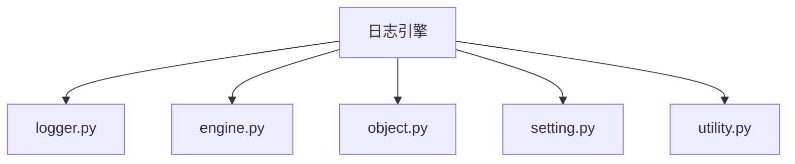
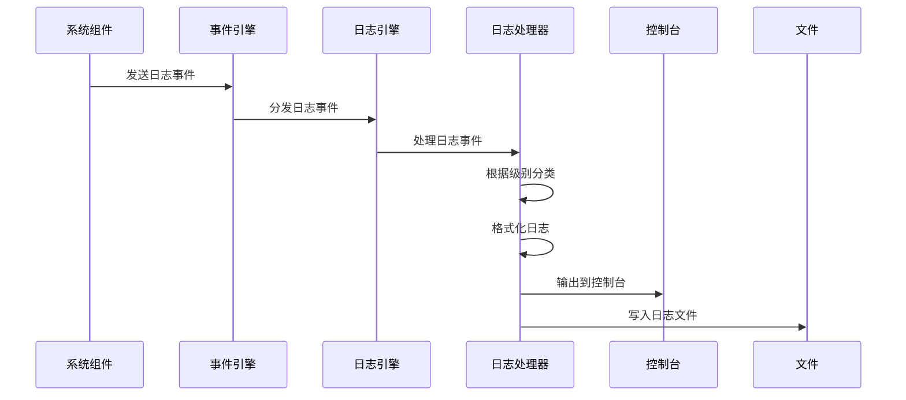
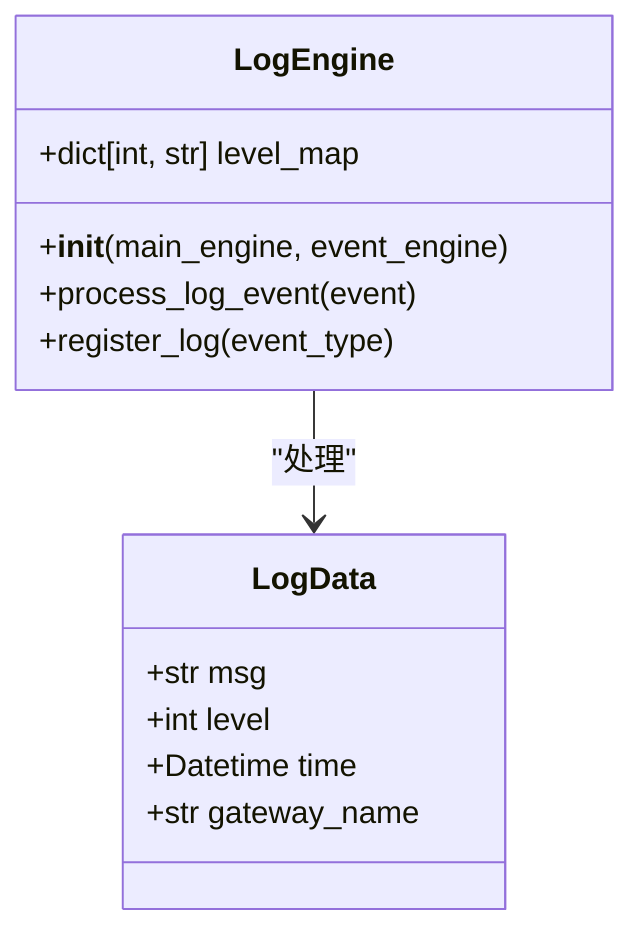
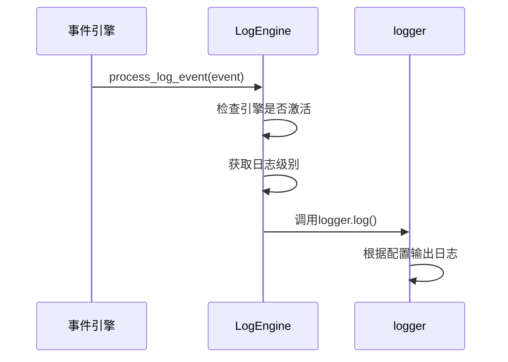
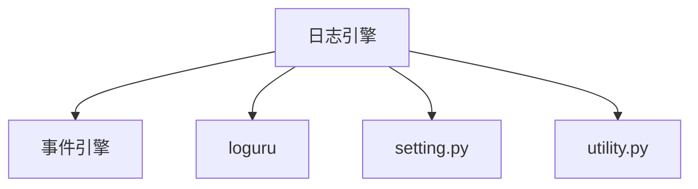

# 日志引擎

<cite>
**本文档引用的文件**
- [logger.py](file://vnpy/trader/logger.py)
- [setting.py](file://vnpy/trader/setting.py)
- [engine.py](file://vnpy/trader/engine.py)
- [object.py](file://vnpy/trader/object.py)
- [utility.py](file://vnpy/trader/utility.py)
- [event.py](file://vnpy/trader/event.py)
</cite>

## 目录
1. [简介](#简介)
2. [项目结构](#项目结构)
3. [核心组件](#核心组件)
4. [架构概述](#架构概述)
5. [详细组件分析](#详细组件分析)
6. [依赖分析](#依赖分析)
7. [性能考虑](#性能考虑)
8. [故障排除指南](#故障排除指南)
9. [结论](#结论)

## 简介
日志引擎（LogEngine）是VeighNa交易框架中的核心组件，负责统一收集、分级管理和输出系统内的日志信息。该引擎基于事件驱动架构，通过订阅系统内的日志事件，根据日志级别（DEBUG/INFO/WARNING/ERROR）进行分类处理，并将关键日志持久化到本地文件以供事后审计。日志引擎还提供了灵活的配置选项，允许用户通过setting.json文件调整日志输出级别和目标（控制台/文件），并支持开发者扩展自定义日志处理器以集成第三方监控系统。

## 项目结构
日志引擎相关代码主要分布在vnpy/trader目录下，包括logger.py、engine.py、object.py等文件。这些文件共同构成了日志系统的完整实现，从日志事件的定义、日志数据的处理到日志的输出和配置管理。

**图表来源**
- [logger.py](file://vnpy/trader/logger.py)
- [engine.py](file://vnpy/trader/engine.py)
- [object.py](file://vnpy/trader/object.py)
- [setting.py](file://vnpy/trader/setting.py)
- [utility.py](file://vnpy/trader/utility.py)

## 核心组件
日志引擎的核心组件包括日志事件处理器、日志配置管理器和日志输出处理器。这些组件协同工作，确保日志信息能够被正确地收集、分类和输出。

**章节来源**
- [logger.py](file://vnpy/trader/logger.py#L1-L55)
- [engine.py](file://vnpy/trader/engine.py#L304-L337)
- [object.py](file://vnpy/trader/object.py#L218-L230)

## 架构概述
日志引擎采用事件驱动架构，通过事件引擎（EventEngine）订阅和分发日志事件。当系统产生日志时，会创建一个日志事件并放入事件队列，日志引擎从队列中获取事件并根据配置进行处理。

**图表来源**
- [engine.py](file://vnpy/trader/engine.py#L304-L337)
- [logger.py](file://vnpy/trader/logger.py#L1-L55)

## 详细组件分析
### 日志事件处理分析
日志引擎通过注册日志事件处理器来接收和处理日志事件。处理器会根据日志级别进行分类，并将日志输出到配置的目标。

#### 类图

**图表来源**
- [engine.py](file://vnpy/trader/engine.py#L304-L337)
- [object.py](file://vnpy/trader/object.py#L218-L230)

#### 序列图

**图表来源**
- [engine.py](file://vnpy/trader/engine.py#L325-L333)
- [logger.py](file://vnpy/trader/logger.py#L1-L55)

### 日志配置分析
日志配置通过setting.py文件中的SETTINGS字典进行管理，允许用户灵活调整日志行为。

#### 配置表
| 配置项 | 说明 | 默认值 |
|-------|------|-------|
| log.active | 是否启用日志引擎 | True |
| log.level | 日志输出级别 | INFO |
| log.console | 是否输出到控制台 | True |
| log.file | 是否输出到文件 | True |

**图表来源**
- [setting.py](file://vnpy/trader/setting.py#L15-L18)

**章节来源**
- [setting.py](file://vnpy/trader/setting.py#L11-L38)
- [logger.py](file://vnpy/trader/logger.py#L36-L55)

## 依赖分析
日志引擎依赖于事件引擎（EventEngine）进行事件分发，同时依赖于loguru库进行日志输出管理。这些依赖关系确保了日志引擎能够高效地处理日志事件。

**图表来源**
- [engine.py](file://vnpy/trader/engine.py#L304-L337)
- [logger.py](file://vnpy/trader/logger.py#L1-L55)

**章节来源**
- [engine.py](file://vnpy/trader/engine.py#L1-L499)
- [logger.py](file://vnpy/trader/logger.py#L1-L55)

## 性能考虑
日志引擎在设计时考虑了性能因素，通过异步事件处理机制避免阻塞主线程。同时，日志输出采用缓冲机制，减少I/O操作对系统性能的影响。

## 故障排除指南
当遇到日志输出问题时，首先检查setting.json文件中的日志配置是否正确，确保log.active为True。如果日志未输出到文件，检查log.file是否为True，并确认日志目录是否有写入权限。

**章节来源**
- [setting.py](file://vnpy/trader/setting.py#L15-L18)
- [logger.py](file://vnpy/trader/logger.py#L48-L55)

## 结论
日志引擎作为VeighNa框架的重要组成部分，提供了强大而灵活的日志管理功能。通过事件驱动架构和可配置的输出选项，它能够满足不同场景下的日志需求，为系统监控和故障排查提供了有力支持。