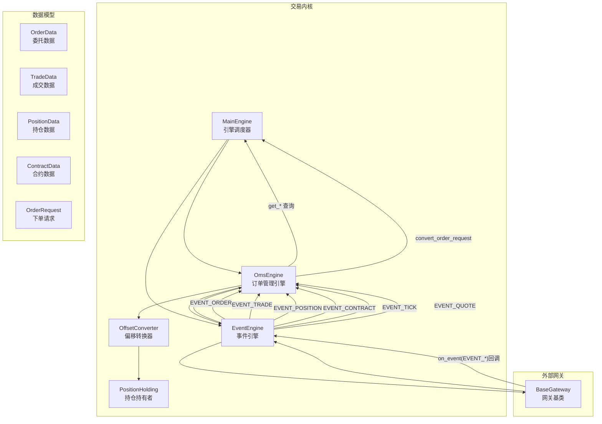
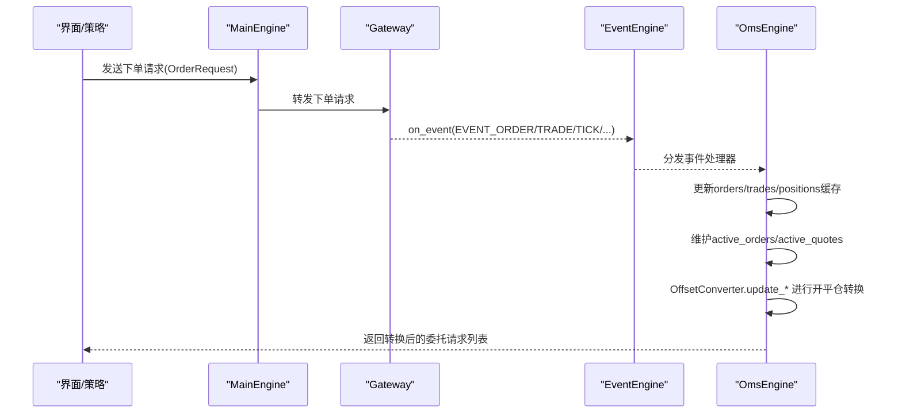
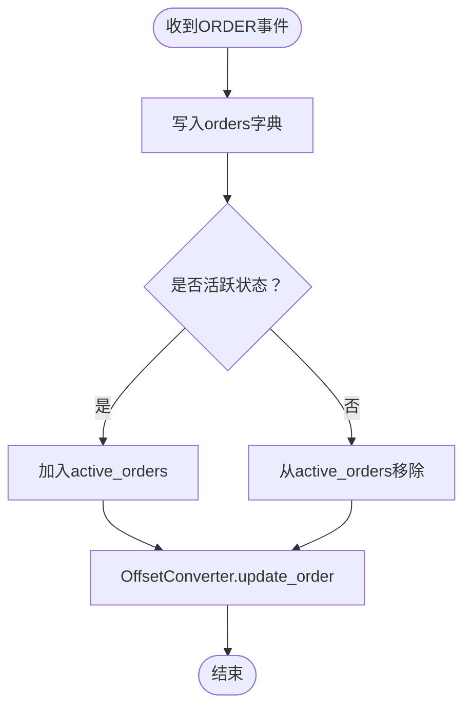
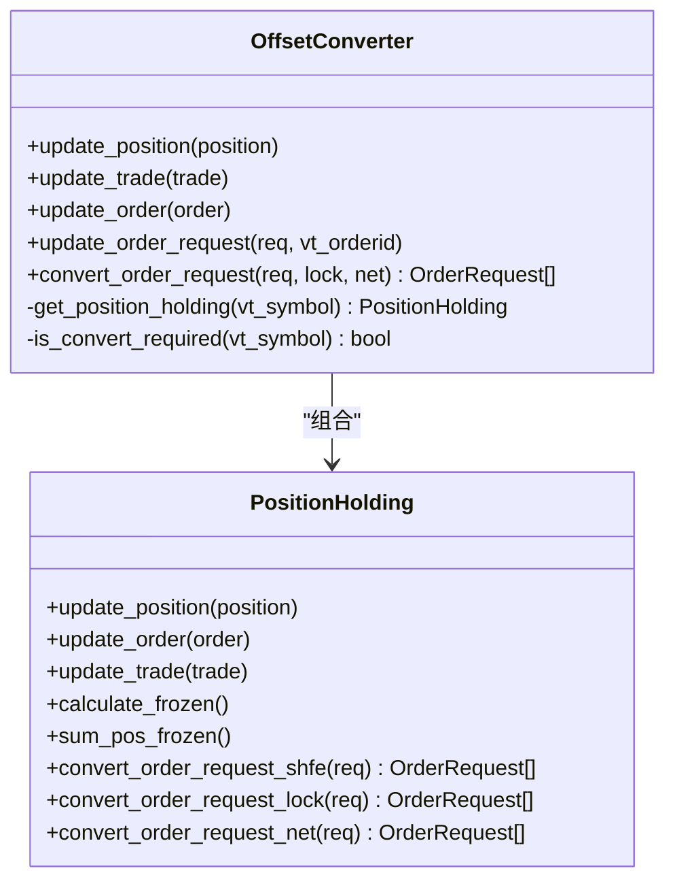
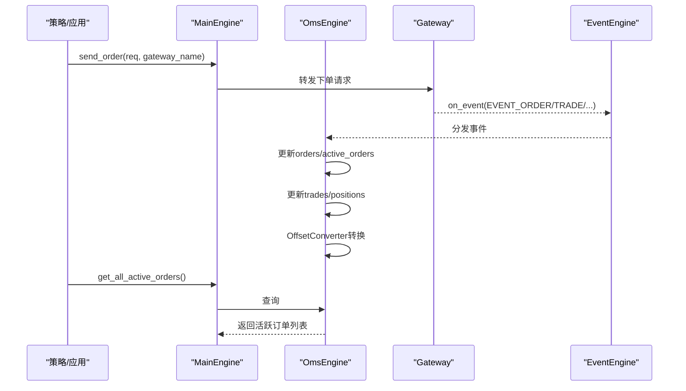
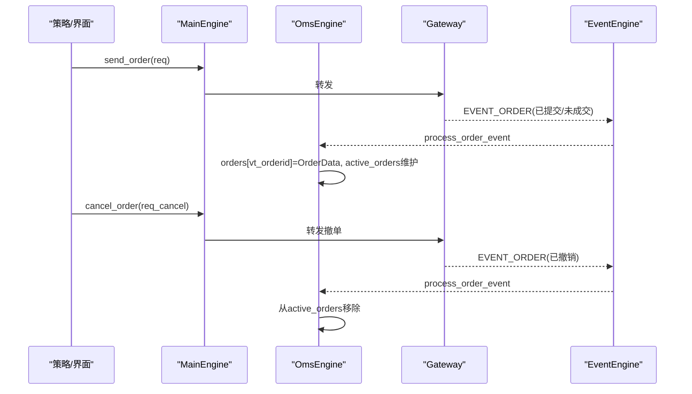
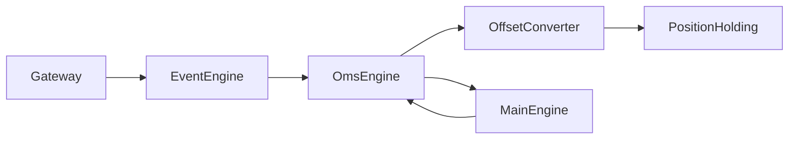

# 订单管理引擎

<cite>
**本文引用的文件列表**
- [vnpy/trader/engine.py](file://vnpy/trader/engine.py)
- [vnpy/trader/converter.py](file://vnpy/trader/converter.py)
- [vnpy/trader/object.py](file://vnpy/trader/object.py)
- [vnpy/event/engine.py](file://vnpy/event/engine.py)
- [vnpy/trader/gateway.py](file://vnpy/trader/gateway.py)
- [vnpy/trader/ui/widget.py](file://vnpy/trader/ui/widget.py)
</cite>

## 目录
1. [引言](#引言)
2. [项目结构](#项目结构)
3. [核心组件](#核心组件)
4. [架构总览](#架构总览)
5. [详细组件分析](#详细组件分析)
6. [依赖关系分析](#依赖关系分析)
7. [性能考量](#性能考量)
8. [故障排查指南](#故障排查指南)
9. [结论](#结论)
10. [附录](#附录)

## 引言
本文件面向vnpy平台的订单管理引擎（OmsEngine），系统性阐述其作为交易指令核心处理中枢的职责与实现细节。重点覆盖：
- 通过事件机制监听order事件，维护本地订单状态机与活跃订单集合
- 利用OffsetConverter在不同网关格式间进行委托单偏移量（开平仓）转换
- 订单缓存机制设计（以order_id为主键的高效查询与状态同步）
- 与MainEngine的集成方式及跨网关异步回报处理
- 订单生命周期管理流程：从下单请求、委托回报、成交回报到撤单处理的闭环
- 状态一致性保障最佳实践：异常处理、重复消息去重、断线重连后的状态恢复策略

## 项目结构
OmsEngine位于vnpy/trader子系统中，围绕事件驱动框架运行，与MainEngine、EventEngine、Gateway协同工作，同时通过OffsetConverter与合约信息联动，完成委托转换与冻结量计算。

图表来源
- [vnpy/trader/engine.py](file://vnpy/trader/engine.py#L339-L567)
- [vnpy/event/engine.py](file://vnpy/event/engine.py#L33-L146)
- [vnpy/trader/gateway.py](file://vnpy/trader/gateway.py#L81-L100)
- [vnpy/trader/converter.py](file://vnpy/trader/converter.py#L310-L403)
- [vnpy/trader/object.py](file://vnpy/trader/object.py#L112-L176)

章节来源
- [vnpy/trader/engine.py](file://vnpy/trader/engine.py#L130-L167)
- [vnpy/event/engine.py](file://vnpy/event/engine.py#L33-L146)
- [vnpy/trader/gateway.py](file://vnpy/trader/gateway.py#L81-L100)

## 核心组件
- OmsEngine：注册并处理各类EVENT（tick、order、trade、position、account、contract、quote），维护orders、trades、positions、accounts、contracts、quotes等字典缓存，以及active_orders、active_quotes活跃集合；提供查询与转换接口。
- OffsetConverter：按合约模式（净仓/多空仓）与交易所规则，将下单请求转换为符合开平仓要求的多个子请求，并维护PositionHolding的冻结量与可用量。
- PositionHolding：跟踪单合约的多空仓头寸、冻结量、可用量，计算开平仓与锁仓逻辑。
- MainEngine：初始化各引擎，桥接UI与策略层调用，转发下单/撤单请求至指定网关。
- EventEngine：统一事件分发与轮询，支撑OmsEngine的异步处理。
- Gateway：向EventEngine推送各类EVENT，形成异步回报闭环。

章节来源
- [vnpy/trader/engine.py](file://vnpy/trader/engine.py#L339-L567)
- [vnpy/trader/converter.py](file://vnpy/trader/converter.py#L17-L167)
- [vnpy/trader/converter.py](file://vnpy/trader/converter.py#L310-L403)
- [vnpy/event/engine.py](file://vnpy/event/engine.py#L33-L146)
- [vnpy/trader/gateway.py](file://vnpy/trader/gateway.py#L81-L100)

## 架构总览
OmsEngine通过事件驱动接收来自各网关的回报，实时更新本地缓存与状态机，并将转换后的委托请求返回给调用方或策略层。其与MainEngine的集成体现在：
- MainEngine在初始化时添加OmsEngine，并暴露get_*、convert_order_request、update_order_request等方法供上层使用
- MainEngine将下单/撤单请求转发给具体网关，网关通过EventEngine回调回报事件
- OmsEngine根据合约信息动态创建OffsetConverter，确保不同网关的开平仓语义一致

图表来源
- [vnpy/trader/engine.py](file://vnpy/trader/engine.py#L130-L167)
- [vnpy/trader/engine.py](file://vnpy/trader/engine.py#L363-L440)
- [vnpy/trader/gateway.py](file://vnpy/trader/gateway.py#L81-L100)
- [vnpy/event/engine.py](file://vnpy/event/engine.py#L66-L88)

## 详细组件分析

### OmsEngine：事件监听与状态机
- 事件注册：注册EVENT_TICK、EVENT_ORDER、EVENT_TRADE、EVENT_POSITION、EVENT_ACCOUNT、EVENT_CONTRACT、EVENT_QUOTE七类事件，分别对应行情、委托、成交、持仓、账户、合约、报价的异步回报。
- 订单状态机：
  - 接收ORDER事件时，写入orders字典；若状态为活跃则加入active_orders，否则从active_orders移除
  - 同步调用OffsetConverter.update_order，驱动开平仓转换与冻结量计算
- 成交/持仓/账户/合约/报价：
  - 写入对应字典；对成交与持仓同步调用OffsetConverter.update_trade/update_position，维持冻结量与可用量一致性
  - 合约事件触发时，为该gateway_name初始化OffsetConverter实例
- 查询接口：
  - 提供get_order/get_trade/get_position/get_account/get_contract/get_quote等按主键查询
  - 提供get_all_*与get_all_active_*用于批量获取
- 转换接口：
  - convert_order_request：按lock/net/交易所规则将原始OrderRequest转换为多个子请求
  - update_order_request：将策略侧的OrderRequest映射为OrderData并更新状态机

图表来源
- [vnpy/trader/engine.py](file://vnpy/trader/engine.py#L378-L394)

章节来源
- [vnpy/trader/engine.py](file://vnpy/trader/engine.py#L363-L440)
- [vnpy/trader/engine.py](file://vnpy/trader/engine.py#L441-L567)

### OffsetConverter与PositionHolding：委托转换与冻结量
- OffsetConverter：
  - 按合约net_position字段判断是否需要转换（多空仓模式才转换）
  - 根据lock/net/交易所规则选择转换策略
  - 通过get_position_holding获取或创建PositionHolding实例
- PositionHolding：
  - 维护long_pos/short_pos及其td/yd分组，以及对应frozen分组
  - update_order/update_trade/update_position计算冻结量与可用量
  - 提供三种转换策略：
    - SHFE/INE特殊规则：平仓优先拆分为CLOSETODAY/CLOSEYESTERDAY
    - 锁仓模式（lock）：在非特定交易所仅能开仓，否则按yd优先平仓再开仓
    - 净仓模式（net）：按可用量优先平昨/今，剩余部分开仓

图表来源
- [vnpy/trader/converter.py](file://vnpy/trader/converter.py#L310-L403)
- [vnpy/trader/converter.py](file://vnpy/trader/converter.py#L17-L167)

章节来源
- [vnpy/trader/converter.py](file://vnpy/trader/converter.py#L17-L167)
- [vnpy/trader/converter.py](file://vnpy/trader/converter.py#L168-L308)
- [vnpy/trader/converter.py](file://vnpy/trader/converter.py#L310-L403)

### 订单缓存机制：以order_id为主键的高效查询与状态同步
- 缓存结构：
  - orders：以vt_orderid为主键存储OrderData
  - active_orders：仅保留活跃委托，便于快速筛选
  - trades/positions/accounts/contracts/quotes：以各自主键存储
- 查询路径：
  - get_order/get_trade/get_position/get_account/get_contract/get_quote按主键查询
  - get_all_active_orders/get_all_active_quotes返回活跃集合
- 状态同步：
  - ORDER事件：写入orders并维护active_orders
  - TRADE/POSITION事件：写入trades/positions并同步OffsetConverter
  - CONTRACT事件：初始化OffsetConverter，确保后续转换生效

章节来源
- [vnpy/trader/engine.py](file://vnpy/trader/engine.py#L441-L567)

### 与MainEngine的集成与跨网关异步回报
- 初始化集成：
  - MainEngine.add_engine(OmsEngine)，并将OmsEngine的方法绑定到MainEngine实例，供上层直接调用
- 下单/撤单：
  - send_order/cancel_order由MainEngine转发到指定Gateway
  - Gateway通过on_event推送EVENT_ORDER/EVENT_TRADE/EVENT_POSITION/EVENT_TICK/EVENT_QUOTE
- 回报处理：
  - OmsEngine在process_*_event中写入缓存并同步OffsetConverter
  - 上层可通过get_all_active_orders等接口获取当前状态

图表来源
- [vnpy/trader/engine.py](file://vnpy/trader/engine.py#L130-L167)
- [vnpy/trader/engine.py](file://vnpy/trader/engine.py#L363-L440)
- [vnpy/trader/gateway.py](file://vnpy/trader/gateway.py#L81-L100)

章节来源
- [vnpy/trader/engine.py](file://vnpy/trader/engine.py#L130-L167)
- [vnpy/trader/gateway.py](file://vnpy/trader/gateway.py#L81-L100)

### 订单生命周期管理流程：从下单到撤单闭环
- 下单请求：
  - 策略/界面构造OrderRequest，调用MainEngine.send_order
  - Gateway转发至交易所，随后推送EVENT_ORDER回报
- 委托回报：
  - OmsEngine写入orders并维护active_orders
  - 若为多空仓模式，OffsetConverter根据lock/net/交易所规则转换为多个子请求
- 成交回报：
  - OmsEngine写入trades并同步OffsetConverter.update_trade
  - PositionHolding据此更新冻结量与可用量
- 撤单处理：
  - 策略/界面调用cancel_order，由MainEngine转发至Gateway
  - Gateway推送EVENT_ORDER回报（状态变更为非活跃），OmsEngine从active_orders移除

图表来源
- [vnpy/trader/engine.py](file://vnpy/trader/engine.py#L233-L254)
- [vnpy/trader/engine.py](file://vnpy/trader/engine.py#L378-L394)
- [vnpy/trader/object.py](file://vnpy/trader/object.py#L112-L151)

章节来源
- [vnpy/trader/engine.py](file://vnpy/trader/engine.py#L233-L254)
- [vnpy/trader/engine.py](file://vnpy/trader/engine.py#L378-L394)
- [vnpy/trader/object.py](file://vnpy/trader/object.py#L112-L151)

## 依赖关系分析
- OmsEngine依赖EventEngine进行事件分发，依赖MainEngine提供的查询与转换接口
- OffsetConverter依赖ContractData判断是否需要转换，并依赖PositionHolding维护冻结量
- Gateway通过on_event向EventEngine推送回报，形成闭环

图表来源
- [vnpy/event/engine.py](file://vnpy/event/engine.py#L33-L146)
- [vnpy/trader/engine.py](file://vnpy/trader/engine.py#L339-L567)
- [vnpy/trader/converter.py](file://vnpy/trader/converter.py#L310-L403)
- [vnpy/trader/gateway.py](file://vnpy/trader/gateway.py#L81-L100)

章节来源
- [vnpy/event/engine.py](file://vnpy/event/engine.py#L33-L146)
- [vnpy/trader/engine.py](file://vnpy/trader/engine.py#L339-L567)
- [vnpy/trader/converter.py](file://vnpy/trader/converter.py#L310-L403)
- [vnpy/trader/gateway.py](file://vnpy/trader/gateway.py#L81-L100)

## 性能考量
- 查询复杂度：orders/trades/positions/accounts/contracts/quotes均为字典存储，按主键查询为O(1)
- 活跃集合：active_orders/active_quotes仅维护活跃委托/报价，减少遍历成本
- 转换成本：OffsetConverter在合约事件触发时初始化，避免每次下单都创建实例
- 事件处理：EventEngine采用队列+线程模型，异步分发事件，降低阻塞风险

[本节为通用性能讨论，无需列出具体文件来源]

## 故障排查指南
- 重复消息去重：
  - 订单/成交/报价均以唯一主键写入缓存，重复事件不会覆盖已有对象，但需确保vt_*id生成规则稳定
- 异常处理：
  - MainEngine在日志事件中输出错误信息，便于定位问题
  - 网关回调必须保证数据不可变，避免缓存引用被修改
- 断线重连后的状态恢复：
  - 合约事件触发时初始化OffsetConverter，确保后续转换逻辑生效
  - 重新订阅后，网关应回传历史回报，OmsEngine会逐步同步至最新状态

章节来源
- [vnpy/trader/engine.py](file://vnpy/trader/engine.py#L304-L338)
- [vnpy/trader/gateway.py](file://vnpy/trader/gateway.py#L54-L70)

## 结论
OmsEngine通过事件驱动与缓存机制，实现了对多网关委托回报的统一管理与状态同步；OffsetConverter确保不同市场规则下的开平仓语义一致；与MainEngine的紧密集成使得策略层能够以简洁接口完成下单、查询与转换。遵循本文的最佳实践，可有效提升订单状态一致性与系统稳定性。

[本节为总结性内容，无需列出具体文件来源]

## 附录
- 关键接口路径参考：
  - 订单查询：[get_order](file://vnpy/trader/engine.py#L447-L452)
  - 成交查询：[get_trade](file://vnpy/trader/engine.py#L453-L459)
  - 活跃订单：[get_all_active_orders](file://vnpy/trader/engine.py#L525-L531)
  - 委托转换：[convert_order_request](file://vnpy/trader/engine.py#L545-L560)
  - 订单缓存写入：[process_order_event](file://vnpy/trader/engine.py#L378-L394)
  - 成交缓存写入：[process_trade_event](file://vnpy/trader/engine.py#L395-L404)
  - 合约事件初始化转换器：[process_contract_event](file://vnpy/trader/engine.py#L420-L428)
  - UI下单入口：[send_order调用](file://vnpy/trader/ui/widget.py#L998-L1011)
  - UI撤单入口：[cancel_all](file://vnpy/trader/ui/widget.py#L1013-L1021)