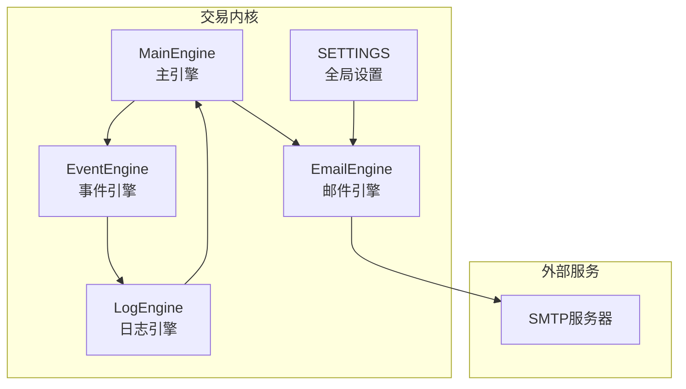
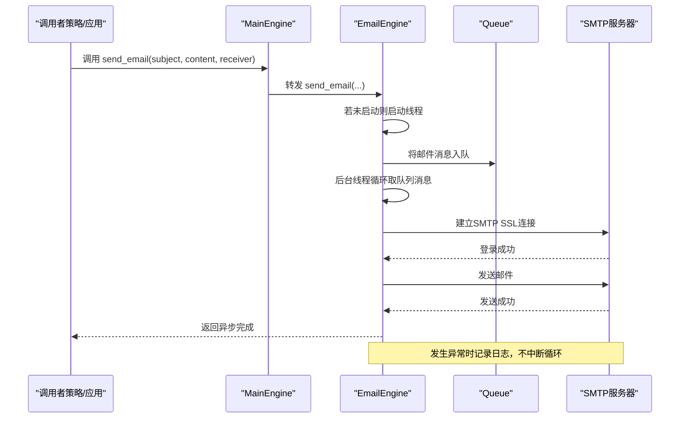
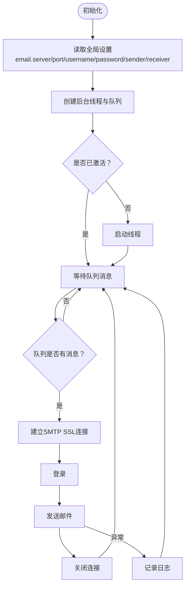
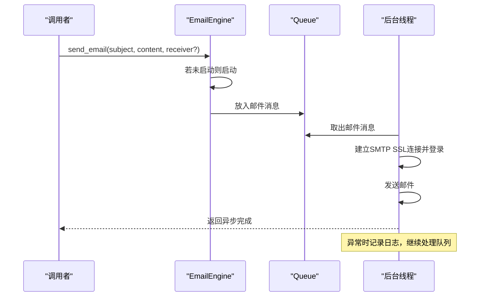
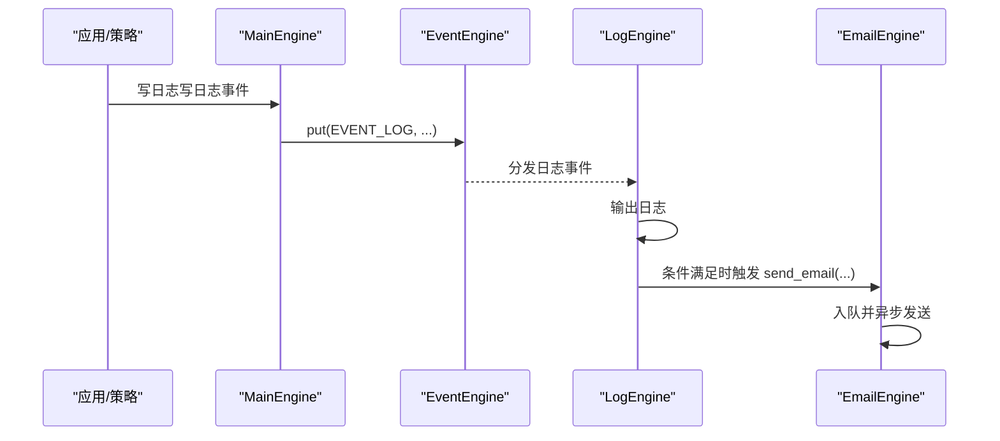
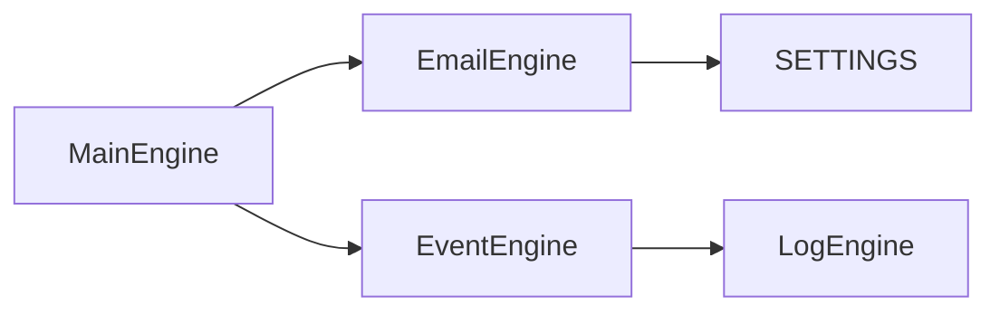

# 邮件引擎

<cite>
**本文引用的文件列表**
- [vnpy/trader/engine.py](file://vnpy/trader/engine.py)
- [vnpy/trader/setting.py](file://vnpy/trader/setting.py)
- [vnpy/trader/event.py](file://vnpy/trader/event.py)
- [vnpy/event/engine.py](file://vnpy/event/engine.py)
- [docs/community/info/veighna_trader.md](file://docs/community/info/veighna_trader.md)
- [docs/elite/info/elite_trader.md](file://docs/elite/info/elite_trader.md)
</cite>

## 目录
1. [简介](#简介)
2. [项目结构](#项目结构)
3. [核心组件](#核心组件)
4. [架构总览](#架构总览)
5. [组件详解](#组件详解)
6. [依赖关系分析](#依赖关系分析)
7. [性能与可靠性](#性能与可靠性)
8. [故障排查指南](#故障排查指南)
9. [结论](#结论)
10. [附录](#附录)

## 简介
本技术文档围绕邮件引擎（EmailEngine）展开，重点说明其作为系统级告警通知通道的实现机制。内容涵盖：
- 初始化流程：从系统设置中读取SMTP服务器配置（主机、端口、用户名、密码、发件人、收件人），并建立安全连接。
- send_email 方法内部逻辑：邮件内容构建、异步发送队列、线程执行与错误处理。
- 如何响应系统事件（如日志事件）触发邮件推送，实现关键事件（如交易异常、策略信号）的实时通知。
- 安全配置最佳实践：防止敏感信息泄露，推荐使用应用专用密码或OAuth2认证。
- 扩展指南：如何适配企业邮箱或国内邮件服务商。

## 项目结构
邮件引擎位于交易内核模块中，与事件系统、全局设置紧密协作：
- 邮件引擎类：负责邮件发送的异步线程与队列管理。
- 全局设置：集中存放SMTP与邮件收发配置。
- 事件系统：日志事件驱动邮件通知。
- 文档：提供配置项说明与使用指引。

图表来源
- [vnpy/trader/engine.py](file://vnpy/trader/engine.py#L150-L160)
- [vnpy/trader/engine.py](file://vnpy/trader/engine.py#L569-L634)
- [vnpy/trader/setting.py](file://vnpy/trader/setting.py#L11-L38)
- [vnpy/event/engine.py](file://vnpy/event/engine.py#L55-L103)

章节来源
- [vnpy/trader/engine.py](file://vnpy/trader/engine.py#L150-L160)
- [vnpy/trader/engine.py](file://vnpy/trader/engine.py#L569-L634)
- [vnpy/trader/setting.py](file://vnpy/trader/setting.py#L11-L38)
- [vnpy/event/engine.py](file://vnpy/event/engine.py#L55-L103)

## 核心组件
- 邮件引擎（EmailEngine）
  - 异步发送：使用线程+队列模型，避免阻塞主线程。
  - 配置来源：从全局设置读取SMTP服务器、端口、用户名、密码、发件人、收件人。
  - 连接方式：使用SMTP SSL安全连接。
  - 错误处理：捕获异常并记录日志，不中断发送循环。
- 主引擎（MainEngine）
  - 注册邮件引擎，暴露 send_email 给上层调用。
  - 写日志事件，驱动日志引擎处理。
- 日志引擎（LogEngine）
  - 订阅日志事件，将日志输出到控制台与文件。
- 事件引擎（EventEngine）
  - 事件分发与定时器线程，支撑日志与邮件通知的异步化。
- 全局设置（SETTINGS）
  - 集中存储邮件相关配置项，支持从持久化文件覆盖默认值。

章节来源
- [vnpy/trader/engine.py](file://vnpy/trader/engine.py#L150-L160)
- [vnpy/trader/engine.py](file://vnpy/trader/engine.py#L569-L634)
- [vnpy/trader/setting.py](file://vnpy/trader/setting.py#L11-L38)
- [vnpy/trader/event.py](file://vnpy/trader/event.py#L7-L15)
- [vnpy/event/engine.py](file://vnpy/event/engine.py#L55-L103)

## 架构总览
邮件引擎通过“事件驱动 + 异步发送”的方式，实现系统级告警通知：
- 上层模块（策略、应用）调用 send_email 发送邮件。
- 邮件内容入队，后台线程从队列取出并发送。
- SMTP SSL 连接建立后执行登录与发送，异常被捕获并记录。
- 日志事件可被日志引擎消费，便于统一监控与审计。

图表来源
- [vnpy/trader/engine.py](file://vnpy/trader/engine.py#L150-L160)
- [vnpy/trader/engine.py](file://vnpy/trader/engine.py#L582-L634)

## 组件详解

### 邮件引擎（EmailEngine）初始化与配置
- 初始化
  - 创建后台线程与队列，初始状态为非活跃。
  - 通过主引擎注册为“email”引擎，供全局调用。
- 配置来源
  - 从全局设置读取以下键值：
    - email.server：SMTP服务器地址
    - email.port：SMTP服务器端口
    - email.username：SMTP用户名
    - email.password：SMTP密码
    - email.sender：发件人邮箱
    - email.receiver：默认收件人邮箱
- 连接与发送
  - 使用SMTP SSL连接，登录后发送邮件。
  - 发送完成后关闭连接。
  - 捕获异常并记录日志，保证发送循环持续运行。

图表来源
- [vnpy/trader/engine.py](file://vnpy/trader/engine.py#L569-L634)
- [vnpy/trader/setting.py](file://vnpy/trader/setting.py#L11-L38)

章节来源
- [vnpy/trader/engine.py](file://vnpy/trader/engine.py#L569-L634)
- [vnpy/trader/setting.py](file://vnpy/trader/setting.py#L11-L38)

### send_email 方法内部逻辑
- 参数与默认值
  - subject：邮件主题
  - content：邮件正文
  - receiver：收件人（可为空，使用默认收件人）
- 内容构建
  - 设置发件人、收件人、主题与正文。
- 异步发送
  - 若引擎未启动，先启动后台线程。
  - 将邮件对象放入队列，后台线程负责发送。
- 错误重试策略
  - 当前实现未内置自动重试；异常被捕获并记录日志，不影响后续消息处理。

图表来源
- [vnpy/trader/engine.py](file://vnpy/trader/engine.py#L582-L634)

章节来源
- [vnpy/trader/engine.py](file://vnpy/trader/engine.py#L582-L634)

### 事件驱动与系统级告警
- 日志事件驱动
  - 主引擎写日志时产生日志事件，日志引擎订阅该事件并输出。
  - 可在日志处理逻辑中增加邮件发送分支，将关键日志转换为邮件通知。
- 事件类型
  - 平台定义了多种事件类型，日志事件类型用于统一日志输出。
- 实现要点
  - 在日志处理回调中判断日志级别或关键字，决定是否触发邮件发送。
  - 通过主引擎提供的 send_email 方法实现异步邮件发送。

图表来源
- [vnpy/trader/engine.py](file://vnpy/trader/engine.py#L150-L167)
- [vnpy/trader/event.py](file://vnpy/trader/event.py#L7-L15)
- [vnpy/event/engine.py](file://vnpy/event/engine.py#L55-L103)

章节来源
- [vnpy/trader/engine.py](file://vnpy/trader/engine.py#L150-L167)
- [vnpy/trader/event.py](file://vnpy/trader/event.py#L7-L15)
- [vnpy/event/engine.py](file://vnpy/event/engine.py#L55-L103)

### 安全配置最佳实践
- 配置项说明
  - email.server：SMTP服务器地址（默认为QQ邮箱）
  - email.port：SMTP服务器端口（默认为465）
  - email.username：邮箱地址
  - email.password：对于QQ邮箱为SMTP授权码
  - email.sender：发件人邮箱（与用户名一致）
  - email.receiver：默认收件人邮箱
- 最佳实践
  - 不要在代码中硬编码敏感信息，优先通过配置文件或环境变量注入。
  - 使用应用专用密码或OAuth2认证替代明文密码，降低泄露风险。
  - 仅在可信网络环境下启用SMTP SSL，确保传输安全。
  - 对于企业邮箱，按服务商要求配置正确的服务器地址与端口。
- 参考文档
  - Veighna Trader 基本使用与 Elite Trader 配置文档提供了详细的配置项说明与示例。

章节来源
- [vnpy/trader/setting.py](file://vnpy/trader/setting.py#L11-L38)
- [docs/community/info/veighna_trader.md](file://docs/community/info/veighna_trader.md#L199-L220)
- [docs/elite/info/elite_trader.md](file://docs/elite/info/elite_trader.md#L226-L233)

### 适配企业邮箱与国内邮件服务商
- 适配步骤
  - 在全局设置中替换 email.server 与 email.port 为企业邮箱或国内服务商的SMTP地址与端口。
  - 使用应用专用密码或OAuth2认证方式配置 email.username 与 email.password。
  - 确保发件人与收件人邮箱正确配置。
- 常见服务商参考
  - QQ邮箱：默认配置已可用，适用于个人与小规模场景。
  - 企业邮箱：根据厂商文档配置SMTP服务器与端口，必要时开启TLS或OAuth2。
  - 国内主流服务商：按其官方SMTP配置调整 server/port/认证方式。
- 注意事项
  - 避免在代码中直接暴露凭据，优先通过配置文件或密钥管理工具注入。
  - 对于需要更高安全性的场景，建议采用OAuth2或IMAP/SMTP双重认证。

章节来源
- [vnpy/trader/setting.py](file://vnpy/trader/setting.py#L11-L38)
- [docs/community/info/veighna_trader.md](file://docs/community/info/veighna_trader.md#L199-L220)
- [docs/elite/info/elite_trader.md](file://docs/elite/info/elite_trader.md#L226-L233)

## 依赖关系分析
- 组件耦合
  - EmailEngine 依赖 SETTINGS 提供的SMTP配置，耦合度低，便于扩展。
  - 主引擎通过 add_engine 注册 EmailEngine，并将 send_email 暴露给上层调用。
  - 日志引擎订阅 EVENT_LOG，形成事件驱动的通知链路。
- 外部依赖
  - Python 标准库 smtplib、email.message、queue、threading。
  - 事件引擎提供异步事件分发与定时器能力。
- 循环依赖
  - 未发现循环依赖；事件与引擎之间为单向依赖。

图表来源
- [vnpy/trader/engine.py](file://vnpy/trader/engine.py#L150-L160)
- [vnpy/trader/engine.py](file://vnpy/trader/engine.py#L569-L634)
- [vnpy/event/engine.py](file://vnpy/event/engine.py#L55-L103)

章节来源
- [vnpy/trader/engine.py](file://vnpy/trader/engine.py#L150-L160)
- [vnpy/trader/engine.py](file://vnpy/trader/engine.py#L569-L634)
- [vnpy/event/engine.py](file://vnpy/event/engine.py#L55-L103)

## 性能与可靠性
- 异步发送
  - 使用队列与后台线程解耦发送操作，避免阻塞主线程与事件循环。
- 连接复用
  - 每次发送新建连接并在发送后关闭，简单可靠但可能带来连接开销。
- 错误处理
  - 发送异常被捕获并记录日志，不影响后续消息处理，具备较好的鲁棒性。
- 建议优化
  - 对于高并发场景，可考虑连接池与批量发送策略。
  - 增加指数退避与重试机制，提升网络波动下的成功率。
  - 对敏感配置进行加密存储与访问控制。

[本节为通用建议，不直接分析具体文件]

## 故障排查指南
- 常见问题
  - SMTP认证失败：检查 email.username 与 email.password 是否正确，确认是否使用应用专用密码或OAuth2。
  - 端口或服务器错误：核对 email.server 与 email.port 是否符合目标服务商要求。
  - 发送超时或连接失败：检查网络连通性与防火墙策略。
  - 默认收件人为空：确认 email.receiver 已正确配置。
- 定位手段
  - 查看日志：EmailEngine 在发送失败时会记录异常堆栈，便于定位问题。
  - 逐步验证：先单独测试SMTP连接与认证，再验证邮件发送流程。
- 修复建议
  - 更新配置文件中的SMTP参数，确保与服务商一致。
  - 使用应用专用密码或OAuth2认证替代明文密码。
  - 在可信网络环境中启用SSL/TLS，避免中间人攻击。

章节来源
- [vnpy/trader/engine.py](file://vnpy/trader/engine.py#L600-L634)

## 结论
邮件引擎通过“事件驱动 + 异步发送”的架构，为系统提供了可靠的告警通知能力。其初始化从全局设置读取SMTP配置并建立安全连接，send_email 方法以队列+线程的方式实现异步发送。结合日志事件，可将关键系统事件转化为邮件通知。为保障安全性与可扩展性，建议采用应用专用密码或OAuth2认证，并按企业邮箱或国内服务商的要求调整配置。未来可在现有基础上引入重试、连接池与批量发送等优化措施，进一步提升性能与稳定性。

[本节为总结性内容，不直接分析具体文件]

## 附录
- 配置项一览
  - email.server：SMTP服务器地址
  - email.port：SMTP服务器端口
  - email.username：SMTP用户名
  - email.password：SMTP密码
  - email.sender：发件人邮箱
  - email.receiver：默认收件人邮箱
- 参考文档
  - Veighna Trader 基本使用与 Elite Trader 配置文档提供了详细的配置说明与示例。

章节来源
- [vnpy/trader/setting.py](file://vnpy/trader/setting.py#L11-L38)
- [docs/community/info/veighna_trader.md](file://docs/community/info/veighna_trader.md#L199-L220)
- [docs/elite/info/elite_trader.md](file://docs/elite/info/elite_trader.md#L226-L233)