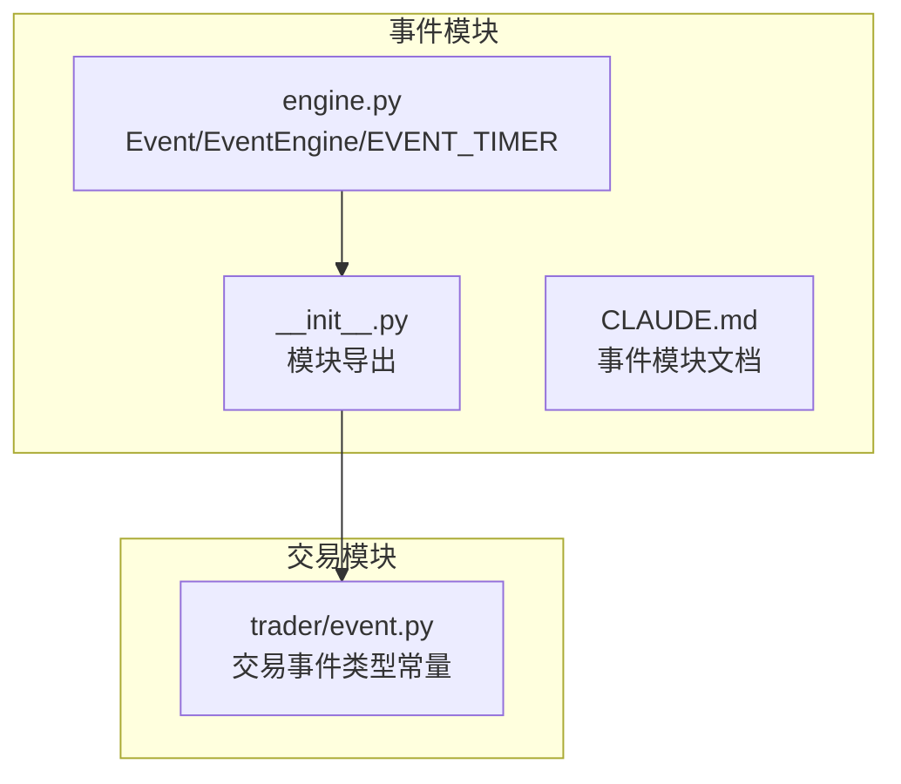
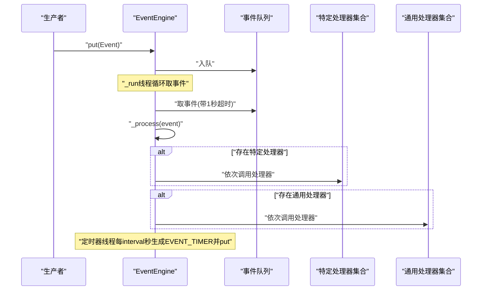
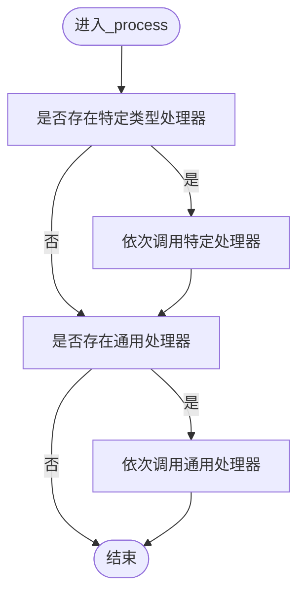
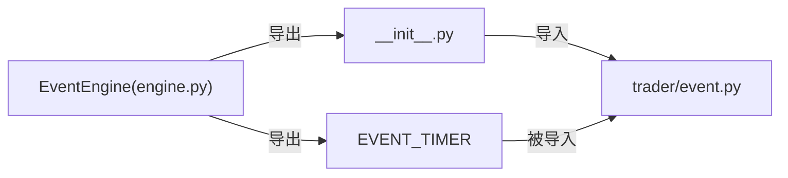

# 事件引擎

<cite>
**本文引用的文件列表**
- [vnpy/event/engine.py](file://vnpy/event/engine.py)
- [vnpy/event/__init__.py](file://vnpy/event/__init__.py)
- [vnpy/event/CLAUDE.md](file://vnpy/event/CLAUDE.md)
- [vnpy/trader/event.py](file://vnpy/trader/event.py)
</cite>

## 目录
1. [简介](#简介)
2. [项目结构](#项目结构)
3. [核心组件](#核心组件)
4. [架构总览](#架构总览)
5. [详细组件分析](#详细组件分析)
6. [依赖关系分析](#依赖关系分析)
7. [性能考量](#性能考量)
8. [故障排查指南](#故障排查指南)
9. [结论](#结论)
10. [附录](#附录)

## 简介
本文件围绕vnpy事件引擎（EventEngine）进行深度技术文档化，聚焦其作为系统通信中枢的设计与实现。内容涵盖：
- Event类的结构设计与type、data字段的语义
- EventEngine的多线程架构：主线程（_run）与定时器线程（_run_timer）协同机制
- 事件队列（Queue）的非阻塞处理模式与1秒超时设计的性能考量
- 事件注册（register/unregister）与通用处理器（register_general）的实现逻辑，以及defaultdict(list)的优势
- _put_（通过put）、_process_等核心方法的执行流程，事件分发到特定处理器与通用处理器的双重路径
- 开发者事件监听最佳实践：处理器函数定义规范、异常处理策略、线程安全注意事项
- EVENT_TIMER事件的生成频率可配置性及其在策略心跳、定时任务中的应用

## 项目结构
事件引擎位于vnpy/event子模块，核心文件如下：
- vnpy/event/engine.py：事件对象与事件引擎实现
- vnpy/event/__init__.py：模块导出
- vnpy/event/CLAUDE.md：事件模块文档
- vnpy/trader/event.py：交易相关事件类型常量（如EVENT_TICK、EVENT_ORDER等），其中EVENT_TIMER由事件引擎导出

图表来源
- [vnpy/event/engine.py](file://vnpy/event/engine.py#L1-L146)
- [vnpy/event/__init__.py](file://vnpy/event/__init__.py#L1-L9)
- [vnpy/event/CLAUDE.md](file://vnpy/event/CLAUDE.md#L67-L131)
- [vnpy/trader/event.py](file://vnpy/trader/event.py#L1-L15)

章节来源
- [vnpy/event/engine.py](file://vnpy/event/engine.py#L1-L146)
- [vnpy/event/__init__.py](file://vnpy/event/__init__.py#L1-L9)
- [vnpy/event/CLAUDE.md](file://vnpy/event/CLAUDE.md#L67-L131)
- [vnpy/trader/event.py](file://vnpy/trader/event.py#L1-L15)

## 核心组件
- Event：事件载体，包含type（事件类型字符串）与data（事件数据对象）
- EventEngine：事件引擎，负责事件入队、分发、定时器事件生成、处理器注册/注销与通用处理器注册/注销
- EVENT_TIMER：定时器事件类型标识符

章节来源
- [vnpy/event/engine.py](file://vnpy/event/engine.py#L13-L31)
- [vnpy/event/engine.py](file://vnpy/event/engine.py#L33-L146)
- [vnpy/event/__init__.py](file://vnpy/event/__init__.py#L1-L9)

## 架构总览
事件引擎采用“单线程事件循环 + 定时器线程”的双线程模型：
- 主线程（_run）：从阻塞队列中取出事件，调用_process进行分发
- 定时器线程（_run_timer）：按间隔睡眠后生成EVENT_TIMER事件并入队
- 分发策略：先按事件类型分发给已注册的特定处理器，再分发给通用处理器

图表来源
- [vnpy/event/engine.py](file://vnpy/event/engine.py#L55-L88)
- [vnpy/event/engine.py](file://vnpy/event/engine.py#L105-L146)

## 详细组件分析

### Event类结构设计
- 字段
  - type：事件类型字符串，用于事件引擎分发与匹配
  - data：事件数据对象，承载具体业务数据
- 设计要点
  - 类型与数据分离，便于统一分发与灵活扩展
  - data支持任意类型，满足不同业务场景

章节来源
- [vnpy/event/engine.py](file://vnpy/event/engine.py#L16-L31)

### EventEngine多线程架构与协同机制
- 线程模型
  - _thread：事件循环线程，持续从队列取事件并分发
  - _timer：定时器线程，按_interval睡眠后生成EVENT_TIMER事件并入队
- 协同机制
  - _active标志控制线程生命周期
  - start启动两个线程；stop停止并等待线程结束
- 队列行为
  - _run线程在取事件时设置1秒超时，避免长期阻塞，保证stop能及时响应

章节来源
- [vnpy/event/engine.py](file://vnpy/event/engine.py#L42-L54)
- [vnpy/event/engine.py](file://vnpy/event/engine.py#L55-L65)
- [vnpy/event/engine.py](file://vnpy/event/engine.py#L80-L88)
- [vnpy/event/engine.py](file://vnpy/event/engine.py#L89-L104)

### 事件队列的非阻塞处理模式与1秒超时设计
- 非阻塞处理
  - _run线程使用带超时的队列取事件，超时后继续循环，从而在无事件时也能响应停止信号
- 性能考量
  - 超时时间适中，兼顾响应性与CPU占用
  - 队列本身是线程安全的，put/get无需额外锁

章节来源
- [vnpy/event/engine.py](file://vnpy/event/engine.py#L55-L65)

### 注册与注销机制：register/unregister与register_general
- 特定类型处理器注册
  - 使用defaultdict(list)存储，键为事件类型，值为处理器列表
  - register确保同一处理器不重复注册
  - unregister移除处理器，并在列表为空时删除该类型键
- 通用处理器注册
  - register_general将处理器加入通用列表
  - unregister_general移除处理器
- 数据结构优势
  - defaultdict(list)避免显式初始化空列表，简化注册逻辑
  - 列表顺序即调用顺序，便于确定性处理

章节来源
- [vnpy/event/engine.py](file://vnpy/event/engine.py#L52-L53)
- [vnpy/event/engine.py](file://vnpy/event/engine.py#L111-L131)
- [vnpy/event/engine.py](file://vnpy/event/engine.py#L132-L146)

### 核心方法执行流程：_put_（通过put）、_process_与分发路径
- put
  - 将事件对象入队，供主线程消费
- _process
  - 先检查是否存在特定类型处理器，若有则依次调用
  - 再检查是否存在通用处理器，若有则依次调用
- 分发路径
  - 双重路径：特定处理器优先，随后通用处理器
  - 通用处理器对所有事件类型生效

图表来源
- [vnpy/event/engine.py](file://vnpy/event/engine.py#L66-L79)

章节来源
- [vnpy/event/engine.py](file://vnpy/event/engine.py#L105-L110)
- [vnpy/event/engine.py](file://vnpy/event/engine.py#L66-L79)

### EVENT_TIMER事件的生成频率与应用场景
- 生成频率
  - 由构造参数interval控制，默认1秒
  - 定时器线程按interval睡眠后生成EVENT_TIMER事件并入队
- 应用场景
  - 策略心跳：周期性触发策略逻辑
  - 定时任务：周期性执行统计、持久化等任务
- 事件类型
  - EVENT_TIMER由事件引擎导出，交易模块通过导入复用

章节来源
- [vnpy/event/engine.py](file://vnpy/event/engine.py#L42-L51)
- [vnpy/event/engine.py](file://vnpy/event/engine.py#L80-L88)
- [vnpy/event/__init__.py](file://vnpy/event/__init__.py#L1-L9)
- [vnpy/trader/event.py](file://vnpy/trader/event.py#L1-L15)

## 依赖关系分析
- 模块导出
  - 事件引擎导出Event、EventEngine、EVENT_TIMER
  - 交易模块导入EVENT_TIMER并定义其他交易事件类型
- 关系图

图表来源
- [vnpy/event/engine.py](file://vnpy/event/engine.py#L13-L31)
- [vnpy/event/__init__.py](file://vnpy/event/__init__.py#L1-L9)
- [vnpy/trader/event.py](file://vnpy/trader/event.py#L1-L15)

章节来源
- [vnpy/event/__init__.py](file://vnpy/event/__init__.py#L1-L9)
- [vnpy/trader/event.py](file://vnpy/trader/event.py#L1-L15)

## 性能考量
- 线程模型
  - 单线程事件循环避免复杂锁竞争，降低上下文切换开销
- 队列与超时
  - 队列操作为线程安全；1秒超时平衡响应性与CPU占用
- 处理器执行
  - 同步串行执行，简单可靠；若处理器耗时，建议将耗时任务异步化或委托至工作线程池

章节来源
- [vnpy/event/CLAUDE.md](file://vnpy/event/CLAUDE.md#L80-L104)

## 故障排查指南
- 事件未被处理
  - 检查是否正确注册了特定类型处理器或通用处理器
  - 确认事件类型字符串一致
- 处理器异常导致引擎停止
  - 当前实现中未捕获处理器内部异常，异常会中断当前处理链路
  - 建议在处理器内部自行捕获异常并记录日志，避免影响引擎
- 停止线程卡住
  - stop会等待两个线程join，若处理器阻塞可能导致停机延迟
  - 确保处理器尽快返回，必要时在处理器中支持可中断逻辑

章节来源
- [vnpy/event/engine.py](file://vnpy/event/engine.py#L66-L79)
- [vnpy/event/engine.py](file://vnpy/event/engine.py#L89-L104)
- [vnpy/event/CLAUDE.md](file://vnpy/event/CLAUDE.md#L80-L104)

## 结论
vnpy事件引擎以简洁的Event/EventEngine模型实现了高效的事件驱动架构。通过defaultdict(list)的处理器映射、线程安全的队列与1秒超时的取件策略，实现了低耦合、高内聚的系统通信中枢。开发者可通过特定类型处理器与通用处理器实现灵活的事件订阅与广播；通过EVENT_TIMER实现策略心跳与定时任务。建议在处理器中遵循轻量、可中断的原则，并在必要时引入异步化手段以提升整体吞吐。

## 附录
- 事件类型参考
  - 交易事件类型：EVENT_TICK、EVENT_TRADE、EVENT_ORDER、EVENT_POSITION、EVENT_ACCOUNT、EVENT_QUOTE、EVENT_CONTRACT、EVENT_LOG
  - 定时器事件：EVENT_TIMER（由事件引擎导出）

章节来源
- [vnpy/trader/event.py](file://vnpy/trader/event.py#L1-L15)
- [vnpy/event/__init__.py](file://vnpy/event/__init__.py#L1-L9)