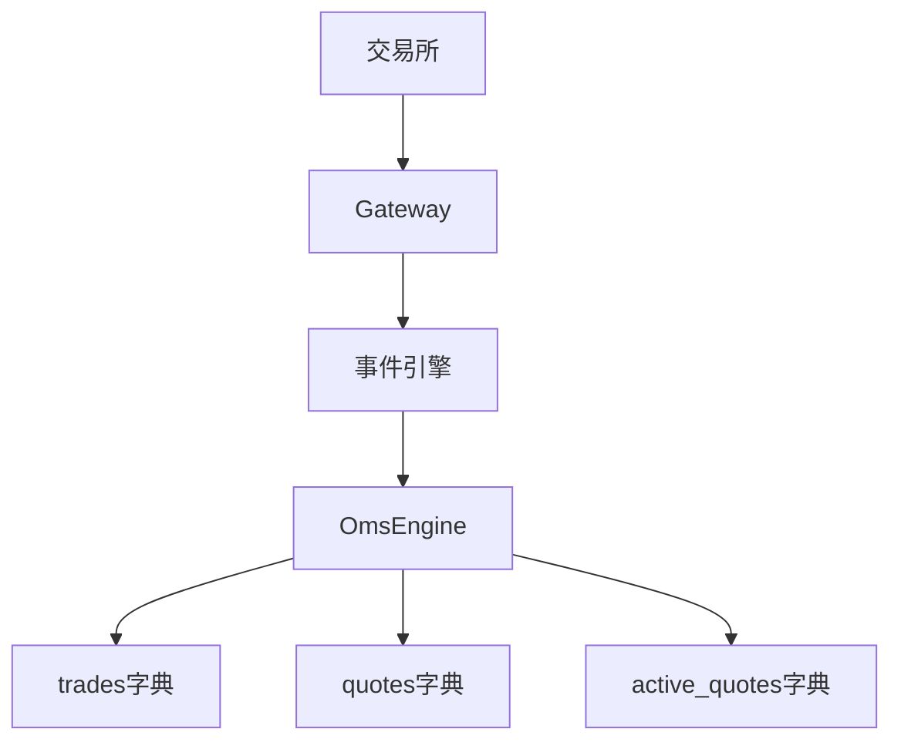
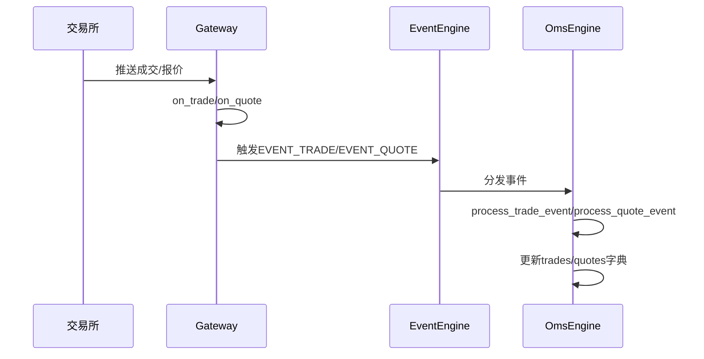
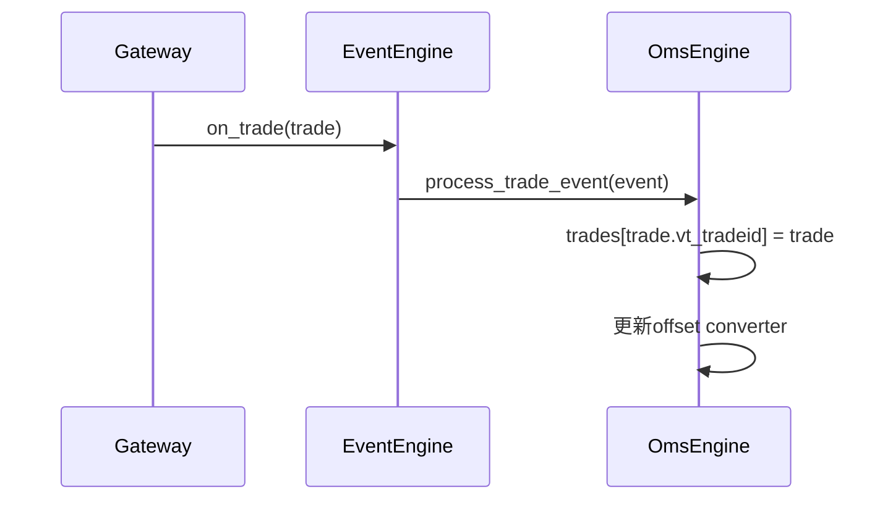
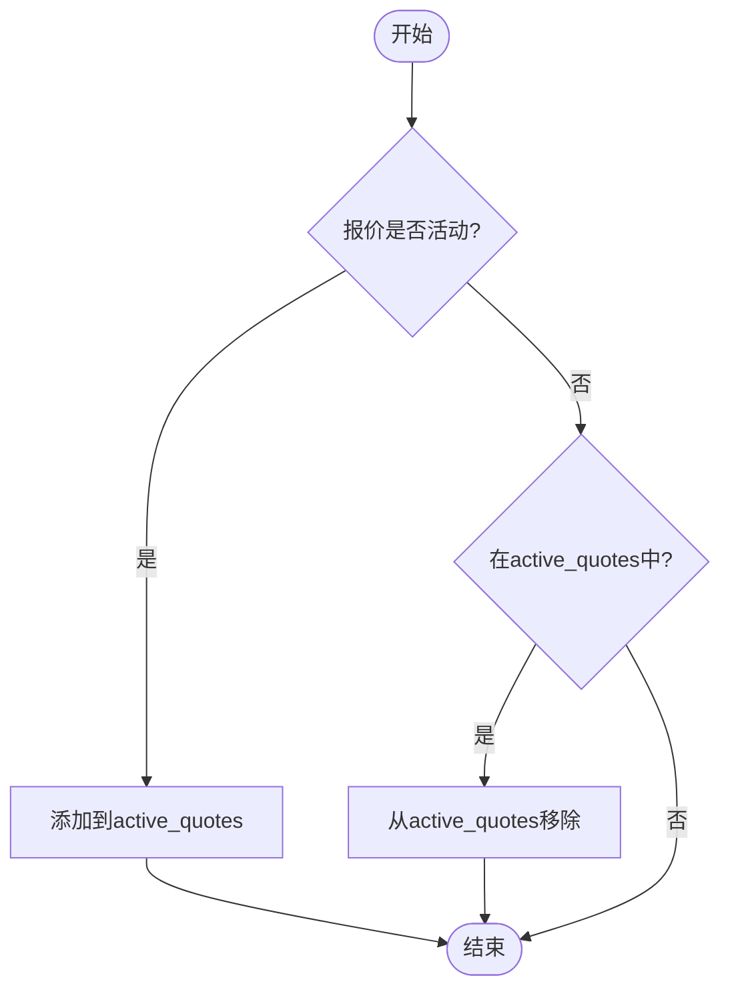
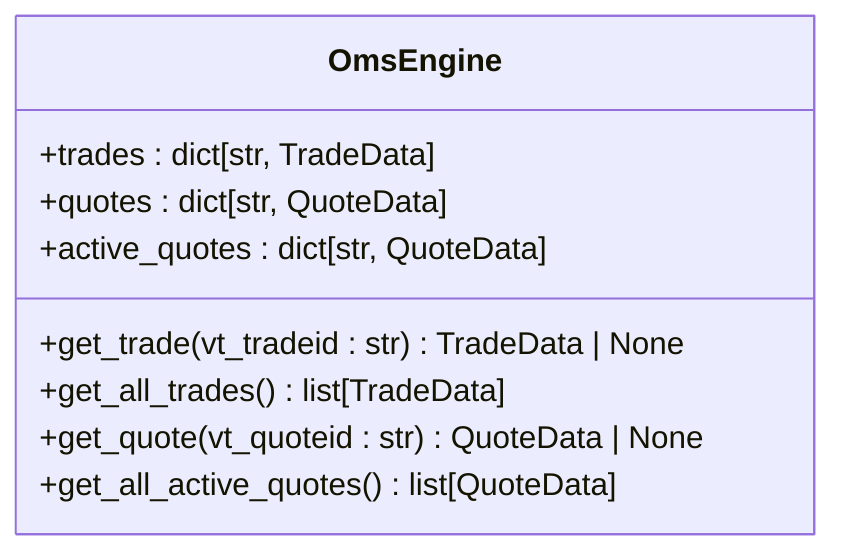
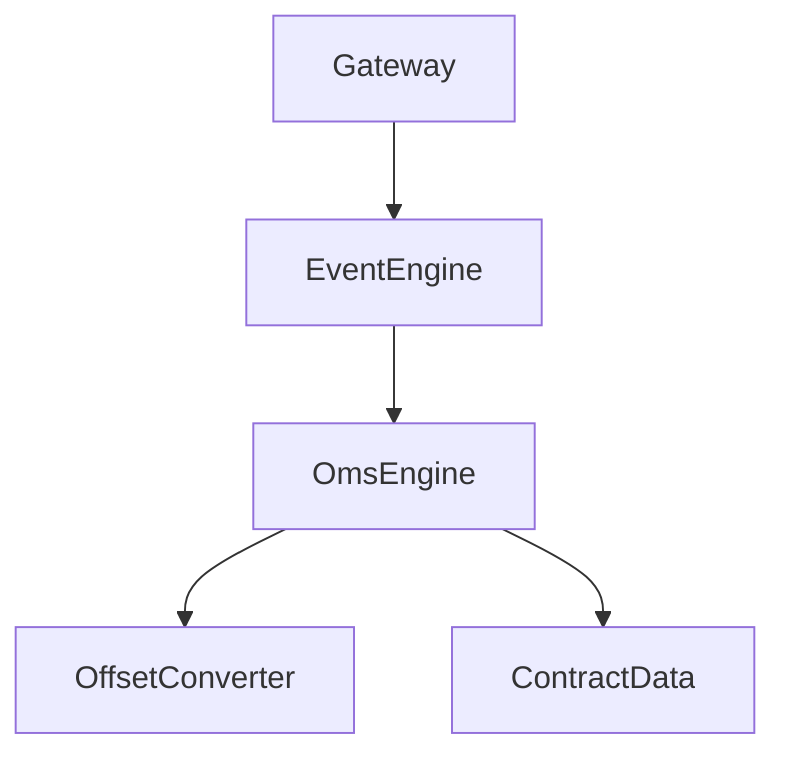

# 成交与报价数据流

<cite>
**本文档引用的文件**  
- [engine.py](file://vnpy/trader/engine.py)
- [object.py](file://vnpy/trader/object.py)
- [gateway.py](file://vnpy/trader/gateway.py)
- [event.py](file://vnpy/trader/event.py)
- [event.py](file://vnpy/event/engine.py)
</cite>

## 目录
1. [引言](#引言)
2. [项目结构](#项目结构)
3. [核心组件](#核心组件)
4. [架构概述](#架构概述)
5. [详细组件分析](#详细组件分析)
6. [依赖分析](#依赖分析)
7. [性能考虑](#性能考虑)
8. [故障排除指南](#故障排除指南)
9. [结论](#结论)

## 引言
本文档全面描述了vnpy框架中成交数据（TradeData）和报价数据（QuoteData）的处理流程。重点分析了从交易所推送成交到OmsEngine处理事件的完整数据流，以及报价数据的更新和管理机制。文档详细解释了OmsEngine中trades字典的设计目的，即完整记录所有历史成交，并阐述了get_trade、get_all_trades、get_quote和get_all_active_quotes等方法的实现逻辑。为开发者提供了成交和报价数据管理的最佳实践，包括如何正确处理成交回报、监控报价状态和应对重复成交的场景。

## 项目结构
vnpy项目的成交与报价数据流主要涉及trader模块中的核心组件。OmsEngine作为订单管理系统的核心，负责处理和存储成交与报价数据。数据流从交易所通过Gateway进入系统，经过事件引擎分发，最终由OmsEngine处理并存储。

**Diagram sources**
- [engine.py](file://vnpy/trader/engine.py#L348-L357)
- [gateway.py](file://vnpy/trader/gateway.py#L101-L107)

**Section sources**
- [engine.py](file://vnpy/trader/engine.py#L340-L634)
- [gateway.py](file://vnpy/trader/gateway.py#L33-L273)

## 核心组件
vnpy的成交与报价数据流由几个核心组件构成：OmsEngine负责数据的存储和管理，Gateway负责与交易所通信并推送数据，事件引擎负责在组件间传递数据。OmsEngine中的trades字典设计用于完整记录所有历史成交，而active_quotes字典则用于跟踪有效的报价单。

**Section sources**
- [engine.py](file://vnpy/trader/engine.py#L340-L634)
- [object.py](file://vnpy/trader/object.py#L153-L304)

## 架构概述
vnpy采用事件驱动架构处理成交与报价数据。当交易所推送成交或报价时，Gateway通过on_trade或on_quote方法触发相应事件，事件引擎将事件分发给注册的处理器，OmsEngine捕获这些事件并更新内部数据结构。

**Diagram sources**
- [gateway.py](file://vnpy/trader/gateway.py#L101-L107)
- [engine.py](file://vnpy/trader/engine.py#L395-L439)

## 详细组件分析

### 成交数据处理分析
成交数据从交易所推送，通过Gateway的on_trade方法触发EVENT_TRADE事件，最终被OmsEngine的process_trade_event方法捕获并存储到trades字典中。OmsEngine的trades字典设计目的是完整记录所有历史成交，确保数据的完整性和可追溯性。

**Diagram sources**
- [gateway.py](file://vnpy/trader/gateway.py#L101-L107)
- [engine.py](file://vnpy/trader/engine.py#L395-L403)

**Section sources**
- [engine.py](file://vnpy/trader/engine.py#L395-L403)
- [object.py](file://vnpy/trader/object.py#L153-L176)

### 报价数据处理分析
报价数据的更新机制包括管理active_quotes字典以跟踪有效的报价单。当报价处于活动状态时，将其添加到active_quotes字典中；当报价失效时，从active_quotes字典中移除。

**Diagram sources**
- [engine.py](file://vnpy/trader/engine.py#L429-L439)

**Section sources**
- [engine.py](file://vnpy/trader/engine.py#L429-L439)
- [object.py](file://vnpy/trader/object.py#L264-L294)

### 数据访问方法分析
OmsEngine提供了get_trade、get_all_trades、get_quote和get_all_active_quotes等方法来访问成交和报价数据。这些方法通过字典的get方法和values方法实现，提供了高效的数据访问接口。

**Diagram sources**
- [engine.py](file://vnpy/trader/engine.py#L453-L535)

**Section sources**
- [engine.py](file://vnpy/trader/engine.py#L453-L535)

## 依赖分析
成交与报价数据流涉及多个组件的依赖关系。OmsEngine依赖事件引擎来接收事件，Gateway依赖OmsEngine来处理成交和报价数据。这些依赖关系通过事件驱动架构解耦，确保了系统的灵活性和可扩展性。

**Diagram sources**
- [engine.py](file://vnpy/trader/engine.py#L361-L371)
- [gateway.py](file://vnpy/trader/gateway.py#L81-L85)

**Section sources**
- [engine.py](file://vnpy/trader/engine.py#L361-L371)
- [gateway.py](file://vnpy/trader/gateway.py#L81-L85)

## 性能考虑
OmsEngine使用字典数据结构存储成交和报价数据，提供了O(1)时间复杂度的数据访问性能。active_quotes字典的维护确保了对活动报价的高效查询。事件驱动架构避免了轮询开销，提高了系统的响应速度和效率。

## 故障排除指南
在处理成交与报价数据时，需要注意以下常见问题：重复成交的处理、报价状态的监控、事件处理的顺序等。开发者应确保正确处理成交回报，及时更新报价状态，并注意事件处理的原子性。

**Section sources**
- [engine.py](file://vnpy/trader/engine.py#L395-L439)
- [gateway.py](file://vnpy/trader/gateway.py#L101-L107)

## 结论
vnpy的成交与报价数据流设计合理，通过事件驱动架构实现了高效的交易数据处理。OmsEngine的trades字典完整记录了所有历史成交，active_quotes字典有效管理了活动报价。开发者应遵循最佳实践，正确处理成交回报，监控报价状态，确保交易系统的稳定运行。