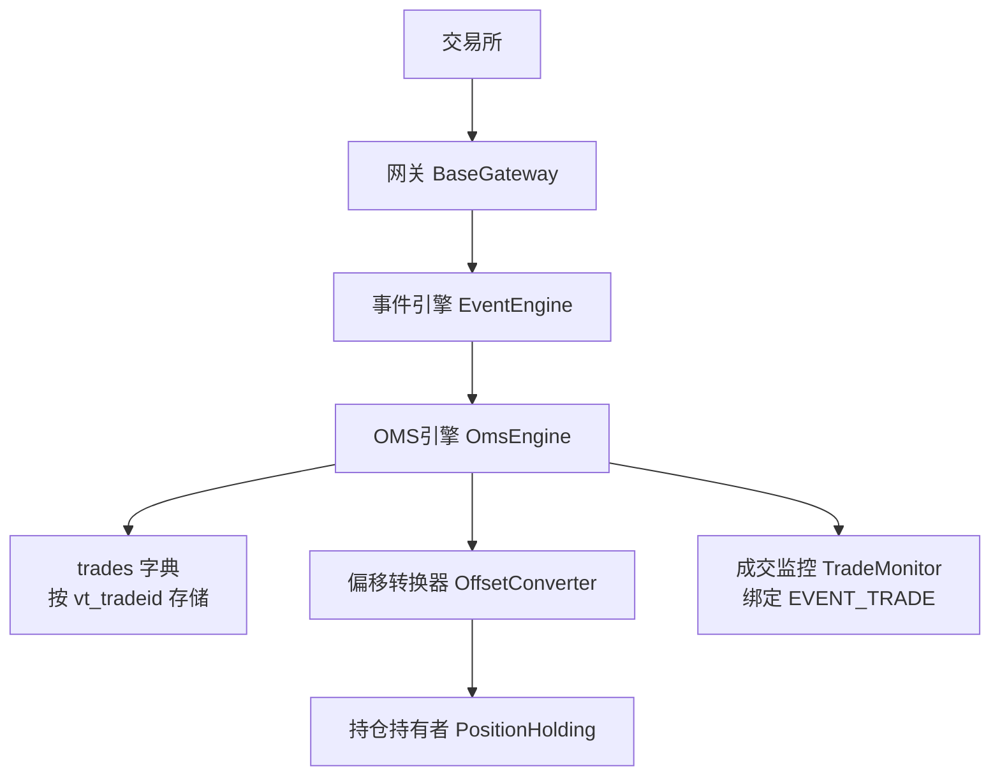
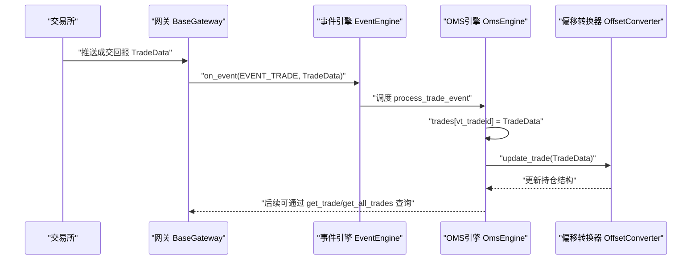
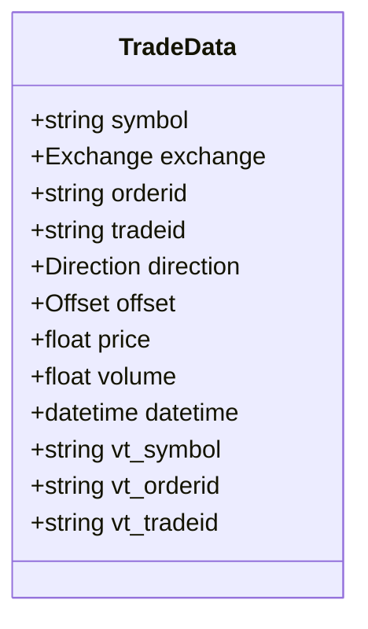
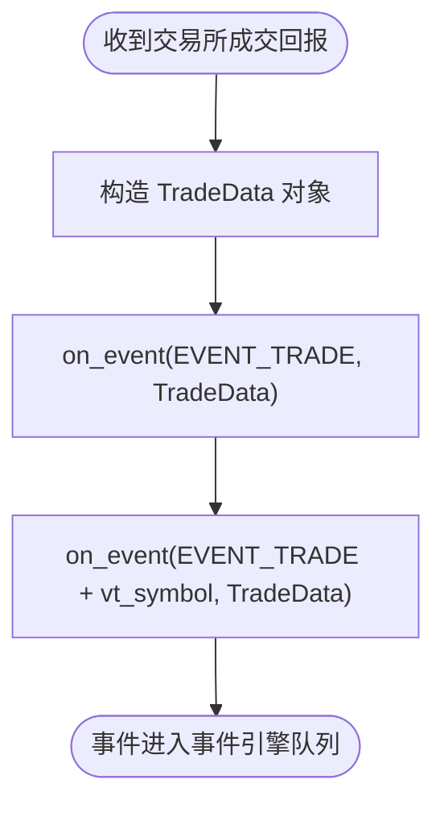
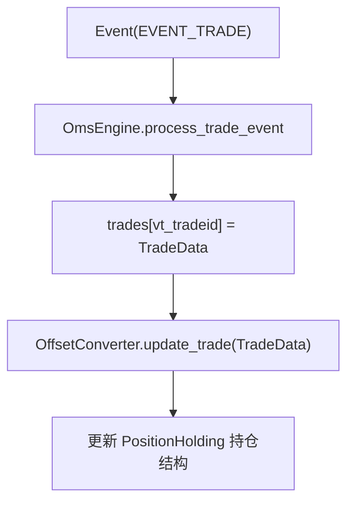
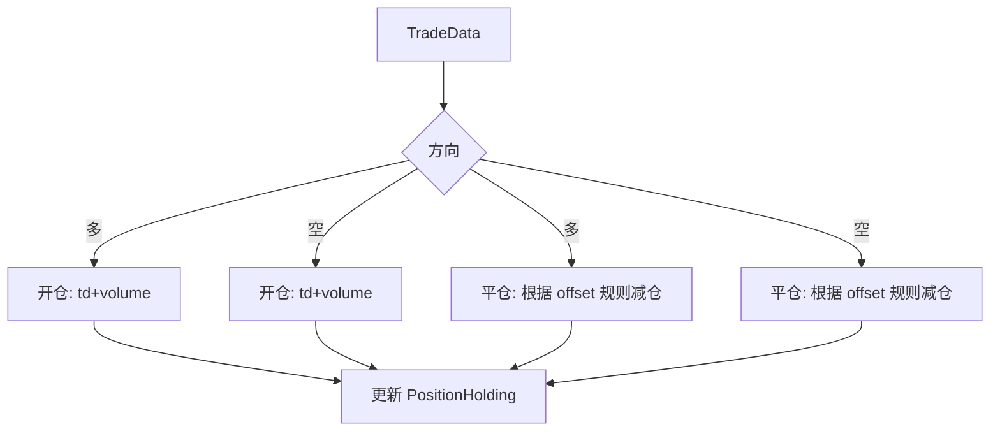
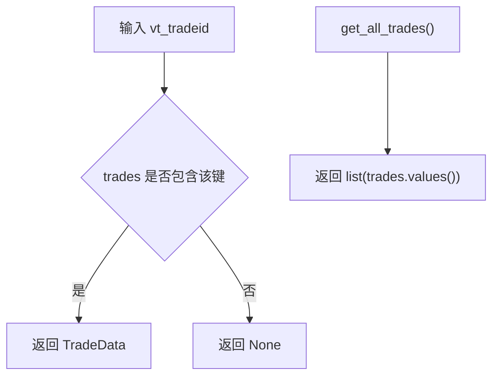
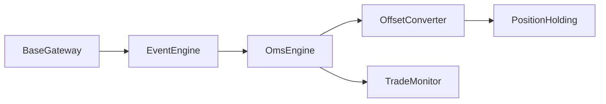

# 成交数据流

<cite>
**本文引用的文件**
- [vnpy/trader/object.py](file://vnpy/trader/object.py)
- [vnpy/trader/event.py](file://vnpy/trader/event.py)
- [vnpy/trader/gateway.py](file://vnpy/trader/gateway.py)
- [vnpy/trader/engine.py](file://vnpy/trader/engine.py)
- [vnpy/trader/converter.py](file://vnpy/trader/converter.py)
- [vnpy/trader/ui/widget.py](file://vnpy/trader/ui/widget.py)
</cite>

## 目录
1. [引言](#引言)
2. [项目结构](#项目结构)
3. [核心组件](#核心组件)
4. [架构总览](#架构总览)
5. [详细组件分析](#详细组件分析)
6. [依赖分析](#依赖分析)
7. [性能考量](#性能考量)
8. [故障排查指南](#故障排查指南)
9. [结论](#结论)
10. [附录](#附录)

## 引言
本文件围绕vnpy平台的成交数据流展开，系统梳理TradeData从交易所通过网关推送、经由事件引擎传递到OmsEngine的完整路径，重点阐释OmsEngine中trades字典作为中央存储的历史成交记录机制，并结合源码说明get_trade、get_all_trades等数据访问方法的实现逻辑，以及如何通过vt_tradeid进行成交数据的精确查询。同时给出开发者在处理成交回报、监控订单成交状态、应对重复成交场景以及基于成交数据进行策略分析的最佳实践。

## 项目结构
围绕成交数据流的关键文件组织如下：
- 数据模型与常量：TradeData、枚举类型等位于object.py；事件类型常量位于event.py
- 网关与事件：BaseGateway负责将交易所回报封装为TradeData并通过事件引擎推送
- 核心引擎：MainEngine持有EventEngine；OmsEngine注册并处理EVENT_TRADE，维护trades字典
- 偏移转换器：OffsetConverter基于TradeData更新持仓结构，支持开平仓与隔夜/今仓区分
- 可视化与监控：TradeMonitor绑定EVENT_TRADE，用于界面展示成交明细

图表来源
- [vnpy/trader/gateway.py](file://vnpy/trader/gateway.py#L93-L116)
- [vnpy/trader/event.py](file://vnpy/trader/event.py#L7-L14)
- [vnpy/trader/engine.py](file://vnpy/trader/engine.py#L339-L404)
- [vnpy/trader/converter.py](file://vnpy/trader/converter.py#L310-L344)
- [vnpy/trader/ui/widget.py](file://vnpy/trader/ui/widget.py#L450-L471)

章节来源
- [vnpy/trader/object.py](file://vnpy/trader/object.py#L154-L176)
- [vnpy/trader/event.py](file://vnpy/trader/event.py#L7-L14)
- [vnpy/trader/gateway.py](file://vnpy/trader/gateway.py#L93-L116)
- [vnpy/trader/engine.py](file://vnpy/trader/engine.py#L339-L404)
- [vnpy/trader/converter.py](file://vnpy/trader/converter.py#L310-L344)
- [vnpy/trader/ui/widget.py](file://vnpy/trader/ui/widget.py#L450-L471)

## 核心组件
- TradeData：成交数据载体，包含symbol、exchange、orderid、tradeid、方向、开平、价格、数量、时间等字段，并在构造时生成vt_symbol、vt_orderid、vt_tradeid
- BaseGateway.on_trade：将TradeData封装为事件并推送至事件引擎，同时推送按vt_symbol细分的事件
- OmsEngine.process_trade_event：接收EVENT_TRADE，将TradeData按vt_tradeid存入trades字典，并驱动OffsetConverter.update_trade
- OffsetConverter/PositionHolding：根据成交方向与开平仓属性更新多空仓及今昨仓，支持上期所/INE特殊规则
- 数据访问接口：get_trade按vt_tradeid查询单条成交；get_all_trades返回全部历史成交列表

章节来源
- [vnpy/trader/object.py](file://vnpy/trader/object.py#L154-L176)
- [vnpy/trader/gateway.py](file://vnpy/trader/gateway.py#L101-L108)
- [vnpy/trader/engine.py](file://vnpy/trader/engine.py#L395-L404)
- [vnpy/trader/converter.py](file://vnpy/trader/converter.py#L310-L344)
- [vnpy/trader/engine.py](file://vnpy/trader/engine.py#L495-L500)

## 架构总览
成交数据流的端到端时序如下：

图表来源
- [vnpy/trader/gateway.py](file://vnpy/trader/gateway.py#L101-L108)
- [vnpy/trader/event.py](file://vnpy/trader/event.py#L7-L14)
- [vnpy/trader/engine.py](file://vnpy/trader/engine.py#L395-L404)
- [vnpy/trader/converter.py](file://vnpy/trader/converter.py#L328-L336)

## 详细组件分析

### TradeData数据模型与标识体系
- 字段与派生标识：TradeData包含基础字段并在__post_init__中生成vt_symbol、vt_orderid、vt_tradeid，确保跨网关唯一性
- 关键用途：作为事件负载在网关与引擎间传递；作为trades字典的键值索引

图表来源
- [vnpy/trader/object.py](file://vnpy/trader/object.py#L154-L176)

章节来源
- [vnpy/trader/object.py](file://vnpy/trader/object.py#L154-L176)

### 网关推送与事件分发
- on_trade：将TradeData封装为事件并推送EVENT_TRADE；同时推送按vt_symbol细分的事件，便于按合约粒度订阅
- on_event：统一事件封装与投递入口，确保线程安全与非阻塞

图表来源
- [vnpy/trader/gateway.py](file://vnpy/trader/gateway.py#L93-L116)

章节来源
- [vnpy/trader/gateway.py](file://vnpy/trader/gateway.py#L93-L116)

### OMS引擎处理与trades字典设计
- 注册事件：OmsEngine在初始化时注册EVENT_TRADE处理器
- 处理流程：process_trade_event将TradeData按vt_tradeid写入trades字典，并驱动OffsetConverter.update_trade
- 设计目的：trades字典作为全局历史成交中心存储，提供按vt_tradeid的精确查询能力，支撑策略回测与实时分析

图表来源
- [vnpy/trader/engine.py](file://vnpy/trader/engine.py#L395-L404)
- [vnpy/trader/converter.py](file://vnpy/trader/converter.py#L328-L336)

章节来源
- [vnpy/trader/engine.py](file://vnpy/trader/engine.py#L395-L404)
- [vnpy/trader/converter.py](file://vnpy/trader/converter.py#L328-L336)

### 偏移转换器与持仓更新
- OffsetConverter.update_trade：根据成交方向与开平仓属性更新多空仓与今昨仓
- 特殊规则：上期所/INE采用“先平昨再平今”的逻辑，其他交易所优先平今
- PositionHolding：维护long_pos/short_pos及其昨今分仓，冻结量计算与校正

图表来源
- [vnpy/trader/converter.py](file://vnpy/trader/converter.py#L71-L111)
- [vnpy/trader/converter.py](file://vnpy/trader/converter.py#L328-L336)

章节来源
- [vnpy/trader/converter.py](file://vnpy/trader/converter.py#L71-L111)
- [vnpy/trader/converter.py](file://vnpy/trader/converter.py#L328-L336)

### 数据访问方法与vt_tradeid查询
- get_trade(vt_tradeid)：按成交唯一标识vt_tradeid精确查询单条成交
- get_all_trades()：返回全部历史成交列表，便于批量分析或导出
- 实现逻辑：trades字典为内存级KV存储，get_trade基于字典查找，get_all_trades直接返回values

图表来源
- [vnpy/trader/engine.py](file://vnpy/trader/engine.py#L495-L500)
- [vnpy/trader/engine.py](file://vnpy/trader/engine.py#L453-L458)

章节来源
- [vnpy/trader/engine.py](file://vnpy/trader/engine.py#L453-L458)
- [vnpy/trader/engine.py](file://vnpy/trader/engine.py#L495-L500)

### 界面监控与事件绑定
- TradeMonitor绑定EVENT_TRADE，按表头展示成交号、委托号、方向、开平、价格、数量、时间、接口等字段
- 支持排序与实时刷新，便于人工核对与调试

章节来源
- [vnpy/trader/ui/widget.py](file://vnpy/trader/ui/widget.py#L450-L471)

## 依赖分析
- 组件耦合
  - BaseGateway依赖EventEngine进行事件推送
  - OmsEngine依赖EventEngine进行事件注册与处理
  - OffsetConverter依赖OmsEngine的get_contract能力，按合约维度维护PositionHolding
- 关键依赖链
  - 网关 → 事件引擎 → OMS引擎 → 偏移转换器 → 持仓结构
- 外部集成点
  - 交易所回报经由网关回调on_trade进入事件系统
  - 策略与UI通过OmsEngine提供的查询接口访问成交数据

图表来源
- [vnpy/trader/gateway.py](file://vnpy/trader/gateway.py#L86-L116)
- [vnpy/trader/engine.py](file://vnpy/trader/engine.py#L339-L404)
- [vnpy/trader/converter.py](file://vnpy/trader/converter.py#L310-L344)
- [vnpy/trader/ui/widget.py](file://vnpy/trader/ui/widget.py#L450-L471)

章节来源
- [vnpy/trader/gateway.py](file://vnpy/trader/gateway.py#L86-L116)
- [vnpy/trader/engine.py](file://vnpy/trader/engine.py#L339-L404)
- [vnpy/trader/converter.py](file://vnpy/trader/converter.py#L310-L344)
- [vnpy/trader/ui/widget.py](file://vnpy/trader/ui/widget.py#L450-L471)

## 性能考量
- 内存占用：trades字典为全量历史成交存储，建议配合策略侧按需清理或分页查询
- 查询效率：字典查找为O(1)，get_all_trades为O(n)遍历，适合小规模回测；大规模分析建议落库或分片
- 并发安全：BaseGateway要求线程安全与非阻塞回调，避免在回调中执行耗时操作
- 事件吞吐：事件引擎为异步队列，合理拆分事件类型，避免热点事件造成积压

## 故障排查指南
- 重复成交
  - 现象：同一vt_tradeid重复入库导致数据异常
  - 排查：确认网关层是否对重复回报进行去重；检查OmsEngine是否覆盖写入
  - 建议：在网关层增加vt_tradeid去重缓存，或在process_trade_event前判断键是否存在
- 查询不到成交
  - 现象：get_trade返回None
  - 排查：确认vt_tradeid格式是否正确；确认EVENT_TRADE是否被注册；确认事件引擎是否正常运行
- 开平仓不一致
  - 现象：持仓与成交不匹配
  - 排查：检查OffsetConverter.update_trade逻辑；确认交易所特殊规则（上期所/INE）是否生效
- 界面不显示
  - 现象：TradeMonitor不刷新
  - 排查：确认EVENT_TRADE是否绑定；确认TradeMonitor的headers与字段一致

章节来源
- [vnpy/trader/engine.py](file://vnpy/trader/engine.py#L395-L404)
- [vnpy/trader/converter.py](file://vnpy/trader/converter.py#L328-L336)
- [vnpy/trader/ui/widget.py](file://vnpy/trader/ui/widget.py#L450-L471)

## 结论
vnpy的成交数据流以事件驱动为核心，通过BaseGateway将交易所回报封装为TradeData并推送EVENT_TRADE，OmsEngine将其按vt_tradeid集中存储于trades字典，从而为策略与UI提供统一、精确的成交数据访问能力。OffsetConverter进一步将成交转化为持仓结构，支持复杂的开平仓与隔夜/今仓管理。开发者应重视vt_tradeid的唯一性与去重策略，合理利用get_trade与get_all_trades进行成交查询与分析，并在界面层通过TradeMonitor进行可视化核对。

## 附录
- 最佳实践清单
  - 正确处理成交回报：确保网关层对重复回报进行去重，避免重复入库
  - 监控订单成交状态：结合get_all_active_orders与get_trade联动，跟踪委托与成交进展
  - 应对重复成交：在process_trade_event前检查键是否存在，必要时记录日志并跳过
  - 基于成交数据进行策略分析：使用get_all_trades导出数据，结合策略回测框架进行统计分析
  - 界面核对：通过TradeMonitor观察成交明细，及时发现异常