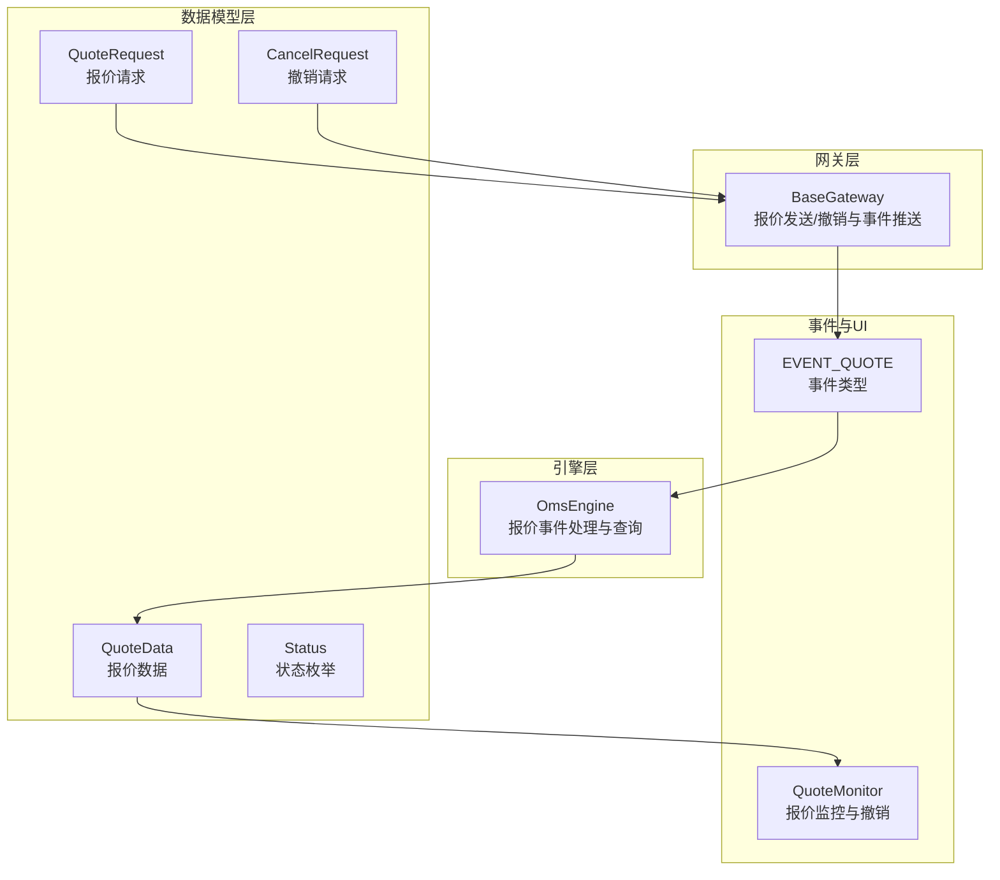
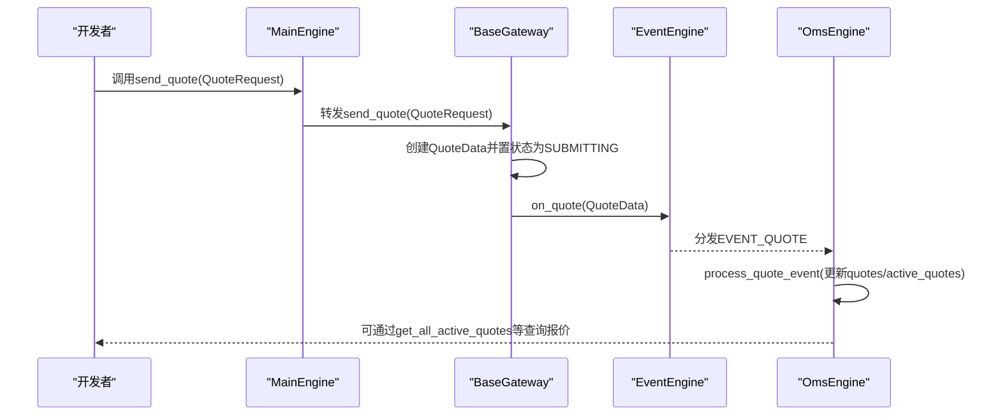
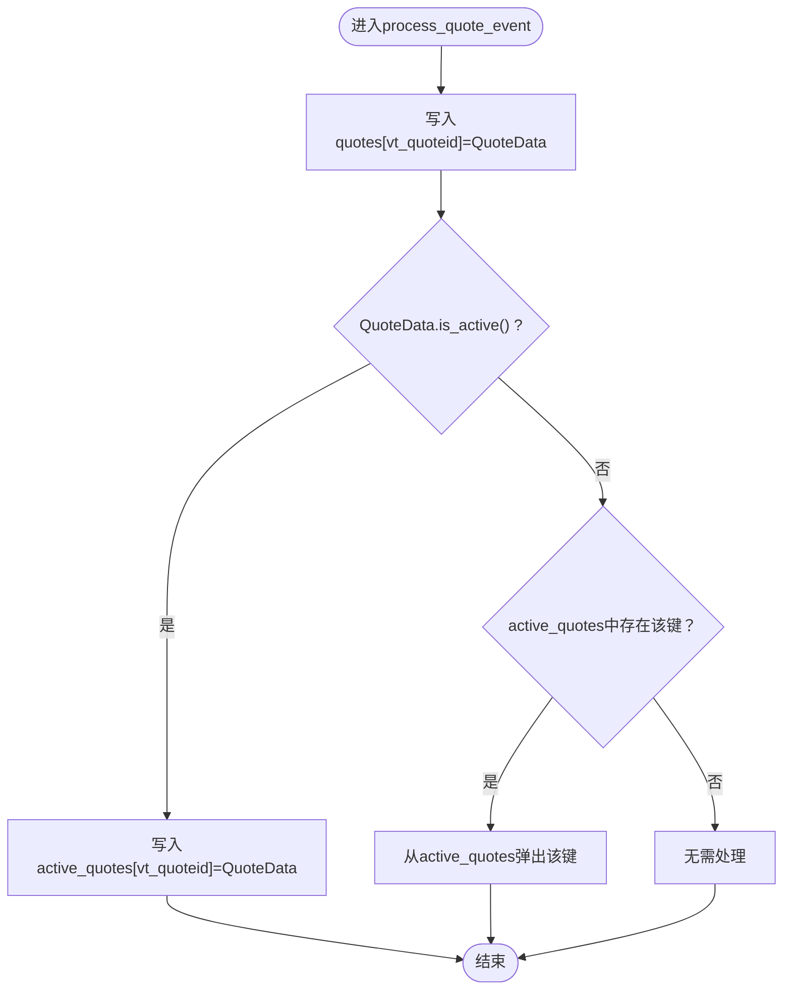
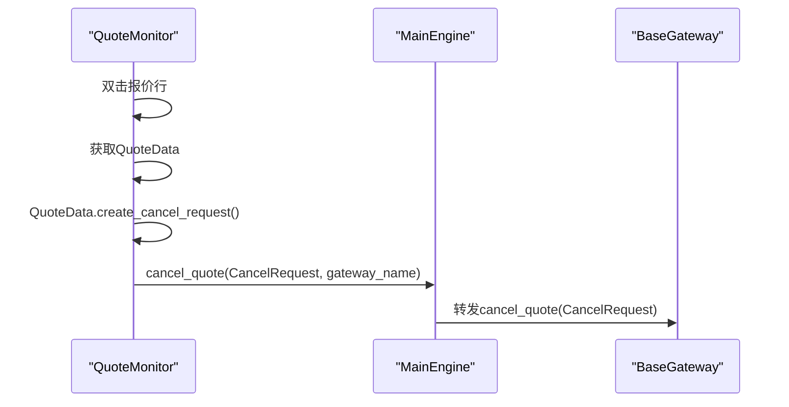
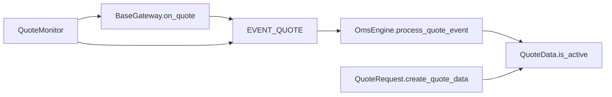

# 报价数据流

<cite>
**本文引用的文件**
- [engine.py](file://vnpy/trader/engine.py)
- [gateway.py](file://vnpy/trader/gateway.py)
- [object.py](file://vnpy/trader/object.py)
- [constant.py](file://vnpy/trader/constant.py)
- [event.py](file://vnpy/trader/event.py)
- [widget.py](file://vnpy/trader/ui/widget.py)
</cite>

## 目录
1. [简介](#简介)
2. [项目结构](#项目结构)
3. [核心组件](#核心组件)
4. [架构总览](#架构总览)
5. [详细组件分析](#详细组件分析)
6. [依赖关系分析](#依赖关系分析)
7. [性能考量](#性能考量)
8. [故障排查指南](#故障排查指南)
9. [结论](#结论)
10. [附录](#附录)

## 简介
本文件系统性梳理vnpy报价数据流（QuoteData）的生命周期管理机制，围绕以下关键目标展开：
- 解释QuoteData如何通过send_quote请求创建，经由网关处理后，通过on_quote方法触发EVENT_QUOTE事件，并由OmsEngine的process_quote_event方法进行状态管理的全过程。
- 深入阐述OmsEngine中quotes与active_quotes两个字典的设计目的：quotes用于持久化存储所有报价单的完整历史；active_quotes用于高效管理当前处于活跃状态的报价单。
- 结合源码说明get_quote、get_all_quotes、get_all_active_quotes等方法的实现逻辑，以及如何通过报价状态is_active来区分活跃与非活跃报价。
- 提供报价数据管理的最佳实践，包括如何正确发起双边报价、监控报价状态变化、处理报价成交或撤单以及基于报价数据进行做市策略开发的方法。

## 项目结构
与报价数据流直接相关的模块与文件如下：
- 引擎层：OmsEngine负责报价事件的接收、状态更新与查询接口暴露
- 网关层：BaseGateway定义报价发送与取消的规范，on_quote用于推送报价事件
- 数据模型层：QuoteData、QuoteRequest、CancelRequest等数据结构
- 常量与事件：Status枚举、EVENT_QUOTE事件类型
- UI层：QuoteMonitor用于展示报价并支持撤销操作

图表来源
- [engine.py](file://vnpy/trader/engine.py#L339-L567)
- [gateway.py](file://vnpy/trader/gateway.py#L133-L139)
- [object.py](file://vnpy/trader/object.py#L265-L304)
- [constant.py](file://vnpy/trader/constant.py#L30-L40)
- [event.py](file://vnpy/trader/event.py#L7-L14)
- [widget.py](file://vnpy/trader/ui/widget.py#L556-L597)

章节来源
- [engine.py](file://vnpy/trader/engine.py#L339-L567)
- [gateway.py](file://vnpy/trader/gateway.py#L133-L139)
- [object.py](file://vnpy/trader/object.py#L265-L304)
- [constant.py](file://vnpy/trader/constant.py#L30-L40)
- [event.py](file://vnpy/trader/event.py#L7-L14)
- [widget.py](file://vnpy/trader/ui/widget.py#L556-L597)

## 核心组件
- QuoteData：报价数据载体，包含买卖价格、买卖量、开平方向、状态、时间戳等字段，并提供is_active判断是否活跃。
- QuoteRequest：报价请求对象，用于向网关发起双边报价。
- CancelRequest：撤销请求对象，从QuoteData派生，便于直接撤销对应报价。
- OmsEngine：订单管理系统引擎，负责注册报价事件、维护quotes与active_quotes字典、提供查询接口。
- BaseGateway：抽象网关基类，定义send_quote/cancel_quote规范与on_quote事件推送。
- EVENT_QUOTE：报价事件类型常量。
- Status：报价状态枚举，ACTIVE_STATUSES集合用于判断报价是否活跃。

章节来源
- [object.py](file://vnpy/trader/object.py#L265-L304)
- [object.py](file://vnpy/trader/object.py#L391-L427)
- [engine.py](file://vnpy/trader/engine.py#L339-L567)
- [gateway.py](file://vnpy/trader/gateway.py#L133-L139)
- [constant.py](file://vnpy/trader/constant.py#L30-L40)
- [event.py](file://vnpy/trader/event.py#L7-L14)

## 架构总览
报价数据流的关键路径如下：
- 发起报价：调用MainEngine.send_quote，转发至具体网关的send_quote，网关内部创建QuoteData并设置初始状态为SUBMITTING，随后通过on_quote推送EVENT_QUOTE事件。
- 接收与更新：OmsEngine注册EVENT_QUOTE，process_quote_event将QuoteData写入quotes；若QuoteData.is_active()为真，则写入active_quotes；否则从active_quotes移除。
- 查询与监控：通过OmsEngine提供的get_quote/get_all_quotes/get_all_active_quotes获取报价；UI层的QuoteMonitor订阅EVENT_QUOTE并支持双击撤销。

图表来源
- [engine.py](file://vnpy/trader/engine.py#L255-L276)
- [gateway.py](file://vnpy/trader/gateway.py#L223-L239)
- [gateway.py](file://vnpy/trader/gateway.py#L133-L139)
- [engine.py](file://vnpy/trader/engine.py#L429-L440)

章节来源
- [engine.py](file://vnpy/trader/engine.py#L255-L276)
- [gateway.py](file://vnpy/trader/gateway.py#L223-L239)
- [gateway.py](file://vnpy/trader/gateway.py#L133-L139)
- [engine.py](file://vnpy/trader/engine.py#L429-L440)

## 详细组件分析

### QuoteData生命周期与状态管理
- 创建：网关在send_quote中根据QuoteRequest.create_quote_data生成QuoteData，并设置初始状态为SUBMITTING。
- 更新：网关收到报价回报后，更新QuoteData的状态（如NOTTRADED/PARTTRADED/CANCELLED/REJECTED），并通过on_quote推送EVENT_QUOTE。
- 存储：OmsEngine.process_quote_event将QuoteData写入quotes字典；若is_active()为真则写入active_quotes，否则从active_quotes移除。
- 查询：提供get_quote按vt_quoteid查询最新报价；get_all_quotes返回历史全集；get_all_active_quotes返回当前活跃报价列表。

图表来源
- [engine.py](file://vnpy/trader/engine.py#L429-L440)
- [object.py](file://vnpy/trader/object.py#L290-L295)

章节来源
- [object.py](file://vnpy/trader/object.py#L265-L304)
- [engine.py](file://vnpy/trader/engine.py#L429-L440)

### OmsEngine中quotes与active_quotes的设计目的
- quotes：以vt_quoteid为键，持久化存储所有报价单的历史版本，便于回溯与审计。
- active_quotes：以vt_quoteid为键，仅保存当前仍处于活跃状态的报价单，便于快速筛选与实时监控，避免遍历全量历史带来的性能开销。

章节来源
- [engine.py](file://vnpy/trader/engine.py#L348-L358)
- [engine.py](file://vnpy/trader/engine.py#L429-L440)

### QuoteRequest与CancelRequest
- QuoteRequest：封装双边报价的买卖价格、买卖量、开平方向与参考信息，提供create_quote_data工厂方法生成QuoteData。
- CancelRequest：从QuoteData派生create_cancel_request，便于直接撤销对应报价。

章节来源
- [object.py](file://vnpy/trader/object.py#L391-L427)
- [object.py](file://vnpy/trader/object.py#L296-L303)

### 状态集合与活跃判断
- ACTIVE_STATUSES：包含SUBMITTING、NOTTRADED、PARTTRADED三类状态，is_active()据此判断报价是否仍处于可交易阶段。
- Status枚举：定义报价状态（SUBMITTING、NOTTRADED、PARTTRADED、ALLTRADED、CANCELLED、REJECTED）。

章节来源
- [object.py](file://vnpy/trader/object.py#L14-L14)
- [object.py](file://vnpy/trader/object.py#L290-L295)
- [constant.py](file://vnpy/trader/constant.py#L30-L40)

### UI层交互与撤销流程
- QuoteMonitor订阅EVENT_QUOTE，展示报价并支持双击撤销。
- 双击时从选中行获取QuoteData，调用QuoteData.create_cancel_request生成CancelRequest，再通过MainEngine.cancel_quote发送至网关。

图表来源
- [widget.py](file://vnpy/trader/ui/widget.py#L556-L597)
- [engine.py](file://vnpy/trader/engine.py#L267-L276)
- [gateway.py](file://vnpy/trader/gateway.py#L240-L246)

章节来源
- [widget.py](file://vnpy/trader/ui/widget.py#L556-L597)
- [engine.py](file://vnpy/trader/engine.py#L267-L276)
- [gateway.py](file://vnpy/trader/gateway.py#L240-L246)

## 依赖关系分析
- OmsEngine依赖EventEngine注册与分发EVENT_QUOTE事件。
- BaseGateway通过on_quote推送QuoteData到EventEngine，再由OmsEngine统一处理。
- QuoteData依赖Status枚举与ACTIVE_STATUSES集合进行活跃状态判断。
- UI层依赖EVENT_QUOTE与QuoteData的vt_quoteid进行展示与撤销。

图表来源
- [event.py](file://vnpy/trader/event.py#L7-L14)
- [gateway.py](file://vnpy/trader/gateway.py#L133-L139)
- [engine.py](file://vnpy/trader/engine.py#L429-L440)
- [object.py](file://vnpy/trader/object.py#L290-L295)
- [object.py](file://vnpy/trader/object.py#L391-L427)
- [widget.py](file://vnpy/trader/ui/widget.py#L556-L597)

章节来源
- [event.py](file://vnpy/trader/event.py#L7-L14)
- [gateway.py](file://vnpy/trader/gateway.py#L133-L139)
- [engine.py](file://vnpy/trader/engine.py#L429-L440)
- [object.py](file://vnpy/trader/object.py#L290-L295)
- [object.py](file://vnpy/trader/object.py#L391-L427)
- [widget.py](file://vnpy/trader/ui/widget.py#L556-L597)

## 性能考量
- active_quotes采用字典结构，按vt_quoteid索引，查询与更新均为平均O(1)，适合高频筛选活跃报价。
- quotes作为完整历史存储，键为vt_quoteid，便于按报价唯一标识检索任意历史版本。
- 若需批量筛选活跃报价，建议优先使用get_all_active_quotes，避免对全量历史进行is_active过滤。

[本节为通用性能讨论，不直接分析具体文件]

## 故障排查指南
- 报价未显示或未更新
  - 检查网关是否正确调用on_quote推送EVENT_QUOTE。
  - 确认OmsEngine是否注册了EVENT_QUOTE事件。
  - 使用get_all_active_quotes确认报价是否被写入active_quotes。
- 撤销无效
  - 确认CancelRequest的参数（quoteid、symbol、exchange）与QuoteData一致。
  - 检查网关cancel_quote实现是否正确转发至服务器。
- 状态异常
  - 检查Status是否符合预期（SUBMITTING/NOTTRADED/PARTTRADED），确保ACTIVE_STATUSES集合与is_active判断一致。

章节来源
- [gateway.py](file://vnpy/trader/gateway.py#L133-L139)
- [engine.py](file://vnpy/trader/engine.py#L363-L371)
- [engine.py](file://vnpy/trader/engine.py#L519-L535)
- [object.py](file://vnpy/trader/object.py#L290-L295)

## 结论
vnpy的报价数据流通过清晰的职责划分与事件驱动机制实现了报价的全生命周期管理：
- 网关负责报价请求的发起与回报推送；
- OmsEngine负责事件接收、状态更新与查询接口；
- UI层提供可视化与交互能力；
- quotes与active_quotes分别承担历史存档与活跃筛选的职责，兼顾完整性与效率。

开发者应遵循以下最佳实践：
- 正确发起双边报价：使用QuoteRequest构造报价请求，确保买卖价格与量级合理。
- 监控报价状态变化：订阅EVENT_QUOTE或使用get_all_active_quotes定期轮询。
- 处理报价成交/撤单：通过CancelRequest撤销报价，或等待网关回报更新状态。
- 基于报价数据做市：利用active_quotes进行实时风控与重平衡，利用quotes进行事后复盘与统计分析。

[本节为总结性内容，不直接分析具体文件]

## 附录
- 关键API与路径
  - 发送报价：MainEngine.send_quote → BaseGateway.send_quote
    - [engine.py](file://vnpy/trader/engine.py#L255-L276)
    - [gateway.py](file://vnpy/trader/gateway.py#L223-L239)
  - 推送报价事件：BaseGateway.on_quote
    - [gateway.py](file://vnpy/trader/gateway.py#L133-L139)
  - 处理报价事件：OmsEngine.process_quote_event
    - [engine.py](file://vnpy/trader/engine.py#L429-L440)
  - 查询报价：OmsEngine.get_quote/get_all_quotes/get_all_active_quotes
    - [engine.py](file://vnpy/trader/engine.py#L477-L481)
    - [engine.py](file://vnpy/trader/engine.py#L519-L535)
  - 撤销报价：MainEngine.cancel_quote → BaseGateway.cancel_quote
    - [engine.py](file://vnpy/trader/engine.py#L267-L276)
    - [gateway.py](file://vnpy/trader/gateway.py#L240-L246)
  - UI撤销：QuoteMonitor双击触发cancel_quote
    - [widget.py](file://vnpy/trader/ui/widget.py#L556-L597)