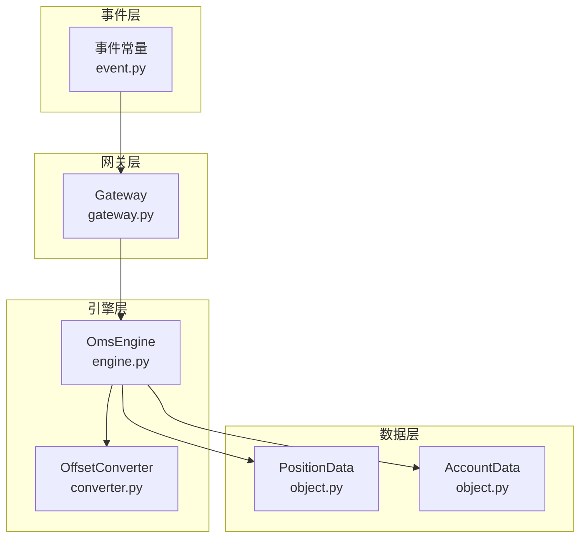
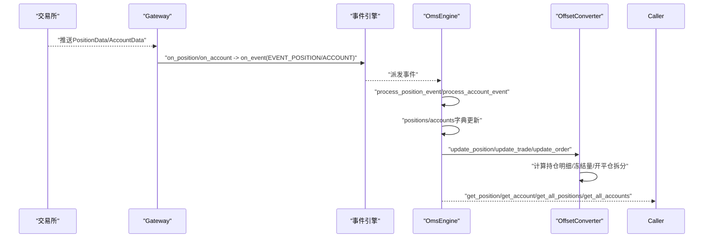
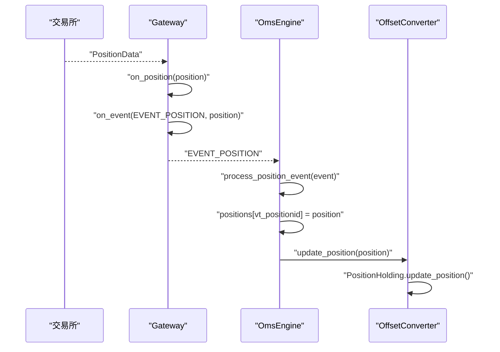
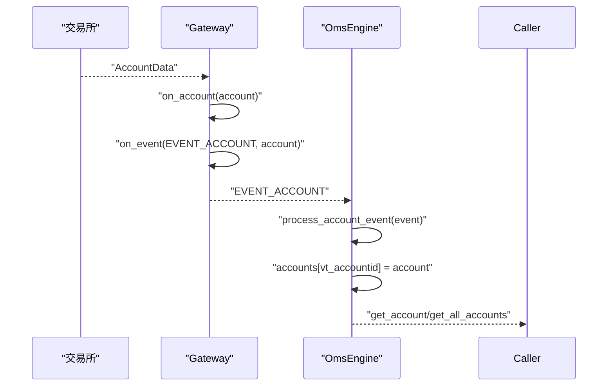
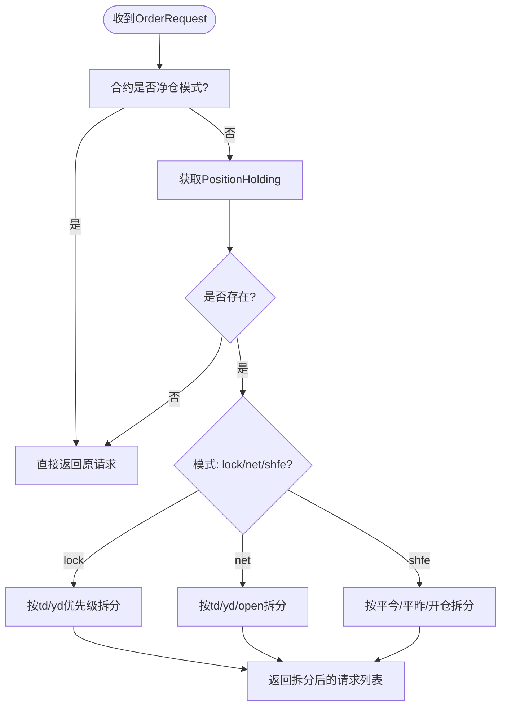
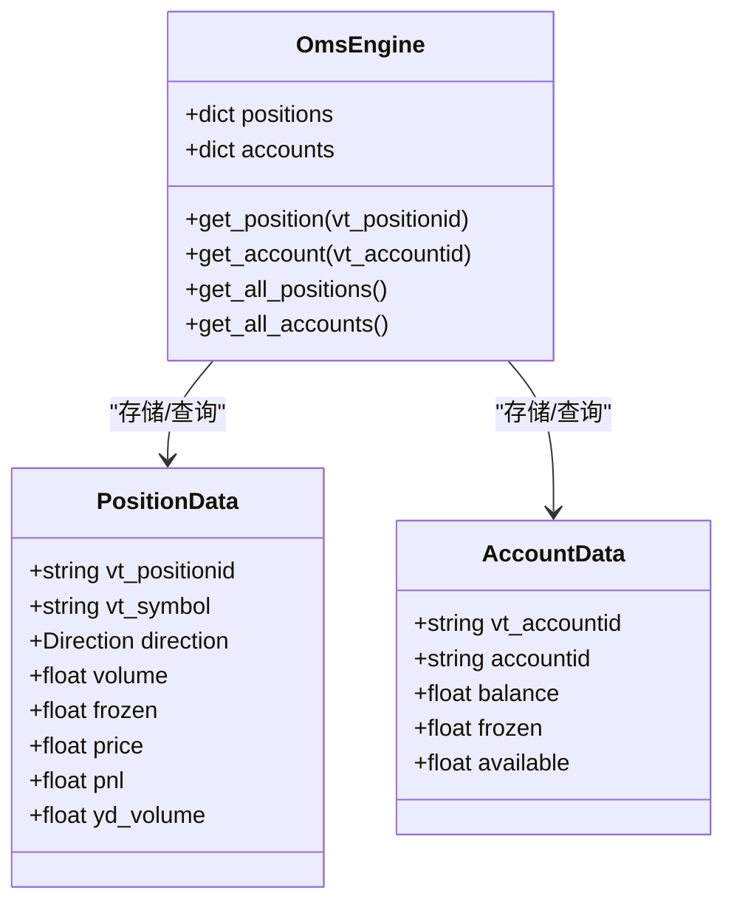
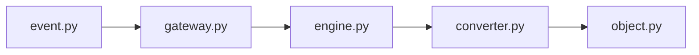

# 持仓与账户数据流

<cite>
**本文引用的文件**
- [vnpy/trader/event.py](file://vnpy/trader/event.py)
- [vnpy/trader/gateway.py](file://vnpy/trader/gateway.py)
- [vnpy/trader/engine.py](file://vnpy/trader/engine.py)
- [vnpy/trader/converter.py](file://vnpy/trader/converter.py)
- [vnpy/trader/object.py](file://vnpy/trader/object.py)
- [vnpy/trader/ui/widget.py](file://vnpy/trader/ui/widget.py)
</cite>

## 目录
1. [引言](#引言)
2. [项目结构](#项目结构)
3. [核心组件](#核心组件)
4. [架构总览](#架构总览)
5. [详细组件分析](#详细组件分析)
6. [依赖关系分析](#依赖关系分析)
7. [性能考量](#性能考量)
8. [故障排查指南](#故障排查指南)
9. [结论](#结论)
10. [附录](#附录)

## 引言
本文件围绕vnpy的持仓(PositionData)与账户(AccountData)数据流展开，系统性解析事件驱动下的数据同步机制：从交易所推送的PositionData经由网关回调on_position触发EVENT_POSITION事件，再到OmsEngine的process_position_event捕获并存储至positions字典，同时联动OffsetConverter动态维护持仓明细与冻结量；AccountData的更新路径类似，由EVENT_ACCOUNT事件驱动并存储至accounts字典。文档还深入剖析OffsetConverter如何基于成交与订单事件计算开平仓逻辑，以及get_position/get_all_positions/get_account/get_all_accounts等方法的实现与最佳实践。

## 项目结构
围绕持仓与账户数据流的关键模块分布如下：
- 事件常量定义：事件类型字符串集中于event.py
- 网关回调：Gateway负责将PositionData/AccountData封装为事件并投递
- 订单管理引擎：OmsEngine注册并处理各类事件，维护内存缓存与对外查询接口
- 开平仓转换器：OffsetConverter基于合约属性与成交/订单事件动态计算持仓与冻结
- 数据模型：PositionData/AccountData等基础数据结构定义

图表来源
- [vnpy/trader/event.py](file://vnpy/trader/event.py#L1-L14)
- [vnpy/trader/gateway.py](file://vnpy/trader/gateway.py#L117-L131)
- [vnpy/trader/engine.py](file://vnpy/trader/engine.py#L361-L423)
- [vnpy/trader/converter.py](file://vnpy/trader/converter.py#L310-L403)
- [vnpy/trader/object.py](file://vnpy/trader/object.py#L178-L216)

章节来源
- [vnpy/trader/event.py](file://vnpy/trader/event.py#L1-L14)
- [vnpy/trader/gateway.py](file://vnpy/trader/gateway.py#L117-L131)
- [vnpy/trader/engine.py](file://vnpy/trader/engine.py#L361-L423)
- [vnpy/trader/converter.py](file://vnpy/trader/converter.py#L310-L403)
- [vnpy/trader/object.py](file://vnpy/trader/object.py#L178-L216)

## 核心组件
- 事件常量：定义EVENT_POSITION、EVENT_ACCOUNT等事件类型，作为跨模块通信契约
- Gateway回调：on_position/on_account将数据封装为事件并投递到事件引擎
- OmsEngine：注册事件处理器，接收并存储PositionData/AccountData，同时初始化OffsetConverter
- OffsetConverter：按合约属性与成交/订单事件动态计算持仓明细、冻结量与开平仓拆分
- 数据模型：PositionData/AccountData提供统一的vt_*键值，便于事件与查询

章节来源
- [vnpy/trader/event.py](file://vnpy/trader/event.py#L1-L14)
- [vnpy/trader/gateway.py](file://vnpy/trader/gateway.py#L117-L131)
- [vnpy/trader/engine.py](file://vnpy/trader/engine.py#L361-L423)
- [vnpy/trader/converter.py](file://vnpy/trader/converter.py#L310-L403)
- [vnpy/trader/object.py](file://vnpy/trader/object.py#L178-L216)

## 架构总览
下图展示PositionData与AccountData从交易所到应用层的完整数据流，强调事件驱动与引擎处理的关键节点。

图表来源
- [vnpy/trader/gateway.py](file://vnpy/trader/gateway.py#L117-L131)
- [vnpy/trader/engine.py](file://vnpy/trader/engine.py#L361-L423)
- [vnpy/trader/converter.py](file://vnpy/trader/converter.py#L310-L403)

## 详细组件分析

### PositionData事件驱动流程
- 交易所推送PositionData后，Gateway调用on_position将其封装为EVENT_POSITION事件并投递
- OmsEngine注册EVENT_POSITION处理器process_position_event，将PositionData按vt_positionid写入内存缓存，并触发OffsetConverter.update_position
- OffsetConverter根据合约属性与成交/订单事件，维护PositionHolding中的多空头寸、当日/昨日本金与冻结量

图表来源
- [vnpy/trader/gateway.py](file://vnpy/trader/gateway.py#L117-L131)
- [vnpy/trader/engine.py](file://vnpy/trader/engine.py#L405-L414)
- [vnpy/trader/converter.py](file://vnpy/trader/converter.py#L319-L327)

章节来源
- [vnpy/trader/gateway.py](file://vnpy/trader/gateway.py#L117-L131)
- [vnpy/trader/engine.py](file://vnpy/trader/engine.py#L405-L414)
- [vnpy/trader/converter.py](file://vnpy/trader/converter.py#L319-L327)

### AccountData事件驱动流程
- 交易所推送AccountData后，Gateway调用on_account将其封装为EVENT_ACCOUNT事件并投递
- OmsEngine注册EVENT_ACCOUNT处理器process_account_event，将AccountData按vt_accountid写入内存缓存
- 外部可通过get_account/get_all_accounts查询账户余额、冻结与可用资金

图表来源
- [vnpy/trader/gateway.py](file://vnpy/trader/gateway.py#L125-L131)
- [vnpy/trader/engine.py](file://vnpy/trader/engine.py#L415-L419)

章节来源
- [vnpy/trader/gateway.py](file://vnpy/trader/gateway.py#L125-L131)
- [vnpy/trader/engine.py](file://vnpy/trader/engine.py#L415-L419)

### OffsetConverter：开平仓逻辑与动态计算
OffsetConverter依据合约属性与成交/订单事件，维护PositionHolding中的多空头寸、当日/昨日本金与冻结量，并提供开平仓拆分策略：
- 合约属性判断：当net_position为True时无需转换；否则按不同交易所规则拆分
- 成交事件：根据offset与exchange区分开仓/平今/平昨，更新td/yd头寸并校正负值
- 订单事件：统计活跃委托，计算冻结量，确保冻结不超过可用头寸
- 请求转换：convert_order_request根据lock/net/shfe规则拆分为多个OrderRequest

图表来源
- [vnpy/trader/converter.py](file://vnpy/trader/converter.py#L367-L389)
- [vnpy/trader/converter.py](file://vnpy/trader/converter.py#L202-L241)
- [vnpy/trader/converter.py](file://vnpy/trader/converter.py#L242-L308)
- [vnpy/trader/converter.py](file://vnpy/trader/converter.py#L168-L201)

章节来源
- [vnpy/trader/converter.py](file://vnpy/trader/converter.py#L367-L389)
- [vnpy/trader/converter.py](file://vnpy/trader/converter.py#L202-L241)
- [vnpy/trader/converter.py](file://vnpy/trader/converter.py#L242-L308)
- [vnpy/trader/converter.py](file://vnpy/trader/converter.py#L168-L201)

### 数据模型与查询接口
- PositionData/AccountData：提供vt_positionid/vt_accountid等键，便于事件与查询
- OmsEngine查询接口：get_position/get_account/get_all_positions/get_all_accounts等，均基于内存缓存返回最新数据

图表来源
- [vnpy/trader/object.py](file://vnpy/trader/object.py#L178-L216)
- [vnpy/trader/engine.py](file://vnpy/trader/engine.py#L459-L511)

章节来源
- [vnpy/trader/object.py](file://vnpy/trader/object.py#L178-L216)
- [vnpy/trader/engine.py](file://vnpy/trader/engine.py#L459-L511)

## 依赖关系分析
- 事件类型依赖：EVENT_POSITION/EVENT_ACCOUNT来自event.py
- 网关依赖：Gateway通过on_event将PositionData/AccountData封装为事件
- 引擎依赖：OmsEngine注册事件处理器并维护内存缓存
- 转换器依赖：OffsetConverter依赖合约信息与成交/订单事件进行计算

图表来源
- [vnpy/trader/event.py](file://vnpy/trader/event.py#L1-L14)
- [vnpy/trader/gateway.py](file://vnpy/trader/gateway.py#L117-L131)
- [vnpy/trader/engine.py](file://vnpy/trader/engine.py#L361-L423)
- [vnpy/trader/converter.py](file://vnpy/trader/converter.py#L310-L403)
- [vnpy/trader/object.py](file://vnpy/trader/object.py#L178-L216)

章节来源
- [vnpy/trader/event.py](file://vnpy/trader/event.py#L1-L14)
- [vnpy/trader/gateway.py](file://vnpy/trader/gateway.py#L117-L131)
- [vnpy/trader/engine.py](file://vnpy/trader/engine.py#L361-L423)
- [vnpy/trader/converter.py](file://vnpy/trader/converter.py#L310-L403)
- [vnpy/trader/object.py](file://vnpy/trader/object.py#L178-L216)

## 性能考量
- 内存缓存：OmsEngine以字典形式缓存PositionData/AccountData，查询复杂度为O(1)，适合高频访问
- 事件驱动：通过事件引擎解耦上游推送与下游处理，避免阻塞
- 计算粒度：OffsetConverter仅在需要转换的合约上维护PositionHolding，减少无效计算
- 批量查询：get_all_positions/get_all_accounts返回全部缓存，适合一次性展示或统计

[本节为通用建议，不直接分析具体文件]

## 故障排查指南
- 数据不一致
  - 现象：get_position/get_account与实际账户/持仓不符
  - 排查：确认EVENT_POSITION/EVENT_ACCOUNT是否被正确注册与处理；检查process_position_event/process_account_event是否执行
  - 参考路径：[事件注册与处理](file://vnpy/trader/engine.py#L361-L423)
- 订单/成交未生效
  - 现象：冻结量异常或可平量不足
  - 排查：确认on_order/on_trade是否触发；检查active_orders与OffsetConverter.update_order是否被调用
  - 参考路径：[订单事件处理](file://vnpy/trader/engine.py#L378-L394)、[成交事件处理](file://vnpy/trader/engine.py#L395-L404)
- 开平仓拆分错误
  - 现象：锁仓/净仓模式下单拆分不符合预期
  - 排查：确认合约net_position属性；检查convert_order_request的lock/net/shfe分支
  - 参考路径：[请求转换](file://vnpy/trader/converter.py#L367-L389)
- 账户监控界面无更新
  - 现象：界面不刷新
  - 排查：确认EVENT_ACCOUNT事件是否被注册；检查AccountMonitor绑定的事件类型
  - 参考路径：[账户事件类型](file://vnpy/trader/event.py#L1-L14)、[账户监控](file://vnpy/trader/ui/widget.py#L538-L555)

章节来源
- [vnpy/trader/engine.py](file://vnpy/trader/engine.py#L361-L423)
- [vnpy/trader/converter.py](file://vnpy/trader/converter.py#L367-L389)
- [vnpy/trader/ui/widget.py](file://vnpy/trader/ui/widget.py#L538-L555)

## 结论
vnpy通过事件驱动将交易所推送的PositionData/AccountData高效地汇聚到OmsEngine，并以字典缓存提供快速查询。OffsetConverter在合约属性与成交/订单事件的基础上，动态维护持仓明细与冻结量，确保开平仓逻辑正确性。开发者应关注事件注册、数据一致性与转换策略配置，以构建稳定可靠的交易系统。

[本节为总结性内容，不直接分析具体文件]

## 附录

### 方法实现要点与最佳实践
- 正确订阅数据更新
  - 使用Gateway的on_position/on_account回调确保事件被正确投递
  - 确认OmsEngine已注册EVENT_POSITION/EVENT_ACCOUNT处理器
  - 参考路径：[网关回调](file://vnpy/trader/gateway.py#L117-L131)、[事件注册](file://vnpy/trader/engine.py#L361-L371)
- 处理数据不一致
  - 在策略或UI侧定期调用get_all_positions/get_all_accounts进行核对
  - 对比vt_*键值与业务期望，定位缺失事件或处理延迟
  - 参考路径：[批量查询](file://vnpy/trader/engine.py#L501-L511)
- 进行数据核对
  - 使用账户监控界面观察EVENT_ACCOUNT事件驱动的刷新
  - 参考路径：[账户监控](file://vnpy/trader/ui/widget.py#L538-L555)
- 开平仓逻辑正确性
  - 明确合约net_position属性，选择lock/net/shfe模式
  - 通过convert_order_request验证拆分结果
  - 参考路径：[请求转换](file://vnpy/trader/converter.py#L367-L389)

章节来源
- [vnpy/trader/gateway.py](file://vnpy/trader/gateway.py#L117-L131)
- [vnpy/trader/engine.py](file://vnpy/trader/engine.py#L361-L371)
- [vnpy/trader/engine.py](file://vnpy/trader/engine.py#L501-L511)
- [vnpy/trader/ui/widget.py](file://vnpy/trader/ui/widget.py#L538-L555)
- [vnpy/trader/converter.py](file://vnpy/trader/converter.py#L367-L389)