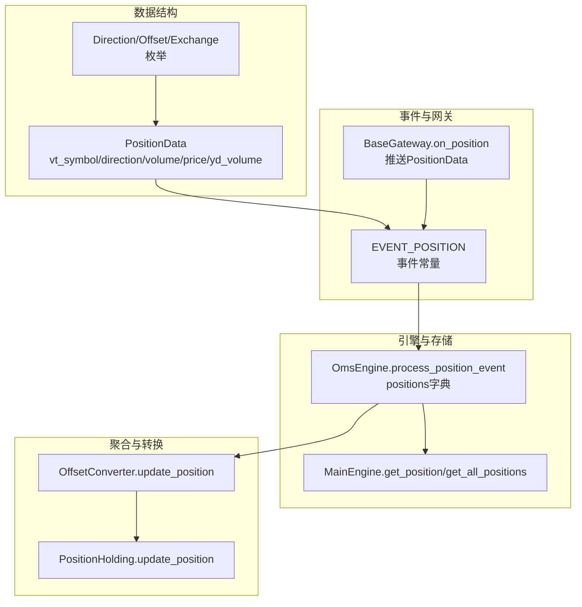
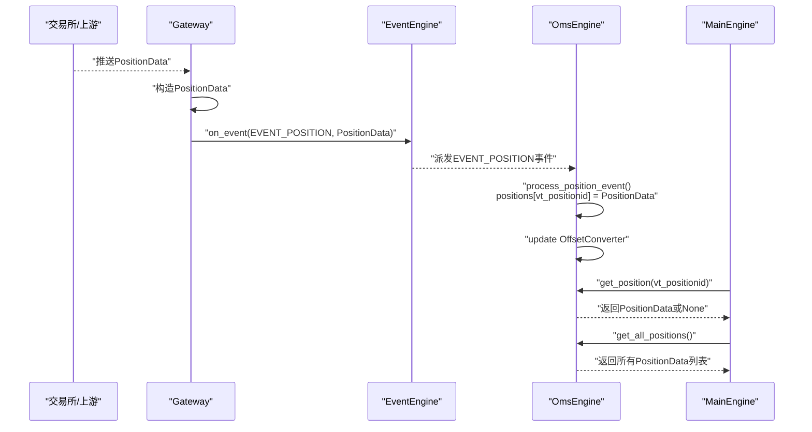
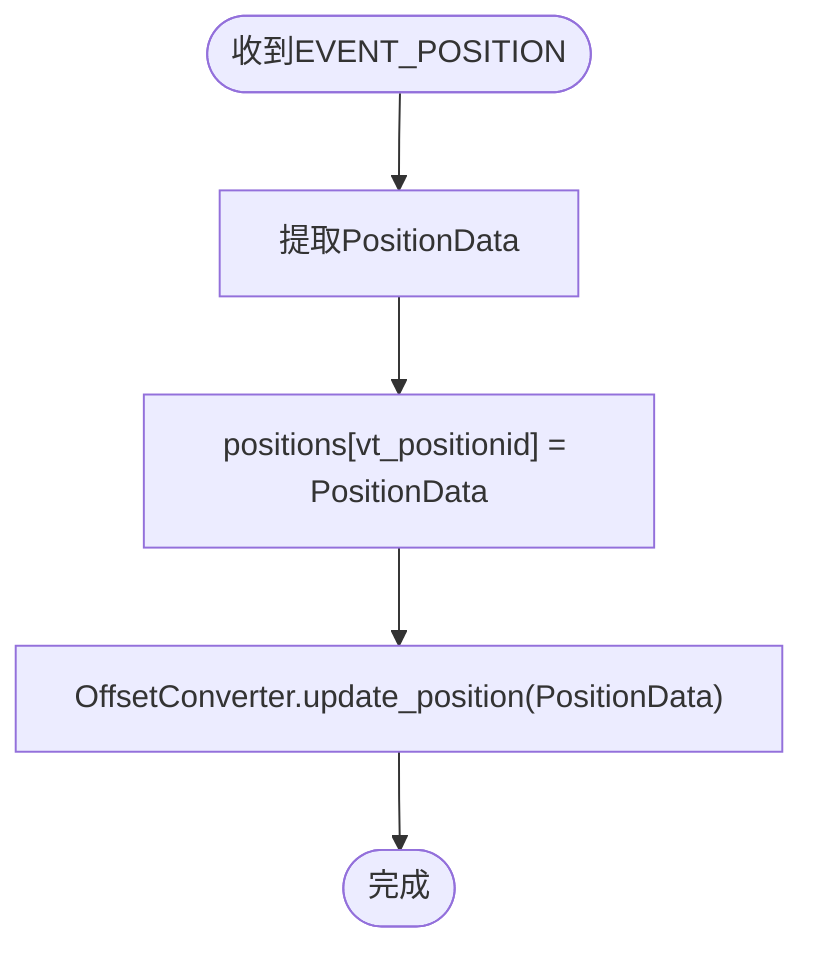
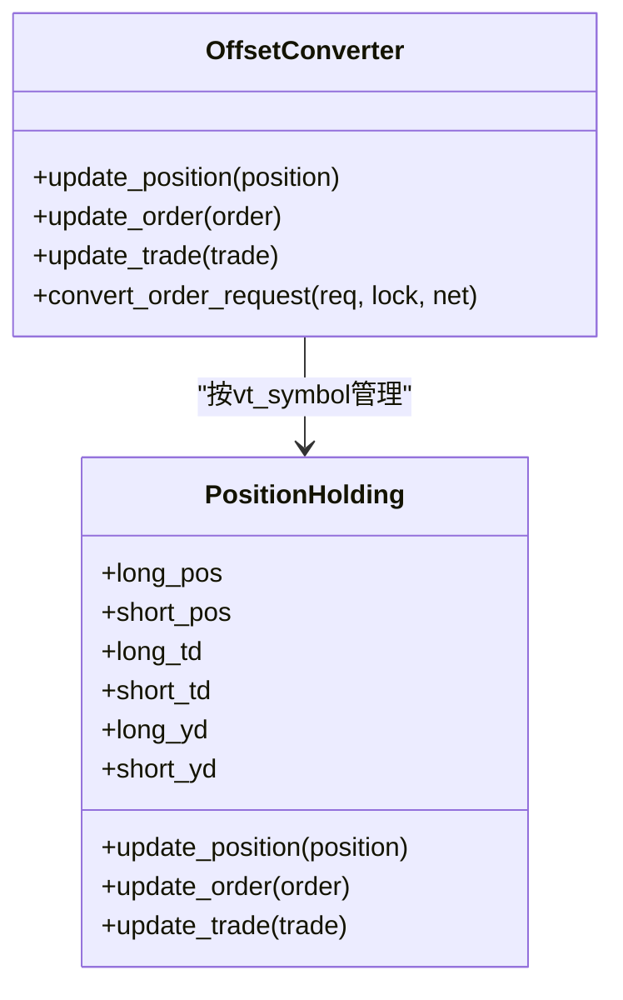
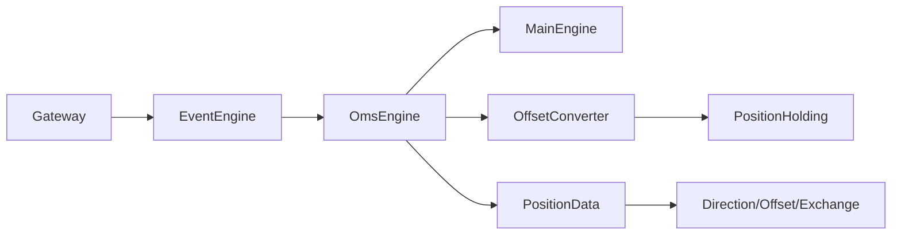

# 持仓数据流

<cite>
**本文引用的文件列表**
- [vnpy/trader/object.py](file://vnpy/trader/object.py)
- [vnpy/trader/event.py](file://vnpy/trader/event.py)
- [vnpy/trader/gateway.py](file://vnpy/trader/gateway.py)
- [vnpy/trader/engine.py](file://vnpy/trader/engine.py)
- [vnpy/trader/converter.py](file://vnpy/trader/converter.py)
- [vnpy/trader/constant.py](file://vnpy/trader/constant.py)
</cite>

## 目录
1. [引言](#引言)
2. [项目结构](#项目结构)
3. [核心组件](#核心组件)
4. [架构总览](#架构总览)
5. [详细组件分析](#详细组件分析)
6. [依赖关系分析](#依赖关系分析)
7. [性能考量](#性能考量)
8. [故障排查指南](#故障排查指南)
9. [结论](#结论)
10. [附录](#附录)

## 引言
本文围绕vnpy的持仓数据流展开，系统性梳理PositionData从交易所通过Gateway推送，触发EVENT_POSITION事件，再到OmsEngine捕获并存储到positions字典的完整链路。同时结合源码解析PositionData关键字段的业务含义、__post_init__中vt_positionid的生成逻辑，以及MainEngine如何通过get_position/get_all_positions提供统一的数据访问接口。文末给出多接口环境下持仓聚合机制与最佳实践建议，帮助开发者在订阅持仓更新、处理数据延迟与核对持仓一致性方面建立稳健的工程实践。

## 项目结构
围绕持仓数据流的相关模块主要分布在以下文件：
- 数据结构定义：PositionData、Direction、Offset、Exchange等
- 事件常量：EVENT_POSITION
- 网关层：Gateway回调on_position触发事件
- 引擎层：OmsEngine注册并处理EVENT_POSITION，存储到positions字典
- 访问接口：MainEngine对外暴露get_position/get_all_positions
- 聚合转换：OffsetConverter/PositionHolding按合约维度聚合多接口持仓

图表来源
- [vnpy/trader/object.py](file://vnpy/trader/object.py#L179-L200)
- [vnpy/trader/event.py](file://vnpy/trader/event.py#L7-L14)
- [vnpy/trader/gateway.py](file://vnpy/trader/gateway.py#L54-L194)
- [vnpy/trader/engine.py](file://vnpy/trader/engine.py#L339-L423)
- [vnpy/trader/converter.py](file://vnpy/trader/converter.py#L17-L53)

章节来源
- [vnpy/trader/object.py](file://vnpy/trader/object.py#L179-L200)
- [vnpy/trader/event.py](file://vnpy/trader/event.py#L7-L14)
- [vnpy/trader/gateway.py](file://vnpy/trader/gateway.py#L54-L194)
- [vnpy/trader/engine.py](file://vnpy/trader/engine.py#L339-L423)
- [vnpy/trader/converter.py](file://vnpy/trader/converter.py#L17-L53)

## 核心组件
- PositionData：代表单个持仓，包含symbol/exchange/direction/volume/frozen/price/pnl/yd_volume等字段，vt_symbol由symbol与exchange拼接生成，vt_positionid由gateway_name、vt_symbol与direction拼接生成。
- EVENT_POSITION：事件类型字符串，用于标识持仓事件。
- BaseGateway.on_position：网关侧在收到交易所/上游推送的持仓数据后，构造PositionData并通过on_event(EVENT_POSITION, data)推送到事件引擎。
- OmsEngine.process_position_event：注册监听EVENT_POSITION，收到事件后将PositionData按vt_positionid存入positions字典，并同步更新OffsetConverter。
- MainEngine.get_position/get_all_positions：对外提供统一的查询接口，前者按vt_positionid返回单条持仓，后者返回所有持仓列表。

章节来源
- [vnpy/trader/object.py](file://vnpy/trader/object.py#L179-L200)
- [vnpy/trader/event.py](file://vnpy/trader/event.py#L7-L14)
- [vnpy/trader/gateway.py](file://vnpy/trader/gateway.py#L54-L194)
- [vnpy/trader/engine.py](file://vnpy/trader/engine.py#L339-L423)

## 架构总览
下图展示从交易所到应用层的完整数据流路径，包括事件注册、推送、处理与访问接口。

图表来源
- [vnpy/trader/gateway.py](file://vnpy/trader/gateway.py#L54-L194)
- [vnpy/trader/engine.py](file://vnpy/trader/engine.py#L339-L423)
- [vnpy/trader/event.py](file://vnpy/trader/event.py#L7-L14)

## 详细组件分析

### PositionData数据结构与业务含义
- 关键字段
  - symbol/exchange：合约标识，vt_symbol由__post_init__拼接生成，格式为“symbol.exchange.value”，用于跨接口统一定位。
  - direction：多/空/净，区分多头与空头持仓。
  - volume：当前总持仓量。
  - frozen：冻结量（受委托冻结影响）。
  - price：持仓成本价。
  - yd_volume：昨日持仓量（用于多空仓模式区分今昨）。
  - gateway_name：来源网关名称，vt_positionid由__post_init__拼接生成，格式为“gateway_name.vt_symbol.direction.value”，确保同一合约在不同网关下的不同方向持仓彼此隔离。
- 业务要点
  - 多空仓模式下，yd_volume与td（当日）分拆，便于按交易所规则进行平仓优先级控制。
  - vt_positionid作为positions字典的键，保证唯一性与可检索性。

章节来源
- [vnpy/trader/object.py](file://vnpy/trader/object.py#L179-L200)
- [vnpy/trader/constant.py](file://vnpy/trader/constant.py#L10-L28)

### vt_positionid生成逻辑
- 生成位置：PositionData.__post_init__
- 生成规则：vt_positionid = f"{self.gateway_name}.{self.vt_symbol}.{self.direction.value}"
- 设计意图：
  - 将“网关来源+合约+方向”三元组作为唯一键，避免同合约在不同网关或同一网关不同方向的持仓冲突。
  - 便于OmsEngine按vt_positionid快速定位与更新。

章节来源
- [vnpy/trader/object.py](file://vnpy/trader/object.py#L194-L198)

### 网关推送与事件触发
- 网关职责：在收到上游推送的PositionData后，构造对象并通过on_event(EVENT_POSITION, data)推送到事件引擎。
- 事件类型：EVENT_POSITION由event.py集中定义，确保全平台一致。

章节来源
- [vnpy/trader/gateway.py](file://vnpy/trader/gateway.py#L54-L194)
- [vnpy/trader/event.py](file://vnpy/trader/event.py#L7-L14)

### OmsEngine处理与存储
- 注册事件：OmsEngine.register_event中注册EVENT_POSITION到process_position_event。
- 处理逻辑：
  - 从事件中提取PositionData，按vt_positionid写入positions字典。
  - 同步更新OffsetConverter，以便后续订单/成交转换与冻结量计算。
- 访问接口：
  - get_position(vt_positionid)：按唯一键返回单条持仓。
  - get_all_positions()：返回所有PositionData列表。

图表来源
- [vnpy/trader/engine.py](file://vnpy/trader/engine.py#L363-L414)

章节来源
- [vnpy/trader/engine.py](file://vnpy/trader/engine.py#L363-L414)

### MainEngine统一访问接口
- 初始化阶段：MainEngine.init_engines中将OmsEngine的get_position/get_all_positions绑定到MainEngine实例，形成统一入口。
- 使用方式：
  - get_position(vt_positionid)：获取指定vt_positionid的最新持仓。
  - get_all_positions()：获取所有合约的所有方向的持仓快照。

章节来源
- [vnpy/trader/engine.py](file://vnpy/trader/engine.py#L130-L156)

### 多接口环境下的聚合机制
- OffsetConverter/PositionHolding的作用：
  - 仅对需要“多空仓模式”的合约进行聚合与转换，若合约net_position为真，则无需转换。
  - 对每只合约维护PositionHolding，分别统计long_pos/short_pos及td/yd分拆与frozen冻结量。
- 聚合时机：
  - 收到PositionData时：update_position更新总仓与td/yd。
  - 收到OrderData时：update_order根据活跃委托计算冻结量。
  - 收到TradeData时：update_trade按开平仓与交易所规则调整td/yd与总仓。
- 适用场景：
  - 上海期货交易所/国际能源交易所等对平仓有“平今/平昨”要求的市场。
  - 其他交易所通常按“可用量=总仓-冻结”直接计算。

图表来源
- [vnpy/trader/converter.py](file://vnpy/trader/converter.py#L17-L53)
- [vnpy/trader/converter.py](file://vnpy/trader/converter.py#L310-L403)

章节来源
- [vnpy/trader/converter.py](file://vnpy/trader/converter.py#L17-L53)
- [vnpy/trader/converter.py](file://vnpy/trader/converter.py#L310-L403)

## 依赖关系分析
- 组件耦合
  - Gateway与EventEngine：Gateway通过on_event(EVENT_POSITION, data)解耦地向事件引擎推送。
  - OmsEngine与EventEngine：OmsEngine通过register_event集中注册各事件处理器，包括EVENT_POSITION。
  - OmsEngine与OffsetConverter：按gateway_name维护转换器，实现多接口聚合。
  - MainEngine与OmsEngine：MainEngine在初始化时注入OmsEngine的查询方法，形成统一对外接口。
- 外部依赖
  - 常量枚举Direction/Offset/Exchange来自constant.py，确保字段语义一致。
  - 事件类型EVENT_POSITION来自event.py，保证事件命名规范。

图表来源
- [vnpy/trader/gateway.py](file://vnpy/trader/gateway.py#L54-L194)
- [vnpy/trader/engine.py](file://vnpy/trader/engine.py#L339-L423)
- [vnpy/trader/converter.py](file://vnpy/trader/converter.py#L17-L53)
- [vnpy/trader/object.py](file://vnpy/trader/object.py#L179-L200)
- [vnpy/trader/constant.py](file://vnpy/trader/constant.py#L10-L28)

章节来源
- [vnpy/trader/gateway.py](file://vnpy/trader/gateway.py#L54-L194)
- [vnpy/trader/engine.py](file://vnpy/trader/engine.py#L339-L423)
- [vnpy/trader/converter.py](file://vnpy/trader/converter.py#L17-L53)
- [vnpy/trader/object.py](file://vnpy/trader/object.py#L179-L200)
- [vnpy/trader/constant.py](file://vnpy/trader/constant.py#L10-L28)

## 性能考量
- 存储键选择：positions字典以vt_positionid为键，O(1)查找，适合高频读取场景。
- 聚合成本：OffsetConverter/PositionHolding在收到Position/Order/Trade事件时更新，计算复杂度与活跃合约数成正比，建议在高并发场景下避免频繁重复推送相同PositionData。
- 事件处理：OmsEngine按事件类型分别处理，EVENT_POSITION处理逻辑简单，主要瓶颈在后续OffsetConverter更新与业务侧消费。

## 故障排查指南
- 无法获取到持仓
  - 检查是否正确订阅并连接对应网关，确认Gateway.on_position回调是否触发。
  - 确认EVENT_POSITION是否被OmsEngine注册并处理。
  - 使用MainEngine.get_all_positions()查看是否有数据入库。
- 持仓方向不正确
  - 检查PositionData.direction是否与预期一致，vt_positionid包含direction，确保键值正确。
- 冻结量异常
  - 检查OffsetConverter.update_order是否被调用，确认活跃委托是否正确计入冻结。
- 多接口持仓不一致
  - 确认OffsetConverter.is_convert_required针对目标合约生效，必要时检查合约net_position设置。
  - 对于SHFE/INE等交易所，确认平仓优先级（平今/平昨）是否符合预期。

章节来源
- [vnpy/trader/engine.py](file://vnpy/trader/engine.py#L363-L414)
- [vnpy/trader/converter.py](file://vnpy/trader/converter.py#L310-L403)

## 结论
vnpy的持仓数据流以PositionData为核心载体，通过Gateway的on_position回调与EventEngine的EVENT_POSITION事件，最终由OmsEngine统一存储到positions字典，并通过MainEngine提供统一查询接口。OffsetConverter/PositionHolding在多接口环境下承担关键的聚合与转换职责，确保不同交易所规则下的持仓一致性与可用量计算准确。开发者应关注vt_positionid的生成规则、事件注册与处理链路、以及OffsetConverter的启用条件，以构建稳定可靠的持仓数据体系。

## 附录
- 最佳实践建议
  - 订阅与更新
    - 在连接网关后，确保Gateway.on_position回调正常触发，避免遗漏。
    - 定期调用MainEngine.get_all_positions()进行快照校验，发现缺失或重复及时排查。
  - 数据延迟处理
    - 对高频场景，建议在应用层增加去重与合并策略，避免重复PositionData导致的抖动。
    - 对于延迟较大的网关，可引入超时检测与告警机制。
  - 一致性核对
    - 对于多接口，优先启用OffsetConverter并核对td/yd与frozen计算逻辑。
    - 对SHFE/INE等特殊交易所，严格遵循平今/平昨优先级，避免违规平仓。
  - 键值设计
    - 坚持使用vt_positionid作为唯一键，避免跨网关/跨方向混淆。
    - 对于策略层，建议以vt_symbol为粒度进行汇总，再按方向细分。