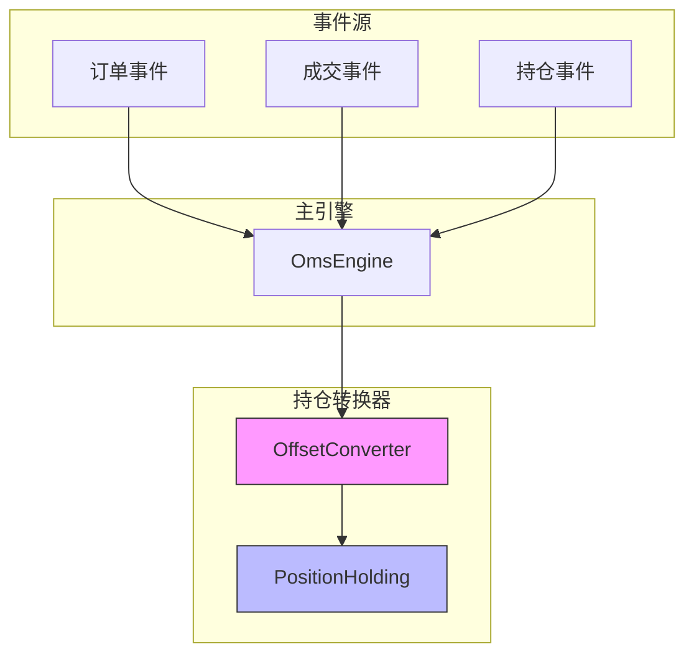
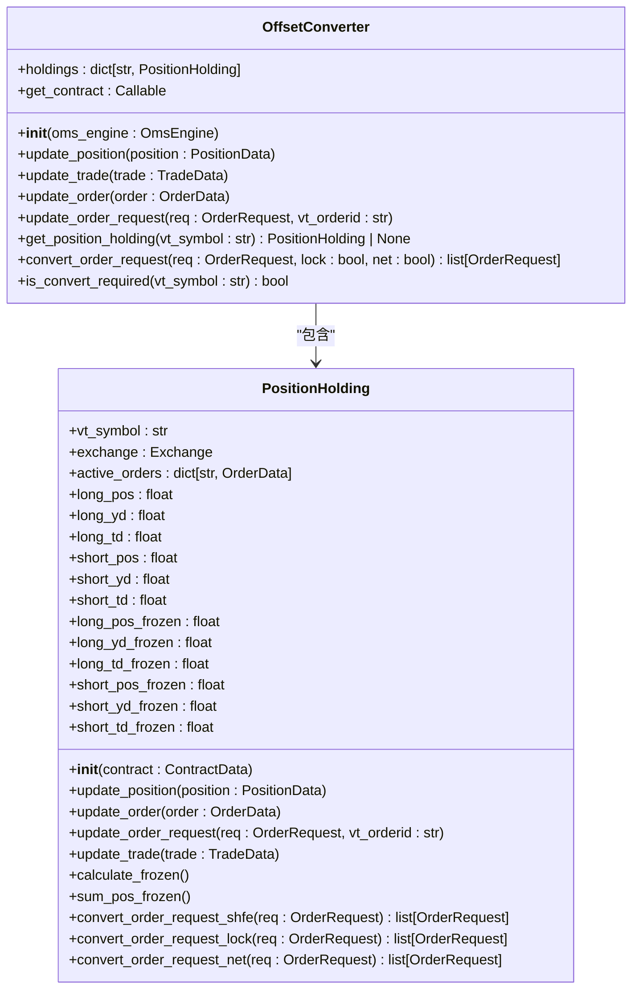
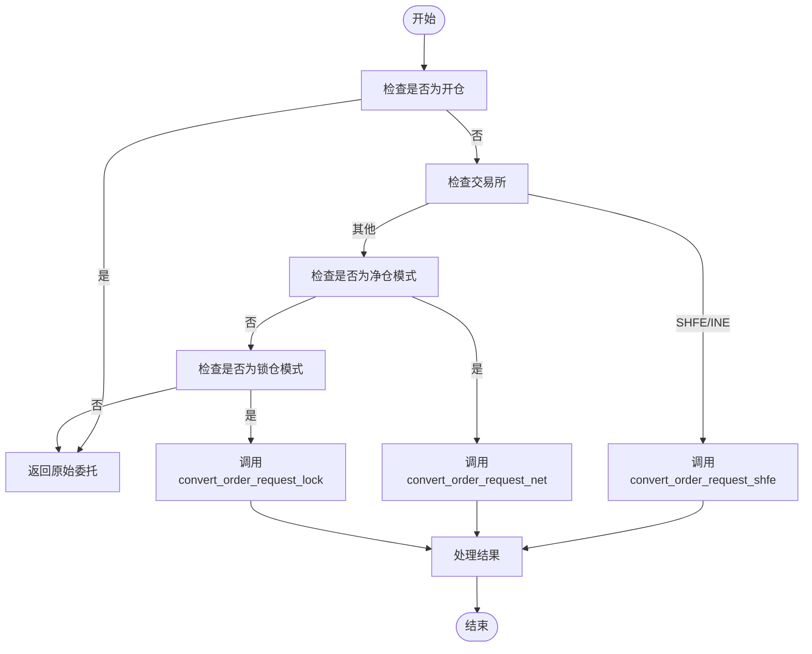
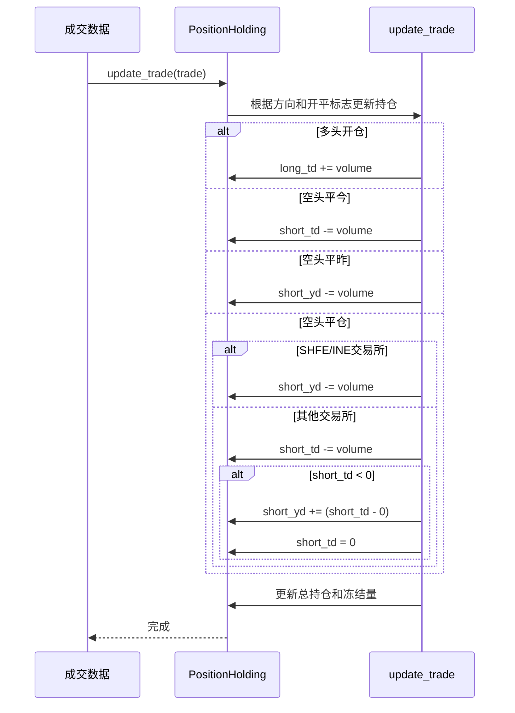
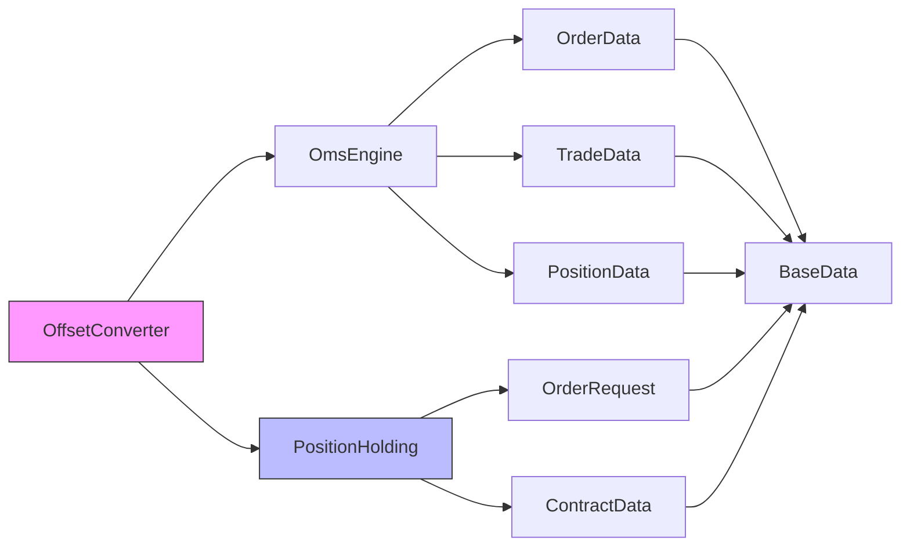

# 持仓转换器机制

<cite>
**本文档引用文件**   
- [converter.py](file://vnpy/trader/converter.py)
- [engine.py](file://vnpy/trader/engine.py)
- [object.py](file://vnpy/trader/object.py)
- [constant.py](file://vnpy/trader/constant.py)
</cite>

## 目录
1. [引言](#引言)
2. [核心组件](#核心组件)
3. [架构概述](#架构概述)
4. [详细组件分析](#详细组件分析)
5. [依赖分析](#依赖分析)
6. [性能考虑](#性能考虑)
7. [故障排除指南](#故障排除指南)
8. [结论](#结论)

## 引言
vn.py持仓转换器（OffsetConverter）是交易系统中的核心组件，负责处理开平仓逻辑的转换。该机制通过监听订单、成交和持仓事件，动态维护多空仓模式下的持仓状态。其主要功能是根据交易所规则（如上海期货交易所/上海国际能源交易中心的平今平昨规则），将用户委托转换为交易所可接受的开平标志。本技术文档将深入解析OffsetConverter的工作原理和实现细节。

## 核心组件
持仓转换器机制的核心是OffsetConverter类和PositionHolding类。OffsetConverter作为主控制器，负责管理多个合约的持仓状态，而PositionHolding类则负责具体合约的持仓计算和开平仓逻辑转换。这两个类协同工作，实现了复杂的开平仓逻辑处理。

**本文档引用文件**   
- [converter.py](file://vnpy/trader/converter.py)
- [engine.py](file://vnpy/trader/engine.py)

## 架构概述

**图表来源**
- [converter.py](file://vnpy/trader/converter.py#L309-L402)
- [engine.py](file://vnpy/trader/engine.py#L343-L360)

## 详细组件分析

### OffsetConverter类分析
OffsetConverter类是持仓转换器的核心控制器，负责管理所有合约的持仓状态。它通过事件驱动的方式，监听订单、成交和持仓事件，并相应地更新内部状态。

#### 类图

**图表来源**
- [converter.py](file://vnpy/trader/converter.py#L309-L402)

**本节来源**
- [converter.py](file://vnpy/trader/converter.py#L309-L402)

### PositionHolding类分析
PositionHolding类负责维护单个合约的持仓状态，包括多头和空头的今仓、昨仓和冻结数量。它实现了核心的开平仓逻辑转换算法。

#### 开平仓逻辑转换流程

**图表来源**
- [converter.py](file://vnpy/trader/converter.py#L167-L306)

#### 持仓更新逻辑

**图表来源**
- [converter.py](file://vnpy/trader/converter.py#L71-L110)

**本节来源**
- [converter.py](file://vnpy/trader/converter.py#L16-L306)

## 依赖分析

**图表来源**
- [converter.py](file://vnpy/trader/converter.py#L309-L402)
- [object.py](file://vnpy/trader/object.py#L17-L354)

**本节来源**
- [converter.py](file://vnpy/trader/converter.py#L309-L402)
- [object.py](file://vnpy/trader/object.py#L17-L354)

## 性能考虑
持仓转换器机制在设计上考虑了性能优化。通过缓存PositionHolding实例，避免了重复创建对象的开销。同时，使用字典数据结构存储持仓信息，确保了O(1)时间复杂度的查找性能。事件驱动的更新机制也减少了不必要的计算，只有在相关事件发生时才进行状态更新。

## 故障排除指南
在使用持仓转换器时，可能遇到以下常见问题：
1. 开平仓标志转换不正确：检查合约的net_position属性，确保正确设置了多空仓或净仓模式。
2. 持仓数量不一致：确认是否正确处理了成交事件，特别是平仓时的今昨仓分配逻辑。
3. 交易所规则应用错误：验证交易所类型是否正确识别，特别是SHFE和INE的平今平昨规则。

**本节来源**
- [converter.py](file://vnpy/trader/converter.py#L309-L402)
- [constant.py](file://vnpy/trader/constant.py#L10-L160)

## 结论
vn.py的持仓转换器机制通过OffsetConverter和PositionHolding两个核心类的协同工作，实现了复杂的开平仓逻辑处理。该机制能够根据不同的交易所规则和账户模式，智能地将用户委托转换为交易所可接受的格式。通过事件驱动的架构设计，系统能够实时响应订单、成交和持仓变化，确保持仓状态的准确性和一致性。这一机制为量化交易系统提供了可靠的基础支持，使得开发者可以专注于策略逻辑的实现，而不必担心底层的开平仓细节。