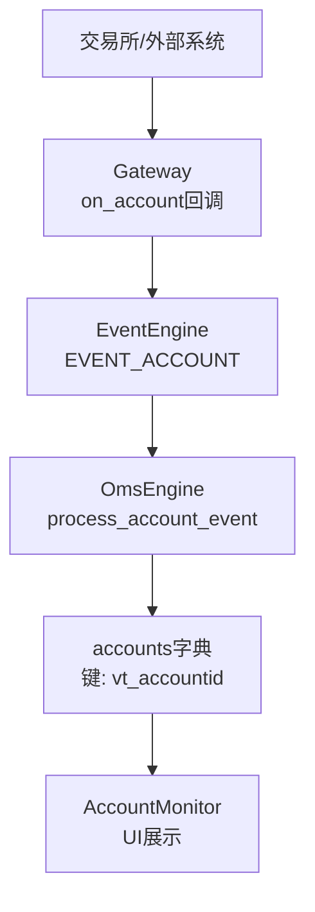
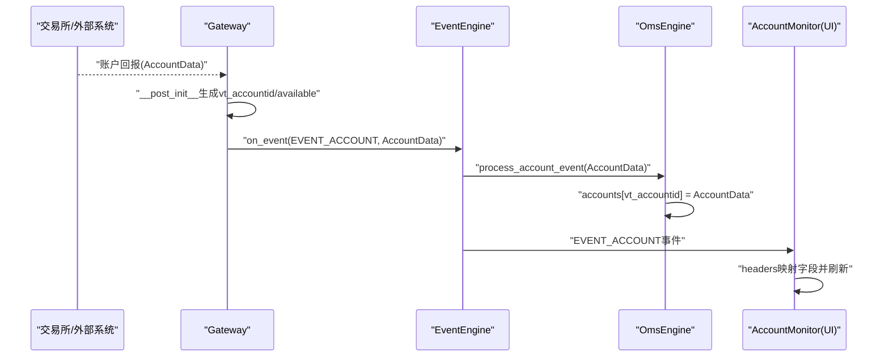
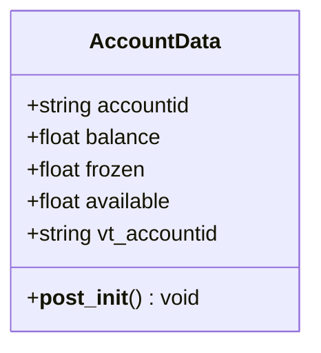
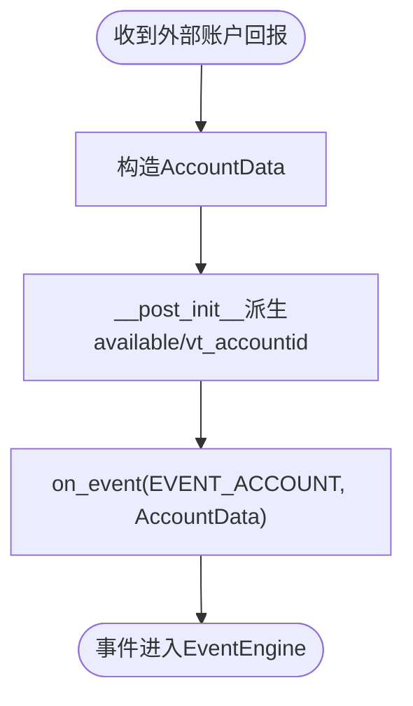
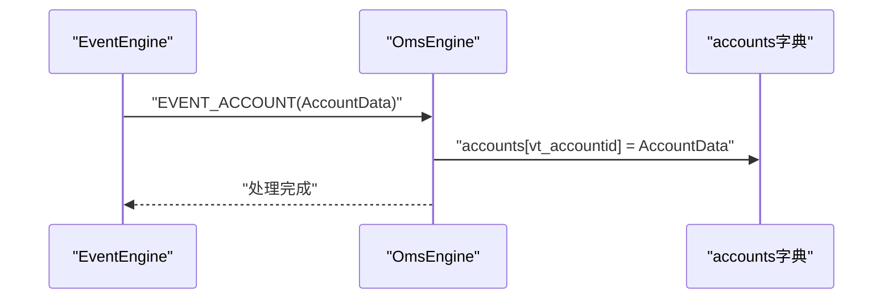
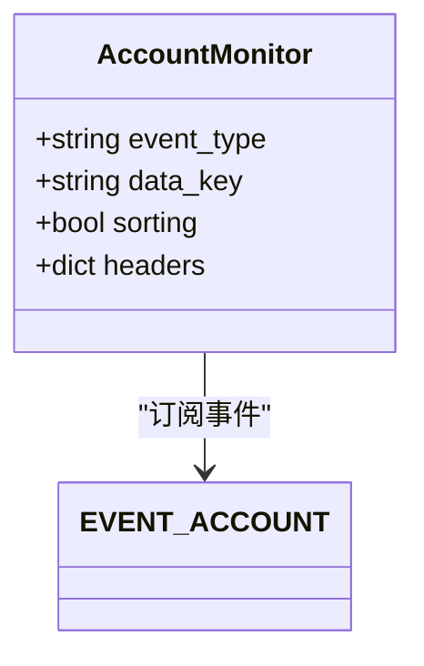
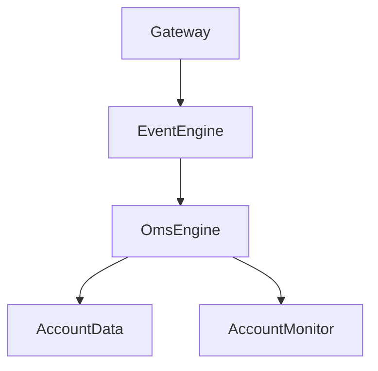

# 账户数据流

<cite>
**本文引用的文件列表**
- [vnpy/trader/object.py](file://vnpy/trader/object.py)
- [vnpy/trader/event.py](file://vnpy/trader/event.py)
- [vnpy/trader/gateway.py](file://vnpy/trader/gateway.py)
- [vnpy/trader/engine.py](file://vnpy/trader/engine.py)
- [vnpy/trader/ui/widget.py](file://vnpy/trader/ui/widget.py)
</cite>

## 目录
1. [引言](#引言)
2. [项目结构](#项目结构)
3. [核心组件](#核心组件)
4. [架构总览](#架构总览)
5. [详细组件分析](#详细组件分析)
6. [依赖关系分析](#依赖关系分析)
7. [性能考量](#性能考量)
8. [故障排查指南](#故障排查指南)
9. [结论](#结论)
10. [附录](#附录)

## 引言
本文件面向vnpy使用者与开发者，系统梳理“账户数据流”的完整链路：从交易所推送的账户数据，经由Gateway封装为AccountData并通过事件系统发出EVENT_ACCOUNT，最终由OmsEngine接收并存入accounts字典；同时深入解释AccountData中balance、frozen、available等关键字段的计算逻辑，尤其是__post_init__中available的自动推导机制；阐明vt_accountid的构造方式及其在跨网关场景下的唯一性保障；结合AccountMonitor组件说明账户数据在UI层的展示逻辑与更新策略；最后给出账户数据订阅、异常监控（如负余额）、数据核对与实盘对账的最佳实践建议。

## 项目结构
围绕账户数据流的关键文件与职责如下：
- vnpy/trader/object.py：定义基础数据类，其中AccountData承载账户余额、冻结、可用等字段，并在__post_init__中自动生成vt_accountid与available。
- vnpy/trader/event.py：定义事件类型常量，包括EVENT_ACCOUNT。
- vnpy/trader/gateway.py：抽象网关基类，约定on_account回调用于推送账户数据，并通过on_event将AccountData封装为事件。
- vnpy/trader/engine.py：主引擎与OMS引擎，负责注册事件处理器（含EVENT_ACCOUNT），并在process_account_event中将AccountData按vt_accountid存入accounts字典。
- vnpy/trader/ui/widget.py：UI组件AccountMonitor，绑定EVENT_ACCOUNT事件，按headers映射字段并驱动界面刷新。

图表来源
- [vnpy/trader/gateway.py](file://vnpy/trader/gateway.py#L93-L110)
- [vnpy/trader/event.py](file://vnpy/trader/event.py#L7-L14)
- [vnpy/trader/engine.py](file://vnpy/trader/engine.py#L363-L371)
- [vnpy/trader/engine.py](file://vnpy/trader/engine.py#L415-L419)
- [vnpy/trader/ui/widget.py](file://vnpy/trader/ui/widget.py#L538-L554)

章节来源
- [vnpy/trader/object.py](file://vnpy/trader/object.py#L200-L216)
- [vnpy/trader/event.py](file://vnpy/trader/event.py#L7-L14)
- [vnpy/trader/gateway.py](file://vnpy/trader/gateway.py#L93-L110)
- [vnpy/trader/engine.py](file://vnpy/trader/engine.py#L363-L371)
- [vnpy/trader/engine.py](file://vnpy/trader/engine.py#L415-L419)
- [vnpy/trader/ui/widget.py](file://vnpy/trader/ui/widget.py#L538-L554)

## 核心组件
- AccountData：账户数据载体，包含accountid、balance、frozen等字段；在__post_init__中自动派生available与vt_accountid。
- EVENT_ACCOUNT：账户事件类型常量，用于事件分发。
- Gateway：抽象网关，提供on_event通用推送方法与on_account回调约定，用于将外部账户数据转换为AccountData并发出事件。
- OmsEngine：注册EVENT_ACCOUNT处理器，接收AccountData并以vt_accountid为键存入accounts字典。
- AccountMonitor：UI监控器，订阅EVENT_ACCOUNT，按headers映射字段并驱动界面更新。

章节来源
- [vnpy/trader/object.py](file://vnpy/trader/object.py#L200-L216)
- [vnpy/trader/event.py](file://vnpy/trader/event.py#L7-L14)
- [vnpy/trader/gateway.py](file://vnpy/trader/gateway.py#L93-L110)
- [vnpy/trader/engine.py](file://vnpy/trader/engine.py#L363-L371)
- [vnpy/trader/engine.py](file://vnpy/trader/engine.py#L415-L419)
- [vnpy/trader/ui/widget.py](file://vnpy/trader/ui/widget.py#L538-L554)

## 架构总览
下图展示了从交易所到UI的端到端账户数据流，强调vt_accountid唯一性与UI字段映射。

图表来源
- [vnpy/trader/object.py](file://vnpy/trader/object.py#L200-L216)
- [vnpy/trader/gateway.py](file://vnpy/trader/gateway.py#L93-L110)
- [vnpy/trader/event.py](file://vnpy/trader/event.py#L7-L14)
- [vnpy/trader/engine.py](file://vnpy/trader/engine.py#L363-L371)
- [vnpy/trader/engine.py](file://vnpy/trader/engine.py#L415-L419)
- [vnpy/trader/ui/widget.py](file://vnpy/trader/ui/widget.py#L538-L554)

## 详细组件分析

### AccountData：字段与派生逻辑
- 关键字段
  - accountid：账户标识（来自外部系统）
  - balance：账户总余额
  - frozen：冻结金额
  - available：可用金额（由__post_init__自动计算）
  - vt_accountid：全局唯一键（由__post_init__生成）
- 计算与派生
  - available = balance - frozen（浮点运算，注意精度）
  - vt_accountid = f"{gateway_name}.{accountid}"（跨网关唯一）
- 字段来源与用途
  - accountid：外部账户标识，不同网关可同名但vt_accountid唯一
  - balance/frozen：由网关推送或查询得到
  - available：仅作为派生字段，便于UI与业务读取
  - vt_accountid：作为OmsEngine.accounts字典的键，确保跨网关唯一

图表来源
- [vnpy/trader/object.py](file://vnpy/trader/object.py#L200-L216)

章节来源
- [vnpy/trader/object.py](file://vnpy/trader/object.py#L200-L216)

### vt_accountid：唯一性与跨网关保障
- 构造方式：vt_accountid = f"{gateway_name}.{accountid}"
- 唯一性保障：
  - gateway_name来自网关实例名称，不同网关实例具有不同名称
  - 同一网关实例内的accountid冲突可通过外部系统保证或在网关侧做去重
  - 因此vt_accountid在系统范围内唯一，避免跨网关账户键冲突
- 实践建议：
  - 确保不同网关实例使用不同gateway_name
  - 若同一网关对接多个子账户，建议在accountid中体现子账户维度，避免重复

章节来源
- [vnpy/trader/object.py](file://vnpy/trader/object.py#L200-L216)
- [vnpy/trader/gateway.py](file://vnpy/trader/gateway.py#L81-L90)

### Gateway：账户数据推送与事件发出
- on_account回调：网关在收到外部账户回报时，应构造AccountData并调用on_account
- on_event：将AccountData封装为事件并投递到EventEngine
- 事件类型：EVENT_ACCOUNT
- 注意事项：
  - AccountData对象应保持不可变性，避免在回调中修改已传递的对象
  - 线程安全：网关方法需非阻塞且线程安全

图表来源
- [vnpy/trader/gateway.py](file://vnpy/trader/gateway.py#L93-L110)
- [vnpy/trader/event.py](file://vnpy/trader/event.py#L7-L14)
- [vnpy/trader/object.py](file://vnpy/trader/object.py#L200-L216)

章节来源
- [vnpy/trader/gateway.py](file://vnpy/trader/gateway.py#L93-L110)
- [vnpy/trader/event.py](file://vnpy/trader/event.py#L7-L14)
- [vnpy/trader/object.py](file://vnpy/trader/object.py#L200-L216)

### OmsEngine：事件接收与存储
- 注册事件：在register_event中注册EVENT_ACCOUNT处理器
- 处理逻辑：process_account_event将AccountData按vt_accountid存入accounts字典
- 查询接口：get_account(vt_accountid)用于按唯一键获取账户数据
- 并发与一致性：
  - accounts字典为内存级缓存，读写需注意并发访问
  - 建议在高并发场景下配合锁或原子操作

图表来源
- [vnpy/trader/engine.py](file://vnpy/trader/engine.py#L363-L371)
- [vnpy/trader/engine.py](file://vnpy/trader/engine.py#L415-L419)

章节来源
- [vnpy/trader/engine.py](file://vnpy/trader/engine.py#L363-L371)
- [vnpy/trader/engine.py](file://vnpy/trader/engine.py#L415-L419)

### UI层：AccountMonitor字段映射与更新策略
- 事件绑定：event_type = EVENT_ACCOUNT；数据键：data_key = "vt_accountid"
- 字段映射（headers）：
  - accountid：账号（只读）
  - balance：余额（可更新）
  - frozen：冻结（可更新）
  - available：可用（可更新）
  - gateway_name：接口（只读）
- 更新策略：
  - update=True的字段在事件到达时触发局部刷新
  - update=False的字段（如accountid、gateway_name）不随事件更新
- 刷新机制：
  - AccountMonitor基于事件驱动，每次EVENT_ACCOUNT到达即更新对应行

图表来源
- [vnpy/trader/ui/widget.py](file://vnpy/trader/ui/widget.py#L538-L554)
- [vnpy/trader/event.py](file://vnpy/trader/event.py#L7-L14)

章节来源
- [vnpy/trader/ui/widget.py](file://vnpy/trader/ui/widget.py#L538-L554)

## 依赖关系分析
- 组件耦合
  - Gateway与EventEngine：通过on_event解耦，Gateway无需关心具体订阅者
  - OmsEngine与EventEngine：通过register_event集中管理事件路由
  - OmsEngine与AccountData：通过vt_accountid建立强关联，键值唯一
  - UI与OmsEngine：通过事件与数据键间接耦合，降低直接依赖
- 外部依赖
  - EventEngine：事件总线，贯穿账户数据流
  - 网关实现：不同网关对账户回报的解析与封装方式可能不同，但遵循相同接口契约

图表来源
- [vnpy/trader/gateway.py](file://vnpy/trader/gateway.py#L93-L110)
- [vnpy/trader/event.py](file://vnpy/trader/event.py#L7-L14)
- [vnpy/trader/engine.py](file://vnpy/trader/engine.py#L363-L371)
- [vnpy/trader/ui/widget.py](file://vnpy/trader/ui/widget.py#L538-L554)

章节来源
- [vnpy/trader/gateway.py](file://vnpy/trader/gateway.py#L93-L110)
- [vnpy/trader/event.py](file://vnpy/trader/event.py#L7-L14)
- [vnpy/trader/engine.py](file://vnpy/trader/engine.py#L363-L371)
- [vnpy/trader/ui/widget.py](file://vnpy/trader/ui/widget.py#L538-L554)

## 性能考量
- 事件吞吐
  - AccountData通常高频推送，建议网关与EventEngine保持非阻塞
  - OmsEngine的accounts字典为内存查找，时间复杂度接近O(1)
- 内存占用
  - accounts仅缓存最新账户快照，建议定期清理不再使用的键
- 并发安全
  - 在高并发场景下，建议对accounts的读写加锁或使用线程安全容器
- UI渲染
  - AccountMonitor按字段update=True进行增量刷新，减少不必要的重绘

## 故障排查指南
- 负余额告警
  - 现象：available或balance出现负值
  - 排查要点：
    - 检查网关推送的balance与frozen是否正确
    - 核对__post_init__派生逻辑是否被覆盖
    - 确认vt_accountid是否唯一，避免误覆盖
- 键冲突
  - 现象：不同网关账户显示为同一行
  - 排查要点：
    - 确认gateway_name不同
    - 确认accountid在同网关内唯一
- UI不更新
  - 现象：界面未刷新
  - 排查要点：
    - 确认EVENT_ACCOUNT事件是否到达
    - 确认AccountMonitor的headers与字段名一致
    - 确认data_key为"vt_accountid"

章节来源
- [vnpy/trader/object.py](file://vnpy/trader/object.py#L200-L216)
- [vnpy/trader/ui/widget.py](file://vnpy/trader/ui/widget.py#L538-L554)

## 结论
vnpy的账户数据流以事件驱动为核心，通过Gateway封装AccountData并发出EVENT_ACCOUNT，OmsEngine以vt_accountid为键存入accounts字典，UI层由AccountMonitor按headers映射展示。AccountData的__post_init__自动派生available与vt_accountid，既简化了业务逻辑，也保障了跨网关唯一性。实践中应重视账户数据的订阅、异常监控与对账，确保系统稳定可靠。

## 附录

### 最佳实践清单
- 账户数据订阅
  - 在网关connect阶段请求账户回报与历史委托/成交，确保首次快照完整
  - 对高频账户回报进行节流或合并，避免UI过度刷新
- 异常监控
  - 建立负余额/可用不足告警机制
  - 对vt_accountid唯一性进行校验与日志记录
- 数据核对与对账
  - 定期比对OmsEngine.accounts与外部系统账户余额
  - 使用gateway_name与accountid组合进行交叉验证
- 实盘对账
  - 将OmsEngine.get_account(vt_accountid)结果与外部系统对账单逐项比对
  - 对差异项进行日志追踪与人工复核