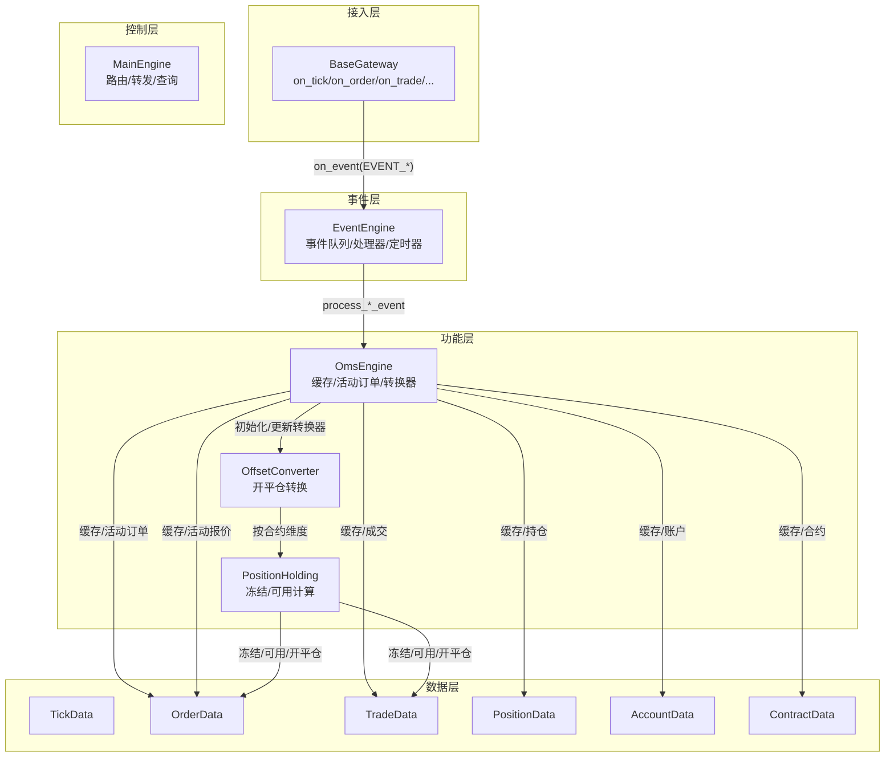
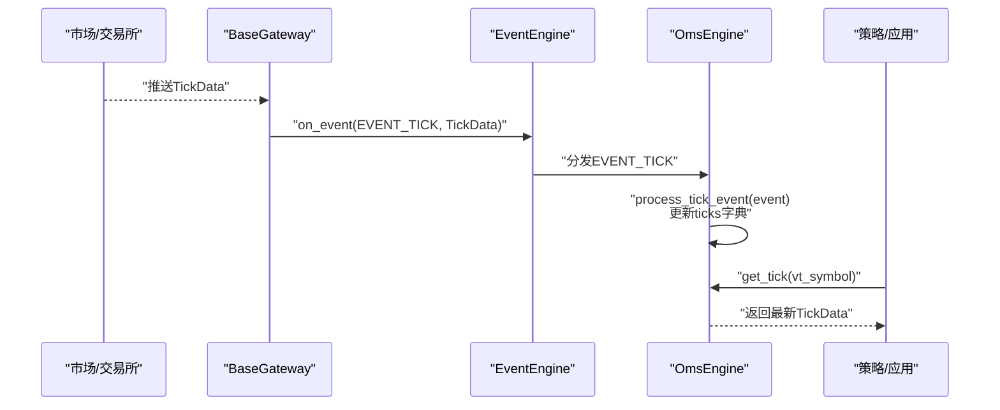
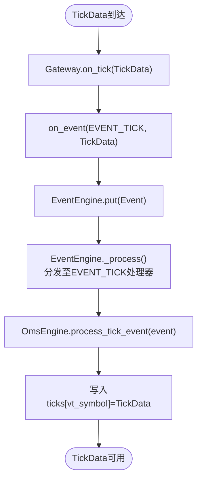
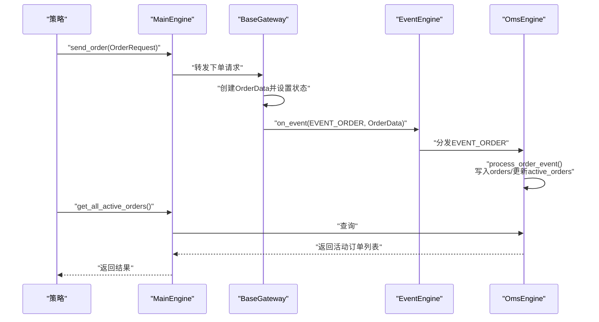
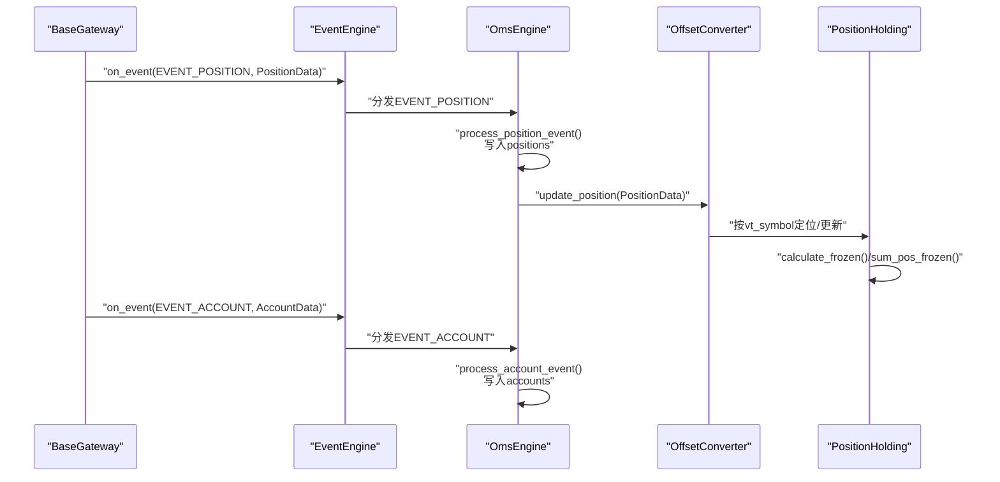
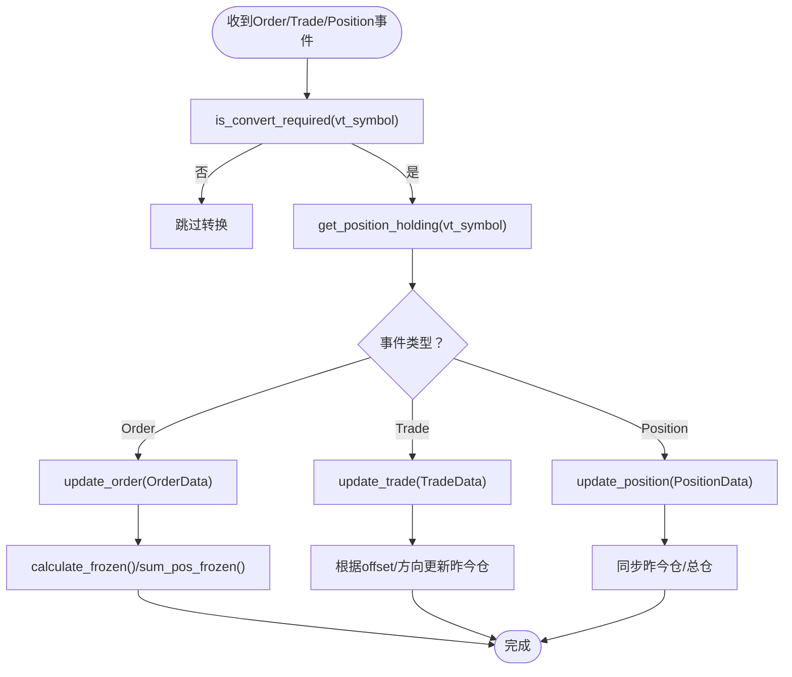
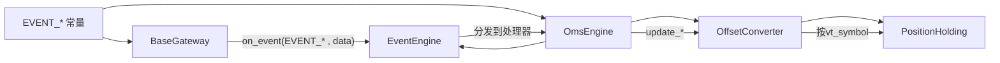

# 数据流机制

<cite>
**本文引用的文件**
- [vnpy/trader/engine.py](file://vnpy/trader/engine.py)
- [vnpy/event/engine.py](file://vnpy/event/engine.py)
- [vnpy/trader/gateway.py](file://vnpy/trader/gateway.py)
- [vnpy/trader/event.py](file://vnpy/trader/event.py)
- [vnpy/trader/object.py](file://vnpy/trader/object.py)
- [vnpy/trader/converter.py](file://vnpy/trader/converter.py)
- [examples/veighna_trader/demo_script.py](file://examples/veighna_trader/demo_script.py)
</cite>

## 目录
1. [引言](#引言)
2. [项目结构](#项目结构)
3. [核心组件](#核心组件)
4. [架构总览](#架构总览)
5. [详细组件分析](#详细组件分析)
6. [依赖关系分析](#依赖关系分析)
7. [性能考量](#性能考量)
8. [故障排查指南](#故障排查指南)
9. [结论](#结论)
10. [附录](#附录)

## 引言
本文件系统性梳理 vnpy 的数据流机制，围绕“从市场到策略再到执行”的完整链路展开，重点说明以下内容：
- TickData 从 Gateway 通过 put 方法进入 EventEngine，触发 EVENT_TICK 事件，最终由 OmsEngine 的 process_tick_event 捕获并存储。
- OrderData 生命周期：从策略发出 OrderRequest，经 MainEngine 转发给 Gateway，再到交易所返回 OrderData 并通过 EVENT_ORDER 更新本地缓存。
- PositionData 和 AccountData 如何通过事件驱动保持实时同步。
- OmsEngine 中 active_orders 等字典的设计目的与作用。
- 结合源码说明 OffsetConverter 如何利用订单与成交事件维护开平仓的正确性。
- 面向开发者的最佳实践：如何正确订阅事件、处理数据延迟与应对数据丢失。

## 项目结构
vnpy 的数据流围绕事件驱动框架构建，主要模块职责如下：
- 事件引擎：负责事件的分发、定时器生成与线程化处理。
- 网关层：封装不同交易所或数据源的接入，统一推送 Tick/Order/Trade/Position/Account 等事件。
- 主引擎：聚合网关与功能引擎，提供统一的查询与调用入口。
- 功能引擎：如 OmsEngine，负责订单管理、缓存与转换逻辑。
- 数据对象：TickData、OrderData、TradeData、PositionData、AccountData 等。

图表来源
- [vnpy/event/engine.py](file://vnpy/event/engine.py#L1-L146)
- [vnpy/trader/gateway.py](file://vnpy/trader/gateway.py#L86-L159)
- [vnpy/trader/engine.py](file://vnpy/trader/engine.py#L339-L567)
- [vnpy/trader/converter.py](file://vnpy/trader/converter.py#L1-L403)

章节来源
- [vnpy/event/engine.py](file://vnpy/event/engine.py#L1-L146)
- [vnpy/trader/gateway.py](file://vnpy/trader/gateway.py#L86-L159)
- [vnpy/trader/engine.py](file://vnpy/trader/engine.py#L73-L303)

## 核心组件
- 事件引擎 EventEngine：提供事件队列、处理器注册、通用处理器、定时器事件生成与线程化处理。
- 网关 BaseGateway：封装连接、订阅、下单、撤单、历史查询；统一通过 on_event 推送各类事件。
- 主引擎 MainEngine：集中管理网关与引擎，提供统一查询与调用接口，并在初始化时挂载 OmsEngine。
- OmsEngine：作为订单管理核心，维护各类数据字典与活动订单/报价集合，并注册事件处理器。
- OffsetConverter/PositionHolding：按合约维度维护持仓与冻结计算，支持锁仓/净仓/上期所特殊规则的开平仓转换。

章节来源
- [vnpy/event/engine.py](file://vnpy/event/engine.py#L1-L146)
- [vnpy/trader/gateway.py](file://vnpy/trader/gateway.py#L86-L159)
- [vnpy/trader/engine.py](file://vnpy/trader/engine.py#L73-L303)
- [vnpy/trader/converter.py](file://vnpy/trader/converter.py#L1-L403)

## 架构总览
下面以 TickData 为例，展示从市场到策略再到执行的完整数据路径。

图表来源
- [vnpy/trader/gateway.py](file://vnpy/trader/gateway.py#L93-L100)
- [vnpy/event/engine.py](file://vnpy/event/engine.py#L66-L80)
- [vnpy/trader/engine.py](file://vnpy/trader/engine.py#L373-L377)

章节来源
- [vnpy/trader/gateway.py](file://vnpy/trader/gateway.py#L93-L100)
- [vnpy/event/engine.py](file://vnpy/event/engine.py#L66-L80)
- [vnpy/trader/engine.py](file://vnpy/trader/engine.py#L373-L377)

## 详细组件分析

### TickData 流转路径与存储
- 网关层：on_tick 将 TickData 通过 on_event 推送 EVENT_TICK 事件，同时也会推送带具体 vt_symbol 的事件键，便于按品种粒度订阅。
- 事件引擎：EventEngine 在线程中从队列取出事件并分发给已注册的处理器。
- OmsEngine：process_tick_event 将 TickData 写入按 vt_symbol 维度的缓存字典，供后续查询使用。

图表来源
- [vnpy/trader/gateway.py](file://vnpy/trader/gateway.py#L93-L100)
- [vnpy/event/engine.py](file://vnpy/event/engine.py#L66-L80)
- [vnpy/trader/engine.py](file://vnpy/trader/engine.py#L373-L377)

章节来源
- [vnpy/trader/gateway.py](file://vnpy/trader/gateway.py#L93-L100)
- [vnpy/trader/engine.py](file://vnpy/trader/engine.py#L373-L377)

### OrderData 生命周期与活动订单管理
- 发出阶段：策略通过 MainEngine.send_order 将 OrderRequest 转发给指定网关，网关内部创建 OrderData 并设置初始状态，随后推送 EVENT_ORDER。
- 本地缓存：OmsEngine.process_order_event 将 OrderData 写入 orders 字典；若订单仍处于活跃状态，则写入 active_orders；否则从 active_orders 中移除。
- 查询接口：MainEngine 提供 get_order/get_all_active_orders 等便捷查询，直接访问 OmsEngine 的缓存。

图表来源
- [vnpy/trader/engine.py](file://vnpy/trader/engine.py#L233-L244)
- [vnpy/trader/gateway.py](file://vnpy/trader/gateway.py#L109-L116)
- [vnpy/event/engine.py](file://vnpy/event/engine.py#L66-L80)
- [vnpy/trader/engine.py](file://vnpy/trader/engine.py#L378-L394)

章节来源
- [vnpy/trader/engine.py](file://vnpy/trader/engine.py#L233-L244)
- [vnpy/trader/engine.py](file://vnpy/trader/engine.py#L378-L394)

### PositionData 与 AccountData 的事件驱动同步
- PositionData：Gateway.on_position 推送 EVENT_POSITION，OmsEngine.process_position_event 写入 positions 字典，并触发 OffsetConverter.update_position，用于冻结/可用量计算。
- AccountData：Gateway.on_account 推送 EVENT_ACCOUNT，OmsEngine.process_account_event 写入 accounts 字典，供策略查询账户资金状况。

图表来源
- [vnpy/trader/gateway.py](file://vnpy/trader/gateway.py#L117-L132)
- [vnpy/event/engine.py](file://vnpy/event/engine.py#L66-L80)
- [vnpy/trader/engine.py](file://vnpy/trader/engine.py#L405-L419)
- [vnpy/trader/converter.py](file://vnpy/trader/converter.py#L319-L336)

章节来源
- [vnpy/trader/gateway.py](file://vnpy/trader/gateway.py#L117-L132)
- [vnpy/trader/engine.py](file://vnpy/trader/engine.py#L405-L419)
- [vnpy/trader/converter.py](file://vnpy/trader/converter.py#L319-L336)

### OmsEngine 中活动订单与报价的设计目的
- active_orders：仅保留当前仍处于活跃状态的订单，便于策略快速筛选未成交/部分成交的订单，降低遍历成本。
- active_quotes：同理，仅保留活跃报价，提升查询效率。
- 设计要点：
  - 使用 is_active 判断状态变更，动态增删字典项。
  - 与 OffsetConverter 协作，确保开平仓转换基于最新订单状态。

章节来源
- [vnpy/trader/engine.py](file://vnpy/trader/engine.py#L356-L359)
- [vnpy/trader/engine.py](file://vnpy/trader/engine.py#L383-L394)
- [vnpy/trader/engine.py](file://vnpy/trader/engine.py#L434-L440)
- [vnpy/trader/object.py](file://vnpy/trader/object.py#L137-L142)

### OffsetConverter 的开平仓正确性保障
OffsetConverter 通过 PositionHolding 维护每种合约的多空头寸、昨今仓与冻结量，并在收到订单/成交事件后进行增量更新，从而保证开平仓方向与数量的正确性。其核心流程如下：

图表来源
- [vnpy/trader/converter.py](file://vnpy/trader/converter.py#L310-L403)
- [vnpy/trader/converter.py](file://vnpy/trader/converter.py#L17-L167)
- [vnpy/trader/converter.py](file://vnpy/trader/converter.py#L54-L111)

章节来源
- [vnpy/trader/converter.py](file://vnpy/trader/converter.py#L310-L403)
- [vnpy/trader/converter.py](file://vnpy/trader/converter.py#L17-L167)

### 订单请求转换与策略交互
- MainEngine 提供 convert_order_request 与 update_order_request 接口，将策略侧原始 OrderRequest 转换为符合交易所规则的多个子请求（如锁仓/净仓/上期所优先），并记录到转换器中以便后续冻结量计算。
- 示例脚本展示了如何订阅行情并轮询获取 Tick，体现事件驱动与轮询查询的结合使用方式。

章节来源
- [vnpy/trader/engine.py](file://vnpy/trader/engine.py#L537-L561)
- [examples/veighna_trader/demo_script.py](file://examples/veighna_trader/demo_script.py#L21-L42)

## 依赖关系分析
- 事件类型定义：EVENT_TICK/ORDER/TRADE/POSITION/ACCOUNT/CONTRACT/QUOTE/LOG 在 trader/event.py 中集中定义，Gateway 与 OmsEngine 均依赖这些常量。
- OmsEngine 对 EventEngine 的依赖：通过 register 注册各事件处理器，形成“事件驱动”的数据更新闭环。
- OffsetConverter 对 OmsEngine 的依赖：通过 get_contract 获取合约信息，按 vt_symbol 维度建立 PositionHolding 实例，实现按合约的冻结/可用计算。

图表来源
- [vnpy/trader/event.py](file://vnpy/trader/event.py#L7-L14)
- [vnpy/trader/gateway.py](file://vnpy/trader/gateway.py#L86-L159)
- [vnpy/trader/engine.py](file://vnpy/trader/engine.py#L363-L371)
- [vnpy/trader/converter.py](file://vnpy/trader/converter.py#L310-L366)

章节来源
- [vnpy/trader/event.py](file://vnpy/trader/event.py#L7-L14)
- [vnpy/trader/gateway.py](file://vnpy/trader/gateway.py#L86-L159)
- [vnpy/trader/engine.py](file://vnpy/trader/engine.py#L363-L371)
- [vnpy/trader/converter.py](file://vnpy/trader/converter.py#L310-L366)

## 性能考量
- 事件驱动的异步处理：EventEngine 采用线程化队列消费，避免阻塞网关回调，提高吞吐。
- 缓存与索引：OmsEngine 以 vt_symbol/vt_orderid/vt_tradeid 等为主键的字典存储，查询复杂度近似 O(1)，适合高频读取。
- 活动集合：active_orders/active_quotes 仅维护活跃订单，减少策略侧过滤成本。
- 冻结计算：PositionHolding 的冻结量计算在订单/成交事件到达时增量更新，避免全局扫描。

[本节为通用指导，无需列出具体文件来源]

## 故障排查指南
- 订阅不到行情：确认 Gateway.on_tick 是否被调用，以及 EVENT_TICK 是否被注册到 EventEngine；检查 MainEngine.subscribe 是否成功转发。
- 订单状态异常：检查 OmsEngine.process_order_event 是否被调用，确认订单状态是否符合 ACTIVE_STATUSES；核对 is_active 判定逻辑。
- 成交未生效：确认 EVENT_TRADE 是否到达，OmsEngine.process_trade_event 是否更新 trades 与 OffsetConverter；检查 PositionHolding 的方向与 offset 分支逻辑。
- 资金/持仓不同步：确认 EVENT_ACCOUNT/EVENT_POSITION 是否到达，OmsEngine.process_account_event/process_position_event 是否写入缓存。
- 数据丢失：EventEngine.stop/close 顺序需先停止事件引擎再关闭网关/引擎，避免新事件产生导致丢失。

章节来源
- [vnpy/trader/gateway.py](file://vnpy/trader/gateway.py#L93-L132)
- [vnpy/event/engine.py](file://vnpy/event/engine.py#L97-L104)
- [vnpy/trader/engine.py](file://vnpy/trader/engine.py#L378-L419)
- [vnpy/trader/converter.py](file://vnpy/trader/converter.py#L54-L111)

## 结论
vnpy 的数据流以事件驱动为核心，通过 EventEngine 实现解耦与高并发处理；OmsEngine 作为中枢，统一维护各类数据缓存与活动集合，并借助 OffsetConverter 实现开平仓的合规转换。开发者应遵循正确的事件订阅与处理流程，合理使用 MainEngine 的查询接口，以获得稳定一致的数据视图。

[本节为总结性内容，无需列出具体文件来源]

## 附录
- 关键事件类型：EVENT_TICK、EVENT_ORDER、EVENT_TRADE、EVENT_POSITION、EVENT_ACCOUNT、EVENT_CONTRACT、EVENT_QUOTE、EVENT_LOG。
- 数据对象关键字段：vt_symbol/vt_orderid/vt_tradeid/vt_positionid/vt_accountid/vt_quoteid 等唯一标识，用于事件分发与缓存索引。
- 最佳实践清单：
  - 在策略初始化时注册所需事件处理器或使用 MainEngine 的查询接口。
  - 使用 get_all_active_orders/get_all_active_quotes 快速筛选活跃订单。
  - 对于锁仓/净仓需求，使用 convert_order_request 进行自动拆单。
  - 注意数据延迟与丢包场景，必要时增加重试与回放逻辑。

[本节为补充说明，无需列出具体文件来源]