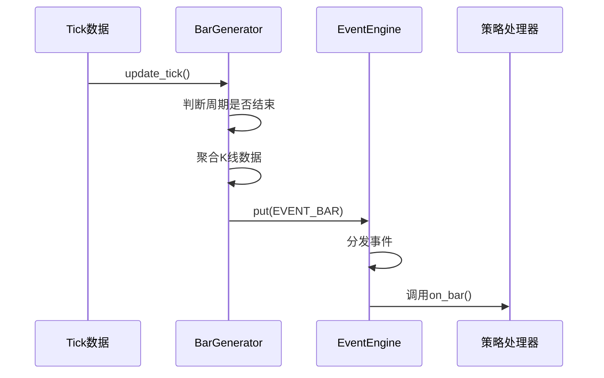

# K线数据流

<cite>
**本文档引用的文件**
- [BarData](file://vnpy/trader/object.py#L88-L108)
- [BarGenerator](file://vnpy/trader/utility.py#L165-L457)
- [EventEngine](file://vnpy/event/engine.py#L33-L145)
- [EVENT_BAR](file://vnpy/trader/event.py#L7)
</cite>

## 目录
1. [引言](#引言)
2. [K线生成机制](#k线生成机制)
3. [BarData对象结构](#bardata对象结构)
4. [事件驱动架构](#事件驱动架构)
5. [多周期K线合成](#多周期k线合成)
6. [最佳实践](#最佳实践)

## 引言
在vnpy交易框架中，K线数据流是量化交易策略的核心数据源。本文档详细阐述了如何基于TickData聚合生成BarData的完整机制，包括时间周期判断、价格聚合算法、成交量累计方法以及事件发布机制。通过深入分析BarGenerator类的实现原理，为开发者提供K线数据处理的全面指导。

## K线生成机制

K线数据的生成主要通过BarGenerator类实现，该类负责监听TickData事件并将其聚合为指定周期的K线数据。当接收到新的TickData时，系统首先检查是否需要创建新的K线周期。

时间周期的判断基于TickData的时间戳，当分钟数发生变化时，即认为进入新的K线周期。此时，系统会将当前K线数据通过回调函数发布，并创建新的K线对象用于收集下一个周期的数据。

价格聚合算法遵循标准的K线形成规则：
- 开盘价：新周期第一个Tick的最新价
- 最高价：周期内所有Tick的最高价中的最大值
- 最低价：周期内所有Tick的最低价中的最小值
- 收盘价：周期内最后一个Tick的最新价

成交量的累计通过计算相邻Tick的成交量差值实现，确保只累加新增的成交量，避免重复计算。

**本节来源**
- [BarGenerator](file://vnpy/trader/utility.py#L203-L259)

## BarData对象结构

BarData是K线数据的核心数据结构，包含K线的所有必要信息。该对象通过dataclass实现，确保了数据的完整性和一致性。

BarData的主要属性包括：
- symbol: 交易品种代码
- exchange: 交易所代码
- datetime: K线时间戳
- interval: K线周期
- volume: 成交量
- turnover: 成交额
- open_interest: 持仓量
- open_price: 开盘价
- high_price: 最高价
- low_price: 最低价
- close_price: 收盘价

vt_symbol标识机制通过将symbol和exchange组合生成唯一标识符，格式为"symbol.exchange"。这种设计确保了不同交易所的同名合约能够被正确区分，避免了交易冲突。

**本节来源**
- [BarData](file://vnpy/trader/object.py#L88-L108)

## 事件驱动架构

vnpy采用事件驱动架构来处理K线数据流。BarGenerator在完成一个K线周期的聚合后，会通过EventEngine发布EVENT_BAR事件。EventEngine作为框架的通信总线，负责事件的分发和处理。

事件处理流程如下：
1. BarGenerator检测到K线周期结束
2. 创建包含BarData的Event对象
3. 调用EventEngine.put()方法将事件放入队列
4. EventEngine线程从队列中取出事件
5. 根据事件类型调用注册的处理器

这种设计实现了生产者和消费者的解耦，确保了系统的响应性和可扩展性。所有事件处理都在独立线程中同步执行，避免了复杂的线程同步问题。

**图表来源**
- [BarGenerator](file://vnpy/trader/utility.py#L222-L223)
- [EventEngine](file://vnpy/event/engine.py#L105-L109)
- [EVENT_BAR](file://vnpy/trader/event.py#L7)

**本节来源**
- [EventEngine](file://vnpy/event/engine.py#L33-L145)

## 多周期K线合成

BarGenerator支持从1分钟K线生成更长周期的K线数据，包括分钟线、小时线和日线。对于分钟线，周期必须能整除60（如2、3、5、6、10、15、20、30分钟）；对于小时线，则没有此限制。

多周期合成的实现分为两个阶段：
1. 首先从TickData生成1分钟K线
2. 然后从1分钟K线合成目标周期的K线

在合成过程中，系统会维护一个窗口K线对象，用于累积多个基础周期的数据。当达到指定的窗口大小时，将窗口K线作为完整周期发布，并重置窗口对象。

日线的合成需要特别指定每日收盘时间，以正确处理跨日交易时段。系统会根据daily_end参数判断日线的结束点，确保日K线的准确性。

**本节来源**
- [BarGenerator](file://vnpy/trader/utility.py#L261-L457)

## 最佳实践

### 处理K线闭合事件
在策略中处理K线闭合事件时，应在on_bar回调函数中实现交易逻辑。此时接收到的K线数据是完整的，可以用于技术指标计算和交易决策。

### 订阅多周期K线
对于需要多周期分析的策略，建议使用多个BarGenerator实例，每个实例负责一个周期的数据聚合。通过设置不同的window参数，可以同时获取不同周期的K线数据。

### 确保K线数据连续性
为确保K线数据的连续性，建议：
1. 在策略初始化时加载历史数据
2. 处理可能的交易时段中断
3. 验证K线数据的完整性
4. 实现数据补全机制

通过合理配置BarGenerator参数和正确处理事件，可以构建稳定可靠的K线数据流，为量化交易策略提供坚实的数据基础。

**本节来源**
- [BarGenerator](file://vnpy/trader/utility.py#L175-L182)
- [cta_strategy.md](file://docs/community/app/cta_strategy.md#L581-L611)