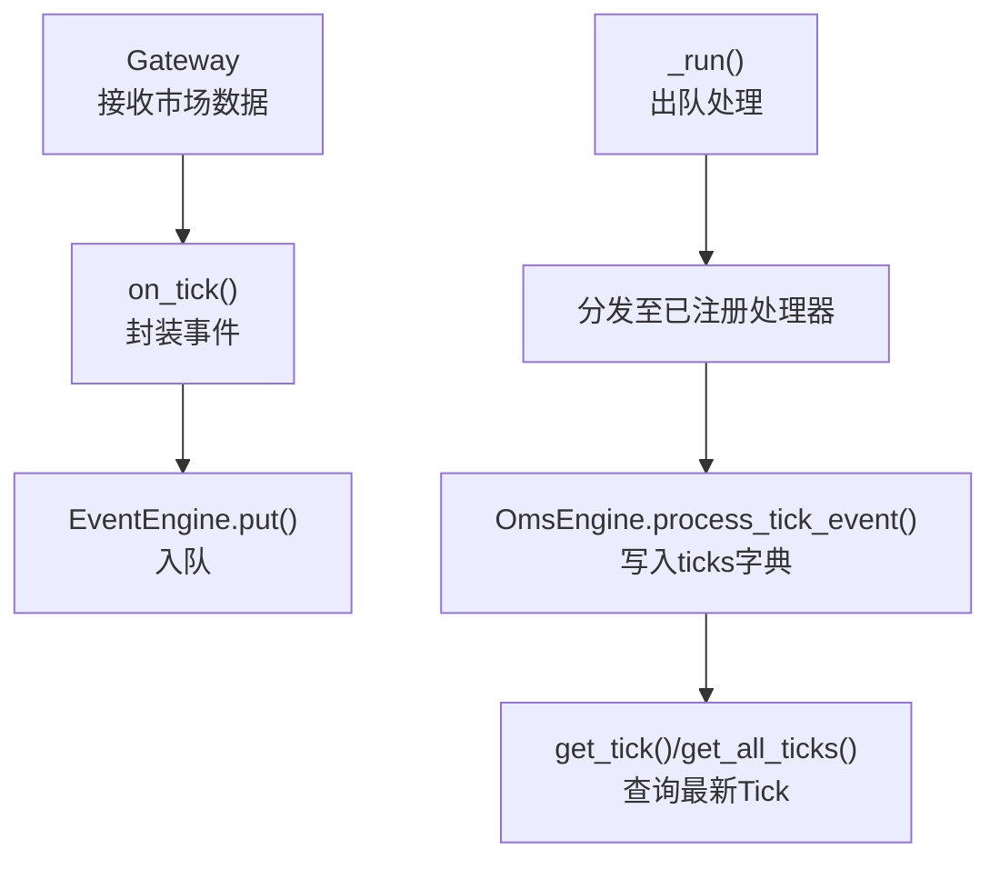
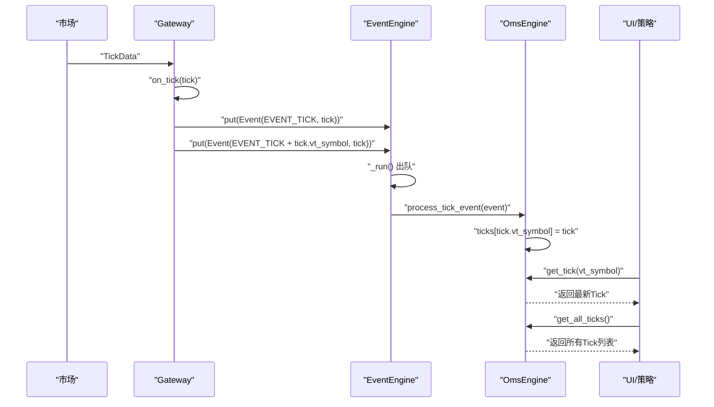
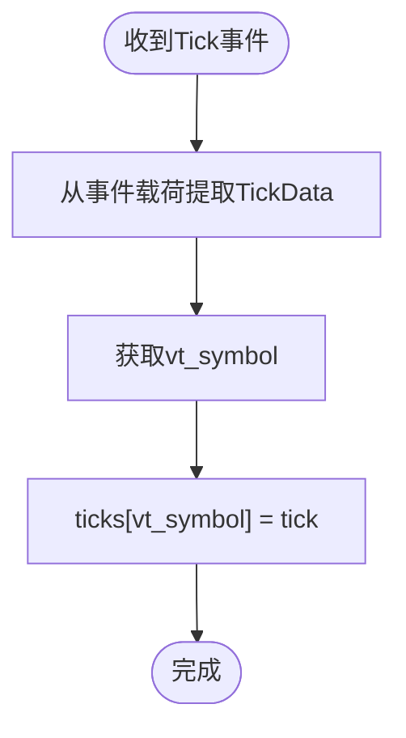
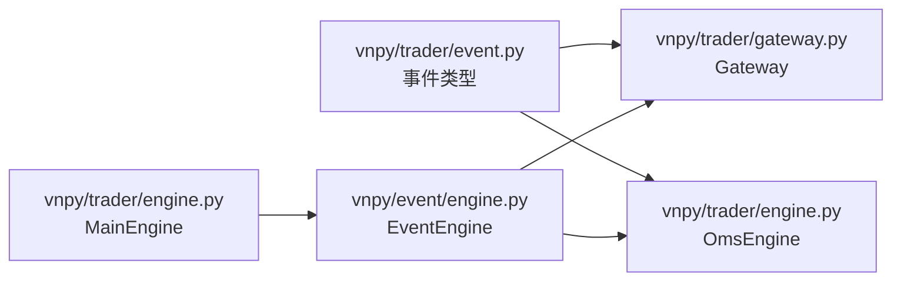

# Tick数据流

<cite>
**本文引用的文件列表**
- [vnpy/trader/engine.py](file://vnpy/trader/engine.py)
- [vnpy/trader/gateway.py](file://vnpy/trader/gateway.py)
- [vnpy/trader/event.py](file://vnpy/trader/event.py)
- [vnpy/event/engine.py](file://vnpy/event/engine.py)
- [vnpy/trader/object.py](file://vnpy/trader/object.py)
- [vnpy/trader/ui/widget.py](file://vnpy/trader/ui/widget.py)
</cite>

## 目录
1. [引言](#引言)
2. [项目结构与角色定位](#项目结构与角色定位)
3. [核心组件](#核心组件)
4. [架构总览](#架构总览)
5. [详细组件分析](#详细组件分析)
6. [依赖关系分析](#依赖关系分析)
7. [性能与复杂度](#性能与复杂度)
8. [最佳实践与故障排查](#最佳实践与故障排查)
9. [结论](#结论)

## 引言
本文件围绕vnpy的Tick数据流展开，系统性梳理从市场到本地缓存的完整路径：从Gateway通过回调将TickData封装为事件，经由EventEngine分发，最终由OmsEngine的事件处理器写入内存缓存ticks字典，并提供get_tick与get_all_ticks等便捷查询接口。文档同时解释ticks字典的设计动机（高效存储与检索最新行情）、方法实现逻辑与使用场景，并给出订阅、延迟与断流等实战建议。

## 项目结构与角色定位
- 事件类型定义：交易层统一定义事件类型字符串，其中包含Tick事件类型。
- 网关层：负责接收市场数据，封装为TickData并通过on_tick回调推送到EventEngine。
- 事件引擎：提供事件队列、注册/注销处理器、定时器等能力。
- 引擎层（OmsEngine）：订阅Tick事件，维护ticks字典，提供查询接口。

图表来源
- [vnpy/trader/gateway.py](file://vnpy/trader/gateway.py#L93-L100)
- [vnpy/event/engine.py](file://vnpy/event/engine.py#L55-L88)
- [vnpy/trader/engine.py](file://vnpy/trader/engine.py#L363-L377)

章节来源
- [vnpy/trader/event.py](file://vnpy/trader/event.py#L7-L14)
- [vnpy/trader/gateway.py](file://vnpy/trader/gateway.py#L93-L100)
- [vnpy/event/engine.py](file://vnpy/event/engine.py#L55-L88)
- [vnpy/trader/engine.py](file://vnpy/trader/engine.py#L363-L377)

## 核心组件
- TickData：行情数据载体，包含最新价、成交量、买卖盘口等字段；vt_symbol用于唯一标识合约。
- Gateway：网关基类，提供on_tick等回调，将TickData封装为事件并推送。
- EventEngine：事件总线，负责事件入队、分发与通用处理器注册。
- OmsEngine：订单管理引擎，订阅Tick事件，维护ticks字典并提供查询接口。

章节来源
- [vnpy/trader/object.py](file://vnpy/trader/object.py#L30-L85)
- [vnpy/trader/gateway.py](file://vnpy/trader/gateway.py#L93-L100)
- [vnpy/event/engine.py](file://vnpy/event/engine.py#L55-L88)
- [vnpy/trader/engine.py](file://vnpy/trader/engine.py#L348-L377)

## 架构总览
Tick数据从市场到本地缓存的关键链路如下：
- 市场数据到达Gateway后，调用on_tick将TickData封装为Event(EVENT_TICK)，并同时发布按vt_symbol细分的事件。
- EventEngine在后台线程循环出队并分发事件，匹配到OmsEngine注册的处理器。
- OmsEngine的process_tick_event将TickData按vt_symbol写入ticks字典，实现“最新行情”的常数时间覆盖式更新。
- 上层可通过get_tick按vt_symbol获取最新Tick，或通过get_all_ticks一次性获取全部合约的最新Tick集合。

图表来源
- [vnpy/trader/gateway.py](file://vnpy/trader/gateway.py#L93-L100)
- [vnpy/event/engine.py](file://vnpy/event/engine.py#L55-L88)
- [vnpy/trader/engine.py](file://vnpy/trader/engine.py#L363-L377)

## 详细组件分析

### TickData与vt_symbol
- TickData在构造完成后生成vt_symbol，格式为“symbol.exchange”，作为跨模块统一的合约标识。
- 这一约定使得ticks字典以vt_symbol为键，天然具备唯一性与可读性，便于后续查询与序列化。

章节来源
- [vnpy/trader/object.py](file://vnpy/trader/object.py#L30-L85)

### Gateway事件推送
- on_tick会向EventEngine推送两类事件：
  - EVENT_TICK：通用Tick事件，携带TickData。
  - EVENT_TICK + tick.vt_symbol：按合约细分的事件，便于仅订阅某合约的用户直接接收。
- 这种双通道设计兼顾全局与局部订阅需求。

章节来源
- [vnpy/trader/gateway.py](file://vnpy/trader/gateway.py#L93-L100)

### EventEngine事件分发
- EventEngine内部使用队列承载事件，后台线程循环取事件并调用_process分发。
- 分发时先匹配精确事件类型，再分发给通用处理器（如有）。
- put方法负责将事件入队，register/unregister用于注册/注销处理器。

章节来源
- [vnpy/event/engine.py](file://vnpy/event/engine.py#L55-L88)
- [vnpy/event/engine.py](file://vnpy/event/engine.py#L105-L145)

### OmsEngine ticks字典与事件处理
- 初始化时注册EVENT_TICK处理器，处理函数将TickData按vt_symbol写入ticks字典。
- 设计目的：
  - 快速覆盖：每次新Tick到达即覆盖旧值，保证ticks始终保存最新行情。
  - 高效查询：以键索引访问，平均O(1)时间复杂度。
  - 轻量缓存：仅保留最新Tick，避免历史冗余占用内存。
- 查询接口：
  - get_tick(vt_symbol)：按键获取最新Tick，不存在则返回None。
  - get_all_ticks()：遍历字典值，返回所有Tick列表。

图表来源
- [vnpy/trader/engine.py](file://vnpy/trader/engine.py#L363-L377)

章节来源
- [vnpy/trader/engine.py](file://vnpy/trader/engine.py#L348-L377)
- [vnpy/trader/engine.py](file://vnpy/trader/engine.py#L483-L487)

### UI侧事件绑定示例
- UI组件通常通过event_engine.register(EVENT_TICK, ...)将信号与回调绑定，实现界面实时显示。
- 这体现了事件驱动架构下“订阅者无需感知生产者”的解耦特性。

章节来源
- [vnpy/trader/ui/widget.py](file://vnpy/trader/ui/widget.py#L856-L859)
- [vnpy/trader/ui/widget.py](file://vnpy/trader/ui/widget.py#L861-L888)

## 依赖关系分析
- 事件类型：交易层定义EVENT_TICK等事件字符串，供Gateway与引擎共享。
- 组件耦合：
  - Gateway依赖EventEngine进行事件推送。
  - OmsEngine依赖EventEngine进行事件订阅与处理。
  - MainEngine负责初始化EventEngine并注入到各组件。
- 外部依赖：EventEngine基于标准库Queue与Thread实现，具备线程安全与阻塞控制。

图表来源
- [vnpy/trader/event.py](file://vnpy/trader/event.py#L7-L14)
- [vnpy/trader/gateway.py](file://vnpy/trader/gateway.py#L93-L100)
- [vnpy/trader/engine.py](file://vnpy/trader/engine.py#L363-L377)
- [vnpy/event/engine.py](file://vnpy/event/engine.py#L55-L88)

章节来源
- [vnpy/trader/event.py](file://vnpy/trader/event.py#L7-L14)
- [vnpy/trader/gateway.py](file://vnpy/trader/gateway.py#L93-L100)
- [vnpy/trader/engine.py](file://vnpy/trader/engine.py#L363-L377)
- [vnpy/event/engine.py](file://vnpy/event/engine.py#L55-L88)

## 性能与复杂度
- 写入复杂度：ticks字典写入为O(1)均摊，适合高频Tick流。
- 查询复杂度：
  - 单键查询get_tick为O(1)。
  - 全量查询get_all_ticks为O(N)，N为合约数量。
- 内存占用：ticks仅保存最新Tick，随合约数量线性增长；若需历史Tick，请结合持久化方案。

章节来源
- [vnpy/trader/engine.py](file://vnpy/trader/engine.py#L483-L487)

## 最佳实践与故障排查

### 行情订阅最佳实践
- 正确注册事件处理器
  - 在OmsEngine初始化后，确保已注册EVENT_TICK处理器（由register_event自动完成）。
  - 若自定义组件需要接收Tick，应通过event_engine.register(EVENT_TICK, ...)注册回调。
- 使用vt_symbol作为键
  - 所有查询与缓存均以vt_symbol为键，务必保证传入的vt_symbol格式正确（symbol.exchange）。
- 合约订阅
  - 通过Gateway的subscribe接口发起订阅请求，确保Gateway内部能持续产生TickData并触发on_tick。

章节来源
- [vnpy/trader/engine.py](file://vnpy/trader/engine.py#L363-L377)
- [vnpy/trader/gateway.py](file://vnpy/trader/gateway.py#L190-L194)
- [vnpy/trader/object.py](file://vnpy/trader/object.py#L30-L85)

### 处理行情延迟
- 事件队列可能成为瓶颈：EventEngine内部使用队列，若上游推送过快或下游处理较慢，可能导致积压。
- 建议：
  - 保持事件处理器轻量化，避免在process_tick_event中执行耗时操作。
  - 将重计算或IO操作移至异步任务或独立线程。
  - 如需统计延迟，可在TickData中记录本地时间与服务器时间差，辅助评估网络与处理时延。

章节来源
- [vnpy/event/engine.py](file://vnpy/event/engine.py#L55-L88)

### 应对行情断流
- 断流表现：ticks字典不会主动清理，仍保留断流前的最后一条Tick。
- 建议：
  - 在上层策略中增加超时检测：若某vt_symbol长时间未更新，视为断流并触发告警或切换备用数据源。
  - 结合日志引擎（LogEngine）记录断流事件，便于追踪与回溯。

章节来源
- [vnpy/trader/engine.py](file://vnpy/trader/engine.py#L348-L377)
- [vnpy/trader/engine.py](file://vnpy/trader/engine.py#L130-L167)

## 结论
vnpy的Tick数据流采用事件驱动架构：Gateway负责将市场数据封装为事件并推送，EventEngine负责分发，OmsEngine订阅并以ticks字典高效缓存最新Tick。该设计在保证低延迟的同时，提供了简洁的查询接口与良好的扩展性。开发者应遵循vt_symbol命名规范、正确注册事件处理器，并在高并发场景下优化事件处理逻辑，以获得稳定可靠的行情数据服务。