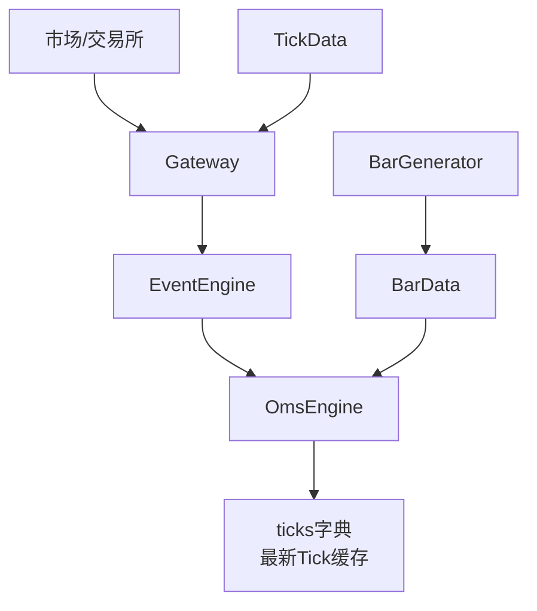
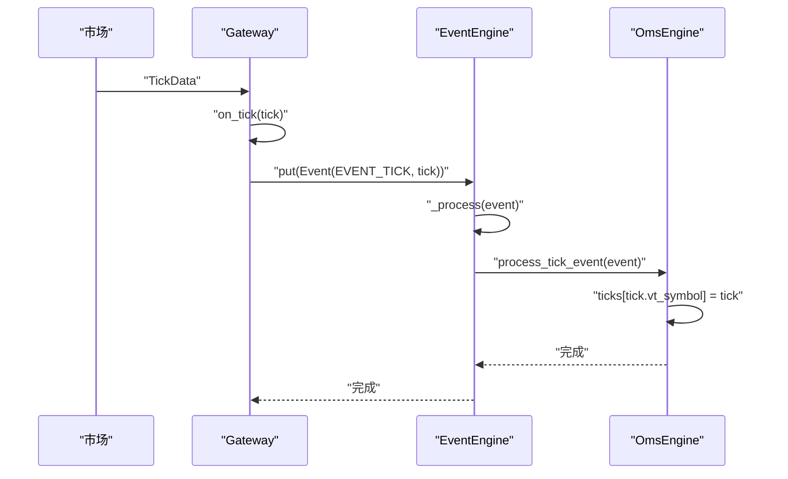
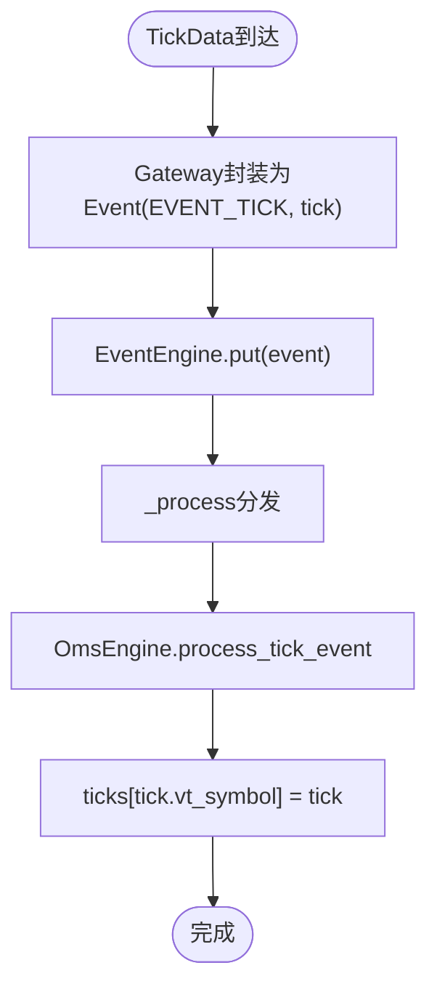
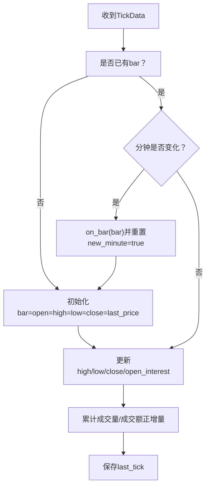
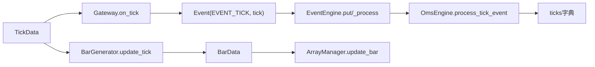

# 行情数据流

<cite>
**本文引用的文件**
- [vnpy/trader/object.py](file://vnpy/trader/object.py)
- [vnpy/trader/event.py](file://vnpy/trader/event.py)
- [vnpy/event/engine.py](file://vnpy/event/engine.py)
- [vnpy/trader/gateway.py](file://vnpy/trader/gateway.py)
- [vnpy/trader/engine.py](file://vnpy/trader/engine.py)
- [vnpy/trader/utility.py](file://vnpy/trader/utility.py)
- [examples/veighna_trader/demo_script.py](file://examples/veighna_trader/demo_script.py)
- [docs/community/app/script_trader.md](file://docs/community/app/script_trader.md)
</cite>

## 目录
1. [引言](#引言)
2. [项目结构](#项目结构)
3. [核心组件](#核心组件)
4. [架构总览](#架构总览)
5. [详细组件分析](#详细组件分析)
6. [依赖关系分析](#依赖关系分析)
7. [性能考量](#性能考量)
8. [故障排查指南](#故障排查指南)
9. [结论](#结论)
10. [附录](#附录)

## 引言
本文围绕vnpy的行情数据流展开，聚焦从市场到本地缓存的完整路径，以TickData为例，说明其如何经由Gateway通过事件引擎（EventEngine）触发EVENT_TICK事件，最终被OmsEngine的process_tick_event方法捕获并存储到ticks字典中。同时，本文阐述BarData的生成机制（基于TickData聚合生成K线），解释OmsEngine中ticks字典的设计目的（高效存储和检索最新行情数据），并结合源码说明get_tick与get_all_ticks等方法的实现逻辑与使用场景。最后给出开发者在行情数据订阅方面的最佳实践，包括正确注册事件处理器、处理行情延迟与断流的建议。

## 项目结构
围绕行情数据流的关键文件与职责如下：
- 数据模型：TickData、BarData等基础数据结构定义
- 事件系统：EventEngine与事件类型常量
- 网关层：Gateway封装来自市场的Tick推送
- 主引擎：MainEngine协调订阅与转发
- 订单管理引擎：OmsEngine接收EVENT_TICK并缓存ticks
- 工具库：BarGenerator用于Tick到Bar的聚合

图表来源
- [vnpy/trader/gateway.py](file://vnpy/trader/gateway.py#L86-L110)
- [vnpy/event/engine.py](file://vnpy/event/engine.py#L105-L146)
- [vnpy/trader/event.py](file://vnpy/trader/event.py#L7-L14)
- [vnpy/trader/engine.py](file://vnpy/trader/engine.py#L340-L372)
- [vnpy/trader/utility.py](file://vnpy/trader/utility.py#L165-L260)

章节来源
- [vnpy/trader/object.py](file://vnpy/trader/object.py#L29-L110)
- [vnpy/trader/event.py](file://vnpy/trader/event.py#L7-L14)
- [vnpy/event/engine.py](file://vnpy/event/engine.py#L1-L146)
- [vnpy/trader/gateway.py](file://vnpy/trader/gateway.py#L86-L110)
- [vnpy/trader/engine.py](file://vnpy/trader/engine.py#L340-L372)
- [vnpy/trader/utility.py](file://vnpy/trader/utility.py#L165-L260)

## 核心组件
- TickData与BarData：定义行情与K线的基础数据结构，包含vt_symbol等关键标识
- EventEngine：事件驱动引擎，负责事件的入队、分发与定时器
- EVENT_TICK：Tick行情事件类型
- Gateway：封装订阅与推送Tick，通过on_event/on_tick将Tick包装为Event并入队
- OmsEngine：注册EVENT_TICK处理器，将最新Tick缓存到ticks字典
- BarGenerator：Tick到Bar的聚合器，支持分钟、小时、日K合成与窗口K线

章节来源
- [vnpy/trader/object.py](file://vnpy/trader/object.py#L29-L110)
- [vnpy/trader/event.py](file://vnpy/trader/event.py#L7-L14)
- [vnpy/event/engine.py](file://vnpy/event/engine.py#L105-L146)
- [vnpy/trader/gateway.py](file://vnpy/trader/gateway.py#L86-L110)
- [vnpy/trader/engine.py](file://vnpy/trader/engine.py#L340-L372)
- [vnpy/trader/utility.py](file://vnpy/trader/utility.py#L165-L260)

## 架构总览
从市场到本地缓存的完整路径如下：
1. 市场产生TickData，Gateway调用on_tick将其封装为Event并put到EventEngine
2. EventEngine按类型分发，OmsEngine注册的EVENT_TICK处理器被调用
3. OmsEngine的process_tick_event将TickData写入ticks字典（按键vt_symbol覆盖最新）
4. 上层可通过get_tick或get_all_ticks读取最新Tick缓存

图表来源
- [vnpy/trader/gateway.py](file://vnpy/trader/gateway.py#L86-L110)
- [vnpy/event/engine.py](file://vnpy/event/engine.py#L66-L79)
- [vnpy/trader/engine.py](file://vnpy/trader/engine.py#L373-L377)

章节来源
- [vnpy/trader/gateway.py](file://vnpy/trader/gateway.py#L86-L110)
- [vnpy/event/engine.py](file://vnpy/event/engine.py#L55-L89)
- [vnpy/trader/engine.py](file://vnpy/trader/engine.py#L373-L377)

## 详细组件分析

### TickData到ticks字典的完整路径
- Gateway.on_tick：将TickData封装为Event(EVENT_TICK, tick)，并通过on_event调用EventEngine.put
- EventEngine._process：按事件类型分发，调用已注册的处理器
- OmsEngine.register_event：注册EVENT_TICK处理器process_tick_event
- OmsEngine.process_tick_event：将tick.vt_symbol作为键，覆盖式写入ticks字典

图表来源
- [vnpy/trader/gateway.py](file://vnpy/trader/gateway.py#L86-L110)
- [vnpy/event/engine.py](file://vnpy/event/engine.py#L66-L79)
- [vnpy/trader/engine.py](file://vnpy/trader/engine.py#L363-L377)

章节来源
- [vnpy/trader/gateway.py](file://vnpy/trader/gateway.py#L86-L110)
- [vnpy/event/engine.py](file://vnpy/event/engine.py#L66-L79)
- [vnpy/trader/engine.py](file://vnpy/trader/engine.py#L363-L377)

### BarData的生成机制（Tick到K线）
- BarGenerator.update_tick：以TickData为输入，按分钟粒度合成1分钟BarData；当分钟切换时触发on_bar回调
- BarGenerator.update_bar：将1分钟BarData进一步合成x分钟、x小时或日K线，支持窗口K线（window_bar）
- ArrayManager.update_bar：将BarData写入滑动数组，供技术指标计算使用

图表来源
- [vnpy/trader/utility.py](file://vnpy/trader/utility.py#L203-L260)
- [vnpy/trader/utility.py](file://vnpy/trader/utility.py#L261-L364)
- [vnpy/trader/utility.py](file://vnpy/trader/utility.py#L487-L531)

章节来源
- [vnpy/trader/utility.py](file://vnpy/trader/utility.py#L165-L260)
- [vnpy/trader/utility.py](file://vnpy/trader/utility.py#L261-L364)
- [vnpy/trader/utility.py](file://vnpy/trader/utility.py#L487-L531)

### OmsEngine中ticks字典的设计目的
- 设计目标：以键值对形式高效存储每个vt_symbol的最新TickData，提供O(1)平均复杂度的读取与覆盖写入
- 使用场景：get_tick按vt_symbol快速获取最新Tick；get_all_ticks返回所有标的的最新Tick集合
- 适用性：适合高频读取最新行情的策略与UI组件，不适合历史回放或批量统计

章节来源
- [vnpy/trader/engine.py](file://vnpy/trader/engine.py#L340-L372)
- [vnpy/trader/engine.py](file://vnpy/trader/engine.py#L441-L488)

### get_tick与get_all_ticks的实现逻辑与使用场景
- get_tick：通过ticks字典按vt_symbol键取值，返回None或最新TickData
- get_all_ticks：返回ticks.values()的列表，适合批量展示或遍历
- 使用场景：策略轮询获取最新Tick、UI组件实时显示、数据导出与分析

章节来源
- [vnpy/trader/engine.py](file://vnpy/trader/engine.py#L441-L488)

### 订阅机制与最佳实践
- 订阅入口：MainEngine.subscribe(SubscribeRequest, gateway_name)调用具体Gateway.subscribe
- 订阅示例：脚本示例中演示了订阅vt_symbols并轮询get_tick
- 最佳实践：
  - 在策略或脚本启动时先订阅所需vt_symbol，再开始读取get_tick
  - 对于批量订阅，建议集中在一个位置统一管理，避免重复订阅
  - 处理行情延迟：get_tick可能返回None或旧数据，应在业务侧做超时与告警
  - 处理断流：定期检查ticks字典中各标的的last_update时间，超过阈值视为断流并报警
  - 注册事件处理器：确保OmsEngine已注册EVENT_TICK处理器（默认在构造时完成）

章节来源
- [vnpy/trader/engine.py](file://vnpy/trader/engine.py#L223-L231)
- [examples/veighna_trader/demo_script.py](file://examples/veighna_trader/demo_script.py#L21-L41)
- [docs/community/app/script_trader.md](file://docs/community/app/script_trader.md#L164-L216)

## 依赖关系分析
- 数据模型依赖：TickData/BarData均继承BaseData，包含gateway_name与vt_symbol等关键字段
- 事件类型：EVENT_TICK由trader.event定义，EventEngine提供事件分发能力
- 网关到引擎：Gateway通过on_event将TickData封装为Event并put到EventEngine
- 引擎到缓存：OmsEngine注册EVENT_TICK处理器，将TickData写入ticks字典
- K线合成：BarGenerator依赖TickData生成BarData，ArrayManager依赖BarData进行指标计算

图表来源
- [vnpy/trader/object.py](file://vnpy/trader/object.py#L29-L110)
- [vnpy/trader/event.py](file://vnpy/trader/event.py#L7-L14)
- [vnpy/event/engine.py](file://vnpy/event/engine.py#L66-L79)
- [vnpy/trader/gateway.py](file://vnpy/trader/gateway.py#L86-L110)
- [vnpy/trader/engine.py](file://vnpy/trader/engine.py#L363-L377)
- [vnpy/trader/utility.py](file://vnpy/trader/utility.py#L165-L260)

章节来源
- [vnpy/trader/object.py](file://vnpy/trader/object.py#L29-L110)
- [vnpy/trader/event.py](file://vnpy/trader/event.py#L7-L14)
- [vnpy/event/engine.py](file://vnpy/event/engine.py#L66-L79)
- [vnpy/trader/gateway.py](file://vnpy/trader/gateway.py#L86-L110)
- [vnpy/trader/engine.py](file://vnpy/trader/engine.py#L363-L377)
- [vnpy/trader/utility.py](file://vnpy/trader/utility.py#L165-L260)

## 性能考量
- 事件处理线程模型：EventEngine在独立线程中处理事件，处理器同步执行，避免复杂锁
- ticks字典：哈希表写入与读取均为O(1)平均复杂度，适合高频读取最新Tick
- BarGenerator：按分钟粒度合成，on_bar回调应避免耗时操作；窗口K线合成支持分钟/小时/日周期
- ArrayManager：滑动数组更新为O(1)，适合大量技术指标计算

章节来源
- [vnpy/event/engine.py](file://vnpy/event/engine.py#L55-L89)
- [vnpy/trader/engine.py](file://vnpy/trader/engine.py#L441-L488)
- [vnpy/trader/utility.py](file://vnpy/trader/utility.py#L165-L260)
- [vnpy/trader/utility.py](file://vnpy/trader/utility.py#L487-L531)

## 故障排查指南
- 订阅无效：确认MainEngine.subscribe已调用具体Gateway.subscribe，且vt_symbol格式正确
- 读取不到Tick：检查OmsEngine是否已注册EVENT_TICK处理器；确认ticks字典中是否存在该vt_symbol
- 行情延迟/断流：在业务侧增加超时检测与告警；对长时间无更新的vt_symbol进行断流处理
- K线缺失：确认BarGenerator.update_tick是否被调用；检查last_price是否为0（会被过滤）

章节来源
- [vnpy/trader/engine.py](file://vnpy/trader/engine.py#L223-L231)
- [vnpy/trader/engine.py](file://vnpy/trader/engine.py#L363-L377)
- [vnpy/trader/utility.py](file://vnpy/trader/utility.py#L203-L212)

## 结论
vnpy通过事件驱动架构将市场TickData高效地传递到OmsEngine，并以ticks字典实现最新行情的快速缓存与检索。BarGenerator为Tick到Bar的K线合成提供了清晰的实现路径，配合ArrayManager可支撑丰富的技术分析。开发者在订阅与使用过程中应遵循最佳实践，关注延迟与断流问题，确保策略与UI组件的稳定性与准确性。

## 附录
- 示例脚本展示了订阅与轮询读取Tick的典型流程
- 文档说明了get_tick/get_all_ticks的使用方式与适用场景

章节来源
- [examples/veighna_trader/demo_script.py](file://examples/veighna_trader/demo_script.py#L21-L41)
- [docs/community/app/script_trader.md](file://docs/community/app/script_trader.md#L164-L216)