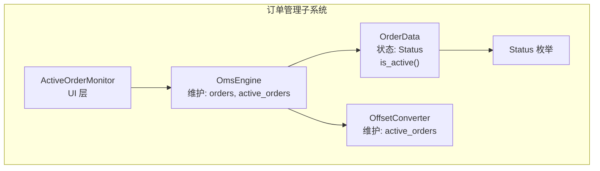
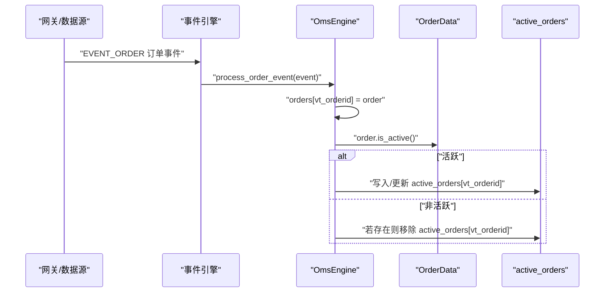
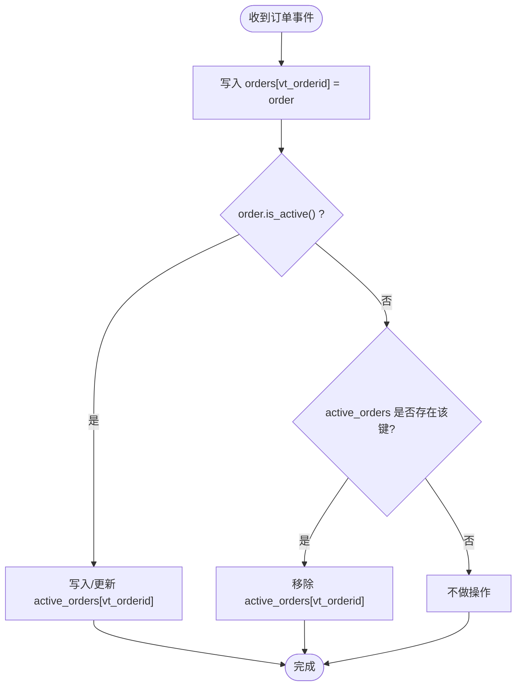
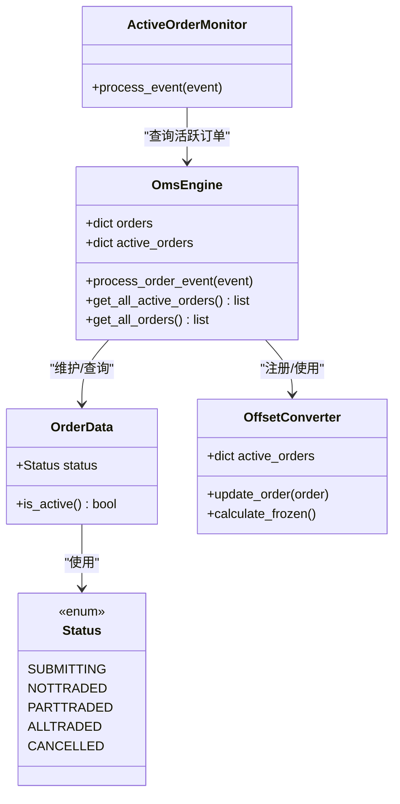

# 活动订单管理

<cite>
**本文引用的文件列表**
- [vnpy/trader/engine.py](file://vnpy/trader/engine.py)
- [vnpy/trader/object.py](file://vnpy/trader/object.py)
- [vnpy/trader/constant.py](file://vnpy/trader/constant.py)
- [vnpy/trader/converter.py](file://vnpy/trader/converter.py)
- [vnpy/trader/ui/widget.py](file://vnpy/trader/ui/widget.py)
</cite>

## 目录
1. [引言](#引言)
2. [项目结构](#项目结构)
3. [核心组件](#核心组件)
4. [架构总览](#架构总览)
5. [详细组件分析](#详细组件分析)
6. [依赖关系分析](#依赖关系分析)
7. [性能考量](#性能考量)
8. [故障排查指南](#故障排查指南)
9. [结论](#结论)
10. [附录](#附录)

## 引言
本文件围绕vnpy的订单管理系统，深入解析OmsEngine中“活动订单”集合active_orders的设计与实现，阐明其仅保留处于活跃状态（is_active()为True）的订单，包括Submitted、NotTraded、PartTraded三类；而AllTraded或Cancelled订单则被移出集合。结合process_order_event方法的工作流程，解释系统如何在收到订单更新事件时自动维护该集合。同时对比get_all_active_orders与get_all_orders在性能与使用场景上的差异，并给出策略开发中合理利用活动订单查询的最佳实践，如防止重复下单与批量撤单。

## 项目结构
与活动订单管理直接相关的核心文件如下：
- OmsEngine：订单管理引擎，负责接收订单事件并维护orders与active_orders两个字典
- OrderData：订单数据模型，包含状态字段与is_active()判断逻辑
- Status：订单状态枚举，定义SUBMITTING、NOTTRADED、PARTTRADED、ALLTRADED、CANCELLED等
- OffsetConverter：偏移转换器，内部也维护一个按活跃状态组织的active_orders字典，用于冻结量计算等
- ActiveOrderMonitor：UI组件，基于订单是否活跃进行行显示控制

图表来源
- [vnpy/trader/engine.py](file://vnpy/trader/engine.py#L338-L565)
- [vnpy/trader/object.py](file://vnpy/trader/object.py#L112-L151)
- [vnpy/trader/constant.py](file://vnpy/trader/constant.py#L30-L40)
- [vnpy/trader/converter.py](file://vnpy/trader/converter.py#L17-L26)
- [vnpy/trader/ui/widget.py](file://vnpy/trader/ui/widget.py#L1053-L1072)

章节来源
- [vnpy/trader/engine.py](file://vnpy/trader/engine.py#L338-L565)
- [vnpy/trader/object.py](file://vnpy/trader/object.py#L112-L151)
- [vnpy/trader/constant.py](file://vnpy/trader/constant.py#L30-L40)
- [vnpy/trader/converter.py](file://vnpy/trader/converter.py#L17-L26)
- [vnpy/trader/ui/widget.py](file://vnpy/trader/ui/widget.py#L1053-L1072)

## 核心组件
- OmsEngine.active_orders：按vt_orderid索引的活跃订单字典，仅保存is_active()为True的订单
- OmsEngine.process_order_event：处理订单事件，同步更新orders与active_orders
- OmsEngine.get_all_active_orders：返回当前活跃订单列表
- OrderData.is_active()：基于状态集合ACTIVE_STATUSES判断是否活跃
- Status枚举：定义SUBMITTING、NOTTRADED、PARTTRADED、ALLTRADED、CANCELLED等状态
- OffsetConverter.active_orders：内部活跃订单字典，用于冻结量计算等

章节来源
- [vnpy/trader/engine.py](file://vnpy/trader/engine.py#L338-L565)
- [vnpy/trader/object.py](file://vnpy/trader/object.py#L112-L151)
- [vnpy/trader/constant.py](file://vnpy/trader/constant.py#L30-L40)
- [vnpy/trader/converter.py](file://vnpy/trader/converter.py#L17-L26)

## 架构总览
OmsEngine通过事件驱动的方式接收来自网关的订单更新，统一写入orders字典，并根据订单状态决定是否加入或移除active_orders。这一设计使得上层查询活跃订单时无需遍历全量订单，显著提升效率。

图表来源
- [vnpy/trader/engine.py](file://vnpy/trader/engine.py#L377-L388)

## 详细组件分析

### OmsEngine.active_orders 设计与实现
- 数据结构
  - orders：完整订单历史字典，键为vt_orderid，值为OrderData
  - active_orders：仅包含活跃订单的字典，键为vt_orderid，值为OrderData
- 维护策略
  - 收到订单事件时，先写入orders
  - 若order.is_active()为True，则写入或更新active_orders
  - 否则，若该vt_orderid存在于active_orders中，则移除
- 查询接口
  - get_all_orders：返回orders.values()，包含所有历史订单
  - get_all_active_orders：返回active_orders.values()，仅包含活跃订单

图表来源
- [vnpy/trader/engine.py](file://vnpy/trader/engine.py#L377-L388)

章节来源
- [vnpy/trader/engine.py](file://vnpy/trader/engine.py#L338-L565)

### OrderData.is_active() 判断逻辑
- ACTIVE_STATUSES集合包含SUBMITTING、NOTTRADED、PARTTRADED三类
- 当订单状态属于该集合时，is_active()返回True，否则False
- 因此，ALLTRADED与CANCELLED不会进入active_orders

章节来源
- [vnpy/trader/object.py](file://vnpy/trader/object.py#L14-L16)
- [vnpy/trader/object.py](file://vnpy/trader/object.py#L137-L141)
- [vnpy/trader/constant.py](file://vnpy/trader/constant.py#L30-L40)

### OffsetConverter.active_orders 的作用
- OffsetConverter内部同样维护一个active_orders字典，用于统计当前活跃委托导致的冻结量
- 在update_order时，会根据是否活跃决定加入或移除该内部字典
- 在calculate_frozen时，遍历该内部字典计算冻结量，避免超仓

章节来源
- [vnpy/trader/converter.py](file://vnpy/trader/converter.py#L17-L26)
- [vnpy/trader/converter.py](file://vnpy/trader/converter.py#L54-L61)
- [vnpy/trader/converter.py](file://vnpy/trader/converter.py#L121-L155)

### UI层对活动订单的展示
- ActiveOrderMonitor在处理订单事件时，根据order.is_active()决定显示/隐藏对应行
- 这体现了活跃订单在界面层的直观呈现需求

章节来源
- [vnpy/trader/ui/widget.py](file://vnpy/trader/ui/widget.py#L1053-L1072)

## 依赖关系分析
- OmsEngine依赖OrderData的状态字段与is_active()方法
- OrderData依赖Status枚举
- OffsetConverter依赖OmsEngine提供的订单/交易/持仓更新能力
- UI层依赖OmsEngine的活跃订单查询接口

图表来源
- [vnpy/trader/engine.py](file://vnpy/trader/engine.py#L338-L565)
- [vnpy/trader/object.py](file://vnpy/trader/object.py#L112-L151)
- [vnpy/trader/constant.py](file://vnpy/trader/constant.py#L30-L40)
- [vnpy/trader/converter.py](file://vnpy/trader/converter.py#L54-L61)
- [vnpy/trader/ui/widget.py](file://vnpy/trader/ui/widget.py#L1053-L1072)

## 性能考量
- get_all_active_orders的时间复杂度为O(k)，k为当前活跃订单数量
- get_all_orders的时间复杂度为O(n)，n为历史订单总数
- 在高频交易场景下，活跃订单通常远小于历史订单总数，因此get_all_active_orders具有明显性能优势
- 对于策略侧的风控与风控自动化（如批量撤单），优先使用get_all_active_orders可减少遍历成本

章节来源
- [vnpy/trader/engine.py](file://vnpy/trader/engine.py#L524-L529)

## 故障排查指南
- 症状：get_all_active_orders返回为空
  - 可能原因：订单尚未进入活跃状态（如已全部成交或撤销）
  - 排查建议：确认订单状态是否属于ACTIVE_STATUSES
- 症状：活跃订单未及时消失
  - 可能原因：订单状态未正确更新或未触发订单事件
  - 排查建议：检查process_order_event是否被调用，以及order.is_active()逻辑
- 症状：冻结量计算异常
  - 可能原因：OffsetConverter内部active_orders未同步更新
  - 排查建议：确认update_order是否在订单事件后被调用

章节来源
- [vnpy/trader/engine.py](file://vnpy/trader/engine.py#L377-L388)
- [vnpy/trader/converter.py](file://vnpy/trader/converter.py#L54-L61)

## 结论
OmsEngine通过在订单事件处理阶段同步维护active_orders，实现了对活跃订单的高效管理。该设计以较小的内存占用换取了查询性能的显著提升，适合策略开发中频繁查询活跃订单的场景。结合is_active()的明确状态语义与OffsetConverter的冻结量计算，系统在保证正确性的同时兼顾了性能与易用性。

## 附录

### 最佳实践清单（策略开发）
- 防止重复下单
  - 在下单前先调用get_all_active_orders，过滤掉同一vt_symbol且方向/开平组合相同的活跃订单，避免重复挂单
- 批量撤单
  - 使用get_all_active_orders获取当前所有活跃订单，遍历vt_orderid执行撤单请求，确保覆盖所有未成交委托
- 风控自动化
  - 基于活跃订单数量与金额阈值，动态调整下单节奏或触发风控条件
- UI展示优化
  - 使用ActiveOrderMonitor仅展示活跃订单，降低界面渲染压力

章节来源
- [vnpy/trader/engine.py](file://vnpy/trader/engine.py#L524-L529)
- [vnpy/trader/ui/widget.py](file://vnpy/trader/ui/widget.py#L1053-L1072)