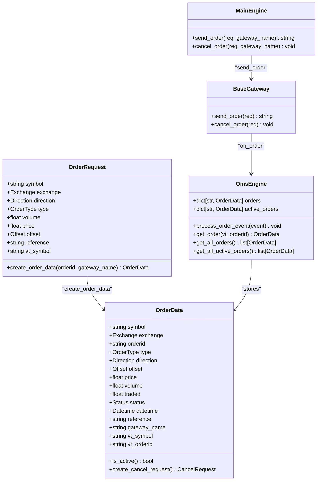
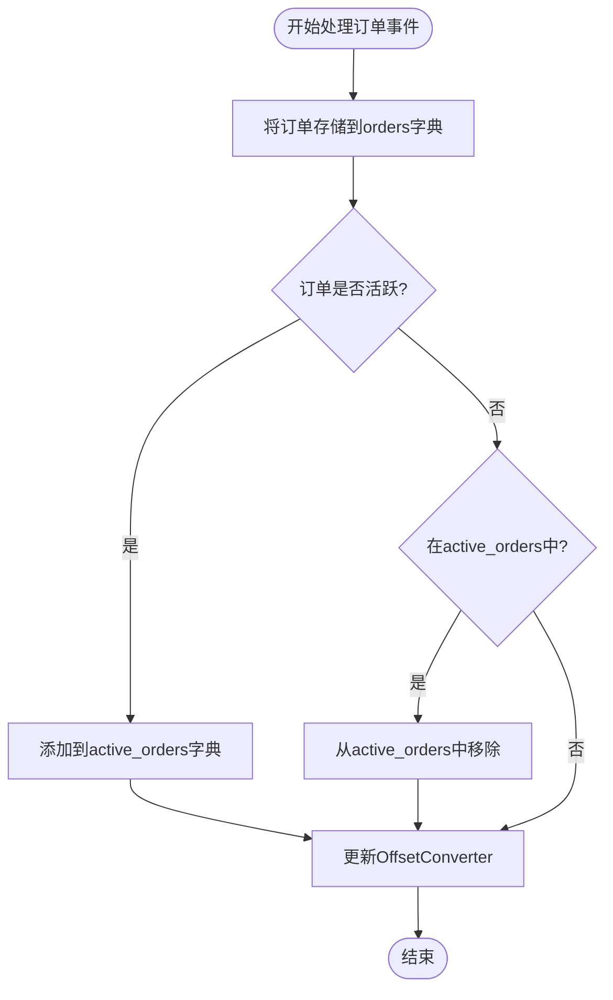
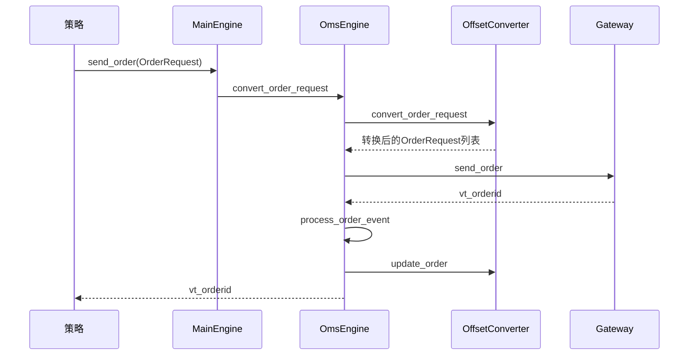

# 订单数据流

<cite>
**本文档引用的文件**   
- [object.py](file://vnpy/trader/object.py)
- [engine.py](file://vnpy/trader/engine.py)
- [converter.py](file://vnpy/trader/converter.py)
- [gateway.py](file://vnpy/trader/gateway.py)
- [constant.py](file://vnpy/trader/constant.py)
- [widget.py](file://vnpy/trader/ui/widget.py)
- [event.py](file://vnpy/trader/event.py)
</cite>

## 目录
1. [订单生命周期概述](#订单生命周期概述)
2. [核心组件分析](#核心组件分析)
3. [OmsEngine订单管理机制](#omsengine订单管理机制)
4. [OffsetConverter开平仓维护](#offsetconverter开平仓维护)
5. [订单查询方法实现](#订单查询方法实现)
6. [订单状态变更处理](#订单状态变更处理)
7. [开发者最佳实践](#开发者最佳实践)

## 订单生命周期概述

在vnpy框架中，订单数据流从策略发出订单请求开始，经过MainEngine转发给Gateway，最终由交易所返回订单状态更新。整个流程通过事件驱动机制实现，确保了系统的松耦合和高响应性。

当策略调用`send_order`方法时，会生成一个`OrderRequest`对象，该对象包含了交易所需的所有必要信息，如交易方向、开平仓类型、价格和数量等。这个请求随后被发送到`MainEngine`，由其负责将请求转发给相应的`Gateway`。

`Gateway`作为连接vnpy与具体交易接口的桥梁，负责将`OrderRequest`转换为交易所能够理解的格式并发送。一旦交易所接收到订单，它会返回一个订单状态更新，这个更新通过`EVENT_ORDER`事件被`OmsEngine`捕获并处理。

**Section sources**
- [object.py](file://vnpy/trader/object.py#L320-L355)
- [engine.py](file://vnpy/trader/engine.py#L241-L243)
- [gateway.py](file://vnpy/trader/gateway.py#L197-L212)

## 核心组件分析

vnpy的订单管理系统由多个核心组件构成，每个组件都有其特定的职责。`OrderData`是订单数据的核心表示，包含了订单的所有属性，如订单号、交易方向、开平仓类型、价格、数量和状态等。

`OrderRequest`是创建新订单的请求对象，它包含了创建订单所需的所有信息。当策略需要下单时，会创建一个`OrderRequest`对象并将其发送给`MainEngine`。

`OmsEngine`（订单管理系统引擎）是整个订单管理的核心，负责维护所有订单的状态，处理订单事件，并提供各种订单查询接口。它通过事件机制与系统其他部分进行通信，确保订单状态的实时更新。

**Diagram sources **
- [object.py](file://vnpy/trader/object.py#L111-L151)
- [engine.py](file://vnpy/trader/engine.py#L348-L356)
- [gateway.py](file://vnpy/trader/gateway.py#L197-L212)

**Section sources**
- [object.py](file://vnpy/trader/object.py#L111-L151)
- [engine.py](file://vnpy/trader/engine.py#L348-L356)
- [gateway.py](file://vnpy/trader/gateway.py#L197-L212)

## OmsEngine订单管理机制

`OmsEngine`使用两个字典来高效管理订单：`orders`和`active_orders`。`orders`字典存储了所有订单，包括已成交和已撤销的订单，为历史查询提供了完整的数据支持。`active_orders`字典则专门用于存储所有活动订单，即状态为"提交中"、"未成交"或"部分成交"的订单，这使得系统能够快速访问和操作当前活跃的订单。

这种设计模式具有显著的优势。首先，通过分离活动订单和所有订单，系统可以在不影响历史数据查询的情况下，高效地管理和更新活动订单。其次，`active_orders`字典的使用大大提高了活动订单的查询效率，特别是在需要频繁检查订单状态的场景下。

当订单状态发生变化时，`OmsEngine`的`process_order_event`方法会被触发。该方法首先将订单数据存储到`orders`字典中，然后根据订单的活动状态决定是否将其添加到或从`active_orders`字典中移除。如果订单是活动的，则将其添加到`active_orders`字典中；如果订单已不再是活动状态，则从`active_orders`字典中移除。

**Diagram sources **
- [engine.py](file://vnpy/trader/engine.py#L378-L388)

**Section sources**
- [engine.py](file://vnpy/trader/engine.py#L348-L356)
- [engine.py](file://vnpy/trader/engine.py#L378-L388)

## OffsetConverter开平仓维护

`OffsetConverter`是vnpy中用于维护开平仓正确性的关键组件，特别是在处理中国期货市场特有的"平今"和"平昨"规则时。它通过`PositionHolding`类来跟踪每个合约的持仓情况，包括多头和空头的今仓、昨仓以及冻结量。

当订单、成交或持仓数据更新时，`OffsetConverter`会相应地更新其内部状态。例如，当一个成交事件发生时，`update_trade`方法会被调用，根据成交的方向和开平仓类型，相应地调整持仓量。对于上海期货交易所（SHFE）和能源交易中心（INE）的合约，平仓时需要区分平今和平昨；而对于其他交易所，则使用通用的"平"操作。

`OffsetConverter`还负责处理订单请求的转换。在某些情况下，如锁仓或净仓模式下，原始的订单请求需要被转换为一个或多个实际的订单请求。`convert_order_request`方法根据指定的模式（锁仓或净仓）和交易所规则，将原始请求转换为适当的订单请求列表。

**Diagram sources **
- [converter.py](file://vnpy/trader/converter.py#L310-L402)
- [engine.py](file://vnpy/trader/engine.py#L545-L560)

**Section sources**
- [converter.py](file://vnpy/trader/converter.py#L310-L402)
- [engine.py](file://vnpy/trader/engine.py#L545-L560)

## 订单查询方法实现

`OmsEngine`提供了多种订单查询方法，以满足不同场景下的需求。`get_order`方法用于根据订单的`vt_orderid`获取单个订单的详细信息。该方法直接从`orders`字典中查找并返回指定的订单对象，如果订单不存在则返回`None`。

`get_all_orders`方法返回系统中所有订单的列表。该方法通过将`orders`字典的值转换为列表来实现，提供了对历史订单的完整访问。这对于需要分析交易历史或生成报告的场景非常有用。

`get_all_active_orders`方法专门用于获取所有活动订单的列表。与`get_all_orders`不同，该方法从`active_orders`字典中获取数据，确保只返回当前活跃的订单。这在需要监控和管理未完成订单的场景下特别有用，因为它避免了遍历所有历史订单的开销。

这些查询方法的设计体现了性能和功能的平衡。通过使用字典数据结构，所有查询操作的时间复杂度都保持在O(1)或O(n)，其中n是返回结果的数量，确保了高效的查询性能。

**Section sources**
- [engine.py](file://vnpy/trader/engine.py#L489-L493)
- [engine.py](file://vnpy/trader/engine.py#L525-L529)

## 订单状态变更处理

订单状态的变更通过事件驱动机制进行处理。每当订单状态发生变化时，`Gateway`会通过`on_order`回调方法将更新的`OrderData`对象发送回`MainEngine`，然后由`MainEngine`触发`EVENT_ORDER`事件。

`OmsEngine`注册了对`EVENT_ORDER`事件的监听，当事件发生时，`process_order_event`方法会被调用。该方法负责更新订单的本地缓存，包括`orders`和`active_orders`字典，并将订单状态变化通知给`OffsetConverter`以维护开平仓的正确性。

对于策略开发者来说，处理订单状态变更的最佳实践是通过订阅`EVENT_ORDER`事件来接收通知，而不是轮询查询订单状态。这不仅减少了系统开销，还能确保及时响应订单状态的变化。策略可以在收到订单更新事件后，根据新的订单状态执行相应的逻辑，如调整仓位、发出新的订单或更新风险管理参数。

**Section sources**
- [engine.py](file://vnpy/trader/engine.py#L378-L394)
- [event.py](file://vnpy/trader/event.py#L9)

## 开发者最佳实践

对于使用vnpy进行开发的用户，以下是一些关于订单管理的最佳实践：

1. **正确处理订单状态变更**：始终通过订阅`EVENT_ORDER`事件来监控订单状态的变化，而不是定期查询。这可以确保及时响应订单状态的更新。

2. **合理使用订单查询方法**：根据具体需求选择合适的查询方法。如果只需要活动订单，使用`get_all_active_orders`；如果需要完整的交易历史，使用`get_all_orders`。

3. **理解开平仓规则**：特别注意不同交易所的开平仓规则差异，尤其是SHFE和INE的"平今"和"平昨"规则。利用`OffsetConverter`的自动转换功能可以简化这一过程。

4. **异常处理**：在发送订单和处理订单更新时，始终包含适当的异常处理逻辑。订单可能因为各种原因被拒绝或撤销，策略需要能够优雅地处理这些情况。

5. **资源管理**：及时清理已完成或已撤销的订单引用，避免内存泄漏。虽然`OmsEngine`会自动管理订单的生命周期，但策略内部的引用需要开发者自行管理。

通过遵循这些最佳实践，开发者可以构建更加稳健和高效的交易策略，充分利用vnpy框架提供的强大订单管理功能。

**Section sources**
- [widget.py](file://vnpy/trader/ui/widget.py#L473-L1077)
- [constant.py](file://vnpy/trader/constant.py#L30-L40)