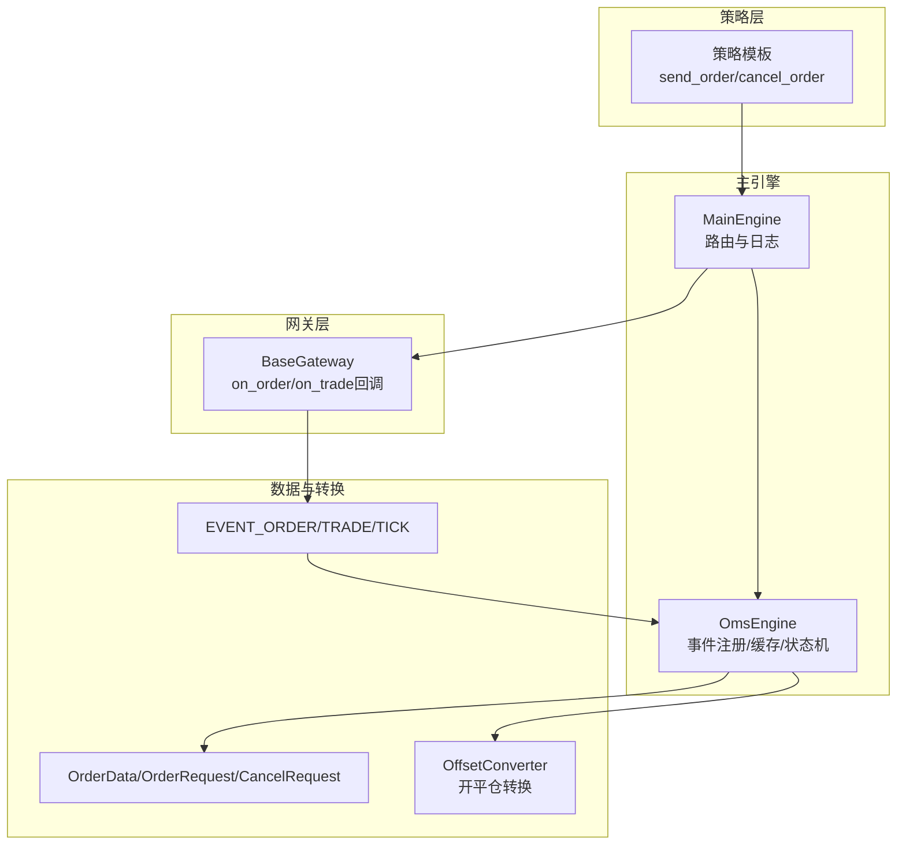
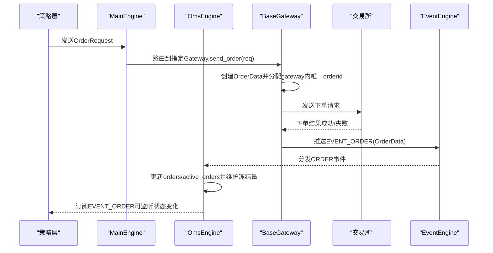
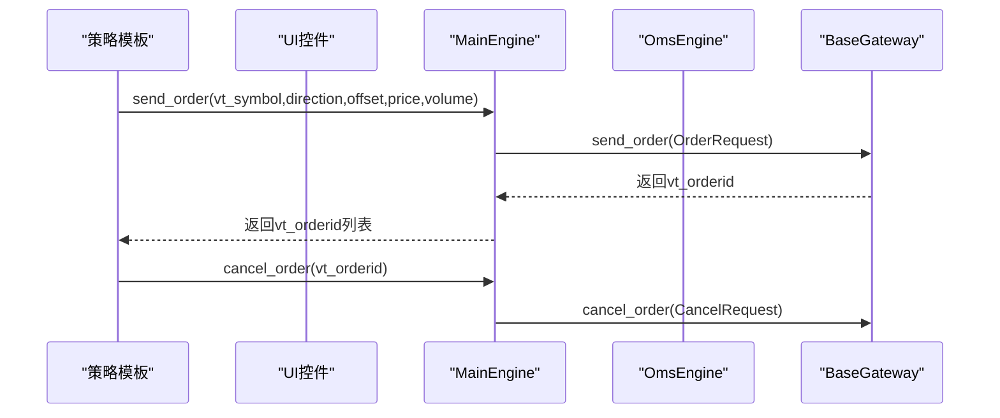
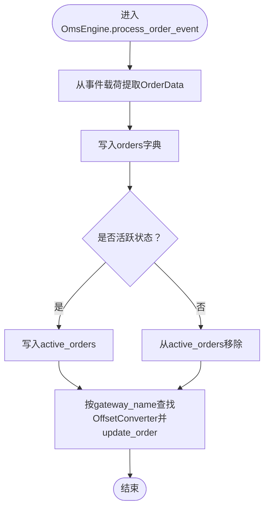
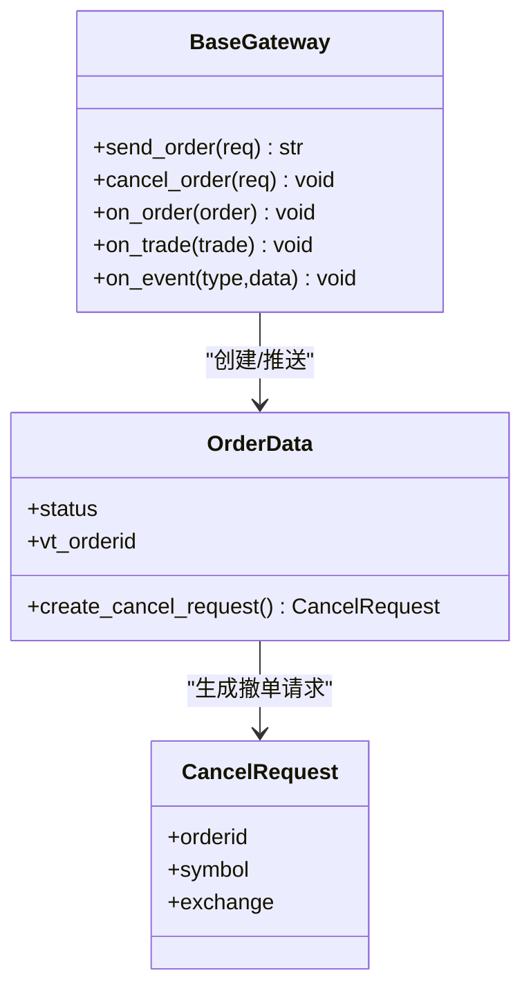
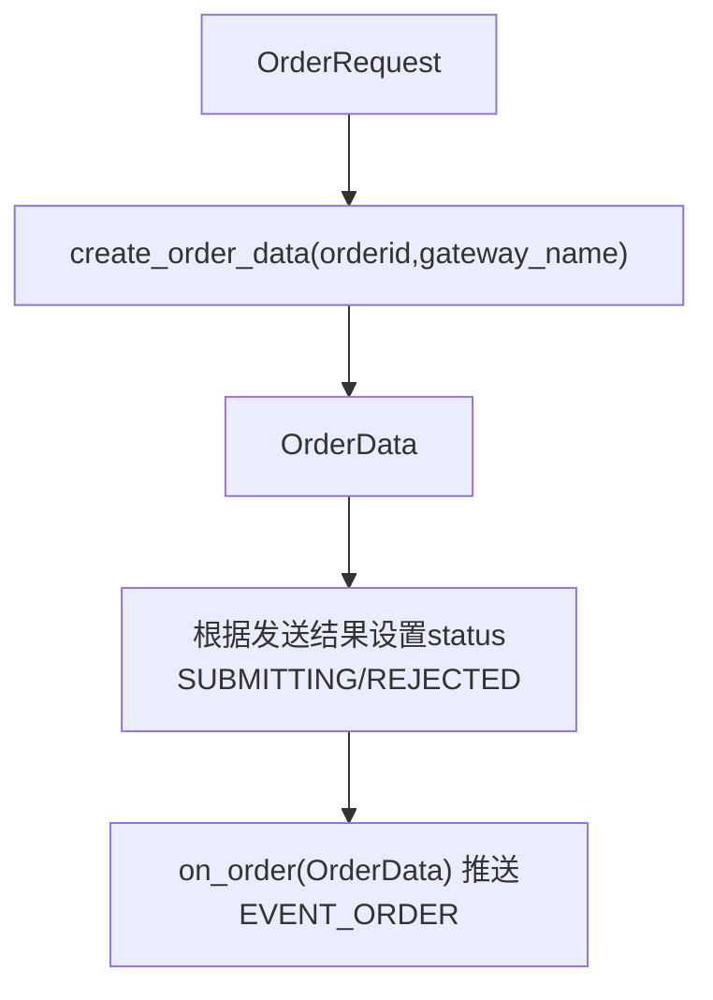
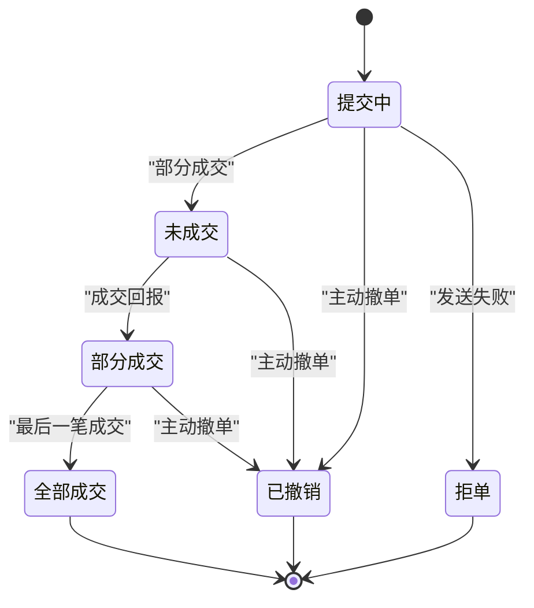
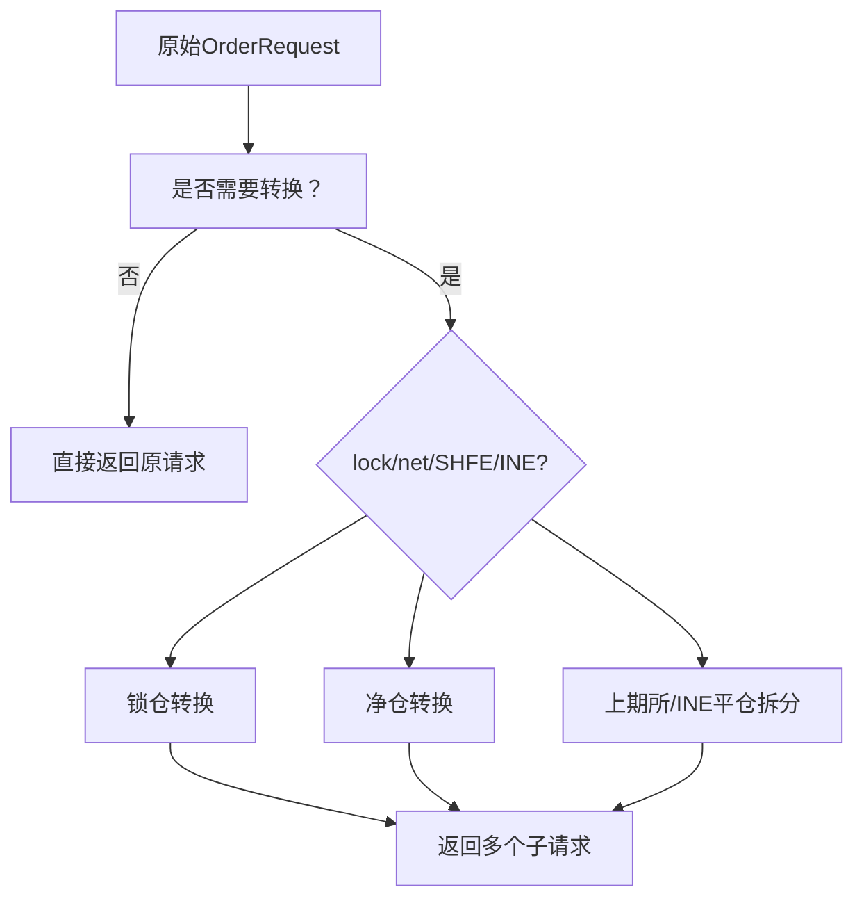
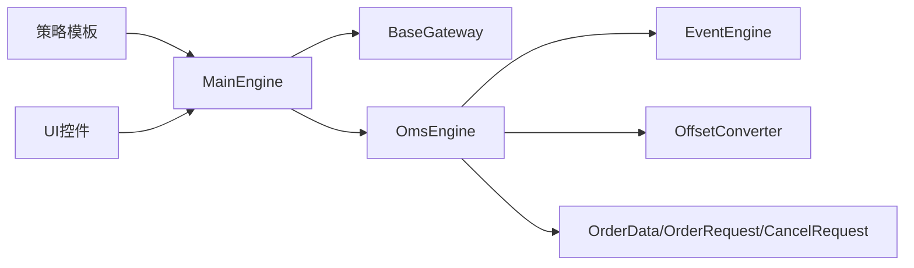

# 订单生命周期

<cite>
**本文引用的文件**
- [vnpy/trader/object.py](file://vnpy/trader/object.py)
- [vnpy/trader/constant.py](file://vnpy/trader/constant.py)
- [vnpy/trader/engine.py](file://vnpy/trader/engine.py)
- [vnpy/trader/gateway.py](file://vnpy/trader/gateway.py)
- [vnpy/trader/event.py](file://vnpy/trader/event.py)
- [vnpy/trader/converter.py](file://vnpy/trader/converter.py)
- [vnpy/trader/ui/widget.py](file://vnpy/trader/ui/widget.py)
- [vnpy/alpha/strategy/template.py](file://vnpy/alpha/strategy/template.py)
- [vnpy/alpha/strategy/backtesting.py](file://vnpy/alpha/strategy/backtesting.py)
</cite>

## 目录
1. [引言](#引言)
2. [项目结构](#项目结构)
3. [核心组件](#核心组件)
4. [架构总览](#架构总览)
5. [详细组件分析](#详细组件分析)
6. [依赖分析](#依赖分析)
7. [性能考虑](#性能考虑)
8. [故障排查指南](#故障排查指南)
9. [结论](#结论)
10. [附录](#附录)

## 引言
本文件系统性梳理vnpy从策略层发起委托请求，到主引擎转发至网关，再到交易所返回订单数据并通过事件驱动更新本地缓存的完整生命周期。重点解释OrderRequest如何被转换为OrderData，以及OrderData中status字段在不同阶段的变更机制；并深入分析send_order与cancel_order的实现逻辑与线程安全性，给出监听订单状态变化、处理下单失败与撤单异常的最佳实践。

## 项目结构
围绕订单生命周期的关键模块分布如下：
- 数据模型与常量：定义OrderData、OrderRequest、CancelRequest、Status等基础类型与状态枚举
- 网关接口：抽象出send_order/cancel_order回调契约，确保与交易所的交互一致性
- 主引擎与OMS引擎：负责路由、事件分发、本地缓存与状态机维护
- 转换器：根据合约与持仓规则对开平仓请求进行转换（如上期所平今/平昨）
- 策略与UI：策略层通过send_order/cancel_order触发委托；UI提供手动下单与撤单入口

图表来源
- [vnpy/trader/engine.py](file://vnpy/trader/engine.py#L340-L423)
- [vnpy/trader/gateway.py](file://vnpy/trader/gateway.py#L1-L160)
- [vnpy/trader/object.py](file://vnpy/trader/object.py#L110-L170)
- [vnpy/trader/converter.py](file://vnpy/trader/converter.py#L54-L120)
- [vnpy/trader/event.py](file://vnpy/trader/event.py#L8-L8)

章节来源
- [vnpy/trader/engine.py](file://vnpy/trader/engine.py#L136-L170)
- [vnpy/trader/gateway.py](file://vnpy/trader/gateway.py#L1-L160)
- [vnpy/trader/object.py](file://vnpy/trader/object.py#L110-L170)
- [vnpy/trader/converter.py](file://vnpy/trader/converter.py#L54-L120)
- [vnpy/trader/event.py](file://vnpy/trader/event.py#L8-L8)

## 核心组件
- OrderData：订单本地状态载体，包含symbol/exchange/orderid/type/direction/offset/price/volume/traded/status/datetime/reference等字段，并提供vt_symbol/vt_orderid与is_active判断
- OrderRequest：策略侧发起的委托请求，包含symbol/exchange/direction/type/volume/price/offset/reference
- CancelRequest：撤单请求，包含orderid/symbol/exchange
- Status：订单状态枚举，包含SUBMITTING、NOTTRADED、PARTTRADED、ALLTRADED、CANCELLED、REJECTED
- BaseGateway：网关抽象，定义send_order/cancel_order契约，on_order/on_trade等回调需手动推送事件
- OmsEngine：OMS引擎，注册EVENT_ORDER/TRADE/TICK等事件，维护orders/active_orders/trades/positions/accounts/contracts/quotes等本地缓存，并根据状态维护活跃订单集合
- OffsetConverter：根据合约与持仓规则对开平仓请求进行转换，维护冻结量与可用量

章节来源
- [vnpy/trader/object.py](file://vnpy/trader/object.py#L110-L170)
- [vnpy/trader/object.py](file://vnpy/trader/object.py#L321-L371)
- [vnpy/trader/constant.py](file://vnpy/trader/constant.py#L30-L40)
- [vnpy/trader/gateway.py](file://vnpy/trader/gateway.py#L195-L221)
- [vnpy/trader/engine.py](file://vnpy/trader/engine.py#L340-L423)
- [vnpy/trader/converter.py](file://vnpy/trader/converter.py#L54-L120)

## 架构总览
下图展示从策略到交易所再到本地缓存的端到端流程，以及事件驱动的状态更新路径。

图表来源
- [vnpy/trader/engine.py](file://vnpy/trader/engine.py#L232-L252)
- [vnpy/trader/gateway.py](file://vnpy/trader/gateway.py#L195-L221)
- [vnpy/trader/engine.py](file://vnpy/trader/engine.py#L363-L394)
- [vnpy/trader/event.py](file://vnpy/trader/event.py#L8-L8)

## 详细组件分析

### 组件A：策略层send_order与cancel_order
- 策略通过send_order构造OrderRequest并交由策略引擎执行，返回vt_orderid列表并加入活跃订单集合
- cancel_order基于OrderData.create_cancel_request生成CancelRequest并调用策略引擎撤单
- UI层也提供手动下单与批量撤单入口，便于调试与验证

图表来源
- [vnpy/alpha/strategy/template.py](file://vnpy/alpha/strategy/template.py#L93-L113)
- [vnpy/trader/ui/widget.py](file://vnpy/trader/ui/widget.py#L976-L1010)
- [vnpy/trader/ui/widget.py](file://vnpy/trader/ui/widget.py#L506-L512)
- [vnpy/trader/engine.py](file://vnpy/trader/engine.py#L232-L252)

章节来源
- [vnpy/alpha/strategy/template.py](file://vnpy/alpha/strategy/template.py#L93-L113)
- [vnpy/trader/ui/widget.py](file://vnpy/trader/ui/widget.py#L976-L1010)
- [vnpy/trader/ui/widget.py](file://vnpy/trader/ui/widget.py#L506-L512)
- [vnpy/trader/engine.py](file://vnpy/trader/engine.py#L232-L252)

### 组件B：主引擎与OMS引擎
- MainEngine负责路由：send_order/cancel_order将请求转发给对应Gateway
- OmsEngine注册EVENT_ORDER/TRADE/TICK等事件，接收后更新orders/active_orders等本地缓存，并维护OffsetConverter
- get_all_active_orders/get_all_orders等查询接口供UI或策略使用

图表来源
- [vnpy/trader/engine.py](file://vnpy/trader/engine.py#L378-L394)
- [vnpy/trader/engine.py](file://vnpy/trader/engine.py#L525-L535)

章节来源
- [vnpy/trader/engine.py](file://vnpy/trader/engine.py#L340-L423)
- [vnpy/trader/engine.py](file://vnpy/trader/engine.py#L525-L535)

### 组件C：网关层与事件推送
- BaseGateway定义send_order/cancel_order契约，要求实现方在成功/失败时设置OrderData.status（SUBMITTING/REJECTED），并通过on_order推送EVENT_ORDER
- on_order/on_trade等回调统一通过on_event推送到EventEngine，再由OmsEngine订阅处理

图表来源
- [vnpy/trader/gateway.py](file://vnpy/trader/gateway.py#L195-L221)
- [vnpy/trader/object.py](file://vnpy/trader/object.py#L110-L170)
- [vnpy/trader/object.py](file://vnpy/trader/object.py#L338-L354)

章节来源
- [vnpy/trader/gateway.py](file://vnpy/trader/gateway.py#L195-L221)
- [vnpy/trader/object.py](file://vnpy/trader/object.py#L110-L170)
- [vnpy/trader/object.py](file://vnpy/trader/object.py#L338-L354)

### 组件D：OrderRequest到OrderData的转换
- OrderRequest.create_order_data用于将请求转换为OrderData，填充gateway_name、symbol、exchange、type、direction、offset、price、volume、reference等字段
- 网关实现应在成功发送后将OrderData.status置为SUBMITTING，若发送失败置为REJECTED

图表来源
- [vnpy/trader/object.py](file://vnpy/trader/object.py#L321-L371)
- [vnpy/trader/gateway.py](file://vnpy/trader/gateway.py#L195-L221)

章节来源
- [vnpy/trader/object.py](file://vnpy/trader/object.py#L321-L371)
- [vnpy/trader/gateway.py](file://vnpy/trader/gateway.py#L195-L221)

### 组件E：订单状态机与状态流转
- ACTIVE_STATUSES包含SUBMITTING、NOTTRADED、PARTTRADED三类活跃状态
- 订单状态可能从SUBMITTING变为NOTTRADED/PARTTRADED/ALLTRADED/CANCELLED/REJECTED
- OmsEngine根据is_active()维护active_orders集合，UI可通过过滤仅显示活跃订单

图表来源
- [vnpy/trader/object.py](file://vnpy/trader/object.py#L14-L16)
- [vnpy/trader/object.py](file://vnpy/trader/object.py#L137-L141)
- [vnpy/trader/engine.py](file://vnpy/trader/engine.py#L378-L394)

章节来源
- [vnpy/trader/object.py](file://vnpy/trader/object.py#L14-L16)
- [vnpy/trader/object.py](file://vnpy/trader/object.py#L137-L141)
- [vnpy/trader/engine.py](file://vnpy/trader/engine.py#L378-L394)

### 组件F：开平仓转换与锁仓/净仓模式
- OffsetConverter根据合约与持仓情况对OrderRequest进行转换，支持锁仓(lock)与净仓(net)两种模式
- 上期所/INE特殊处理：平仓优先平今，不足时再平昨；也可按规则拆分为平今/平昨/开仓组合

图表来源
- [vnpy/trader/converter.py](file://vnpy/trader/converter.py#L367-L402)
- [vnpy/trader/converter.py](file://vnpy/trader/converter.py#L189-L241)
- [vnpy/trader/converter.py](file://vnpy/trader/converter.py#L242-L300)

章节来源
- [vnpy/trader/converter.py](file://vnpy/trader/converter.py#L367-L402)
- [vnpy/trader/converter.py](file://vnpy/trader/converter.py#L189-L241)
- [vnpy/trader/converter.py](file://vnpy/trader/converter.py#L242-L300)

### 组件G：UI与监听最佳实践
- UI提供手动下单入口，将用户输入封装为OrderRequest并调用MainEngine.send_order
- UI提供批量撤单与活跃订单过滤显示，便于观察状态变化
- 策略应订阅EVENT_ORDER以监听状态变化，避免轮询

章节来源
- [vnpy/trader/ui/widget.py](file://vnpy/trader/ui/widget.py#L976-L1010)
- [vnpy/trader/ui/widget.py](file://vnpy/trader/ui/widget.py#L1031-L1077)
- [vnpy/trader/ui/widget.py](file://vnpy/trader/ui/widget.py#L506-L512)

## 依赖分析
- 策略层依赖MainEngine提供的send_order/cancel_order接口
- MainEngine依赖BaseGateway接口，转发请求并记录日志
- OmsEngine依赖EventEngine，订阅EVENT_ORDER/TRADE/TICK并维护本地缓存
- OffsetConverter依赖合约与持仓信息，动态维护冻结量与可用量
- UI依赖MainEngine查询活跃订单与批量撤单

图表来源
- [vnpy/trader/engine.py](file://vnpy/trader/engine.py#L136-L170)
- [vnpy/trader/gateway.py](file://vnpy/trader/gateway.py#L1-L160)
- [vnpy/trader/engine.py](file://vnpy/trader/engine.py#L340-L423)
- [vnpy/trader/converter.py](file://vnpy/trader/converter.py#L54-L120)
- [vnpy/trader/object.py](file://vnpy/trader/object.py#L110-L170)

章节来源
- [vnpy/trader/engine.py](file://vnpy/trader/engine.py#L136-L170)
- [vnpy/trader/gateway.py](file://vnpy/trader/gateway.py#L1-L160)
- [vnpy/trader/engine.py](file://vnpy/trader/engine.py#L340-L423)
- [vnpy/trader/converter.py](file://vnpy/trader/converter.py#L54-L120)
- [vnpy/trader/object.py](file://vnpy/trader/object.py#L110-L170)

## 性能考虑
- 事件驱动：通过EventEngine异步分发，避免阻塞主线程
- 缓存优化：OmsEngine集中维护orders/active_orders/trades/positions等字典，查询复杂度低
- 线程安全：BaseGateway契约要求所有方法非阻塞且线程安全，避免共享可变状态
- 开平仓转换：在OmsEngine初始化合约事件时建立OffsetConverter，减少重复计算

## 故障排查指南
- 下单失败（REJECTED）：检查网关send_order实现是否正确设置OrderData.status为REJECTED，并推送EVENT_ORDER
- 撤单异常：确认CancelRequest参数（orderid/symbol/exchange）与OrderData一致，且网关cancel_order已正确发送
- 状态不更新：确认OmsEngine已注册EVENT_ORDER，且UI/策略已订阅相应事件
- 锁仓/净仓转换问题：核对OffsetConverter配置与合约属性（net_position），必要时调整lock/net参数

章节来源
- [vnpy/trader/gateway.py](file://vnpy/trader/gateway.py#L195-L221)
- [vnpy/trader/engine.py](file://vnpy/trader/engine.py#L363-L394)
- [vnpy/trader/converter.py](file://vnpy/trader/converter.py#L367-L402)

## 结论
vnpy的订单生命周期采用“策略层发起请求—主引擎路由—网关对接交易所—事件驱动更新本地缓存”的清晰架构。OrderRequest到OrderData的转换由网关实现负责，状态机由OmsEngine维护，OffsetConverter提供灵活的开平仓转换能力。开发者应遵循线程安全与非阻塞原则，通过事件订阅而非轮询监听状态变化，并在遇到异常时依据上述排查要点快速定位问题。

## 附录
- 常见状态含义
  - SUBMITTING：提交中（已创建OrderData但尚未完全发送）
  - NOTTRADED：未成交（已发送但未成交回报）
  - PARTTRADED：部分成交（已有成交回报）
  - ALLTRADED：全部成交（最后一笔成交）
  - CANCELLED：已撤销（主动撤单）
  - REJECTED：拒单（发送失败）

章节来源
- [vnpy/trader/constant.py](file://vnpy/trader/constant.py#L30-L40)
- [vnpy/trader/object.py](file://vnpy/trader/object.py#L14-L16)
- [vnpy/trader/gateway.py](file://vnpy/trader/gateway.py#L195-L221)