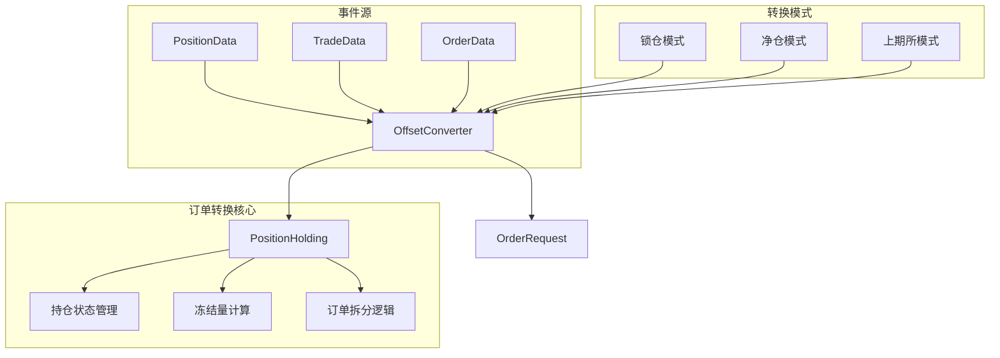
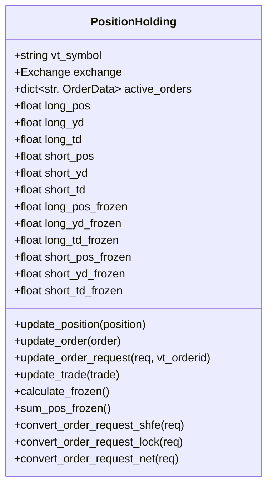
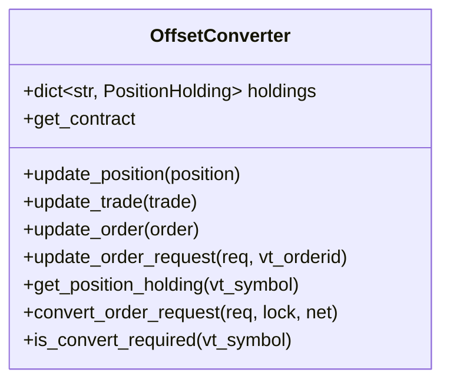
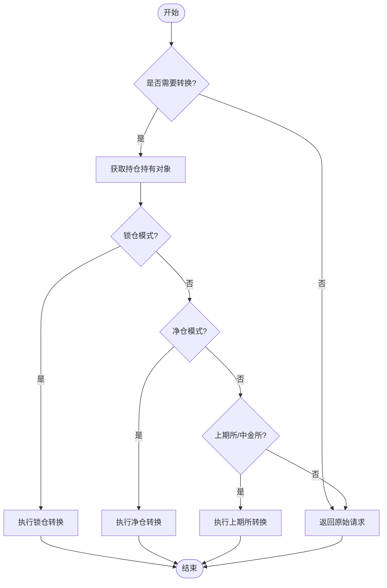
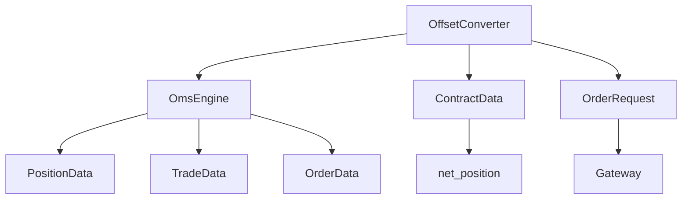

# 订单转换机制

<cite>
**本文档引用文件**  
- [converter.py](file://vnpy/trader/converter.py)
- [engine.py](file://vnpy/trader/engine.py)
- [constant.py](file://vnpy/trader/constant.py)
- [object.py](file://vnpy/trader/object.py)
</cite>

## 目录
1. [引言](#引言)
2. [核心组件](#核心组件)
3. [架构概述](#架构概述)
4. [详细组件分析](#详细组件分析)
5. [依赖分析](#依赖分析)
6. [使用指南](#使用指南)
7. [结论](#结论)

## 引言
vn.py作为专业的量化交易框架，其订单转换机制在处理国内期货市场特有的开平仓规则方面发挥着关键作用。该机制的核心是OffsetConverter类，它解决了国内期货交易中“平今仓”与“平昨仓”的区分问题，确保了交易指令的准确执行。本文档将深入剖析OffsetConverter的工作原理，详细解释其如何通过监听订单、成交和持仓事件来动态推断用户的实际开平仓意图，并自动将中性的平仓请求转换为具体的平仓类型。

## 核心组件
订单转换机制主要由OffsetConverter和PositionHolding两个核心类构成。OffsetConverter作为主控制器，负责管理所有合约的持仓持有状态，并根据交易模式（锁仓、净仓）和交易所规则（如上期所）来决定如何转换订单请求。PositionHolding类则为每个合约维护详细的持仓信息，包括今仓、昨仓、冻结量等关键数据，为订单转换提供决策依据。

**Section sources**
- [converter.py](file://vnpy/trader/converter.py#L310-L402)

## 架构概述
订单转换机制采用事件驱动架构，通过监听交易系统中的PositionData、TradeData和OrderData事件来实时更新持仓状态。当用户提交一个中性的平仓请求（如Offset.CLOSE）时，系统会根据当前的持仓情况和交易所规则，自动将其转换为具体的平仓指令（Offset.CLOSETODAY或Offset.CLOSEYESTERDAY）。这一过程确保了在上期所等要求明确区分平今平昨的交易所中，交易指令能够正确执行。

**Diagram sources**
- [converter.py](file://vnpy/trader/converter.py#L310-L402)
- [engine.py](file://vnpy/trader/engine.py#L339-L560)

## 详细组件分析

### PositionHolding 分析
PositionHolding类为每个合约维护独立的持仓状态，是订单转换机制的基础。它不仅跟踪总的多空持仓量，还细分了今仓和昨仓的数量，并计算了因未成交订单而冻结的持仓量。这种精细化的持仓管理使得系统能够准确判断可用的平仓额度。

**Diagram sources**
- [converter.py](file://vnpy/trader/converter.py#L17-L308)

### OffsetConverter 分析
OffsetConverter是订单转换机制的中枢，它管理着所有合约的PositionHolding实例。通过监听PositionData、TradeData和OrderData事件，OffsetConverter能够实时更新每个合约的持仓状态。当收到订单请求时，它会根据合约的交易模式和交易所类型，调用相应的转换方法来生成最终的订单指令。

**Diagram sources**
- [converter.py](file://vnpy/trader/converter.py#L310-L402)

### convert_order_request 方法分析
convert_order_request方法是订单转换的核心入口，它根据不同的交易模式和交易所规则来决定如何处理订单请求。对于上期所和中金所的合约，系统会自动将中性的平仓请求转换为具体的平今或平昨指令；对于锁仓模式，系统会优先平掉昨仓，然后开新仓；对于净仓模式，系统会按照今仓优先的原则进行平仓。

**Diagram sources**
- [converter.py](file://vnpy/trader/converter.py#L367-L388)

## 依赖分析
订单转换机制依赖于vn.py框架的多个核心组件。它通过OmsEngine接收PositionData、TradeData和OrderData事件，并利用ContractData获取合约的交易模式信息。同时，该机制与订单管理系统紧密集成，确保转换后的订单能够正确提交到交易网关。

**Diagram sources**
- [converter.py](file://vnpy/trader/converter.py#L310-L402)
- [engine.py](file://vnpy/trader/engine.py#L339-L560)

## 使用指南
在使用vn.py进行期货交易时，开发者无需手动处理平今平昨的区分，系统会自动完成这一复杂过程。当提交一个平仓请求时，只需指定Offset.CLOSE，系统会根据当前持仓情况和交易所规则自动选择合适的平仓方式。对于特殊需求，如需要强制平昨仓，可以直接指定Offset.CLOSEYESTERDAY。

**Section sources**
- [converter.py](file://vnpy/trader/converter.py#L367-L388)
- [engine.py](file://vnpy/trader/engine.py#L545-L560)

## 结论
vn.py的订单转换机制通过OffsetConverter和PositionHolding两个核心类的协同工作，有效解决了国内期货市场特有的平今平昨问题。该机制不仅提高了交易的准确性，还大大简化了策略开发的复杂度，使开发者能够专注于策略逻辑本身，而不必担心底层交易规则的细节。这一设计体现了vn.py作为专业量化交易框架的成熟性和实用性。