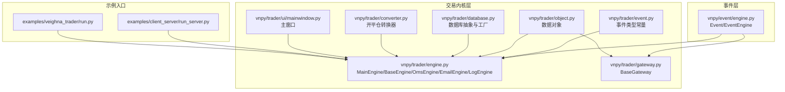
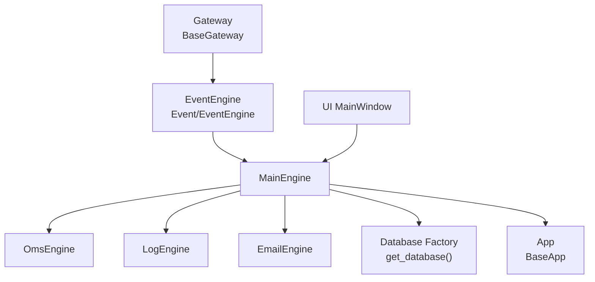
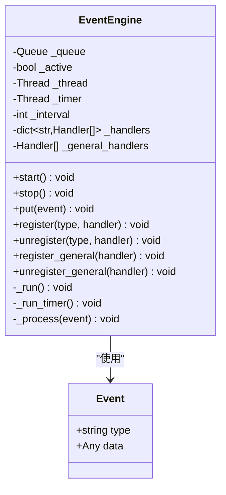
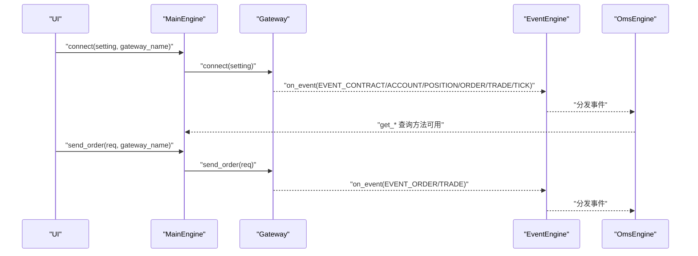
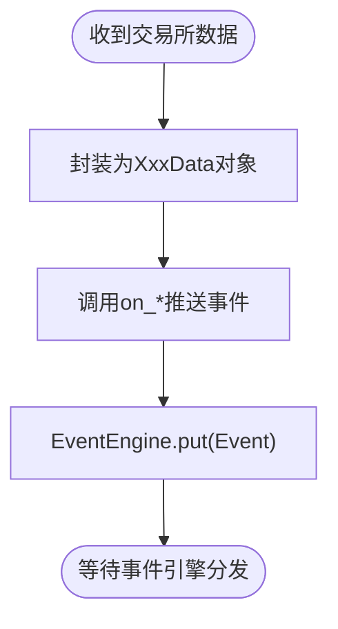
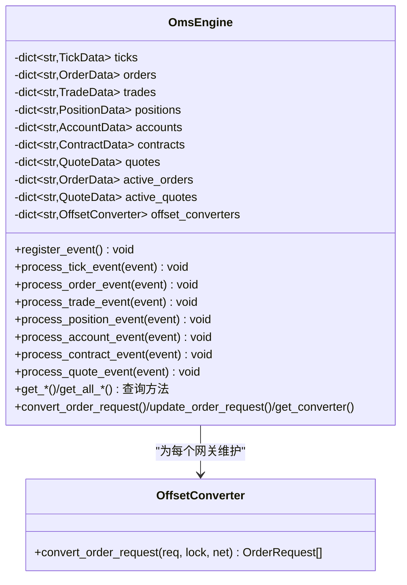
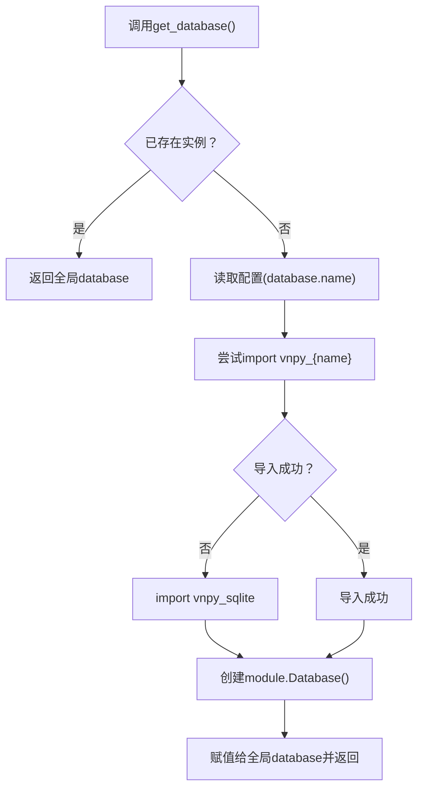
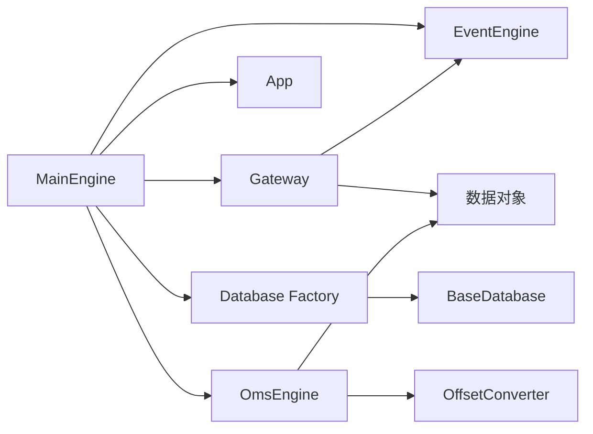
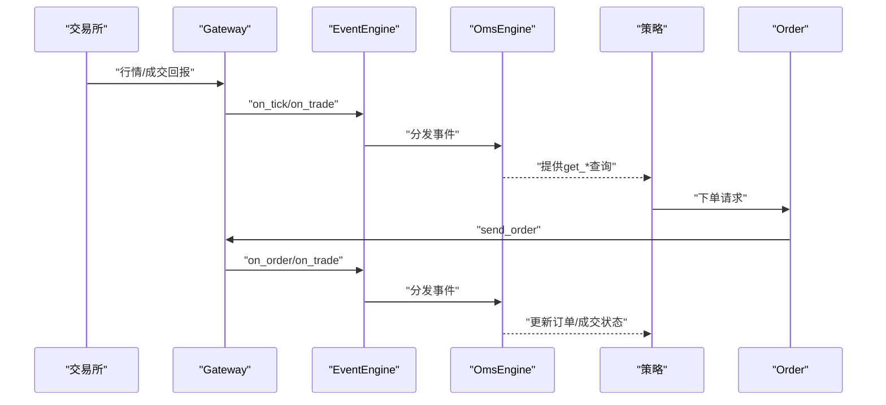

# 核心架构

<cite>
**本文引用的文件**
- [vnpy/event/engine.py](file://vnpy/event/engine.py)
- [vnpy/trader/engine.py](file://vnpy/trader/engine.py)
- [vnpy/trader/gateway.py](file://vnpy/trader/gateway.py)
- [vnpy/trader/event.py](file://vnpy/trader/event.py)
- [vnpy/trader/object.py](file://vnpy/trader/object.py)
- [vnpy/trader/database.py](file://vnpy/trader/database.py)
- [vnpy/trader/converter.py](file://vnpy/trader/converter.py)
- [vnpy/trader/ui/mainwindow.py](file://vnpy/trader/ui/mainwindow.py)
- [examples/client_server/run_server.py](file://examples/client_server/run_server.py)
- [examples/veighna_trader/run.py](file://examples/veighna_trader/run.py)
</cite>

## 目录
1. [引言](#引言)
2. [项目结构](#项目结构)
3. [核心组件](#核心组件)
4. [架构总览](#架构总览)
5. [详细组件分析](#详细组件分析)
6. [依赖关系分析](#依赖关系分析)
7. [性能考量](#性能考量)
8. [故障排查指南](#故障排查指南)
9. [结论](#结论)
10. [附录](#附录)

## 引言
本文件面向vnpy核心架构的深度解读，聚焦于事件驱动设计模式与主引擎（MainEngine）的协调机制。我们将系统阐述EventEngine如何作为通信中枢实现模块间解耦，通过事件发布-订阅机制传递行情、订单、成交等消息；并说明MainEngine如何集成Gateway（交易接口）、App（功能应用）与数据库组件，实现统一调度。文档还将结合源码讲解核心类的初始化流程、生命周期管理与线程模型，绘制数据流路径图，讨论单例模式在数据库连接中的应用、异步IO处理机制以及系统扩展性设计，为后续模块开发提供架构理解基础。

## 项目结构
vnpy采用分层+模块化的组织方式：
- 事件层：vnpy/event 提供通用事件框架（Event、EventEngine）
- 交易内核层：vnpy/trader 提供引擎、网关、对象、数据库、转换器、UI等核心能力
- 示例与入口：examples 展示典型运行方式（含GUI与终端）

图表来源
- [vnpy/event/engine.py](file://vnpy/event/engine.py#L1-L146)
- [vnpy/trader/engine.py](file://vnpy/trader/engine.py#L1-L303)
- [vnpy/trader/gateway.py](file://vnpy/trader/gateway.py#L1-L273)
- [vnpy/trader/event.py](file://vnpy/trader/event.py#L1-L15)
- [vnpy/trader/object.py](file://vnpy/trader/object.py#L1-L200)
- [vnpy/trader/database.py](file://vnpy/trader/database.py#L1-L160)
- [vnpy/trader/converter.py](file://vnpy/trader/converter.py#L1-L403)
- [vnpy/trader/ui/mainwindow.py](file://vnpy/trader/ui/mainwindow.py#L1-L200)
- [examples/client_server/run_server.py](file://examples/client_server/run_server.py#L1-L45)
- [examples/veighna_trader/run.py](file://examples/veighna_trader/run.py#L39-L87)

章节来源
- [vnpy/event/engine.py](file://vnpy/event/engine.py#L1-L146)
- [vnpy/trader/engine.py](file://vnpy/trader/engine.py#L1-L303)
- [vnpy/trader/gateway.py](file://vnpy/trader/gateway.py#L1-L273)
- [vnpy/trader/event.py](file://vnpy/trader/event.py#L1-L15)
- [vnpy/trader/object.py](file://vnpy/trader/object.py#L1-L200)
- [vnpy/trader/database.py](file://vnpy/trader/database.py#L1-L160)
- [vnpy/trader/converter.py](file://vnpy/trader/converter.py#L1-L403)
- [vnpy/trader/ui/mainwindow.py](file://vnpy/trader/ui/mainwindow.py#L1-L200)
- [examples/client_server/run_server.py](file://examples/client_server/run_server.py#L1-L45)
- [examples/veighna_trader/run.py](file://examples/veighna_trader/run.py#L39-L87)

## 核心组件
- EventEngine：事件队列与分发器，负责定时事件与事件分发，支持注册/注销处理器与全局处理器
- MainEngine：平台核心，统一管理EventEngine、Gateway、App、数据库与各功能引擎
- BaseGateway：交易接口抽象，封装连接、订阅、下单、撤单、查询等，并通过EventEngine发布事件
- BaseEngine：功能引擎基类，提供统一的引擎生命周期与事件注册能力
- OmsEngine：订单管理子系统，聚合行情、订单、成交、持仓、账户、合约、报价等数据
- LogEngine：日志引擎，订阅日志事件并输出
- EmailEngine：邮件引擎，异步发送邮件
- 数据对象：TickData、OrderData、TradeData、PositionData、AccountData、ContractData、BarData等
- 数据库抽象：BaseDatabase与工厂方法get_database，支持动态加载数据库驱动
- OffsetConverter：开平仓转换器，根据合约规则与持仓情况转换订单请求

章节来源
- [vnpy/event/engine.py](file://vnpy/event/engine.py#L1-L146)
- [vnpy/trader/engine.py](file://vnpy/trader/engine.py#L1-L303)
- [vnpy/trader/gateway.py](file://vnpy/trader/gateway.py#L1-L273)
- [vnpy/trader/event.py](file://vnpy/trader/event.py#L1-L15)
- [vnpy/trader/object.py](file://vnpy/trader/object.py#L1-L200)
- [vnpy/trader/database.py](file://vnpy/trader/database.py#L1-L160)
- [vnpy/trader/converter.py](file://vnpy/trader/converter.py#L1-L403)

## 架构总览
vnpy采用事件驱动的松耦合架构：
- EventEngine作为中枢，Gateway通过on_*回调将市场数据与业务事件封装为Event并投递
- MainEngine统一调度，将事件路由到各功能引擎（如OmsEngine、LogEngine、EmailEngine）
- App通过MainEngine注册功能引擎，形成策略、风控、数据管理等功能模块
- 数据库通过工厂方法按配置动态加载，提供统一的持久化接口

图表来源
- [vnpy/trader/gateway.py](file://vnpy/trader/gateway.py#L1-L273)
- [vnpy/event/engine.py](file://vnpy/event/engine.py#L1-L146)
- [vnpy/trader/engine.py](file://vnpy/trader/engine.py#L1-L303)
- [vnpy/trader/database.py](file://vnpy/trader/database.py#L1-L160)
- [vnpy/trader/ui/mainwindow.py](file://vnpy/trader/ui/mainwindow.py#L1-L200)

## 详细组件分析

### EventEngine：事件驱动中枢
- 设计要点
  - 使用线程安全队列承载事件，后台线程循环消费
  - 支持按事件类型分发与“全局处理器”广播
  - 定时器线程周期性产生定时事件
- 关键行为
  - put：入队事件
  - register/unregister：按类型注册/注销处理器
  - register_general/unregister_general：注册/注销全局处理器
  - start/stop：启动/停止事件引擎与定时器线程
- 复杂度与性能
  - 入队/出队为O(1)，分发复杂度与注册处理器数量成正比
  - 定时器间隔可配置，默认1秒

图表来源
- [vnpy/event/engine.py](file://vnpy/event/engine.py#L1-L146)

章节来源
- [vnpy/event/engine.py](file://vnpy/event/engine.py#L1-L146)

### MainEngine：统一调度中心
- 初始化流程
  - 构造时可注入EventEngine，否则自建并启动
  - 切换工作目录至TRADER_DIR
  - 初始化功能引擎（日志、OMS、邮件等）
- 生命周期管理
  - add_gateway/add_app/add_engine：注册组件
  - connect/subscribe/send_order/cancel_order/send_quote/cancel_quote/query_history：对外接口
  - close：优雅关闭，先停止EventEngine，再依次关闭各引擎与网关
- 事件路由
  - write_log：构造日志事件并投递到EventEngine
  - init_engines：将常用查询与转换方法绑定到MainEngine，供上层调用

图表来源
- [vnpy/trader/engine.py](file://vnpy/trader/engine.py#L1-L303)
- [vnpy/trader/gateway.py](file://vnpy/trader/gateway.py#L1-L273)
- [vnpy/trader/event.py](file://vnpy/trader/event.py#L1-L15)

章节来源
- [vnpy/trader/engine.py](file://vnpy/trader/engine.py#L1-L303)

### BaseGateway：交易接口抽象
- 设计要点
  - 所有方法需线程安全、非阻塞
  - 必须实现回调：on_tick/on_trade/on_order/on_position/on_account/on_contract
  - 写日志通过on_log统一走EventEngine
- 关键行为
  - on_event：封装事件类型与数据并投递
  - on_tick/on_trade/on_order/on_position/on_account/on_quote/on_log：按类型分发
  - send_order/cancel_order/send_quote/cancel_quote/subscribe/query_account/query_position/query_history：对外接口
- 与EventEngine的关系
  - 通过EventEngine.put将数据事件投递到中枢

图表来源
- [vnpy/trader/gateway.py](file://vnpy/trader/gateway.py#L1-L273)
- [vnpy/event/engine.py](file://vnpy/event/engine.py#L1-L146)

章节来源
- [vnpy/trader/gateway.py](file://vnpy/trader/gateway.py#L1-L273)

### OmsEngine：订单管理子系统
- 职责
  - 订阅并聚合EVENT_TICK/EVENT_ORDER/EVENT_TRADE/EVENT_POSITION/EVENT_ACCOUNT/EVENT_CONTRACT/EVENT_QUOTE
  - 维护内存快照：ticks/orders/trades/positions/accounts/contracts/quotes
  - 维护活跃订单/报价集合
  - 为不同网关初始化OffsetConverter
- 关键方法
  - register_event：注册各类事件处理器
  - process_*_event：更新内存映射与活跃集合
  - get_* / get_all_*：提供查询接口
  - convert_order_request/update_order_request/get_converter：开平仓转换

图表来源
- [vnpy/trader/engine.py](file://vnpy/trader/engine.py#L339-L634)
- [vnpy/trader/converter.py](file://vnpy/trader/converter.py#L1-L403)

章节来源
- [vnpy/trader/engine.py](file://vnpy/trader/engine.py#L339-L634)
- [vnpy/trader/converter.py](file://vnpy/trader/converter.py#L1-L403)

### 数据对象与事件类型
- 事件类型
  - EVENT_TICK/ORDER/TRADE/POSITION/ACCOUNT/CONTRACT/QUOTE/LOG
- 数据对象
  - TickData、BarData、OrderData、TradeData、PositionData、AccountData、ContractData、QuoteData等
  - 每个对象包含标准化字段与vt_*标识，便于跨网关统一处理

章节来源
- [vnpy/trader/event.py](file://vnpy/trader/event.py#L1-L15)
- [vnpy/trader/object.py](file://vnpy/trader/object.py#L1-L200)

### 数据库抽象与单例模式
- BaseDatabase定义统一接口：保存/加载/删除/概览
- get_database工厂函数
  - 读取配置决定数据库驱动名称
  - 动态导入vnpy_{name}模块，若不存在回退到vnpy_sqlite
  - 使用全局变量database缓存实例，实现单例
- 适用场景
  - 策略回测、实盘数据存储、历史数据查询

图表来源
- [vnpy/trader/database.py](file://vnpy/trader/database.py#L1-L160)

章节来源
- [vnpy/trader/database.py](file://vnpy/trader/database.py#L1-L160)

### 异步IO与线程模型
- EventEngine
  - 后台线程循环消费队列，非阻塞入队
  - 定时器线程周期性产生定时事件
- EmailEngine
  - 首次发送时惰性启动线程与队列
  - 异步发送邮件，异常时写日志
- BaseGateway
  - 文档要求线程安全、非阻塞
  - 通过EventEngine实现异步事件分发
- MainEngine
  - 初始化时启动EventEngine
  - 关闭时先停止EventEngine，再关闭各引擎与网关

章节来源
- [vnpy/event/engine.py](file://vnpy/event/engine.py#L1-L146)
- [vnpy/trader/engine.py](file://vnpy/trader/engine.py#L1-L303)
- [vnpy/trader/gateway.py](file://vnpy/trader/gateway.py#L1-L273)

### UI与入口示例
- MainWindow
  - 构造时持有MainEngine与EventEngine
  - 初始化停靠窗口、菜单、工具栏
  - 通过MainEngine获取网关与应用列表，动态加载功能
- 示例入口
  - run_server.py：创建EventEngine与MainEngine，添加Gateway与App，启动GUI
  - run.py：示例中展示添加多个Gateway与App的方式

章节来源
- [vnpy/trader/ui/mainwindow.py](file://vnpy/trader/ui/mainwindow.py#L1-L200)
- [examples/client_server/run_server.py](file://examples/client_server/run_server.py#L1-L45)
- [examples/veighna_trader/run.py](file://examples/veighna_trader/run.py#L39-L87)

## 依赖关系分析
- 组件耦合
  - MainEngine依赖EventEngine、Gateway、App、数据库工厂
  - Gateway依赖EventEngine与数据对象
  - OmsEngine依赖EventEngine与数据对象
  - 数据库工厂依赖配置与动态导入
- 外部依赖
  - GUI：PyQt5/6（MainWindow）
  - 邮件：smtplib（EmailEngine）
  - 数据库：动态模块导入（get_database）

图表来源
- [vnpy/trader/engine.py](file://vnpy/trader/engine.py#L1-L303)
- [vnpy/trader/gateway.py](file://vnpy/trader/gateway.py#L1-L273)
- [vnpy/trader/database.py](file://vnpy/trader/database.py#L1-L160)
- [vnpy/trader/converter.py](file://vnpy/trader/converter.py#L1-L403)
- [vnpy/trader/object.py](file://vnpy/trader/object.py#L1-L200)

章节来源
- [vnpy/trader/engine.py](file://vnpy/trader/engine.py#L1-L303)
- [vnpy/trader/gateway.py](file://vnpy/trader/gateway.py#L1-L273)
- [vnpy/trader/database.py](file://vnpy/trader/database.py#L1-L160)
- [vnpy/trader/converter.py](file://vnpy/trader/converter.py#L1-L403)
- [vnpy/trader/object.py](file://vnpy/trader/object.py#L1-L200)

## 性能考量
- 事件队列与分发
  - 队列操作为O(1)，分发复杂度与处理器数量线性相关
  - 定时器间隔影响事件吞吐与延迟权衡
- 线程模型
  - EventEngine双线程模型（事件线程+定时器线程），避免阻塞
  - EmailEngine惰性启动，减少不必要的线程开销
- 数据聚合
  - OmsEngine内存快照提供快速查询，但需注意内存占用与清理策略
- 数据库
  - 工厂模式按需加载驱动，避免不必要的依赖
  - 批量写入与事务优化可进一步提升性能（在具体驱动实现中体现）

## 故障排查指南
- 事件未到达
  - 检查EventEngine是否已启动与停止顺序
  - 确认处理器是否正确注册（按类型与全局）
- 网关连接失败
  - 查看Gateway日志事件（on_log）与write_log输出
  - 核对默认设置与连接参数
- 订单状态异常
  - 检查OmsEngine是否正确处理ORDER/TRADE事件
  - 核对OffsetConverter转换逻辑与合约属性
- 邮件发送失败
  - 查看EmailEngine异常日志与SMTP配置
- 数据库驱动缺失
  - 确认配置项database.name与对应驱动模块是否安装
  - 回退到默认SQLite驱动

章节来源
- [vnpy/trader/engine.py](file://vnpy/trader/engine.py#L1-L303)
- [vnpy/trader/gateway.py](file://vnpy/trader/gateway.py#L1-L273)
- [vnpy/trader/database.py](file://vnpy/trader/database.py#L1-L160)

## 结论
vnpy通过EventEngine实现了事件驱动的解耦架构，MainEngine作为统一调度中心，将Gateway、App与数据库组件有机整合。该设计具备良好的扩展性与可维护性：新增网关只需实现BaseGateway并正确推送事件；新增功能通过App注册引擎即可接入；数据库通过工厂模式实现按需加载。配合线程模型与异步IO处理，系统在高并发场景下仍能保持稳定与高效。

## 附录
- 数据流路径图（交易所→Gateway→Event→MainEngine→Strategy→Order→Gateway）
  - 行情：交易所→Gateway.on_tick→EventEngine→OmsEngine.process_tick_event→策略订阅
  - 订单：策略→MainEngine.send_order→Gateway.send_order→EventEngine→OmsEngine.process_order_event→Gateway.on_order
  - 成交：Gateway.on_trade→EventEngine→OmsEngine.process_trade_event→策略订阅

图表来源
- [vnpy/trader/gateway.py](file://vnpy/trader/gateway.py#L1-L273)
- [vnpy/event/engine.py](file://vnpy/event/engine.py#L1-L146)
- [vnpy/trader/engine.py](file://vnpy/trader/engine.py#L1-L303)