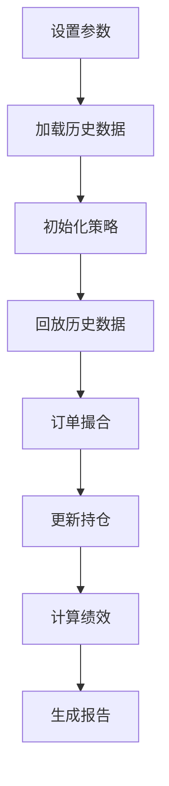
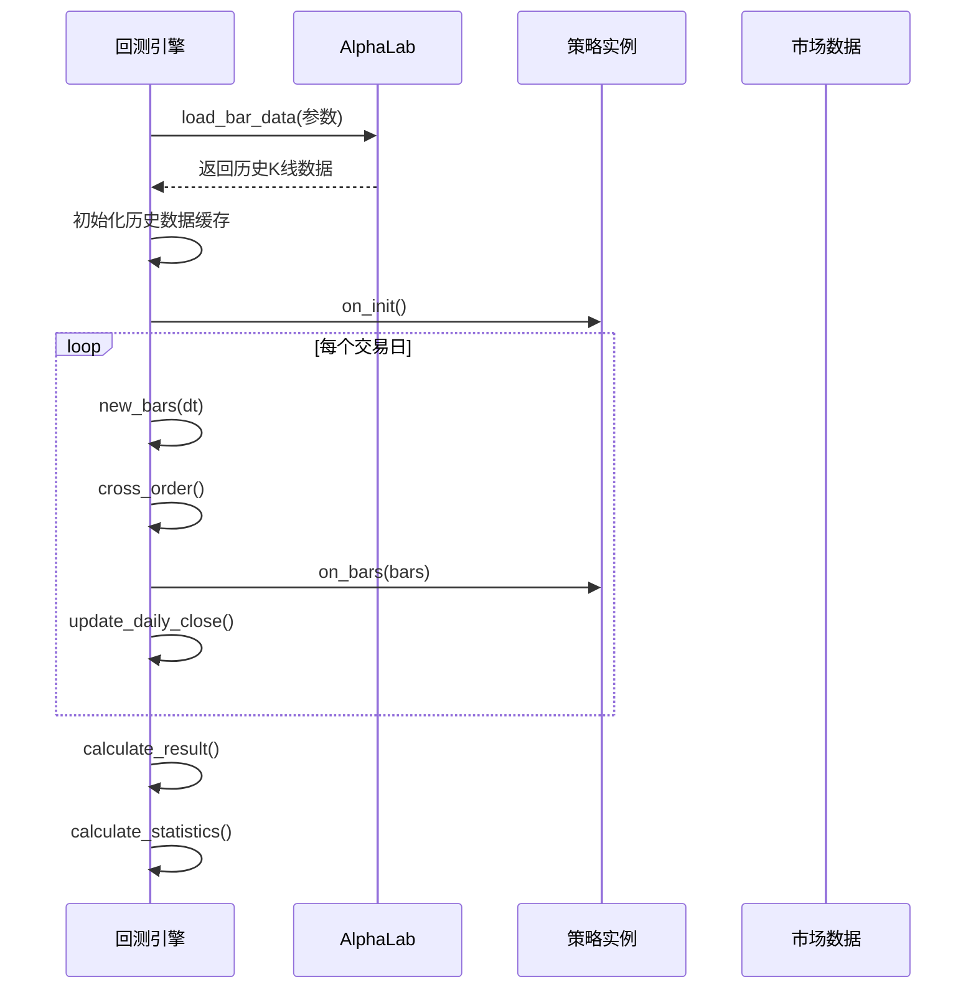
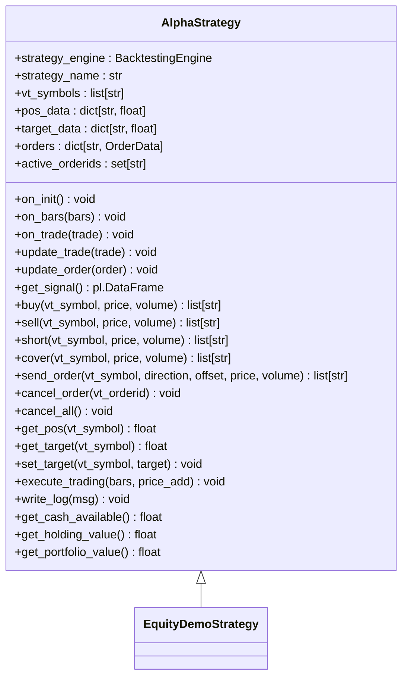
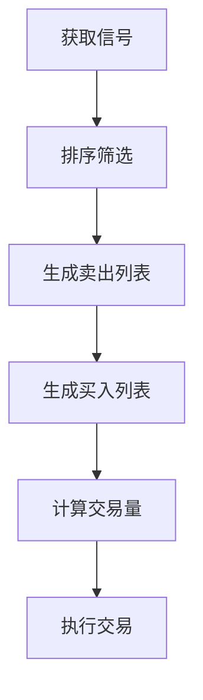
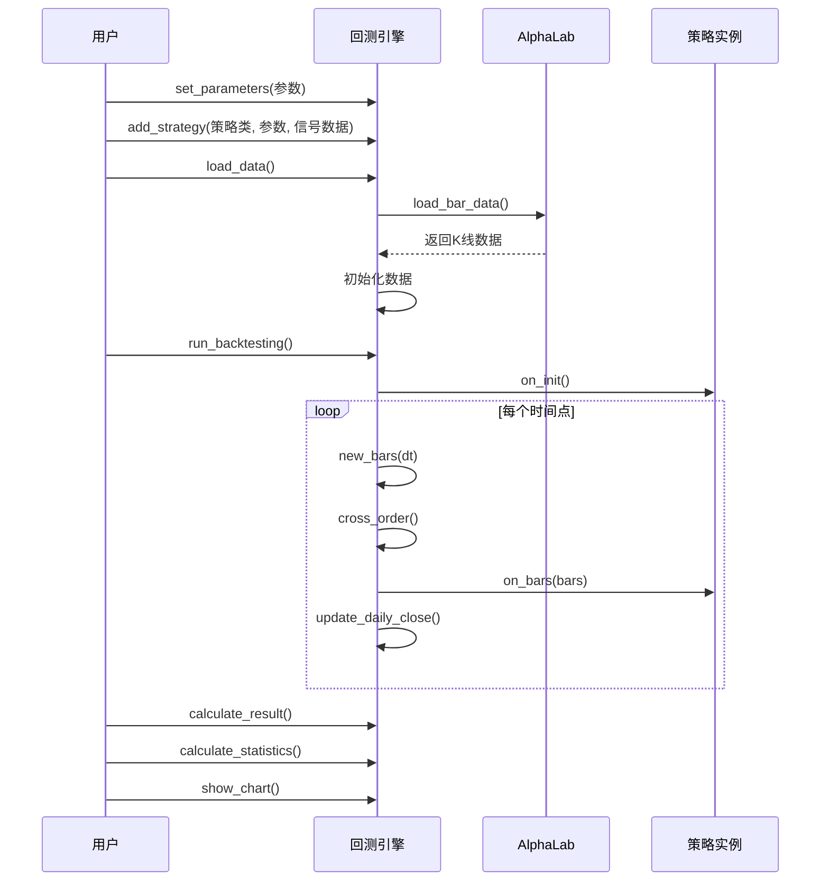

# AI策略开发与回测

<cite>
**本文档引用文件**   
- [backtesting.py](file://vnpy/alpha/strategy/backtesting.py)
- [template.py](file://vnpy/alpha/strategy/template.py)
- [equity_demo_strategy.py](file://vnpy/alpha/strategy/strategies/equity_demo_strategy.py)
- [lab.py](file://vnpy/alpha/lab.py)
- [alpha_demo_strategy.py](file://vnpy/alpha/strategy/strategies/equity_demo_strategy.py)
</cite>

## 目录
1. [引言](#引言)
2. [回测引擎设计](#回测引擎设计)
3. [策略基类接口](#策略基类接口)
4. [AI模型集成示例](#ai模型集成示例)
5. [端到端代码示例](#端到端代码示例)
6. [参数优化机制](#参数优化机制)
7. [结论](#结论)

## 引言
本文档系统阐述基于AI模型的量化策略开发与回测机制，重点分析vnpy框架中alpha模块的实现原理。通过深入解析回测引擎、策略基类和实际策略示例，展示如何将训练好的AI模型集成到交易策略中，实现从信号生成、订单执行到回测评估的完整流程。

## 回测引擎设计

vnpy的回测引擎采用事件驱动架构，通过BacktestingEngine类实现完整的回测流程。引擎支持多合约、多周期的历史数据回放，能够精确模拟交易过程中的各种市场行为。

**图表来源**
- [backtesting.py](file://vnpy/alpha/strategy/backtesting.py#L70-L149)

**回测流程分析**
回测引擎的核心流程包括数据加载、策略初始化、历史数据回放、订单撮合和绩效计算五个阶段。首先通过set_parameters方法设置回测参数，包括交易品种、时间周期、起止时间和初始资金等。然后调用load_data方法从AlphaLab数据管理器加载指定时间段的历史K线数据。

**图表来源**
- [backtesting.py](file://vnpy/alpha/strategy/backtesting.py#L150-L168)

**交易成本与滑点模拟**
回测引擎精确模拟了交易成本和滑点。在cross_order方法中，当订单价格满足撮合条件时，系统会根据合约的手续费率(long_rates/short_rates)计算交易佣金，并更新可用资金。同时，通过设置价格跳动(pricetick)和涨跌停限制，模拟了实际交易中的滑点影响。

**绩效评估模块**
引擎提供了全面的绩效评估功能，包括年化收益、夏普比率、最大回撤等核心指标。calculate_statistics方法首先计算每日盈亏，然后基于资金曲线计算各种统计指标。特别地，系统会检查是否发生爆仓（资金小于等于0），并据此调整指标计算逻辑。

**本节来源**
- [backtesting.py](file://vnpy/alpha/strategy/backtesting.py#L228-L402)

## 策略基类接口

AlphaStrategy类作为所有AI策略的基类，定义了标准化的策略接口和生命周期管理方法。该设计采用面向对象的模板方法模式，确保了策略开发的一致性和可扩展性。

**图表来源**
- [template.py](file://vnpy/alpha/strategy/template.py#L15-L206)

**生命周期方法**
策略基类定义了三个核心生命周期方法：on_init、on_bars和on_trade。on_init方法在策略初始化时调用，用于设置初始状态和参数；on_bars方法在每个K线周期结束时调用，是策略逻辑的主要执行入口；on_trade方法在每笔交易成交后调用，用于更新持仓信息。

**交易指令接口**
基类提供了统一的交易指令接口，包括buy（买入开仓）、sell（卖出平仓）、short（卖出开仓）和cover（买入平仓）四个基本操作。这些方法通过send_order与回测引擎交互，实现了交易指令的发送和管理。

**持仓管理机制**
策略通过pos_data字典维护实际持仓，通过target_data字典维护目标持仓。execute_trading方法实现了基于目标持仓的自动调仓逻辑，能够智能地生成平仓和开仓订单组合，实现持仓的平稳过渡。

**本节来源**
- [template.py](file://vnpy/alpha/strategy/template.py#L15-L206)

## AI模型集成示例

以EquityDemoStrategy为例，展示如何将AI模型的预测信号集成到交易策略中。该策略实现了基于信号排名的股票组合管理，通过动态调仓实现超额收益。

**图表来源**
- [equity_demo_strategy.py](file://vnpy/alpha/strategy/strategies/equity_demo_strategy.py#L12-L102)

**信号处理逻辑**
策略通过get_signal方法从回测引擎获取当前时间点的模型预测信号。信号数据包含每个股票的预测得分，策略首先按得分降序排列，然后选择得分最高的top_k只股票作为持仓候选。

**动态调仓机制**
策略实现了智能的调仓逻辑：首先确定需要卖出的股票列表，包括不在当前指数成分股中的持仓和信号排名最低的n_drop只股票；然后确定需要买入的股票列表，从信号排名靠前但尚未持仓的股票中选择。这种机制确保了组合的动态优化。

**风险控制参数**
策略内置了多重风险控制参数：min_days限制了最短持有期，防止过度交易；cash_ratio控制了资金利用率，保留一定现金应对市场波动；price_add设置了订单价格的调整比例，通过在收盘价基础上增加一定比例来提高成交概率。

**本节来源**
- [equity_demo_strategy.py](file://vnpy/alpha/strategy/strategies/equity_demo_strategy.py#L12-L102)

## 端到端代码示例

以下是一个完整的AI策略开发与回测流程示例，展示了从模型信号加载到回测执行的全过程。

**图表来源**
- [backtesting.py](file://vnpy/alpha/strategy/backtesting.py#L70-L439)

**数据准备阶段**
首先需要通过AlphaLab准备所需数据。AlphaLab作为数据管理中枢，负责存储和管理历史K线、指数成分股、合约信息等各类数据。用户可以通过save_bar_data、save_component_data等方法将数据存入对应目录。

**回测执行流程**
回测执行流程始于参数设置，通过set_parameters方法配置回测的基本参数。然后通过add_strategy方法添加策略实例和信号数据。调用load_data加载历史数据后，run_backtesting方法启动回测主循环，逐个时间点回放数据并触发策略逻辑。

**结果分析与可视化**
回测完成后，通过calculate_result和calculate_statistics方法计算绩效指标。show_chart方法提供了多维度的可视化分析，包括资金曲线、回撤图、日收益分布等，帮助用户全面评估策略表现。

**本节来源**
- [backtesting.py](file://vnpy/alpha/strategy/backtesting.py#L70-L439)
- [lab.py](file://vnpy/alpha/lab.py#L20-L481)

## 参数优化机制

vnpy框架提供了完善的参数优化支持，用户可以通过网格搜索或遗传算法等方式寻找最优参数组合。

**优化流程**
参数优化通常包括以下步骤：首先定义参数搜索空间，然后在训练集上进行多组参数的回测，最后根据绩效指标选择最优参数组合。优化过程可以基于夏普比率、年化收益或收益回撤比等目标函数。

**实现方式**
虽然本文档分析的代码中未直接包含优化模块，但通过策略参数的灵活设置，可以很容易地实现参数优化。用户可以将策略中的top_k、n_drop、price_add等参数作为优化变量，通过外部循环调用回测引擎进行批量测试。

**本节来源**
- [equity_demo_strategy.py](file://vnpy/alpha/strategy/strategies/equity_demo_strategy.py#L15-L23)

## 结论
本文档详细解析了vnpy框架中基于AI模型的量化策略开发与回测机制。通过事件驱动的回测引擎、标准化的策略基类和灵活的模型集成方式，提供了一套完整的量化研究解决方案。该框架不仅支持复杂的多因子模型集成，还提供了精确的交易成本模拟和全面的绩效评估，为量化策略的研发和验证提供了强大支持。