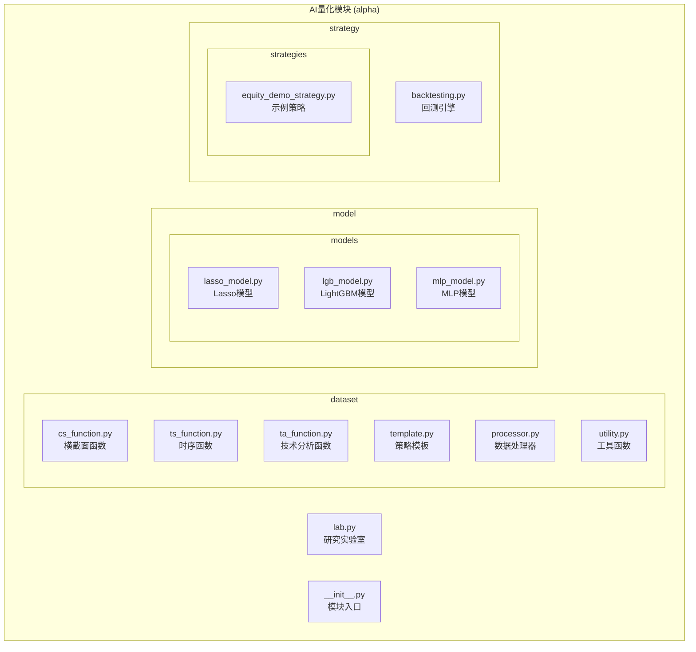
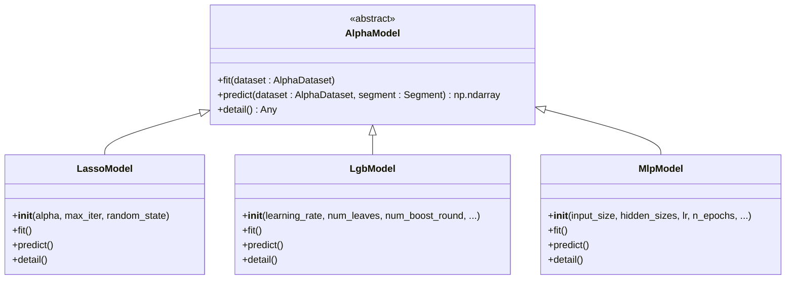
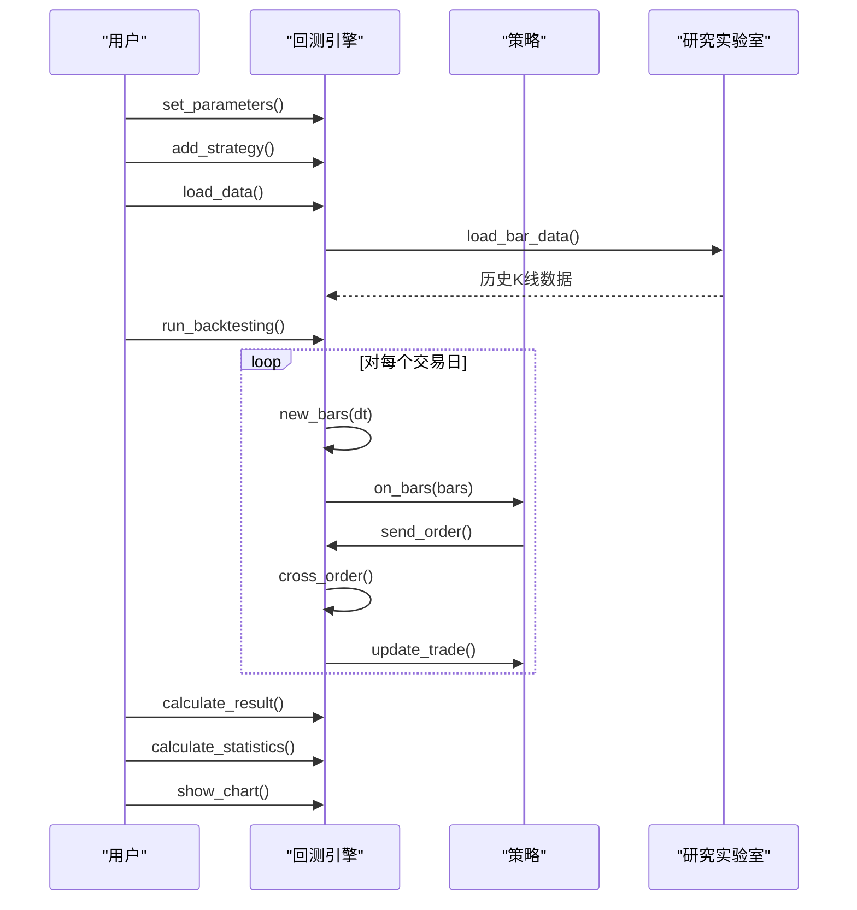

# AI量化模块 (alpha)

<cite>
**本文档引用的文件**   
- [__init__.py](file://vnpy/alpha/__init__.py)
- [lab.py](file://vnpy/alpha/lab.py)
- [template.py](file://vnpy/alpha/dataset/template.py)
- [cs_function.py](file://vnpy/alpha/dataset/cs_function.py)
- [ts_function.py](file://vnpy/alpha/dataset/ts_function.py)
- [ta_function.py](file://vnpy/alpha/dataset/ta_function.py)
- [lasso_model.py](file://vnpy/alpha/model/models/lasso_model.py)
- [lgb_model.py](file://vnpy/alpha/model/models/lgb_model.py)
- [mlp_model.py](file://vnpy/alpha/model/models/mlp_model.py)
- [template.py](file://vnpy/alpha/model/template.py)
- [template.py](file://vnpy/alpha/strategy/template.py)
- [backtesting.py](file://vnpy/alpha/strategy/backtesting.py)
</cite>

## 目录
1. [简介](#简介)
2. [项目结构](#项目结构)
3. [核心组件](#核心组件)
4. [因子工程能力](#因子工程能力)
5. [机器学习模型支持](#机器学习模型支持)
6. [策略回测引擎](#策略回测引擎)
7. [交互式研究环境](#交互式研究环境)
8. [端到端多因子策略开发示例](#端到端多因子策略开发示例)
9. [结论](#结论)

## 简介

AI量化模块（alpha）是vnpy框架中的一个高级量化分析组件，专注于多因子策略的开发与研究。该模块提供了一套完整的工具链，涵盖了从数据获取、因子计算、模型训练到策略回测的全流程。其核心功能包括：基于polars的数据处理能力、丰富的因子工程函数库、支持多种机器学习算法的模型框架、可扩展的策略回测引擎，以及一个交互式的量化研究环境（AlphaLab）。本模块旨在为量化研究员提供一个高效、灵活且可复现的研究平台，支持从因子挖掘到策略验证的完整研究周期。

**Section sources**
- [__init__.py](file://vnpy/alpha/__init__.py)

## 项目结构

AI量化模块的项目结构清晰地划分为四个主要子包：dataset、model、strategy和lab，每个子包负责不同的功能领域。dataset包专注于数据处理和因子工程，提供了横截面、时序和技术分析函数。model包封装了多种机器学习算法，便于模型的训练与预测。strategy包实现了策略回测引擎和策略模板。lab包则提供了交互式研究环境，用于数据管理和研究流程的组织。

**Diagram sources**
- [__init__.py](file://vnpy/alpha/__init__.py)

**Section sources**
- [__init__.py](file://vnpy/alpha/__init__.py)

## 核心组件

AI量化模块的核心由四个相互协作的组件构成：AlphaDataset、AlphaModel、AlphaStrategy和AlphaLab。AlphaDataset是数据处理的核心，负责管理原始数据、计算因子特征并生成用于机器学习的特征集。AlphaModel是机器学习的抽象基类，定义了模型训练和预测的标准接口，其具体实现包括Lasso、LightGBM和MLP等算法。AlphaStrategy是策略的基类，定义了策略初始化、接收行情和处理交易的回调方法。AlphaLab是交互式研究环境的入口，集成了数据管理、模型和数据集的持久化等功能。这些组件通过清晰的接口进行交互，形成了一个从数据到策略的完整工作流。

**Section sources**
- [__init__.py](file://vnpy/alpha/__init__.py)
- [template.py](file://vnpy/alpha/dataset/template.py)
- [template.py](file://vnpy/alpha/model/template.py)
- [template.py](file://vnpy/alpha/strategy/template.py)
- [lab.py](file://vnpy/alpha/lab.py)

## 因子工程能力

### 横截面函数 (cs_function)

横截面函数用于在特定时间点对所有股票（或合约）的某个特征进行跨资产的计算。`cs_function.py`文件提供了多种横截面操作，这些操作在每个时间点上独立执行，结果反映了该时刻资产间的相对位置。主要函数包括：
- `cs_rank`: 计算特征在横截面上的排名。
- `cs_mean`: 计算特征在横截面上的均值。
- `cs_std`: 计算特征在横截面上的标准差。

这些函数是构建多因子模型的基础，常用于对原始因子进行标准化或去极值处理。

**Section sources**
- [cs_function.py](file://vnpy/alpha/dataset/cs_function.py)

### 时序函数 (ts_function)

时序函数用于对单个资产的特征在时间维度上进行滚动计算。`ts_function.py`文件提供了丰富的时序操作，支持对历史数据窗口进行各种统计分析。主要函数包括：
- `ts_delay`: 获取特征在指定时间前的值。
- `ts_min`/`ts_max`: 计算滚动窗口内的最小/最大值。
- `ts_mean`/`ts_std`: 计算滚动窗口内的均值/标准差。
- `ts_sum`: 计算滚动窗口内的总和。
- `ts_slope`/`ts_rsquare`: 计算滚动线性回归的斜率和R平方值。
- `ts_corr`: 计算两个特征在滚动窗口内的相关性。

这些函数是技术分析和动量策略的核心，能够捕捉资产价格的时间序列模式。

**Section sources**
- [ts_function.py](file://vnpy/alpha/dataset/ts_function.py)

### 技术分析函数 (ta_function)

技术分析函数封装了常用的技术指标计算，基于TA-Lib库实现。`ta_function.py`文件提供了针对单个合约的技术指标计算函数，主要函数包括：
- `ta_rsi`: 计算相对强弱指数（RSI）。
- `ta_atr`: 计算平均真实波幅（ATR）。

这些函数通过将polars的DataFrame转换为pandas的Series，调用TA-Lib计算后再转换回polars的DataFrame，实现了高性能的技术指标计算。

**Section sources**
- [ta_function.py](file://vnpy/alpha/dataset/ta_function.py)

## 机器学习模型支持

### 模型架构

AI量化模块的模型设计遵循一个统一的接口。`AlphaModel`作为所有模型的基类，定义了`fit`（训练）、`predict`（预测）和`detail`（详情）三个抽象方法。这种设计使得不同的机器学习算法可以无缝地集成到同一个研究流程中，用户可以轻松地在不同模型之间切换而无需修改上层代码。

**Diagram sources**
- [template.py](file://vnpy/alpha/model/template.py)
- [lasso_model.py](file://vnpy/alpha/model/models/lasso_model.py)
- [lgb_model.py](file://vnpy/alpha/model/models/lgb_model.py)
- [mlp_model.py](file://vnpy/alpha/model/models/mlp_model.py)

### Lasso模型

Lasso模型是一个基于L1正则化的线性回归模型，由`LassoModel`类实现。它通过引入正则化项来防止过拟合，并能自动进行特征选择，将不重要的特征系数压缩至零。该模型适用于特征维度较高、需要稀疏解的场景。其`detail`方法会输出非零特征的重要性排序，帮助用户理解模型的决策依据。

**Section sources**
- [lasso_model.py](file://vnpy/alpha/model/models/lasso_model.py)

### LightGBM模型

LightGBM模型是一个基于梯度提升决策树（GBDT）的集成学习模型，由`LgbModel`类实现。它以训练速度快、内存占用低和预测精度高而著称。该模型支持早停（early stopping）和日志记录，能够有效防止过拟合。其`detail`方法会生成特征重要性图，直观地展示哪些因子对模型预测贡献最大。

**Section sources**
- [lgb_model.py](file://vnpy/alpha/model/models/lgb_model.py)

### MLP模型

MLP模型是一个多层感知机（神经网络）模型，由`MlpModel`类实现。它使用PyTorch框架构建，支持深度神经网络，能够捕捉特征间的非线性关系。该模型实现了完整的训练流程，包括学习率调度、早停和权重初始化。其`detail`方法通过扰动分析计算特征重要性，为复杂的黑盒模型提供了一定程度的可解释性。

**Section sources**
- [mlp_model.py](file://vnpy/alpha/model/models/mlp_model.py)

## 策略回测引擎

### 回测引擎架构

策略回测引擎由`BacktestingEngine`类实现，它模拟了真实交易环境，负责加载历史数据、驱动策略运行、撮合订单和计算绩效。引擎与`AlphaStrategy`基类协同工作，通过事件驱动的方式将K线数据推送给策略，并接收策略发出的交易信号。

**Diagram sources**
- [backtesting.py](file://vnpy/alpha/strategy/backtesting.py)
- [template.py](file://vnpy/alpha/strategy/template.py)

### 策略模板

`AlphaStrategy`是所有策略的基类，它定义了策略必须实现的接口，如`on_init`（初始化）、`on_bars`（接收K线）和`on_trade`（处理成交）。策略通过继承此类并重写这些方法来实现自己的交易逻辑。引擎通过`update_trade`和`update_order`方法将成交和订单状态更新推送给策略，策略则通过`buy`、`sell`等方法向引擎发送交易指令。

**Section sources**
- [template.py](file://vnpy/alpha/strategy/template.py)
- [backtesting.py](file://vnpy/alpha/strategy/backtesting.py)

## 交互式研究环境

`AlphaLab`类是整个AI量化模块的交互式研究环境，它为量化研究提供了一个统一的入口和工作空间。`AlphaLab`的主要功能包括：
- **数据管理**：`save_bar_data`和`load_bar_data`方法用于将行情数据以Parquet格式持久化存储，支持日线和分钟线。
- **成分股管理**：`save_component_data`和`load_component_data`方法用于管理指数成分股信息。
- **持久化**：`save_dataset`、`save_model`和`save_signal`方法可以将研究过程中的数据集、训练好的模型和预测信号保存到磁盘，便于后续加载和复用。
- **研究流程组织**：通过统一的路径管理，将数据、模型和信号分门别类地存储，确保研究过程的可复现性。

`AlphaLab`极大地简化了研究流程，用户可以在一个Jupyter Notebook中完成从数据加载到策略回测的所有步骤。

**Section sources**
- [lab.py](file://vnpy/alpha/lab.py)

## 端到端多因子策略开发示例

一个完整的多因子策略开发流程如下：

1.  **数据获取**：使用`AlphaLab`从数据库或API加载股票的日线数据。
2.  **因子计算**：创建一个`AlphaDataset`实例，使用`cs_function`、`ts_function`和`ta_function`中的函数定义多个因子表达式，并调用`prepare_data`方法计算所有因子。
3.  **模型训练**：选择一个`AlphaModel`（如`LgbModel`），调用其`fit`方法在训练集上训练模型，并使用`detail`方法分析特征重要性。
4.  **预测与信号生成**：使用训练好的模型在测试集上调用`predict`方法生成预测信号，并将信号保存到`AlphaLab`。
5.  **策略回测**：创建一个`BacktestingEngine`实例，加载历史数据和预测信号，添加一个继承自`AlphaStrategy`的自定义策略，在策略的`on_bars`方法中根据预测信号生成交易指令。
6.  **绩效评估**：运行回测后，调用`calculate_statistics`和`show_chart`方法评估策略的绩效。

这个流程展示了AI量化模块如何将数据、模型和策略三个环节无缝连接，形成一个高效的量化研究闭环。

**Section sources**
- [lab.py](file://vnpy/alpha/lab.py)
- [template.py](file://vnpy/alpha/dataset/template.py)
- [cs_function.py](file://vnpy/alpha/dataset/cs_function.py)
- [ts_function.py](file://vnpy/alpha/dataset/ts_function.py)
- [ta_function.py](file://vnpy/alpha/dataset/ta_function.py)
- [lgb_model.py](file://vnpy/alpha/model/models/lgb_model.py)
- [template.py](file://vnpy/alpha/strategy/template.py)
- [backtesting.py](file://vnpy/alpha/strategy/backtesting.py)

## 结论

AI量化模块（alpha）为量化研究提供了一个功能强大且结构清晰的框架。其模块化的设计使得数据处理、模型训练和策略回测可以独立开发和测试。丰富的因子工程函数库和多种机器学习模型的支持，为构建复杂的多因子策略提供了坚实的基础。`AlphaLab`交互式环境极大地提升了研究效率和可复现性。通过遵循端到端的开发流程，用户可以系统性地从数据中挖掘Alpha，并通过严谨的回测验证其有效性。该模块是vnpy生态系统中进行高级量化分析的核心工具。