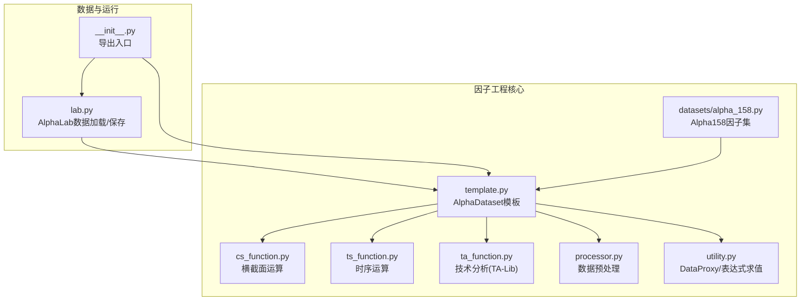
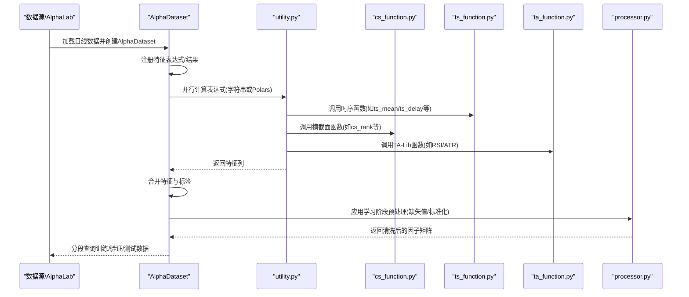
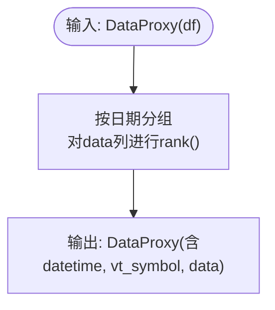
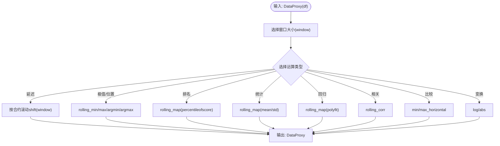
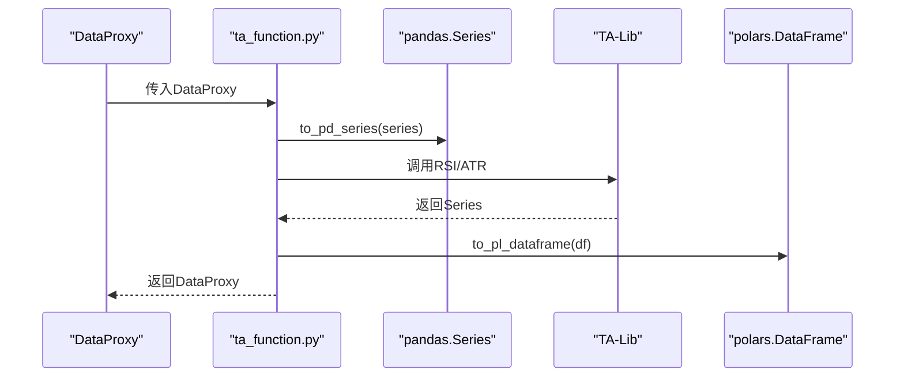
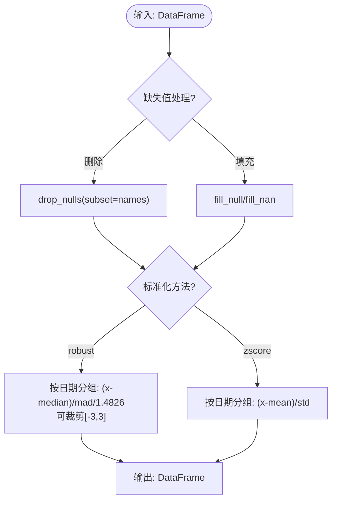
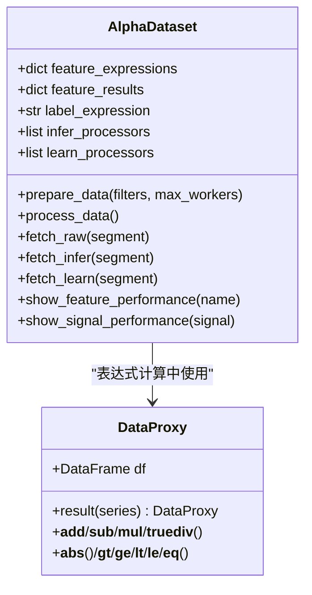
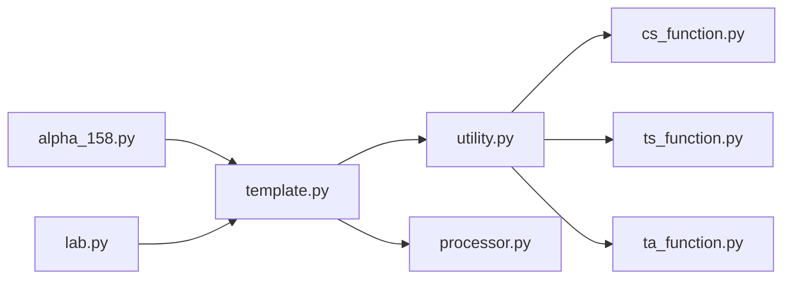

# 因子工程与数据集

<cite>
**本文引用的文件列表**
- [cs_function.py](file://vnpy/alpha/dataset/cs_function.py)
- [ts_function.py](file://vnpy/alpha/dataset/ts_function.py)
- [ta_function.py](file://vnpy/alpha/dataset/ta_function.py)
- [processor.py](file://vnpy/alpha/dataset/processor.py)
- [template.py](file://vnpy/alpha/dataset/template.py)
- [utility.py](file://vnpy/alpha/dataset/utility.py)
- [alpha_158.py](file://vnpy/alpha/dataset/datasets/alpha_158.py)
- [lab.py](file://vnpy/alpha/lab.py)
- [__init__.py](file://vnpy/alpha/__init__.py)
- [research_workflow_lgb.ipynb](file://examples/alpha_research/research_workflow_lgb.ipynb)
- [download_data_rq.ipynb](file://examples/alpha_research/download_data_rq.ipynb)
</cite>

## 目录
1. [引言](#引言)
2. [项目结构](#项目结构)
3. [核心组件](#核心组件)
4. [架构总览](#架构总览)
5. [详细组件分析](#详细组件分析)
6. [依赖关系分析](#依赖关系分析)
7. [性能考量](#性能考量)
8. [故障排查指南](#故障排查指南)
9. [结论](#结论)
10. [附录](#附录)

## 引言
本文件系统性梳理vnpy中AI量化模块的因子工程能力，围绕横截面因子、时序因子、技术分析因子、数据预处理流水线以及经典Alpha158因子集展开，结合AlphaLab数据加载与AlphaDataset模板，给出从原始行情数据到因子矩阵的完整生成流程与扩展接口说明。文档旨在帮助读者快速理解各模块职责、调用关系与最佳实践。

## 项目结构
因子工程相关代码集中在vnpy/alpha/dataset目录下，包含横截面运算、时序运算、技术分析运算、数据预处理、通用工具与Alpha158经典因子集；同时通过AlphaLab提供数据加载与持久化能力，配合AlphaDataset模板完成因子表达式计算、并行化执行与分段数据管理。

图表来源
- [cs_function.py](file://vnpy/alpha/dataset/cs_function.py#L1-L38)
- [ts_function.py](file://vnpy/alpha/dataset/ts_function.py#L1-L227)
- [ta_function.py](file://vnpy/alpha/dataset/ta_function.py#L1-L43)
- [processor.py](file://vnpy/alpha/dataset/processor.py#L1-L126)
- [utility.py](file://vnpy/alpha/dataset/utility.py#L1-L183)
- [template.py](file://vnpy/alpha/dataset/template.py#L1-L304)
- [alpha_158.py](file://vnpy/alpha/dataset/datasets/alpha_158.py#L1-L131)
- [lab.py](file://vnpy/alpha/lab.py#L1-L200)
- [__init__.py](file://vnpy/alpha/__init__.py#L1-L18)

章节来源
- [lab.py](file://vnpy/alpha/lab.py#L1-L200)
- [__init__.py](file://vnpy/alpha/__init__.py#L1-L18)

## 核心组件
- DataProxy：封装DataFrame为可参与表达式的“特征对象”，支持四则运算、比较、绝对值等操作，统一输出包含datetime、vt_symbol与data列的数据结构。
- 表达式求值：utility.py提供两种表达式执行路径：
  - 字符串表达式：通过calculate_by_expression动态注入ts/cs/ta函数与基础字段，使用eval执行。
  - Polars表达式：通过calculate_by_polars直接对DataFrame进行列级计算。
- AlphaDataset模板：负责特征表达式注册、并行计算、结果合并、分段数据查询、预处理流水线、信号与因子表现分析。
- 数据预处理：processor.py提供缺失值处理、跨期标准化、稳健Z-score归一化、横截面秩归一化等常用流程。
- 经典因子集：alpha_158.py基于AlphaDataset派生，集中定义了158个经典因子表达式及标签构造。

章节来源
- [utility.py](file://vnpy/alpha/dataset/utility.py#L1-L183)
- [template.py](file://vnpy/alpha/dataset/template.py#L1-L304)
- [processor.py](file://vnpy/alpha/dataset/processor.py#L1-L126)
- [alpha_158.py](file://vnpy/alpha/dataset/datasets/alpha_158.py#L1-L131)

## 架构总览
下图展示了从原始日线数据到因子矩阵的端到端流程，以及各模块之间的协作关系。

图表来源
- [lab.py](file://vnpy/alpha/lab.py#L156-L243)
- [template.py](file://vnpy/alpha/dataset/template.py#L90-L171)
- [utility.py](file://vnpy/alpha/dataset/utility.py#L111-L162)
- [cs_function.py](file://vnpy/alpha/dataset/cs_function.py#L10-L38)
- [ts_function.py](file://vnpy/alpha/dataset/ts_function.py#L14-L227)
- [ta_function.py](file://vnpy/alpha/dataset/ta_function.py#L12-L43)
- [processor.py](file://vnpy/alpha/dataset/processor.py#L9-L126)

## 详细组件分析

### 横截面因子(cs_function.py)
- 功能要点
  - cs_rank：按交易日对特征进行排名，返回秩次。
  - cs_mean/cs_std：按交易日计算特征的均值与标准差，用于横截面统计。
- 实现模式
  - 基于polars的groupby over("datetime")进行分组聚合，保持datetime与vt_symbol两列不变，仅对data列做聚合。
- 典型用途
  - 排名标准化、横截面去极值、中性化前的统计准备。

图表来源
- [cs_function.py](file://vnpy/alpha/dataset/cs_function.py#L10-L18)

章节来源
- [cs_function.py](file://vnpy/alpha/dataset/cs_function.py#L10-L38)

### 时序因子(ts_function.py)
- 功能要点
  - ts_delay：固定滞后窗口取值。
  - ts_min/ts_max/ts_argmin/ts_argmax：滚动窗口极值与位置。
  - ts_rank：滚动窗口内当前值的百分位排名。
  - ts_sum/ts_mean/ts_std：滚动求和/均值/标准差。
  - ts_slope/ts_rsquare/ts_resi：滚动线性回归斜率、R方与残差。
  - ts_corr：两特征滚动相关系数，过滤无穷值。
  - ts_less/ts_greater：逐元素最小/最大比较。
  - ts_log/ts_abs：自然对数与绝对值。
- 实现模式
  - 使用over("vt_symbol")确保按合约维度滚动计算。
  - 对滚动映射采用numpy/scipy实现复杂统计（如polyfit、percentileofscore）。
- 典型用途
  - 动量、波动率、趋势、择时等策略因子构建。

图表来源
- [ts_function.py](file://vnpy/alpha/dataset/ts_function.py#L14-L227)

章节来源
- [ts_function.py](file://vnpy/alpha/dataset/ts_function.py#L14-L227)

### 技术分析因子(ta_function.py)与TA-Lib集成
- 功能要点
  - 提供与TA-Lib的桥接：将DataProxy转换为pandas Series，调用talib.RSI/ATR后转回polars DataFrame。
- 实现模式
  - to_pd_series/to_pl_dataframe负责跨框架数据结构转换。
  - ta_rsi/ta_atr分别对close、high/low/close序列计算指标。
- 典型用途
  - 成交量/价格动量、波动率刻画、超买超卖信号等。

图表来源
- [ta_function.py](file://vnpy/alpha/dataset/ta_function.py#L12-L43)

章节来源
- [ta_function.py](file://vnpy/alpha/dataset/ta_function.py#L12-L43)

### 数据预处理流水线(processor.py)
- 功能要点
  - 缺失值处理：drop_na/fill_na，支持全表或指定列。
  - 横截面标准化：robust/zscore两种方法，按日期分组中心化与缩放。
  - 稳健Z-score归一化：可限定训练期，使用中位数与MAD缩放，并可裁剪异常值。
  - 横截面秩归一化：按日期rank后线性映射至[-1.73, 1.73]区间（约×2倍标准差尺度）。
- 实现模式
  - 基于polars over("datetime")进行日期分组统计与变换。
  - robust方法使用median与median绝对偏差(mad)，并乘以常数1.4826近似标准差。
- 典型用途
  - 因子稳定性提升、异常值控制、不同尺度因子的统一。

图表来源
- [processor.py](file://vnpy/alpha/dataset/processor.py#L9-L126)

章节来源
- [processor.py](file://vnpy/alpha/dataset/processor.py#L9-L126)

### AlphaDataset模板(template.py)与因子表达式
- 功能要点
  - 特征注册：add_feature支持字符串表达式或直接传入DataFrame结果。
  - 标签设置：set_label定义预测目标。
  - 并行计算：prepare_data通过多进程并行计算表达式，使用multiprocessing上下文。
  - 预处理管线：add_processor为推理/学习阶段分别添加处理器，process_data顺序应用。
  - 分段查询：fetch_raw/fetch_infer/fetch_learn按训练/验证/测试时间段切片。
  - 表现分析：show_feature_performance与show_signal_performance对接alphalens进行因子/信号质量评估。
- 实现模式
  - calculate_by_expression/local变量注入+eval执行，或calculate_by_polars直接列式计算。
  - query_by_time基于datetime范围过滤并排序。
- 典型用途
  - 快速构建多因子矩阵、统一数据生命周期管理、可复现的因子实验流程。

图表来源
- [template.py](file://vnpy/alpha/dataset/template.py#L23-L304)
- [utility.py](file://vnpy/alpha/dataset/utility.py#L8-L110)

章节来源
- [template.py](file://vnpy/alpha/dataset/template.py#L23-L304)
- [utility.py](file://vnpy/alpha/dataset/utility.py#L111-L162)

### 经典因子集Alpha158(alpha_158.py)
- 构建思路
  - 基于AlphaDataset派生，集中注册158个经典因子表达式，覆盖K线形态、价格相对水平、动量、均值、标准差、斜率、R方、残差、分位数、最高/最低位置、相关性、涨跌计数、成交量相关统计等。
  - 标签通常定义未来一段时间的收益，便于回测与模型训练。
- 使用方式
  - 通过Alpha158构造函数传入DataFrame与训练/验证/测试时间段，随后可继续添加自定义特征或预处理流程。

章节来源
- [alpha_158.py](file://vnpy/alpha/dataset/datasets/alpha_158.py#L1-L131)

### 数据加载与持久化(AlphaLab)
- 能力概览
  - 保存/加载日线/分钟线数据，自动去重与排序。
  - 组件数据（指数成分）的保存与加载，支持按日期范围查询与持有期过滤。
  - 将多合约数据拼接为统一的DataFrame，自动计算vwap，处理停牌日（零值转NaN），并进行价格归一化。
  - 支持将AlphaDataset/模型/信号序列持久化与加载。
- 典型流程
  - 通过load_bar_df加载多合约日线数据，扩展起止日期以满足滚动窗口需求。
  - 结合Alpha158创建数据集，添加预处理与特征表达式，最终得到可用于建模的因子矩阵。

章节来源
- [lab.py](file://vnpy/alpha/lab.py#L156-L243)
- [lab.py](file://vnpy/alpha/lab.py#L245-L481)

## 依赖关系分析
- 模块耦合
  - utility.py是表达式求值的核心枢纽，被template.py与alpha_158.py间接依赖。
  - cs_function/ts_function/ta_function均依赖utility.DataProxy与polars。
  - processor.py独立于上述函数，但与template.py共同作用于AlphaDataset的learn/infer阶段。
- 外部依赖
  - TA-Lib：ta_function依赖talib进行RSI/ATR计算。
  - alphalens：template.py中用于因子/信号表现分析。
  - polars/numpy/scipy：用于高性能列式计算与统计。
- 循环依赖
  - 未发现循环导入；utility.py在运行时局部导入ts/cs/ta函数避免全局污染。

图表来源
- [utility.py](file://vnpy/alpha/dataset/utility.py#L111-L162)
- [cs_function.py](file://vnpy/alpha/dataset/cs_function.py#L10-L38)
- [ts_function.py](file://vnpy/alpha/dataset/ts_function.py#L14-L227)
- [ta_function.py](file://vnpy/alpha/dataset/ta_function.py#L12-L43)
- [template.py](file://vnpy/alpha/dataset/template.py#L90-L171)
- [processor.py](file://vnpy/alpha/dataset/processor.py#L9-L126)
- [alpha_158.py](file://vnpy/alpha/dataset/datasets/alpha_158.py#L1-L131)
- [lab.py](file://vnpy/alpha/lab.py#L156-L243)

## 性能考量
- 计算效率
  - polars列式计算与over分组聚合具备良好性能，建议优先使用calculate_by_polars表达式而非字符串eval。
  - 并行计算prepare_data默认使用spawn上下文，适合CPU密集型表达式；注意进程间数据传输开销。
- 内存占用
  - 大规模多合约数据拼接时，建议先按vt_symbol分区计算，再合并，减少重复列与中间态内存峰值。
- 稳健性
  - 在ts_corr等涉及无穷值的场景，应显式过滤或替换，避免影响后续统计。
  - robust标准化对异常值更鲁棒，但在极少数极端情况下可能放大噪声，需结合业务场景权衡。

## 故障排查指南
- 表达式求值错误
  - 确认表达式中变量名与DataFrame列名一致，且未混用数值与列名顺序。
  - 若使用字符串表达式，检查是否正确注入了ts/cs/ta函数与基础字段。
- 数据不一致
  - 确保datetime与vt_symbol列存在且类型正确；排序顺序会影响over分组与滚动计算。
- 缺失值与异常值
  - 使用process_drop_na与process_fill_na清理；必要时结合process_cs_norm或process_robust_zscore_norm进行标准化。
- 并行计算卡顿
  - 检查max_workers设置与系统CPU核数匹配；减少单表达式复杂度或拆分为多个简单表达式。
- alphalens分析报错
  - 确保因子与价格数据对齐，且无NaN/无穷值；必要时在show_feature_performance前进行fillna与drop_nulls。

章节来源
- [template.py](file://vnpy/alpha/dataset/template.py#L158-L270)
- [processor.py](file://vnpy/alpha/dataset/processor.py#L9-L126)

## 结论
vnpy的因子工程体系以AlphaDataset为核心模板，结合utility的表达式求值、cs/ts/ta三大类因子函数与processor的预处理流水线，形成从原始行情到因子矩阵的完整链路。通过AlphaLab的数据加载与持久化能力，可高效支撑大规模多合约因子研究与回测验证。Alpha158作为经典因子集范例，展示了如何组合使用上述函数构建多因子模型，并可通过add_feature/add_processor灵活扩展。

## 附录

### 从原始行情到因子矩阵的完整示例流程
以下步骤对应于研究工作流Notebook中的典型流程，展示如何从AlphaLab加载数据、构建Alpha158数据集、添加预处理与特征表达式，并得到可用于建模的因子矩阵。

- 步骤1：加载数据
  - 使用AlphaLab.load_bar_df加载多合约日线数据，扩展起止日期以满足滚动窗口需求。
  - 参考路径：[research_workflow_lgb.ipynb](file://examples/alpha_research/research_workflow_lgb.ipynb#L100-L173)
- 步骤2：创建数据集
  - 通过Alpha158(df, train_period, valid_period, test_period)初始化数据集。
  - 参考路径：[research_workflow_lgb.ipynb](file://examples/alpha_research/research_workflow_lgb.ipynb#L181-L200)
- 步骤3：添加预处理
  - 在learn阶段添加缺失值处理与标签标准化。
  - 参考路径：[research_workflow_lgb.ipynb](file://examples/alpha_research/research_workflow_lgb.ipynb#L196-L200)
- 步骤4：准备与处理数据
  - 调用dataset.prepare_data并行计算表达式；随后process_data应用预处理。
  - 参考路径：[template.py](file://vnpy/alpha/dataset/template.py#L90-L171)
- 步骤5：分段查询与建模
  - 使用fetch_learn/learn_df获取训练/验证/测试数据，进入模型训练与回测。
  - 参考路径：[template.py](file://vnpy/alpha/dataset/template.py#L172-L192)

章节来源
- [research_workflow_lgb.ipynb](file://examples/alpha_research/research_workflow_lgb.ipynb#L100-L200)
- [template.py](file://vnpy/alpha/dataset/template.py#L90-L192)

### 因子扩展接口与最佳实践
- 扩展接口
  - 自定义特征：通过AlphaDataset.add_feature(name, expression或result)注册。
  - 自定义预处理：通过AlphaDataset.add_processor(task, processor)添加函数。
  - 自定义标签：通过AlphaDataset.set_label(expression)设置预测目标。
- 最佳实践
  - 优先使用Polars表达式进行列式计算，避免字符串eval带来的安全与性能问题。
  - 对横截面因子进行标准化与去极值，提升模型稳定性。
  - 对时序因子使用合理窗口长度，避免过短导致噪声过大或过长导致信息滞后。
  - 利用show_feature_performance与show_signal_performance进行快速质量评估。

章节来源
- [template.py](file://vnpy/alpha/dataset/template.py#L58-L192)
- [utility.py](file://vnpy/alpha/dataset/utility.py#L111-L162)