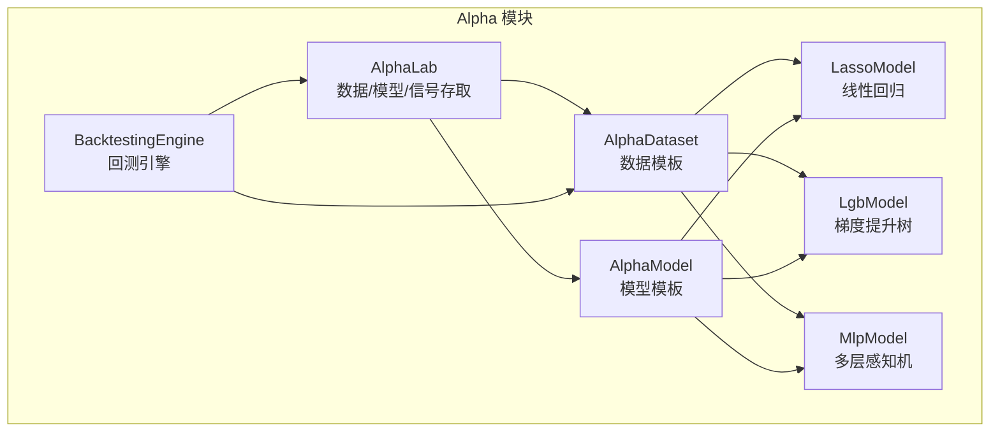
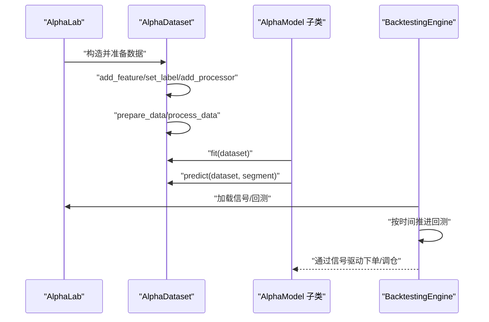
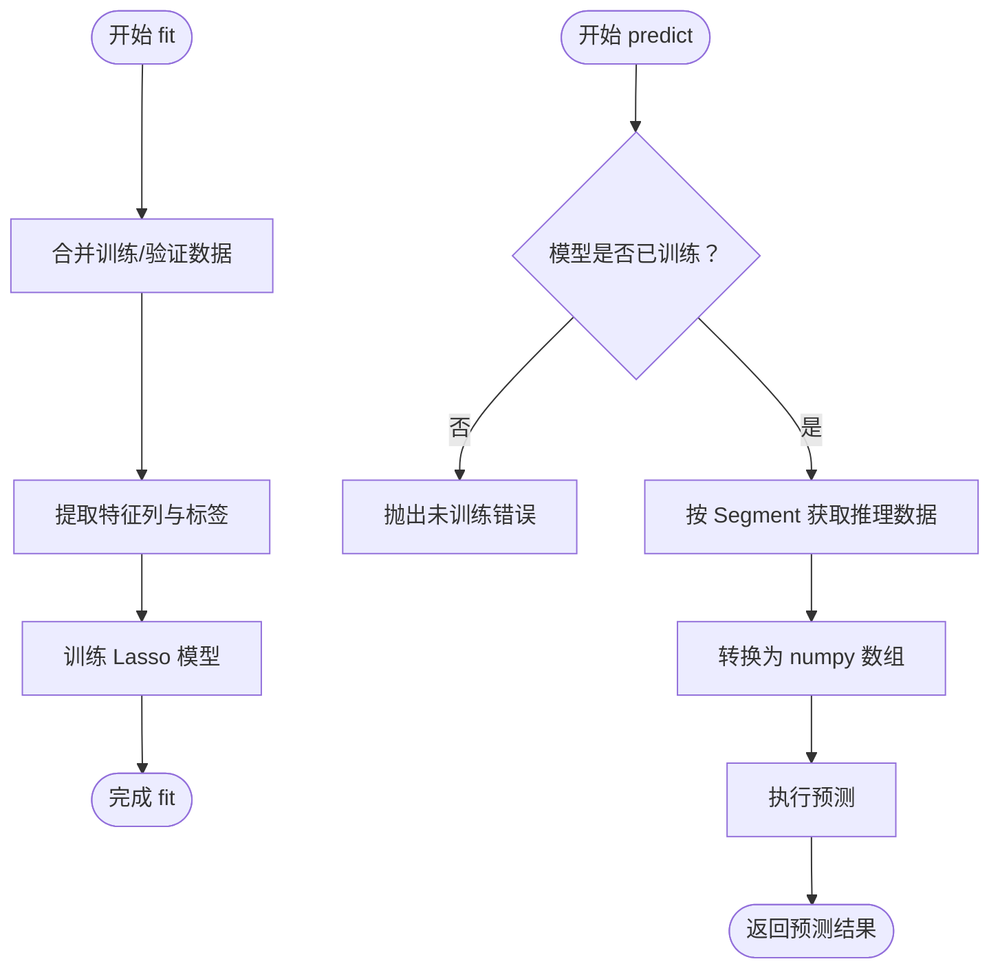
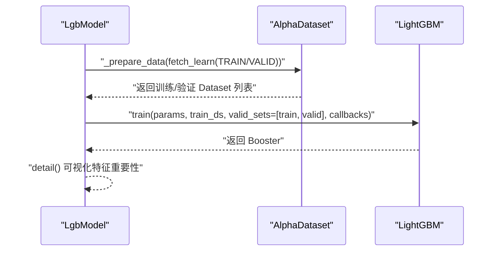
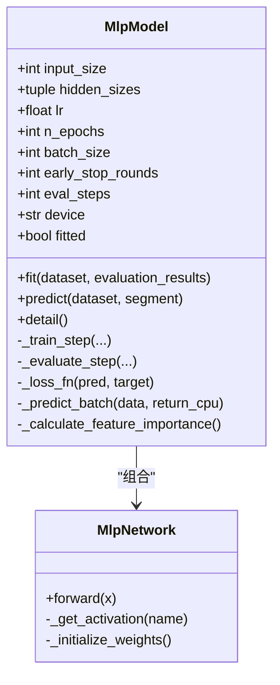
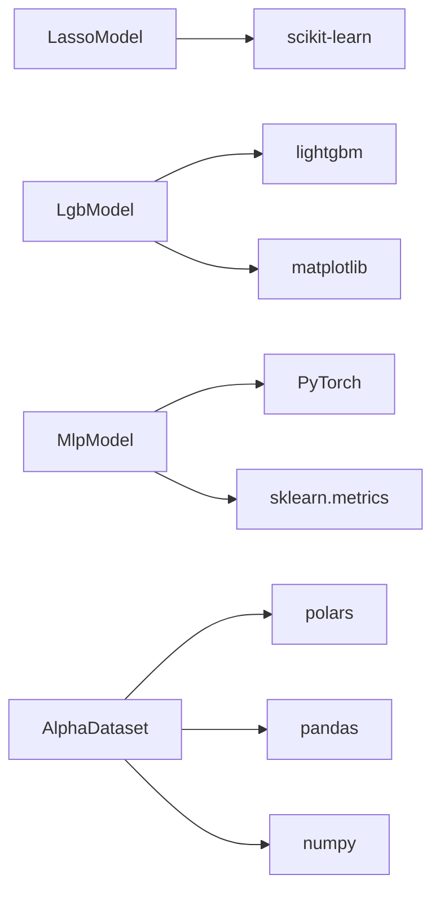

# 机器学习模型管理

<cite>
**本文引用的文件**
- [vnpy/alpha/model/template.py](file://vnpy/alpha/model/template.py)
- [vnpy/alpha/dataset/template.py](file://vnpy/alpha/dataset/template.py)
- [vnpy/alpha/dataset/utility.py](file://vnpy/alpha/dataset/utility.py)
- [vnpy/alpha/model/models/lasso_model.py](file://vnpy/alpha/model/models/lasso_model.py)
- [vnpy/alpha/model/models/lgb_model.py](file://vnpy/alpha/model/models/lgb_model.py)
- [vnpy/alpha/model/models/mlp_model.py](file://vnpy/alpha/model/models/mlp_model.py)
- [vnpy/alpha/__init__.py](file://vnpy/alpha/__init__.py)
- [vnpy/alpha/lab.py](file://vnpy/alpha/lab.py)
- [vnpy/alpha/strategy/backtesting.py](file://vnpy/alpha/strategy/backtesting.py)
</cite>

## 目录
1. [引言](#引言)
2. [项目结构](#项目结构)
3. [核心组件](#核心组件)
4. [架构总览](#架构总览)
5. [详细组件分析](#详细组件分析)
6. [依赖分析](#依赖分析)
7. [性能考虑](#性能考虑)
8. [故障排查指南](#故障排查指南)
9. [结论](#结论)
10. [附录](#附录)

## 引言
本文件系统性解析 vnpy 量化研究模块中的机器学习模型体系，重点覆盖：
- 线性模型 Lasso 在因子选择与降维中的应用，包括正则化参数调优与系数解释
- 梯度提升树模型 LightGBM 的非线性拟合能力，展示特征重要性分析与预测性能优势
- 多层感知机 MLP 的结构设计与训练技巧，适用于复杂非线性关系建模
- 基于模板类扩展新模型的方法规范（fit、predict、detail 等）
- 完整的模型训练流程示例，包含数据划分、交叉验证、过拟合防范与 IC/IR 等指标计算

## 项目结构
AI 量化模块位于 vnpy/alpha 下，围绕 AlphaDataset 数据模板与 AlphaModel 模板类组织，模型实现位于 vnpy/alpha/model/models，配套的数据处理工具位于 vnpy/alpha/dataset。

图表来源
- [vnpy/alpha/dataset/template.py](file://vnpy/alpha/dataset/template.py#L23-L304)
- [vnpy/alpha/model/template.py](file://vnpy/alpha/model/template.py#L9-L31)
- [vnpy/alpha/model/models/lasso_model.py](file://vnpy/alpha/model/models/lasso_model.py#L1-L140)
- [vnpy/alpha/model/models/lgb_model.py](file://vnpy/alpha/model/models/lgb_model.py#L1-L171)
- [vnpy/alpha/model/models/mlp_model.py](file://vnpy/alpha/model/models/mlp_model.py#L1-L684)
- [vnpy/alpha/lab.py](file://vnpy/alpha/lab.py#L1-L481)
- [vnpy/alpha/strategy/backtesting.py](file://vnpy/alpha/strategy/backtesting.py#L1-L200)

章节来源
- [vnpy/alpha/__init__.py](file://vnpy/alpha/__init__.py#L1-L18)
- [vnpy/alpha/dataset/template.py](file://vnpy/alpha/dataset/template.py#L23-L304)
- [vnpy/alpha/model/template.py](file://vnpy/alpha/model/template.py#L9-L31)

## 核心组件
- AlphaModel 抽象模板：定义 fit、predict、detail 等统一接口，约束子类实现。
- AlphaDataset 数据模板：提供特征表达式、标签表达式、分段数据（训练/验证/测试）、并行特征计算、时间切片查询、信号与特征表现分析等能力。
- 三个具体模型：
  - LassoModel：线性回归+L1 正则，适合高维稀疏特征选择与可解释性
  - LgbModel：LightGBM 回归，支持早停与特征重要性可视化
  - MlpModel：深度神经网络，支持早停、学习率调度、批量训练与特征重要性分析

章节来源
- [vnpy/alpha/model/template.py](file://vnpy/alpha/model/template.py#L9-L31)
- [vnpy/alpha/dataset/template.py](file://vnpy/alpha/dataset/template.py#L23-L304)
- [vnpy/alpha/model/models/lasso_model.py](file://vnpy/alpha/model/models/lasso_model.py#L1-L140)
- [vnpy/alpha/model/models/lgb_model.py](file://vnpy/alpha/model/models/lgb_model.py#L1-L171)
- [vnpy/alpha/model/models/mlp_model.py](file://vnpy/alpha/model/models/mlp_model.py#L1-L200)

## 架构总览
下图展示了模型训练与推理在数据模板与回测引擎之间的交互路径。

图表来源
- [vnpy/alpha/lab.py](file://vnpy/alpha/lab.py#L389-L481)
- [vnpy/alpha/dataset/template.py](file://vnpy/alpha/dataset/template.py#L58-L192)
- [vnpy/alpha/model/models/lasso_model.py](file://vnpy/alpha/model/models/lasso_model.py#L40-L111)
- [vnpy/alpha/model/models/lgb_model.py](file://vnpy/alpha/model/models/lgb_model.py#L84-L148)
- [vnpy/alpha/model/models/mlp_model.py](file://vnpy/alpha/model/models/mlp_model.py#L137-L409)
- [vnpy/alpha/strategy/backtesting.py](file://vnpy/alpha/strategy/backtesting.py#L104-L170)

## 详细组件分析

### AlphaModel 抽象模板与扩展规范
- 角色定位：统一模型接口，确保 fit/predict/detail 的一致性
- 扩展步骤：
  - 继承 AlphaModel
  - 实现 fit(dataset)：从 AlphaDataset 获取训练/验证数据，构建内部模型
  - 实现 predict(dataset, segment)：对指定数据段进行预测
  - 可选实现 detail()：输出模型细节（如特征重要性、系数等）
- 注意事项：
  - 预测前需确保模型已训练（抛出未训练错误时应先 fit）
  - 使用 AlphaDataset 的 fetch_learn/fetch_infer 进行数据读取
  - 对于需要保存/加载的模型，建议结合 AlphaLab 的持久化接口

章节来源
- [vnpy/alpha/model/template.py](file://vnpy/alpha/model/template.py#L9-L31)

### AlphaDataset 数据模板与特征工程
- 数据分段：支持 TRAIN/VALID/TEST 三段时间范围，通过 Segment 枚举标识
- 特征与标签：
  - add_feature(name, expression/result)：支持字符串表达式或 Polars 表达式
  - set_label(expression)：设置目标变量
- 并行计算：prepare_data 内部使用多进程并行计算表达式，显著提升大规模因子生成效率
- 数据处理管线：add_processor 支持 infer/learn 两阶段处理器链，process_data 应用到推理/学习数据
- 时间切片：query_by_time 支持按时间范围过滤；fetch_raw/fetch_infer/fetch_learn 提供三段数据访问
- 性能分析：show_feature_performance/show_signal_performance 基于 alphalens 进行因子/信号表现分析

章节来源
- [vnpy/alpha/dataset/template.py](file://vnpy/alpha/dataset/template.py#L23-L304)
- [vnpy/alpha/dataset/utility.py](file://vnpy/alpha/dataset/utility.py#L1-L183)

### Lasso 线性模型：因子选择与降维
- 模型特性：
  - 使用 L1 正则实现稀疏系数，自动进行特征选择与降维
  - 通过 detail() 输出非零系数并按绝对值排序，便于解释
- 训练流程要点：
  - 合并训练与验证数据以扩大样本规模
  - 提取特征列名，转换为 numpy 数组后训练
- 参数与调优：
  - alpha：正则化强度，越大越强的稀疏化
  - max_iter：最大迭代次数
  - random_state：随机种子
- 系数解释：
  - detail() 输出非零特征及其系数，可用于理解因子重要性与方向

图表来源
- [vnpy/alpha/model/models/lasso_model.py](file://vnpy/alpha/model/models/lasso_model.py#L40-L140)

章节来源
- [vnpy/alpha/model/models/lasso_model.py](file://vnpy/alpha/model/models/lasso_model.py#L1-L140)

### LightGBM 梯度提升树：非线性拟合与特征重要性
- 模型特性：
  - 支持回归任务，内置早停与日志回调，防止过拟合
  - detail() 可输出 split/gain 两种特征重要性图
- 训练流程要点：
  - _prepare_data 分别为训练/验证构造 LightGBM Dataset
  - 使用 early_stopping 与 log_evaluation 控制训练过程
- 参数与调优：
  - learning_rate、num_leaves、num_boost_round、early_stopping_rounds、log_evaluation_period、seed
- 特征重要性：
  - detail() 调用 lgb.plot_importance，直观展示 top 特征

图表来源
- [vnpy/alpha/model/models/lgb_model.py](file://vnpy/alpha/model/models/lgb_model.py#L53-L171)

章节来源
- [vnpy/alpha/model/models/lgb_model.py](file://vnpy/alpha/model/models/lgb_model.py#L1-L171)

### MLP 神经网络：结构设计与训练技巧
- 结构设计：
  - MlpNetwork 支持多隐藏层，包含 Dropout/BatchNorm/激活函数组合
  - 权重初始化采用 Kaiming 初始化，适配 LeakyReLU/SiLU
- 训练技巧：
  - 支持 Adam/SGD 优化器与 L2 正则
  - ReduceLROnPlateau 自适应学习率调度
  - 早停机制：验证损失不再下降则停止训练
  - 批量训练：随机采样 batch_size，周期性评估与记录
- 特征重要性：
  - _calculate_feature_importance 基于噪声扰动的标准差变化衡量特征重要性
- 推理：
  - _predict_batch 支持大数组分批推理，避免显存溢出

图表来源
- [vnpy/alpha/model/models/mlp_model.py](file://vnpy/alpha/model/models/mlp_model.py#L1-L684)

章节来源
- [vnpy/alpha/model/models/mlp_model.py](file://vnpy/alpha/model/models/mlp_model.py#L1-L684)

### 基于 template.py 扩展新模型类
- 必须实现的方法：
  - fit(dataset): 从 AlphaDataset 获取训练/验证数据并训练内部模型
  - predict(dataset, segment): 对指定 Segment 进行预测
  - detail(): 输出模型细节（可选）
- 推荐实现模式：
  - 使用 dataset.fetch_learn/fetch_infer 获取数据
  - 在 detail 中输出关键统计或可视化
  - 在 predict 前检查模型是否已训练，避免未初始化错误
- 与 AlphaLab 协作：
  - 使用 AlphaLab.save_model/load_model 进行模型持久化
  - 使用 AlphaLab.save_signal/load_signal 保存/加载信号

章节来源
- [vnpy/alpha/model/template.py](file://vnpy/alpha/model/template.py#L9-L31)
- [vnpy/alpha/lab.py](file://vnpy/alpha/lab.py#L421-L481)

## 依赖分析
- 模型与数据模板耦合：
  - 所有模型均依赖 AlphaDataset 的数据接口（fetch_learn/fetch_infer）
  - 通过 Segment 区分训练/验证/测试，保证训练与推理一致的数据预处理
- 外部库依赖：
  - LassoModel 依赖 scikit-learn
  - LgbModel 依赖 lightgbm，并使用 matplotlib 进行特征重要性可视化
  - MlpModel 依赖 PyTorch、sklearn.metrics（MSE）、Polars/Pandas/numpy
- 工具函数：
  - AlphaDataset 内部使用 utility.py 的 to_datetime、Segment、表达式计算工具

图表来源
- [vnpy/alpha/model/models/lasso_model.py](file://vnpy/alpha/model/models/lasso_model.py#L1-L20)
- [vnpy/alpha/model/models/lgb_model.py](file://vnpy/alpha/model/models/lgb_model.py#L1-L10)
- [vnpy/alpha/model/models/mlp_model.py](file://vnpy/alpha/model/models/mlp_model.py#L1-L20)
- [vnpy/alpha/dataset/template.py](file://vnpy/alpha/dataset/template.py#L1-L20)

章节来源
- [vnpy/alpha/model/models/lasso_model.py](file://vnpy/alpha/model/models/lasso_model.py#L1-L20)
- [vnpy/alpha/model/models/lgb_model.py](file://vnpy/alpha/model/models/lgb_model.py#L1-L10)
- [vnpy/alpha/model/models/mlp_model.py](file://vnpy/alpha/model/models/mlp_model.py#L1-L20)
- [vnpy/alpha/dataset/template.py](file://vnpy/alpha/dataset/template.py#L1-L20)

## 性能考虑
- 数据并行与内存：
  - AlphaDataset.prepare_data 使用多进程并行计算表达式，适合大规模因子生成
  - MLP 的 _predict_batch 采用分批推理，避免一次性载入全部数据导致显存不足
- 过拟合防范：
  - LgbModel：early_stopping 与日志回调
  - MlpModel：早停、ReduceLROnPlateau、Dropout、BatchNorm、L2 正则
- 计算效率：
  - 使用 Polars/Pandas/numpy 进行向量化操作
  - LassoModel 使用 fit_intercept=False、copy_X=False 以减少开销

章节来源
- [vnpy/alpha/dataset/template.py](file://vnpy/alpha/dataset/template.py#L90-L171)
- [vnpy/alpha/model/models/lgb_model.py](file://vnpy/alpha/model/models/lgb_model.py#L84-L148)
- [vnpy/alpha/model/models/mlp_model.py](file://vnpy/alpha/model/models/mlp_model.py#L137-L409)

## 故障排查指南
- 模型未训练即预测：
  - 现象：predict 抛出“模型未训练”的错误
  - 处理：先调用 fit，确认 AlphaDataset 已 prepare_data/process_data
- 数据为空或时间范围不匹配：
  - 现象：fetch_learn/fetch_infer 返回空数据
  - 处理：检查 AlphaDataset 的 data_periods 与 query_by_time 的边界
- 特征重要性为空：
  - Lasso：detail() 输出非零系数，若全为零可能正则过大或特征无信息量
  - Lgb/Mlp：确认特征列名与数据一致，且训练成功
- 回测阶段无信号：
  - 现象：BacktestingEngine.get_signal 返回空
  - 处理：确认 AlphaLab.save_signal/load_signal 的命名与时间对齐

章节来源
- [vnpy/alpha/model/models/lasso_model.py](file://vnpy/alpha/model/models/lasso_model.py#L96-L111)
- [vnpy/alpha/dataset/template.py](file://vnpy/alpha/dataset/template.py#L172-L192)
- [vnpy/alpha/strategy/backtesting.py](file://vnpy/alpha/strategy/backtesting.py#L709-L722)

## 结论
该机器学习模型体系以 AlphaModel/AlphaDataset 为核心抽象，提供了统一的训练与推理接口，并针对不同任务（线性、非线性、深度学习）分别给出成熟实现。通过并行特征工程、早停与学习率调度、特征重要性分析等手段，既保证了工程效率，也兼顾了模型可解释性与稳定性。结合 AlphaLab 的数据/模型/信号持久化与 BacktestingEngine 的回测流程，可快速落地因子预测与策略回测闭环。

## 附录

### 模型训练流程示例（含数据划分、交叉验证、过拟合防范与 IC/IR 计算）
- 数据准备
  - 使用 AlphaDataset.add_feature/add_processor/set_label 构建特征与标签
  - prepare_data/process_data 生成推理/学习数据
- 训练与验证
  - Lasso：调整 alpha，观察 detail() 系数分布
  - LightGBM：设置 early_stopping_rounds，使用 detail() 查看特征重要性
  - MLP：设置 early_stop_rounds、eval_steps、optimizer、weight_decay
- 交叉验证与过拟合防范
  - 使用 TRAIN/VALID 划分，LgbModel/MlpModel 已内置早停
  - Lasso 可通过网格搜索 alpha，观察验证集误差
- 性能评估
  - 通过 AlphaLab.save_signal 保存预测信号
  - 使用 AlphaDataset.show_signal_performance 或自定义 IC/IR 计算（基于 alphalens 的 get_clean_factor_and_forward_returns）

章节来源
- [vnpy/alpha/dataset/template.py](file://vnpy/alpha/dataset/template.py#L193-L270)
- [vnpy/alpha/model/models/lgb_model.py](file://vnpy/alpha/model/models/lgb_model.py#L84-L171)
- [vnpy/alpha/model/models/mlp_model.py](file://vnpy/alpha/model/models/mlp_model.py#L137-L409)
- [vnpy/alpha/lab.py](file://vnpy/alpha/lab.py#L421-L481)