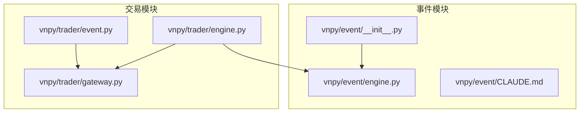
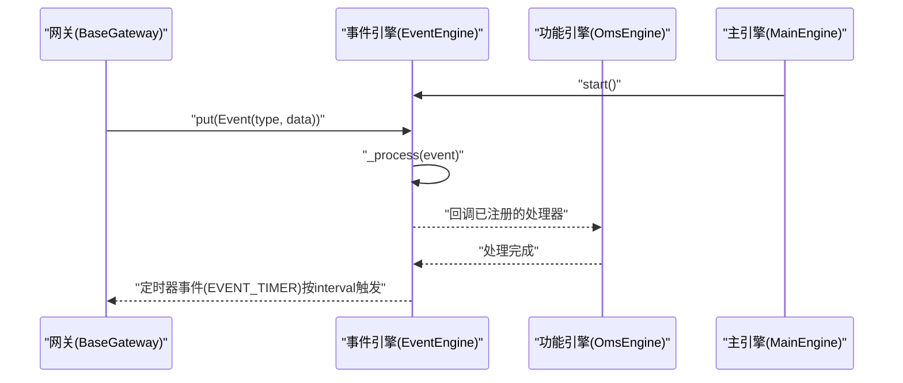
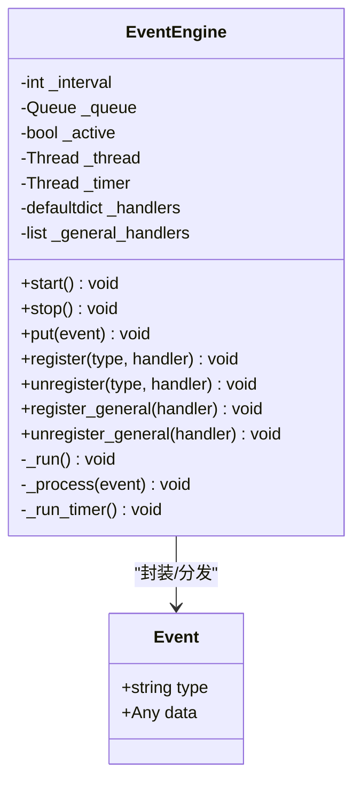
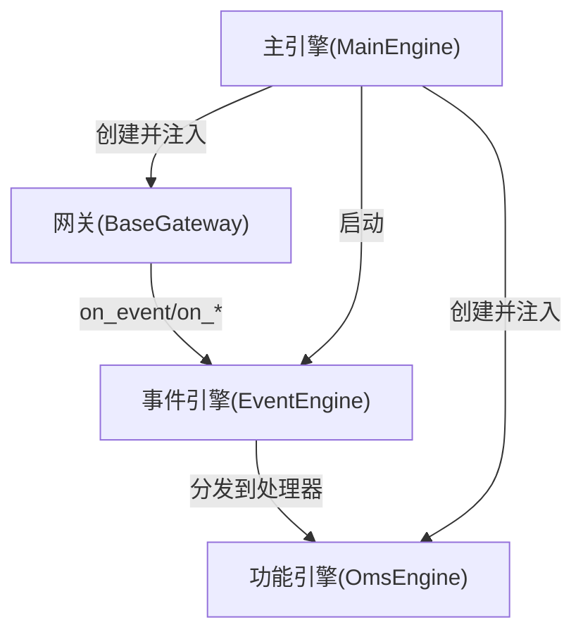
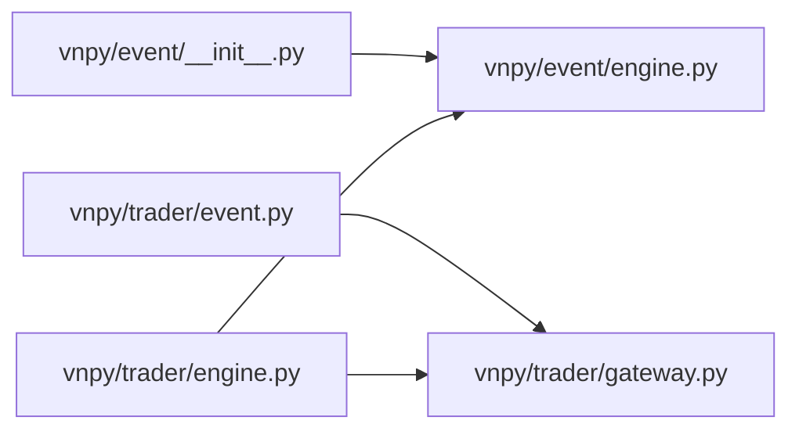

# 事件驱动模块 (event)

<cite>
**本文引用的文件列表**
- [vnpy/event/engine.py](file://vnpy/event/engine.py)
- [vnpy/event/__init__.py](file://vnpy/event/__init__.py)
- [vnpy/event/CLAUDE.md](file://vnpy/event/CLAUDE.md)
- [vnpy/trader/event.py](file://vnpy/trader/event.py)
- [vnpy/trader/gateway.py](file://vnpy/trader/gateway.py)
- [vnpy/trader/engine.py](file://vnpy/trader/engine.py)
</cite>

## 目录
1. [简介](#简介)
2. [项目结构](#项目结构)
3. [核心组件](#核心组件)
4. [架构总览](#架构总览)
5. [组件详解](#组件详解)
6. [依赖关系分析](#依赖关系分析)
7. [性能考量](#性能考量)
8. [故障排查指南](#故障排查指南)
9. [结论](#结论)
10. [附录](#附录)

## 简介
本文件面向vnpy事件驱动模块（event）进行全面技术文档整理，重点阐释EventEngine的发布-订阅事件循环机制、事件队列管理、线程安全处理与性能优化策略；说明Event类的结构设计与事件类型常量定义；给出在策略或应用中注册事件监听器、发布自定义事件的实践路径；阐明该模块作为系统通信总线的角色，如何连接交易引擎、网关与功能应用；并提供常见问题排查与性能监控调优建议。

## 项目结构
事件驱动模块位于vnpy/event目录，核心由事件引擎与事件对象组成，并通过vnpy/trader模块扩展出交易平台的事件类型常量，最终在vnpy/trader/engine中被主引擎统一启动与调度。

图表来源
- [vnpy/event/engine.py](file://vnpy/event/engine.py#L1-L146)
- [vnpy/event/__init__.py](file://vnpy/event/__init__.py#L1-L9)
- [vnpy/trader/event.py](file://vnpy/trader/event.py#L1-L15)
- [vnpy/trader/gateway.py](file://vnpy/trader/gateway.py#L80-L160)
- [vnpy/trader/engine.py](file://vnpy/trader/engine.py#L73-L120)

章节来源
- [vnpy/event/engine.py](file://vnpy/event/engine.py#L1-L146)
- [vnpy/event/__init__.py](file://vnpy/event/__init__.py#L1-L9)
- [vnpy/trader/event.py](file://vnpy/trader/event.py#L1-L15)
- [vnpy/trader/gateway.py](file://vnpy/trader/gateway.py#L80-L160)
- [vnpy/trader/engine.py](file://vnpy/trader/engine.py#L73-L120)

## 核心组件
- Event：事件载体，包含事件类型字符串与数据对象，用于在EventEngine中进行分发。
- EventEngine：事件引擎，负责事件入队、出队、分发、定时器事件生成与线程生命周期管理。
- 事件类型常量：在vnpy/trader/event.py中定义交易相关事件类型，如行情、委托、成交、持仓、账户、合约、报价、日志等；同时导出EVENT_TIMER用于定时器事件。

章节来源
- [vnpy/event/engine.py](file://vnpy/event/engine.py#L13-L27)
- [vnpy/event/engine.py](file://vnpy/event/engine.py#L33-L146)
- [vnpy/trader/event.py](file://vnpy/trader/event.py#L1-L15)

## 架构总览
事件驱动模块在vnpy中承担“通信总线”的角色：各模块通过EventEngine进行解耦通信。网关（Gateway）通过on_event系列方法将市场数据、委托回报、成交回报、账户信息、合约信息、日志等事件发布到EventEngine；功能引擎（如OmsEngine）通过register订阅相应事件类型，实现对数据的聚合与处理；主引擎（MainEngine）统一启动EventEngine并协调各子系统。

图表来源
- [vnpy/trader/gateway.py](file://vnpy/trader/gateway.py#L86-L160)
- [vnpy/event/engine.py](file://vnpy/event/engine.py#L55-L88)
- [vnpy/trader/engine.py](file://vnpy/trader/engine.py#L73-L120)

## 组件详解

### Event类与事件类型常量
- Event类：包含type与data两个字段，用于承载事件类型与数据负载。
- 事件类型常量：
  - EVENT_TIMER：定时器事件类型，由EventEngine周期性产生。
  - 交易事件类型：EVENT_TICK、EVENT_TRADE、EVENT_ORDER、EVENT_POSITION、EVENT_ACCOUNT、EVENT_QUOTE、EVENT_CONTRACT、EVENT_LOG等，由vnpy/trader/event.py定义并在网关层广泛使用。

章节来源
- [vnpy/event/engine.py](file://vnpy/event/engine.py#L13-L27)
- [vnpy/trader/event.py](file://vnpy/trader/event.py#L1-L15)

### EventEngine：发布-订阅事件循环与线程模型
- 线程模型
  - 单独线程处理事件队列（阻塞取事件，超时容错）。
  - 单独线程按interval生成定时器事件（EVENT_TIMER）。
  - 生命周期控制：start()启动两条线程；stop()停止并等待线程结束。
- 事件分发
  - _process：先按事件类型分发给已注册的处理器，再分发给通用处理器（对所有事件生效）。
  - register/unregister：按事件类型注册/注销处理器，去重保证同一处理器不重复注册。
  - register_general/unregister_general：注册/注销通用处理器。
- 队列与线程安全
  - 使用Queue作为事件队列，put为线程安全接口，适合跨线程发布事件。
  - _run循环中使用带超时的get，避免长时间阻塞导致stop无法及时响应。
- 定时器
  - _run_timer按interval睡眠后生成EVENT_TIMER事件并入队，从而驱动周期性任务。

图表来源
- [vnpy/event/engine.py](file://vnpy/event/engine.py#L13-L146)

章节来源
- [vnpy/event/engine.py](file://vnpy/event/engine.py#L33-L146)

### 在策略或应用中注册事件监听器与发布自定义事件
- 注册监听器
  - 在功能引擎或策略中，通过EventEngine.register(type, handler)注册处理器，handler签名需接受Event参数。
  - 若需处理所有事件类型，可使用register_general(handler)。
- 发布自定义事件
  - 创建Event(type, data)，并通过EventEngine.put(event)入队。
  - 网关层可通过BaseGateway.on_event(type, data)间接发布事件。
- 示例参考路径
  - 注册日志事件处理器：参见[注册日志处理器](file://vnpy/trader/engine.py#L334-L337)
  - 订阅交易事件：参见[注册交易事件处理器](file://vnpy/trader/engine.py#L363-L372)
  - 网关发布事件：参见[网关事件发布](file://vnpy/trader/gateway.py#L86-L160)

章节来源
- [vnpy/trader/engine.py](file://vnpy/trader/engine.py#L330-L372)
- [vnpy/trader/gateway.py](file://vnpy/trader/gateway.py#L86-L160)
- [vnpy/event/engine.py](file://vnpy/event/engine.py#L105-L146)

### 作为系统通信总线的角色
- 连接网关与功能应用
  - 网关通过on_event系列方法将市场数据、委托回报、成交回报、账户信息、合约信息、日志等事件发布到EventEngine。
  - 功能引擎（如OmsEngine）通过register订阅这些事件，实现数据聚合与业务逻辑处理。
- 主引擎统一启动
  - MainEngine在初始化时创建EventEngine并调用start()，随后初始化各功能引擎与网关，形成统一的事件驱动闭环。

图表来源
- [vnpy/trader/gateway.py](file://vnpy/trader/gateway.py#L86-L160)
- [vnpy/trader/engine.py](file://vnpy/trader/engine.py#L73-L120)
- [vnpy/trader/engine.py](file://vnpy/trader/engine.py#L339-L372)

章节来源
- [vnpy/trader/gateway.py](file://vnpy/trader/gateway.py#L80-L160)
- [vnpy/trader/engine.py](file://vnpy/trader/engine.py#L73-L120)
- [vnpy/trader/engine.py](file://vnpy/trader/engine.py#L339-L372)

## 依赖关系分析
- 导出与入口
  - vnpy/event/__init__.py导出Event、EventEngine、EVENT_TIMER，供上层模块直接使用。
- 事件类型来源
  - vnpy/trader/event.py定义交易事件类型常量，并显式导入EVENT_TIMER，确保定时器事件在交易模块可见。
- 网关与引擎协作
  - BaseGateway持有EventEngine实例，通过on_*方法发布事件。
  - MainEngine持有EventEngine实例，负责启动与注入各子系统。

图表来源
- [vnpy/event/__init__.py](file://vnpy/event/__init__.py#L1-L9)
- [vnpy/event/engine.py](file://vnpy/event/engine.py#L13-L27)
- [vnpy/trader/event.py](file://vnpy/trader/event.py#L1-L15)
- [vnpy/trader/gateway.py](file://vnpy/trader/gateway.py#L80-L160)
- [vnpy/trader/engine.py](file://vnpy/trader/engine.py#L73-L120)

章节来源
- [vnpy/event/__init__.py](file://vnpy/event/__init__.py#L1-L9)
- [vnpy/trader/event.py](file://vnpy/trader/event.py#L1-L15)
- [vnpy/trader/gateway.py](file://vnpy/trader/gateway.py#L80-L160)
- [vnpy/trader/engine.py](file://vnpy/trader/engine.py#L73-L120)

## 性能考量
- 事件处理模型
  - 事件在单一事件引擎线程内串行处理，避免锁竞争与复杂同步，但处理器内部不应执行耗时操作。
- 定时器精度
  - 定时器基于sleep(interval)，精度受操作系统定时器影响；interval越小，CPU占用越高，需权衡。
- 队列与吞吐
  - 队列为有界阻塞队列，put为线程安全；若处理器处理慢于生产速率，队列会增长，需通过优化处理器或拆分引擎缓解。
- 异常隔离
  - 处理器异常不会中断引擎运行，建议在处理器内部做好异常捕获与日志记录，避免影响整体事件循环。
- 并发与跨线程
  - put为线程安全接口，可在任何线程发布事件；但处理器在事件引擎线程内执行，避免跨线程共享可变状态。

章节来源
- [vnpy/event/engine.py](file://vnpy/event/engine.py#L55-L88)
- [vnpy/event/engine.py](file://vnpy/event/engine.py#L105-L146)
- [vnpy/event/CLAUDE.md](file://vnpy/event/CLAUDE.md#L92-L110)

## 故障排查指南
- 事件丢失
  - 现象：某些事件未到达处理器。
  - 排查要点：
    - 确认是否正确注册处理器（register/register_general），且类型一致。
    - 检查EventEngine是否已start，stop后不会再处理新事件。
    - 确认处理器内部异常被捕获，避免中断后续事件分发。
- 处理延迟
  - 现象：事件到达但处理滞后。
  - 排查要点：
    - 检查处理器是否执行耗时操作，必要时将耗时任务异步化或移出事件线程。
    - 适当增大interval（若存在大量定时器事件），减少事件风暴。
    - 观察队列长度变化，必要时拆分事件引擎或减少高频事件。
- 定时器不触发
  - 现象：EVENT_TIMER未按预期触发。
  - 排查要点：
    - 确认EventEngine已start，且stop未提前调用。
    - 检查interval设置是否合理，以及是否存在长时间阻塞。
- 跨线程使用
  - 现象：多线程发布事件导致性能抖动或异常。
  - 排查要点：
    - 使用EventEngine.put进行跨线程发布是安全的；但避免在处理器中进行跨线程共享状态访问。

章节来源
- [vnpy/event/engine.py](file://vnpy/event/engine.py#L55-L88)
- [vnpy/event/engine.py](file://vnpy/event/engine.py#L97-L104)
- [vnpy/event/CLAUDE.md](file://vnpy/event/CLAUDE.md#L105-L116)

## 结论
vnpy事件驱动模块以轻量、清晰的设计实现了发布-订阅事件循环，通过EventEngine统一调度，将网关、功能引擎与主引擎有机连接为一个低耦合的通信总线。开发者只需遵循注册-发布-处理的模式即可快速构建稳定、可扩展的交易系统。在追求高性能时，应关注处理器的串行化特性、定时器精度与队列压力，并通过合理的事件拆分与异步化手段提升整体吞吐与稳定性。

## 附录
- 快速参考
  - 导出入口：Event、EventEngine、EVENT_TIMER
  - 交易事件类型：EVENT_TICK、EVENT_TRADE、EVENT_ORDER、EVENT_POSITION、EVENT_ACCOUNT、EVENT_QUOTE、EVENT_CONTRACT、EVENT_LOG
  - 常用接口：start()、stop()、put()、register()、unregister()、register_general()、unregister_general()

章节来源
- [vnpy/event/__init__.py](file://vnpy/event/__init__.py#L1-L9)
- [vnpy/trader/event.py](file://vnpy/trader/event.py#L1-L15)
- [vnpy/event/engine.py](file://vnpy/event/engine.py#L97-L146)