# 主引擎 (MainEngine)

<cite>
**本文引用的文件列表**
- [vnpy/trader/engine.py](file://vnpy/trader/engine.py)
- [vnpy/event/engine.py](file://vnpy/event/engine.py)
- [vnpy/trader/gateway.py](file://vnpy/trader/gateway.py)
- [vnpy/trader/app.py](file://vnpy/trader/app.py)
- [vnpy/trader/object.py](file://vnpy/trader/object.py)
- [examples/veighna_trader/run.py](file://examples/veighna_trader/run.py)
</cite>

## 目录
1. [引言](#引言)
2. [项目结构](#项目结构)
3. [核心组件](#核心组件)
4. [架构总览](#架构总览)
5. [详细组件分析](#详细组件分析)
6. [依赖关系分析](#依赖关系分析)
7. [性能考量](#性能考量)
8. [故障排查指南](#故障排查指南)
9. [结论](#结论)
10. [附录](#附录)

## 引言
本文件围绕主引擎（MainEngine）展开，系统性解析其作为交易系统核心协调器的职责与实现。重点涵盖：
- 初始化事件引擎、管理网关、功能引擎与应用模块的机制
- add_gateway、add_app、connect 等核心方法的实现与调用流程
- get_gateway、get_engine 等查询方法的设计原理
- 与事件引擎（EventEngine）的集成与事件驱动通信模式
- 生命周期管理（初始化、启动、关闭）及资源清理与异常处理策略
- 结合示例展示如何在实际应用中配置与使用主引擎

## 项目结构
主引擎位于交易子系统核心层，负责编排事件引擎、网关、功能引擎与应用模块。关键文件与职责如下：
- vnpy/trader/engine.py：定义 MainEngine、BaseEngine、LogEngine、OmsEngine、EmailEngine 及其交互逻辑
- vnpy/event/engine.py：事件驱动框架，提供事件分发、定时器与线程模型
- vnpy/trader/gateway.py：抽象网关基类，定义与交易系统的对接契约
- vnpy/trader/app.py：抽象应用基类，描述应用元信息与引擎绑定关系
- vnpy/trader/object.py：通用数据结构（Tick、Order、Trade、Position、Contract、Quote 等）
- examples/veighna_trader/run.py：典型使用示例，演示如何创建事件引擎并注入主引擎

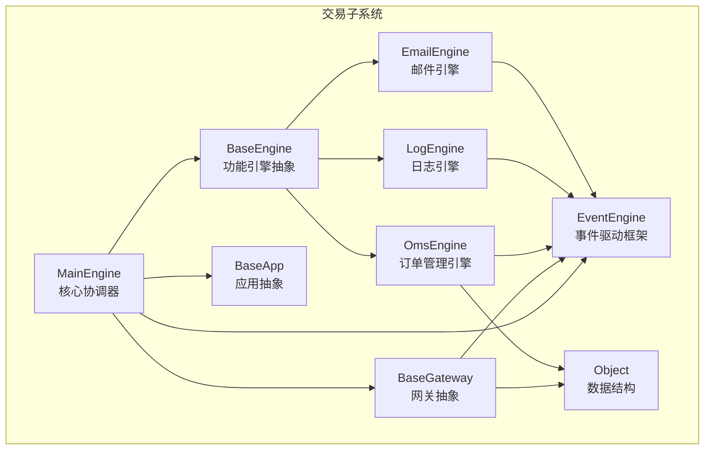

图表来源
- [vnpy/trader/engine.py](file://vnpy/trader/engine.py#L73-L304)
- [vnpy/event/engine.py](file://vnpy/event/engine.py#L33-L146)
- [vnpy/trader/gateway.py](file://vnpy/trader/gateway.py#L33-L225)
- [vnpy/trader/app.py](file://vnpy/trader/app.py#L10-L22)
- [vnpy/trader/object.py](file://vnpy/trader/object.py#L1-L200)

章节来源
- [vnpy/trader/engine.py](file://vnpy/trader/engine.py#L73-L304)
- [vnpy/event/engine.py](file://vnpy/event/engine.py#L33-L146)
- [vnpy/trader/gateway.py](file://vnpy/trader/gateway.py#L33-L225)
- [vnpy/trader/app.py](file://vnpy/trader/app.py#L10-L22)
- [vnpy/trader/object.py](file://vnpy/trader/object.py#L1-L200)

## 核心组件
- MainEngine：平台核心协调器，负责事件引擎初始化、功能引擎注册、网关与应用管理、对外接口封装（连接、订阅、下单、撤单、报价、历史查询等），以及生命周期管理（启动、关闭）
- BaseEngine：功能引擎抽象基类，为具体引擎（如日志、订单管理、邮件）提供统一的构造与关闭接口
- LogEngine：日志事件处理引擎，将 EVENT_LOG 注册到事件引擎并输出到日志系统
- OmsEngine：订单管理引擎，维护市场数据、订单、成交、持仓、账户、合约、报价等状态，并提供查询与转换能力
- EmailEngine：邮件发送引擎，异步队列化发送邮件，线程安全地处理 SMTP 发送
- EventEngine：事件驱动框架，提供事件入队、分发、定时器、线程模型与注册/注销机制
- BaseGateway：网关抽象，定义与交易系统的对接契约（连接、订阅、下单、撤单、报价、历史查询、日志推送等）
- BaseApp：应用抽象，描述应用元信息（名称、模块路径、引擎类、UI 组件等）

章节来源
- [vnpy/trader/engine.py](file://vnpy/trader/engine.py#L51-L304)
- [vnpy/event/engine.py](file://vnpy/event/engine.py#L33-L146)
- [vnpy/trader/gateway.py](file://vnpy/trader/gateway.py#L33-L225)
- [vnpy/trader/app.py](file://vnpy/trader/app.py#L10-L22)

## 架构总览
主引擎采用“事件驱动 + 网关 + 功能引擎 + 应用模块”的分层架构：
- 事件驱动：由 EventEngine 提供事件分发与定时器，MainEngine 在初始化时启动事件引擎
- 网关层：通过 BaseGateway 抽象对接不同交易系统，统一事件推送（Tick、Order、Trade、Position、Account、Contract、Quote、Log）
- 功能引擎层：通过 BaseEngine 抽象，注册到 MainEngine，订阅相应事件类型，维护内部状态并提供查询接口
- 应用模块层：通过 BaseApp 描述应用元信息，MainEngine 将其映射为对应的功能引擎实例

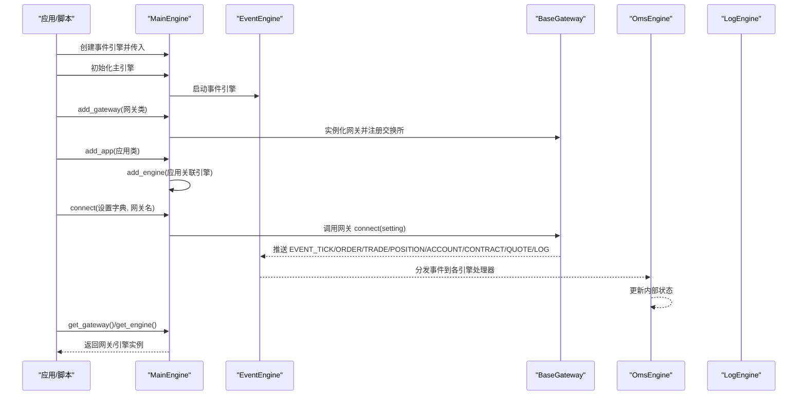

图表来源
- [vnpy/trader/engine.py](file://vnpy/trader/engine.py#L78-L222)
- [vnpy/event/engine.py](file://vnpy/event/engine.py#L89-L110)
- [vnpy/trader/gateway.py](file://vnpy/trader/gateway.py#L86-L159)

章节来源
- [vnpy/trader/engine.py](file://vnpy/trader/engine.py#L78-L222)
- [vnpy/event/engine.py](file://vnpy/event/engine.py#L89-L110)
- [vnpy/trader/gateway.py](file://vnpy/trader/gateway.py#L86-L159)

## 详细组件分析

### MainEngine 类与生命周期
- 初始化：接收外部或内部创建的 EventEngine，启动事件引擎；切换工作目录至交易目录；初始化内置功能引擎（日志、订单管理、邮件）
- 生命周期：
  - 启动：事件引擎线程与定时器线程开始运行
  - 关闭：停止事件引擎，依次调用各功能引擎与网关的关闭方法，确保资源有序释放

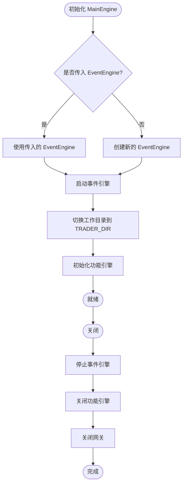

图表来源
- [vnpy/trader/engine.py](file://vnpy/trader/engine.py#L78-L93)
- [vnpy/trader/engine.py](file://vnpy/trader/engine.py#L289-L304)
- [vnpy/event/engine.py](file://vnpy/event/engine.py#L89-L104)

章节来源
- [vnpy/trader/engine.py](file://vnpy/trader/engine.py#L78-L93)
- [vnpy/trader/engine.py](file://vnpy/trader/engine.py#L289-L304)
- [vnpy/event/engine.py](file://vnpy/event/engine.py#L89-L104)

### add_gateway：网关注册与交换所聚合
- 作用：根据网关类创建实例，注册到主引擎；同时将网关支持的交易所集合合并到主引擎的交换所列表中
- 设计要点：
  - 若未指定网关名称，则使用网关类默认名称
  - 将网关实例加入字典，便于后续按名称查询
  - 去重合并交易所集合，便于上层业务识别可用市场

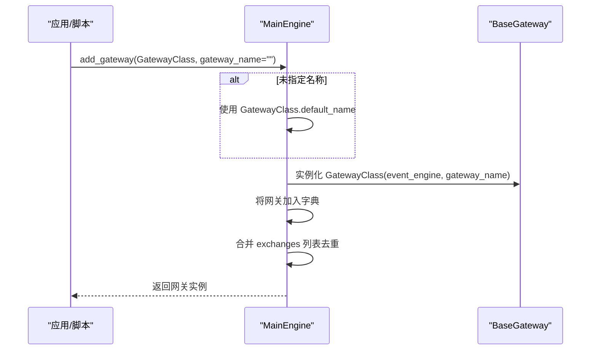

图表来源
- [vnpy/trader/engine.py](file://vnpy/trader/engine.py#L102-L118)
- [vnpy/trader/gateway.py](file://vnpy/trader/gateway.py#L72-L85)

章节来源
- [vnpy/trader/engine.py](file://vnpy/trader/engine.py#L102-L118)
- [vnpy/trader/gateway.py](file://vnpy/trader/gateway.py#L72-L85)

### add_app：应用注册与引擎绑定
- 作用：注册应用，同时为其绑定对应的功能引擎类，创建并注册该引擎
- 设计要点：
  - 从应用类读取 app_name、engine_class 等元信息
  - 通过 add_engine 注册应用引擎，使应用具备功能引擎的能力

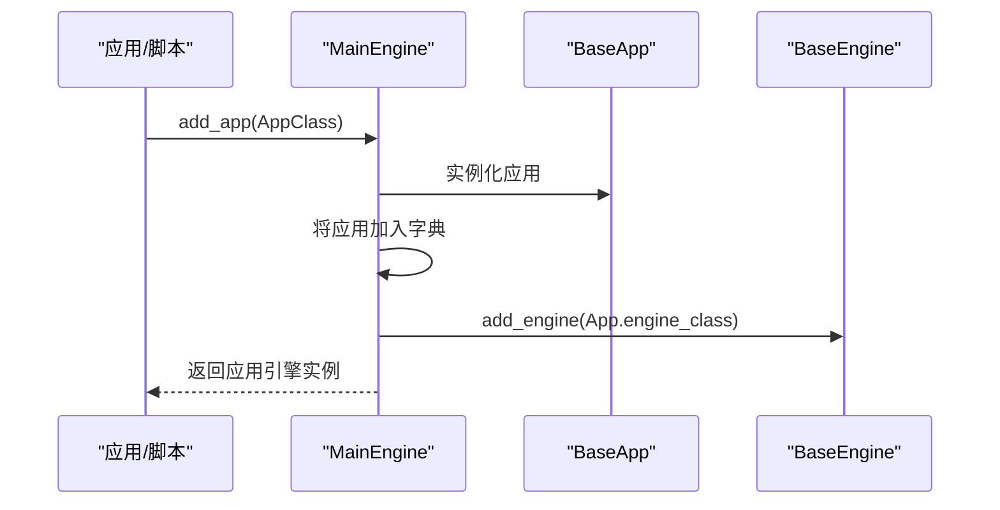

图表来源
- [vnpy/trader/engine.py](file://vnpy/trader/engine.py#L120-L128)
- [vnpy/trader/app.py](file://vnpy/trader/app.py#L10-L22)

章节来源
- [vnpy/trader/engine.py](file://vnpy/trader/engine.py#L120-L128)
- [vnpy/trader/app.py](file://vnpy/trader/app.py#L10-L22)

### connect：连接网关与日志记录
- 作用：根据网关名称获取网关实例，记录连接日志，调用网关 connect(setting) 完成登录与查询
- 设计要点：
  - 通过 get_gateway 安全获取网关，不存在时写入日志提示
  - 记录连接动作日志，便于审计与问题定位

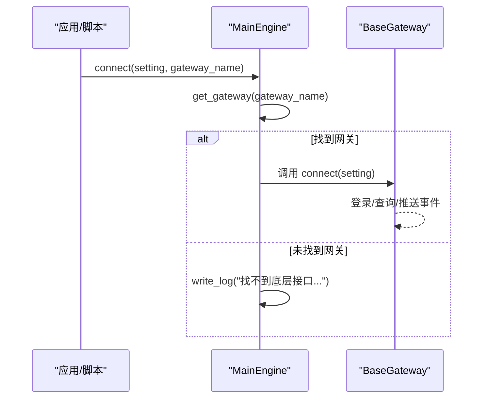

图表来源
- [vnpy/trader/engine.py](file://vnpy/trader/engine.py#L213-L222)
- [vnpy/trader/engine.py](file://vnpy/trader/engine.py#L168-L175)

章节来源
- [vnpy/trader/engine.py](file://vnpy/trader/engine.py#L213-L222)
- [vnpy/trader/engine.py](file://vnpy/trader/engine.py#L168-L175)

### 订阅、下单、撤单、报价、历史查询：统一入口与日志
- 订阅：通过 get_gateway 获取网关，记录订阅日志，调用 gateway.subscribe
- 下单：记录下单日志，调用 gateway.send_order 并返回订单号
- 撤单：记录撤单日志，调用 gateway.cancel_order
- 报价：记录报价日志，调用 gateway.send_quote/cancel_quote
- 历史查询：记录查询日志，调用 gateway.query_history

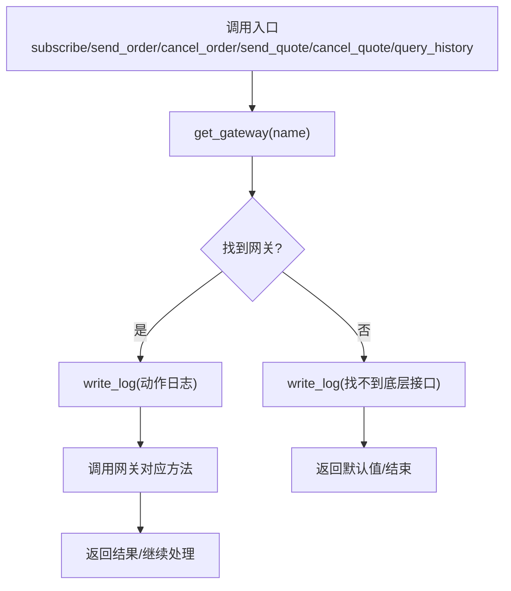

图表来源
- [vnpy/trader/engine.py](file://vnpy/trader/engine.py#L223-L288)
- [vnpy/trader/engine.py](file://vnpy/trader/engine.py#L168-L175)

章节来源
- [vnpy/trader/engine.py](file://vnpy/trader/engine.py#L223-L288)
- [vnpy/trader/engine.py](file://vnpy/trader/engine.py#L168-L175)

### 查询方法：get_gateway 与 get_engine
- get_gateway：按名称从字典中检索网关，不存在时写入日志
- get_engine：按名称从字典中检索引擎，不存在时写入日志
- 设计原理：提供统一的查询入口，保证调用方在未知目标是否存在时也能安全访问，并通过日志辅助诊断

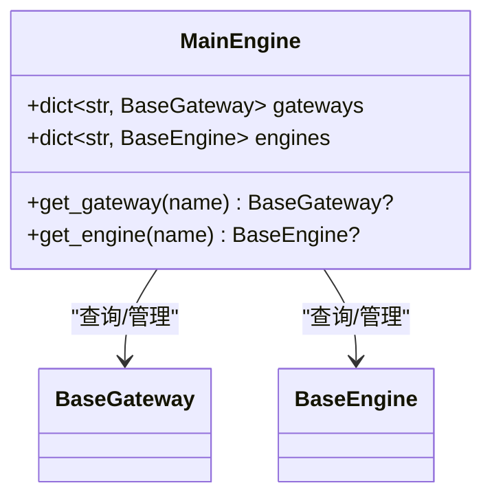

图表来源
- [vnpy/trader/engine.py](file://vnpy/trader/engine.py#L168-L184)

章节来源
- [vnpy/trader/engine.py](file://vnpy/trader/engine.py#L168-L184)

### 与 EventEngine 的集成与事件驱动通信
- MainEngine 在初始化时启动 EventEngine，所有功能引擎均通过事件类型注册处理器
- 网关通过 on_event/on_tick/on_order/on_trade/on_position/on_account/on_contract/on_quote/on_log 等方法将数据转化为事件并投递到事件队列
- OmsEngine 注册了 Tick、Order、Trade、Position、Account、Contract、Quote 等事件处理器，维护内部状态并提供查询接口
- LogEngine 注册 EVENT_LOG，将日志事件输出到日志系统

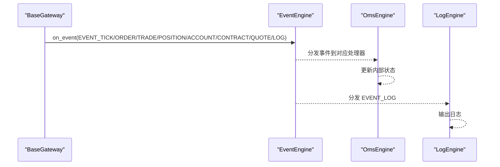

图表来源
- [vnpy/trader/gateway.py](file://vnpy/trader/gateway.py#L86-L159)
- [vnpy/event/engine.py](file://vnpy/event/engine.py#L66-L79)
- [vnpy/trader/engine.py](file://vnpy/trader/engine.py#L339-L438)
- [vnpy/trader/engine.py](file://vnpy/trader/engine.py#L305-L337)

章节来源
- [vnpy/trader/gateway.py](file://vnpy/trader/gateway.py#L86-L159)
- [vnpy/event/engine.py](file://vnpy/event/engine.py#L66-L79)
- [vnpy/trader/engine.py](file://vnpy/trader/engine.py#L305-L337)
- [vnpy/trader/engine.py](file://vnpy/trader/engine.py#L339-L438)

### 数据结构与状态管理（OmsEngine）
- OmsEngine 维护以下核心状态：
  - Tick、Order、Trade、Position、Account、Contract、Quote 字典
  - 活跃订单与报价集合
  - 按网关的 OffsetConverter 映射，用于偏移转换
- 提供丰富的查询接口：按符号/ID 获取最新数据、获取全部数据、获取活跃订单/报价等
- 对于订单与报价，根据状态更新/移除活跃集合；对账户、持仓、合约、报价分别更新 OffsetConverter

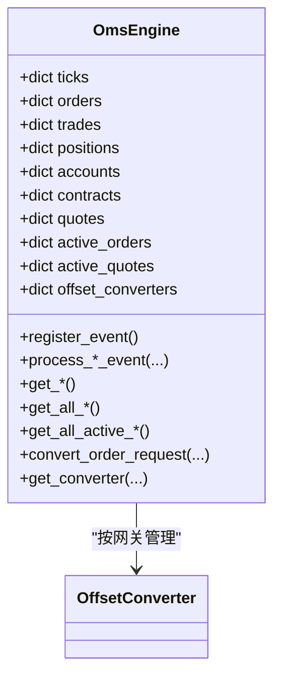

图表来源
- [vnpy/trader/engine.py](file://vnpy/trader/engine.py#L339-L567)
- [vnpy/trader/object.py](file://vnpy/trader/object.py#L1-L200)

章节来源
- [vnpy/trader/engine.py](file://vnpy/trader/engine.py#L339-L567)
- [vnpy/trader/object.py](file://vnpy/trader/object.py#L1-L200)

### 邮件引擎（EmailEngine）与日志引擎（LogEngine）
- EmailEngine：异步发送邮件，首次发送时启动线程与队列；SMTP 发送失败时写入日志
- LogEngine：注册 EVENT_LOG，将日志事件输出到日志系统，支持级别映射

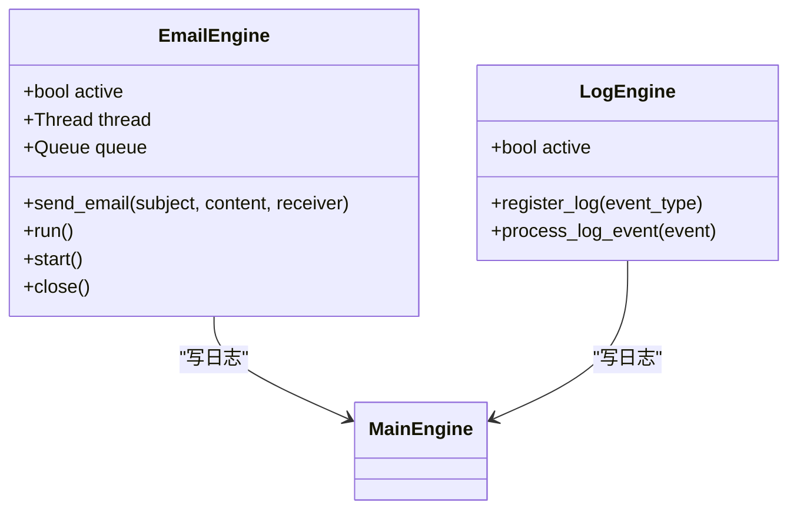

图表来源
- [vnpy/trader/engine.py](file://vnpy/trader/engine.py#L569-L634)
- [vnpy/trader/engine.py](file://vnpy/trader/engine.py#L305-L337)

章节来源
- [vnpy/trader/engine.py](file://vnpy/trader/engine.py#L569-L634)
- [vnpy/trader/engine.py](file://vnpy/trader/engine.py#L305-L337)

## 依赖关系分析
- MainEngine 依赖 EventEngine、BaseGateway、BaseEngine、BaseApp、Object 等模块
- 网关通过 EventEngine 推送事件，功能引擎订阅事件并维护状态
- 应用通过 BaseApp 与功能引擎绑定，形成“应用-引擎-网关”的协作关系

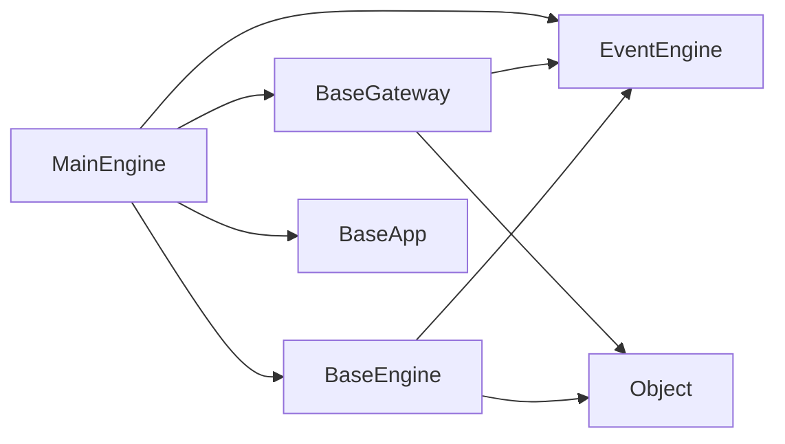

图表来源
- [vnpy/trader/engine.py](file://vnpy/trader/engine.py#L73-L304)
- [vnpy/trader/gateway.py](file://vnpy/trader/gateway.py#L33-L225)
- [vnpy/trader/object.py](file://vnpy/trader/object.py#L1-L200)

章节来源
- [vnpy/trader/engine.py](file://vnpy/trader/engine.py#L73-L304)
- [vnpy/trader/gateway.py](file://vnpy/trader/gateway.py#L33-L225)
- [vnpy/trader/object.py](file://vnpy/trader/object.py#L1-L200)

## 性能考量
- 事件驱动：通过 EventEngine 的队列与线程模型，将 IO 密集型任务解耦，降低阻塞风险
- 状态聚合：OmsEngine 将多类数据集中存储，查询复杂度低，但需注意内存占用与并发一致性
- 网关线程安全：BaseGateway 要求线程安全与非阻塞，避免影响事件引擎吞吐
- 邮件异步：EmailEngine 使用队列与线程异步发送，避免阻塞主线程

## 故障排查指南
- 网关未找到：get_gateway/get_engine 未命中时会写日志，检查网关/引擎名称是否正确
- 连接失败：connect 会记录动作日志，检查 setting 参数与网关实现
- 订单/报价状态异常：检查 OmsEngine 的活跃集合更新逻辑与 OffsetConverter 初始化
- 邮件发送失败：EmailEngine 在 run 中捕获异常并写日志，检查 SMTP 配置

章节来源
- [vnpy/trader/engine.py](file://vnpy/trader/engine.py#L168-L184)
- [vnpy/trader/engine.py](file://vnpy/trader/engine.py#L213-L222)
- [vnpy/trader/engine.py](file://vnpy/trader/engine.py#L569-L634)

## 结论
主引擎通过事件驱动架构将网关、功能引擎与应用模块有机整合，提供了统一的接入与管理接口。其核心价值体现在：
- 统一初始化与生命周期管理
- 事件驱动的数据流与状态管理
- 易扩展的网关与应用注册机制
- 完备的日志与异常处理策略

## 附录
- 示例用法参考：在示例脚本中创建 EventEngine 并注入 MainEngine，随后注册网关与应用，最后启动 UI 或终端循环

章节来源
- [examples/veighna_trader/run.py](file://examples/veighna_trader/run.py#L39-L87)